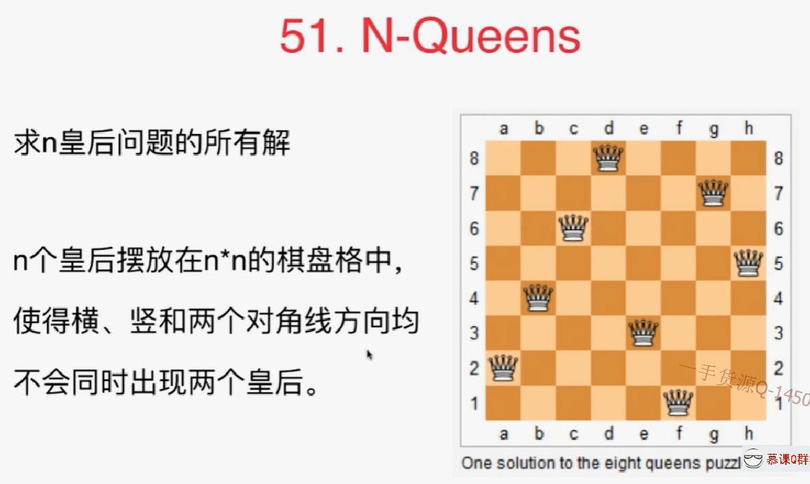
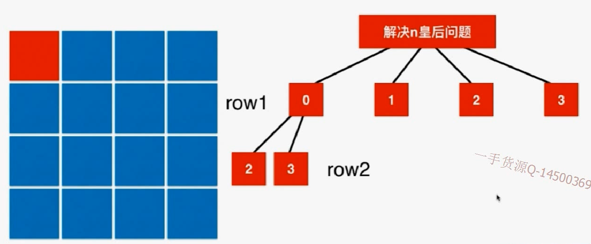
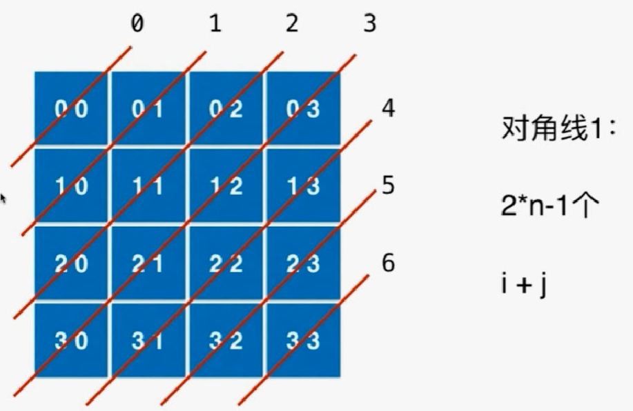
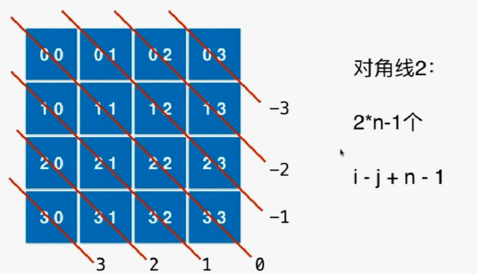

# 51.N-Queens



标准的是8皇后问题，以4皇后为例。

- 首先每一行都要有一个皇后，不然就会一行有两个皇后，不符合题意。
- 确定第一行在第一列位置，第二行的皇后不能在第一，二列，先放在第三列，然后依次往后找。不行再回溯，放在第四列。



剩下的问题：如何判断不合法的情况


右上--左下：每个对角线节点上横纵坐标之和是定值。



左上--右下：每个对角线节点上横纵坐标之差是定值。同时希望这个差保存在数组中，就是一个正数，所以要加上n-1.



- 代码实现

从index=0（第0行）开始，每次进入第index行都已经拥有了index-1行的结果，所以当index进入n（相当于拥有了n-1行的结果）的时候就已经排好一个皇后，直接记录并返回即可。

```java
import java.util.Arrays;
import java.util.LinkedList;
import java.util.List;
import java.util.ArrayList;

/// 51. N-Queens
/// https://leetcode.com/problems/n-queens/description/
/// 时间复杂度: O(n^n)
/// 空间复杂度: O(n)
public class Solution {
    private boolean[] col;
    private boolean[] dia1;
    private boolean[] dia2;
    private ArrayList<List<String>> res;

    public List<List<String>> solveNQueens(int n) {
        res = new ArrayList<List<String>>();
        col = new boolean[n];
        dia1 = new boolean[2 * n - 1];
        dia2 = new boolean[2 * n - 1];

        LinkedList<Integer> row = new LinkedList<Integer>();
        putQueen(n, 0, row);

        return res;
    }

    // 尝试在一个n皇后问题中, 摆放第index行的皇后位置.row存储每一行的皇后摆放在第几列的位置
    private void putQueen(int n, int index, LinkedList<Integer> row){
        // 全部遍历完，生成解
        if(index == n){
            res.add(generateBoard(n, row));
            return;
        }

        for(int i = 0 ; i < n ; i ++)
            // 尝试将第index行的皇后摆放在第i列
            // 纵方向和两个对角线方向都不冲突
            if(!col[i] && !dia1[index + i] && !dia2[index - i + n - 1]){
                row.addLast(i);
                col[i] = true;
                dia1[index + i] = true;
                dia2[index - i + n - 1] = true;
                putQueen(n, index + 1, row);
                col[i] = false;
                dia1[index + i] = false;
                dia2[index - i + n - 1] = false;
                row.removeLast();
            }

        return;
    }

    // 将int数组转为string
    private List<String> generateBoard(int n, LinkedList<Integer> row){
        assert row.size() == n;

        ArrayList<String> board = new ArrayList<String>();
        for(int i = 0 ; i < n ; i ++){
            char[] charArray = new char[n];
            Arrays.fill(charArray, '.');
            charArray[row.get(i)] = 'Q';
            board.add(new String(charArray));
        }
        return board;
    }

    private static void printBoard(List<String> board){
        for(String s: board)
            System.out.println(s);
        System.out.println();
    }

    public static void main(String[] args) {
        int n = 4;
        List<List<String>> res = (new Solution()).solveNQueens(n);
        for(List<String> board: res)
            printBoard(board);
    }
}
```

## N皇后有很多优化思路：如何进行有效的剪枝

练习：

52 N-QUEENSII

37 sudoku solver 数独问题--优化


