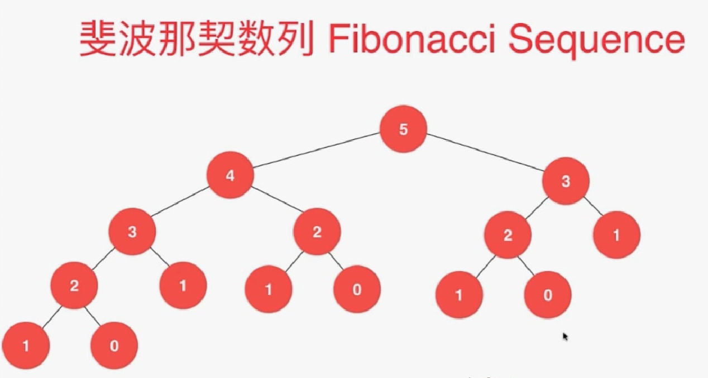
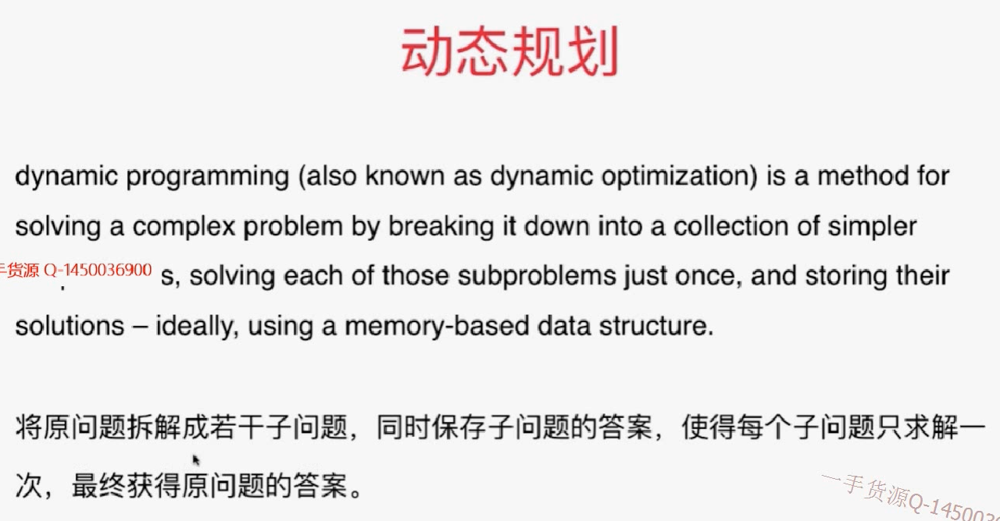
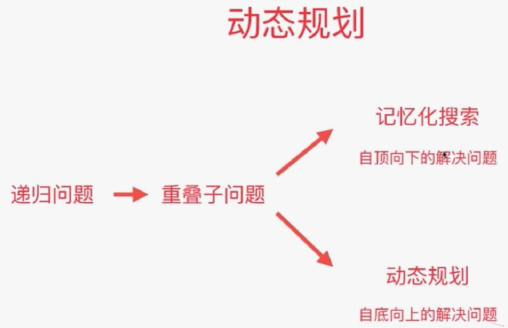
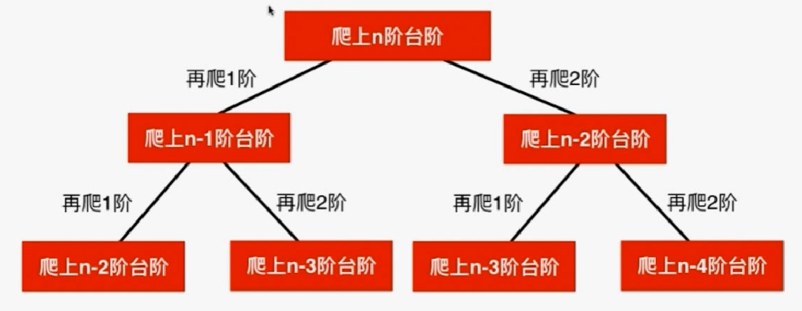

# 斐波那契数列

时间复杂度：2^n，时间是指数级增长。递归树如下：有多次重复计算。即：**重叠子结构问题**



对于n=20，执行了2w次fib函数。n=40，执行了300w

- 递归求斐波那契数列

```java
// 递归求斐波那契数列
public class Solution1 {
    private int num = 0;

    public int fib( int n ){
        num ++;
        if( n == 0 )
            return 0;
        if( n == 1 )
            return 1;

        return fib(n-1) + fib(n-2);
    }

    public int getNum(){
        return num;
    }

    public static void main(String[] args) {
        int n = 42;

        Solution1 solution = new Solution1();
        long startTime = System.currentTimeMillis();
        int res = solution.fib(n);
        long endTime = System.currentTimeMillis();

        System.out.println("fib(" + n + ") = " + res);
        System.out.println("time : " + (endTime - startTime) + " ms");
        System.out.println("run function fib() " + solution.getNum() + " times.");
    }
}
```

- 记忆化搜索

记忆化搜索--自上而下的解决问题。更容易

```java
import java.util.Arrays;

// 记忆化搜索
public class Solution2 {
    private int num = 0;

    public int fib(int n){
        int[] memo = new int[n + 1];
        Arrays.fill(memo, -1);
        return fib(n, memo);
    }

    private int fib(int n, int[] memo){
        num ++;
        if(n == 0)
            return 0;
        if(n == 1)
            return 1;
        
        if(memo[n] == -1)
            memo[n] = fib(n - 1, memo) + fib(n - 2, memo);
        return memo[n];
    }

    public int getNum(){
        return num;
    }

    public static void main(String[] args) {
        //int n = 42;
        int n = 1000; // 注意: 我们使用n = 1000只是为了测试性能, 实际上会溢出.斐波那契额数列是以指数速度上涨的.所以这个结果是错误的
        Solution2 solution = new Solution2();
        long startTime = System.currentTimeMillis();
        int res = solution.fib(n);
        long endTime = System.currentTimeMillis();

        System.out.println("fib(" + n + ") = " + res);
        System.out.println("time : " + (endTime - startTime) + " ms");
        System.out.println("run function fib() " + solution.getNum() + " times.");
    }
}
```

- 动态规划

自下而上的解决问题。先解决小数据量问题的结果，再解决大数据情况下的结果。

性能比记忆化搜素更好：

1.没有递归调用，省时间、空间。

2.memo只访问了一次

```java
import java.util.Arrays;

// 动态规划
public class Solution3 {
    public int fib(int n){
        int[] memo = new int[n + 1];
        Arrays.fill(memo, -1);

        memo[0] = 0;
        memo[1] = 1;
        for(int i = 2 ; i <= n ; i ++)
            memo[i] = memo[i - 1] + memo[i - 2];

        return memo[n];
    }

    public static void main(String[] args) {
        //int n = 42;
        int n = 1000; // 注意: 我们使用n = 1000只是为了测试性能, 实际上会溢出
        // 斐波那契额数列是以指数速度上涨的

        Solution3 solution = new Solution3();
        long startTime = System.currentTimeMillis();
        int res = solution.fib(n);
        long endTime = System.currentTimeMillis();

        System.out.println("fib(" + n + ") = " + res);
        System.out.println("time : " + (endTime - startTime) + " ms");
    }
}
```

# 什么是动态规划



动态规划的本质和记忆化搜索是一样的。一般记忆化搜索的答案是能够满足的。有时候记忆搜索的答案也会是一个动态规划的答案。有一类递归问题有重叠子结构问题,转化为动态规划



# 70.climbing  stairs


## 递归：自顶向下



### 普通递归

```java
import java.util.Arrays;

public class Solution1 {
    private int calcWays(int n){
        if(n == 1)
            return 1;
        if(n == 2)
            return 2;

        return calcWays(n - 1) + calcWays(n - 2);
    }

    public static void main(String[] args) {

        System.out.println((new Solution1()).calcWays(10));
    }
}
```

递归终止的条件也可以是如下：这样n=2传进去后会自动算出来。

```java
private int calcWays(int n){
    // 没有台阶可以走，就一种方式
    if(n == 0)
        return 1;
    if(n == 1)
        return 2;

    return calcWays(n - 1) + calcWays(n - 2);
}
```

### 记忆化搜索

```java
import java.util.Arrays;

public class Solution1 {
    private int[] memo;

    public int climbStairs(int n) {
        memo = new int[n+1];
        Arrays.fill(memo, -1);
        return calcWays(n);
    }

    private int calcWays(int n){
        if(n == 0 || n == 1)
            return 1;
		//没有计算过
        if(memo[n] == -1)
            memo[n] = calcWays(n - 1) + calcWays(n - 2);

        return memo[n];
    }

    public static void main(String[] args) {
        System.out.println((new Solution1()).climbStairs(10));
    }
}
```

### 动态规划

```java
/// 70. Climbing Stairs
/// https://leetcode.com/problems/climbing-stairs/description/
/// 动态规划
/// 时间复杂度: O(n)
/// 空间复杂度: O(n)
public class Solution2 {

    public int climbStairs(int n) {
        int[] memo = new int[n + 1];
        memo[0] = 1;
        memo[1] = 1;
        for(int i = 2 ; i <= n ; i ++)
            memo[i] = memo[i - 1] + memo[i - 2];
        return memo[n];
    }

    public static void main(String[] args) {
        System.out.println((new Solution2()).climbStairs(10));
    }
}
```

# 练习

120 reiangle

64 minimum path sum

题目中限定每个格子包含一个非负整数，每一步只能左移或下移。这两个问题是对题目能够使用动态规划求解有限定的。