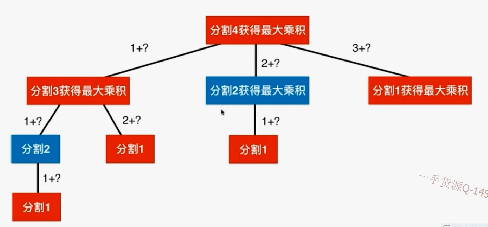
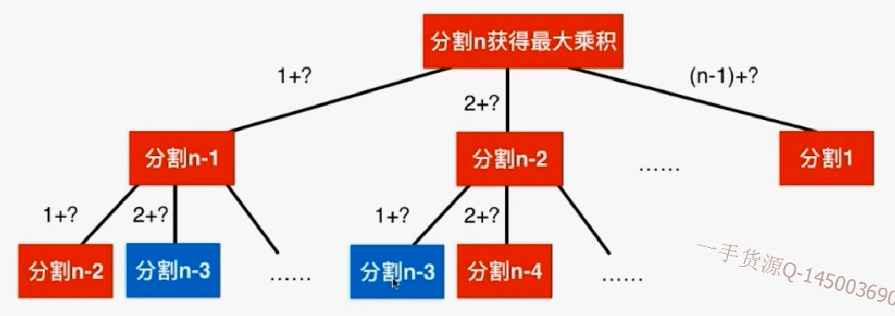
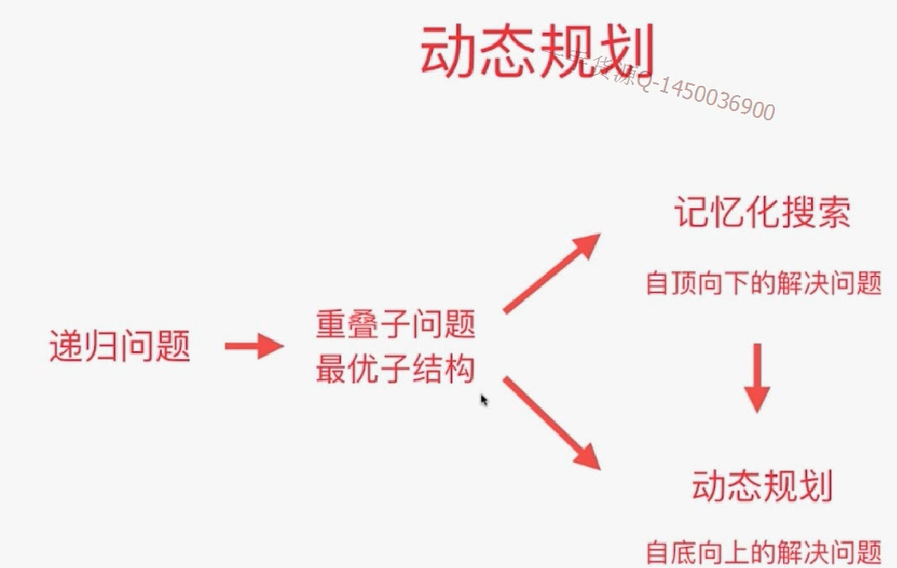

# 343


## 暴力解决

由于将n分成几份不知道，所以不知道要分几重循环。所以用回溯遍历找出一个数做分割的所有可能性。（O(2^n)）。

比如分割4：蓝色的是重叠子问题，可以用记忆化搜索



分割n：res(n) = x * res(n-x)



## 最优子结构

之所以可以用这样的递归结构去解决问题，就是因为**通过求得子问题的最优解，能够求得原问题的最优解。即：最优子结构**（针对优化问题）

即：一个递归问题同时有重叠子问题结构 & 最优子结构 就能采用动态规划。



- 暴力答案（breakInteger是至少将n-i分割两部分，所以还要考虑不分割n-i）

```java
/// 343. Integer Break
/// https://leetcode.com/problems/integer-break/description/
/// 暴力搜索
/// 在Leetcode中提交这个版本的代码会超时! (Time Limit Exceeded)
/// 时间复杂度: O(n^n)
/// 空间复杂度: O(n)
public class Solution1 {
    public int integerBreak(int n) {
        if(n < 1)
            throw new IllegalArgumentException("n should be greater than zero");
        return breakInteger(n);
    }

    // 将n进行分割(至少分割两部分), 可以获得的最大乘积
    private int breakInteger(int n){
        if(n == 1)
            return 1;

        int res = -1;
        for(int i = 1 ; i <= n - 1 ; i ++)
            //breakInteger分为至少两部分，但还有一种情况就是i*(n-i)
            res = max3(res, i * (n - i), i * breakInteger(n - i));
        return res;
    }

    private int max3(int a, int b, int c){
        return Math.max(a, Math.max(b, c));
    }

    public static void main(String[] args) {
        System.out.println((new Solution1()).integerBreak(2));
        System.out.println((new Solution1()).integerBreak(10));
    }
}
```

- 记忆化搜索，自顶向下

```java
import java.util.Arrays;

/// 343. Integer Break
/// https://leetcode.com/problems/integer-break/description/
/// 记忆化搜索
/// 时间复杂度: O(n^2)
/// 空间复杂度: O(n)
public class Solution2 {
    private int[] memo;

    public int integerBreak(int n) {
        if(n < 1)
            throw new IllegalArgumentException("n should be greater than zero");

        memo = new int[n+1];
        Arrays.fill(memo, -1);

        return breakInteger(n);
    }

    // 将n进行分割(至少分割两部分), 可以获得的最大乘积
    private int breakInteger(int n){
        if(n == 1)
            return 1;

        if(memo[n] != -1)
            return memo[n];

        int res = -1;
        for(int i = 1 ; i <= n - 1 ; i ++)
            res = max3(res, i * (n - i) , i * breakInteger(n - i));
        // 记录结果
        memo[n] = res;
        return res;
    }

    private int max3(int a, int b, int c){
        return Math.max(a, Math.max(b, c));
    }

    public static void main(String[] args) {
        System.out.println((new Solution2()).integerBreak(2));
        System.out.println((new Solution2()).integerBreak(10));
    }
}
```

- 动态规划，自底向上

```java
/// 343. Integer Break
/// https://leetcode.com/problems/integer-break/description/
/// 动态规划
/// 时间复杂度: O(n^2)
/// 空间复杂度: O(n)
public class Solution3 {
    public int integerBreak(int n) {
        if(n < 1)
            throw new IllegalArgumentException("n should be greater than zero");

        int[] memo = new int[n+1];
        memo[1] = 1;
        for(int i = 2 ; i <= n ; i ++)
            // 求解memo[i]
            for(int j = 1 ; j <= i - 1 ; j ++)
                memo[i] = max3(memo[i], j * (i - j), j * memo[i - j]);

        return memo[n];
    }

    private int max3(int a, int b, int c){
        return Math.max(a, Math.max(b, c));
    }

    public static void main(String[] args) {
        System.out.println((new Solution3()).integerBreak(2));
        System.out.println((new Solution3()).integerBreak(10));
    }
}
```

## 练习

279  perfect squares

91 decode ways

62 unique paths

63 unique pathsII