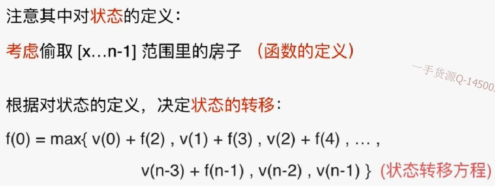

# 198


## 暴力法


最优化问题-可能有最优子结构。

- 首先：考虑偷0；不偷0，偷1；不偷0,1,偷2.。。


紧接着：发现该问题有最优子结构，重叠子问题




**f函数的定义**只是：**考虑**，而不是一定。所以不一定会在该范围内偷。

v就表示要偷取这个编号的房子。

状态：定义了函数要做什么

状态转移方程：函数怎么做

```java
import java.util.Arrays;

/// 198. House Robber
/// https://leetcode.com/problems/house-robber/description/
/// 暴力
/// 时间复杂度: O(n^2)
/// 空间复杂度: O(n)
public class Solution1 {
    public int rob(int[] nums) {
        return tryRob(nums, 0);
    }

    // 考虑抢劫nums[index...nums.size())这个范围的所有房子
    private int tryRob(int[] nums, int index){
        if(index >= nums.length)
            return 0;

        int res = 0;
        for(int i = index ; i < nums.length ; i ++)
            res = Math.max(res, nums[i] + tryRob(nums, i + 2));
        return res;
    }

    public static void main(String[] args) {
        int nums[] = {2, 1};
        System.out.println((new Solution1()).rob(nums));
    }
}
```

## 记忆化搜索

```java
import java.util.Arrays;

/// 198. House Robber
/// https://leetcode.com/problems/house-robber/description/
/// 记忆化搜索
/// 时间复杂度: O(n^2)
/// 空间复杂度: O(n)
public class Solution1 {
    // memo[i] 表示考虑抢劫 nums[i...n) 所能获得的最大收益
    private int[] memo;

    public int rob(int[] nums) {
        memo = new int[nums.length];
        Arrays.fill(memo, -1);
        return tryRob(nums, 0);
    }

    // 考虑抢劫nums[index...nums.size())这个范围的所有房子
    private int tryRob(int[] nums, int index){
        if(index >= nums.length)
            return 0;

        if(memo[index] != -1)
            return memo[index];

        int res = 0;
        for(int i = index ; i < nums.length ; i ++)
            res = Math.max(res, nums[i] + tryRob(nums, i + 2));
        memo[index] = res;
        return res;
    }

    public static void main(String[] args) {
        int nums[] = {2, 1};
        System.out.println((new Solution1()).rob(nums));
    }
}
```

## 动态规划:自底向上

```java
import java.util.Arrays;

/// 198. House Robber
/// https://leetcode.com/problems/house-robber/description/
/// 动态规划
/// 时间复杂度: O(n^2)
/// 空间复杂度: O(n)
public class Solution2 {
    public int rob(int[] nums) {
        int n = nums.length;
        if(n == 0)
            return 0;

        // memo[i] 表示考虑抢劫 nums[i...n) 即 nums[i...n-1] 所能获得的最大收益
        int[] memo = new int[nums.length];
        // i=n-1是最基础的情况，要考虑数组越界，所以n >= 1,前面要判断n=0时的情况
        memo[n - 1] = nums[n - 1];
        for(int i = n - 2 ; i >= 0 ; i --)
            // memo[i]
            for (int j = i; j < n; j++)
                memo[i] = Math.max( memo[i],nums[j] + (j + 2 < n ? memo[j + 2] : 0));
		
        // 最大的情况
        return memo[0];
    }

    public static void main(String[] args) {
        int nums[] = {2, 1};
        System.out.println((new Solution2()).rob(nums));
    }
}
```

# 改变状态


## 练习

213  house robberII

337  house robberIII

309 best time to buy and sell stock with cooldown