# 0-1背包问题

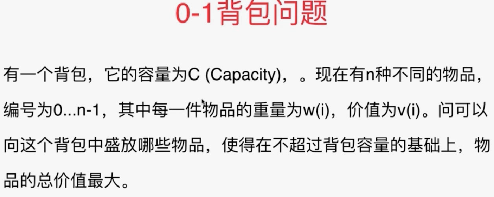

## 暴力解法

还是一个最优解问题，解空间是组合。组合问题都可以用递归去解，看能不能找到重叠子问题和最优子结构去解。

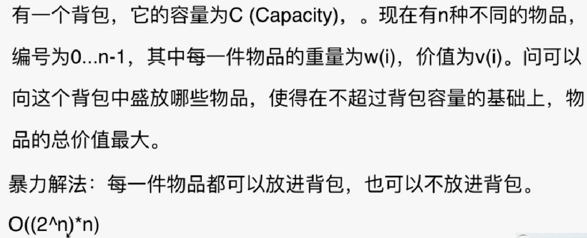

状态：递归函数的参数，递归函数要做什么。参数的个数意味着解决问题要满足的约束条件。本题目有两个约束条件，n个物品，放入容量为C的背包。

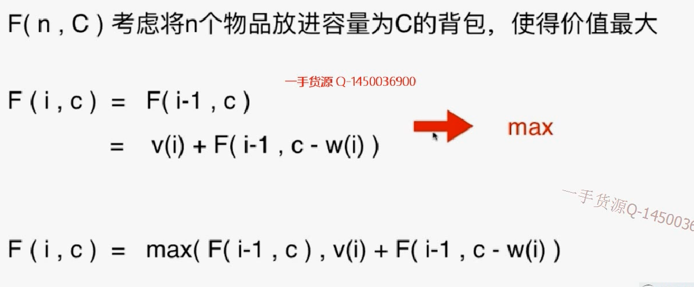

## 记忆化搜索

**// 因为这个问题有两个约束条件，每个状态由两个变量决定。所以memo是一个二维数组**

```java
/// 背包问题
/// 记忆化搜索
/// 时间复杂度: O(n * C) 其中n为物品个数; C为背包容积
/// 空间复杂度: O(n * C)
public class Solution1 {
    // 因为这个问题有两个约束条件，每个状态由两个变量决定。
    private int[][] memo;

    public int knapsack01(int[] w, int[] v, int C){
        if(w == null || v == null || w.length != v.length)
            throw new IllegalArgumentException("Invalid w or v");

        if(C < 0)
            throw new IllegalArgumentException("C must be greater or equal to zero.");

        int n = w.length;
        if(n == 0 || C == 0)
            return 0;

        memo = new int[n][C + 1];
        return bestValue(w, v, n - 1, C);
    }

    // 用 [0...index]的物品,填充容积为c的背包的最大价值
    private int bestValue(int[] w, int[] v, int index, int c){
		// 容量不够或者Index不对，就返回
        if(c <= 0 || index < 0)
            return 0;
		// 计算过
        if(memo[index][c] != -1)
            return memo[index][c];
		// 不放最后一个
        int res = bestValue(w, v, index-1, c);
        // 放最后一个，放的话要考虑容量够不够，容量够再放。
        if(c >= w[index])
            res = Math.max(res, v[index] + bestValue(w, v, index - 1, c - w[index]));

        return memo[index][c] = res;
    }

    public static void main(String[] args) {
    }
}
```

模拟填充过程：

1. 三行表示3个物品，六列表示容量。最后的答案就是arr\[2][5].

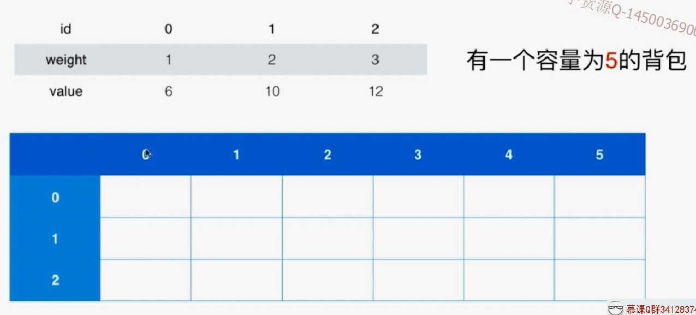

2. 根据递推公式依次去填表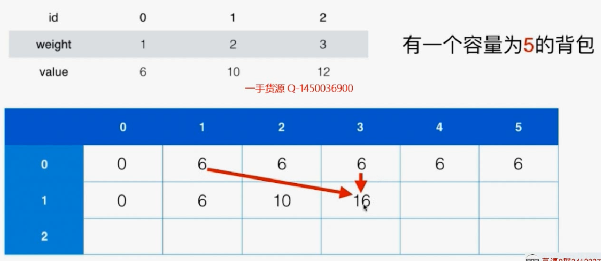
3. 最后得到结果

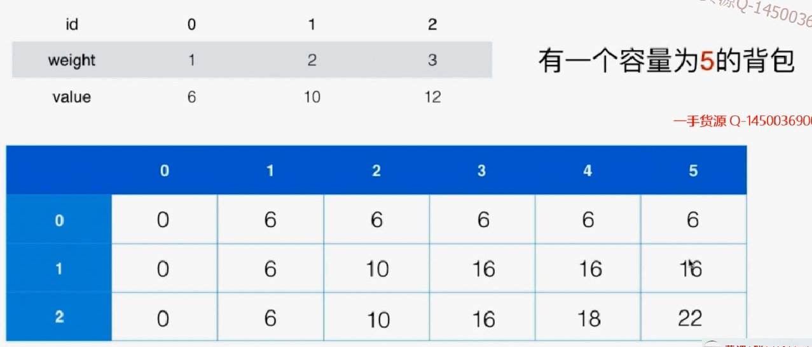

## 贪心解法X

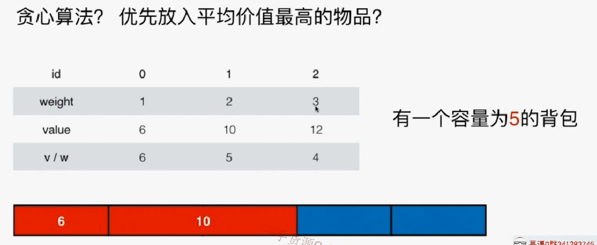

如上所示，先放0,1.就没有地方放3了，所以这个是局部最优解，但本题求的是全局最优解。

## 动态规划

```java
/// 背包问题
/// 动态规划
/// 时间复杂度: O(n * C) 其中n为物品个数; C为背包容积
/// 空间复杂度: O(n * C)
public class Solution2 {
    public int knapsack01(int[] w, int[] v, int C){
        if(w == null || v == null || w.length != v.length)
            throw new IllegalArgumentException("Invalid w or v");

        if(C < 0)
            throw new IllegalArgumentException("C must be greater or equal to zero.");
		
        //排除不正确的情况
        int n = w.length;
        if(n == 0 || C == 0)
            return 0;

        int[][] memo = new int[n][C + 1];
		// 初始化，先填充第一行，考虑第一个物品能否放进去。j是当前背包容量。这里因为确保了有一个物品，所以前面要先判断一下有几个物品
        for(int j = 0 ; j <= C ; j ++)
            memo[0][j] = (j >= w[0] ? v[0] : 0 );
		
        // 
        for(int i = 1 ; i < n ; i ++)
            for(int j = 0 ; j <= C ; j ++){
                memo[i][j] = memo[i-1][j];
                if(j >= w[i])
                    memo[i][j] = Math.max(memo[i][j], v[i] + memo[i - 1][j - w[i]]);
            }

        return memo[n - 1][C];
    }

    public static void main(String[] args) {

    }
}
```

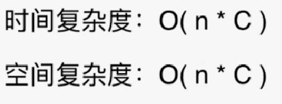

# 0-1背包优化

## 使用2行完成

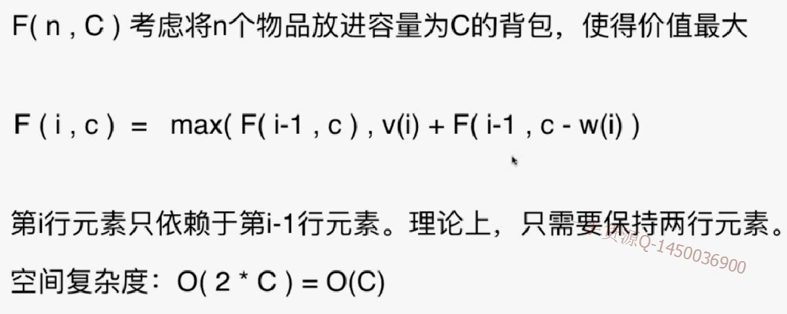

可以开辟两行i,i+1，在计算下一行i+2的时候就占用i即可。所以可以发现这两行中有一行总是在处理物品编号为奇数时的情况，另一行总是在处理物品编号为偶数时的情况。所以所有行都要%2。

极大的扩展了能处理的问题规模n

```java
/// 背包问题
/// 动态规划改进: 滚动数组
/// 时间复杂度: O(n * C) 其中n为物品个数; C为背包容积
/// 空间复杂度: O(C), 实际使用了2*C的额外空间
public class Solution1 {
    public int knapsack01(int[] w, int[] v, int C){

        if(w == null || v == null || w.length != v.length)
            throw new IllegalArgumentException("Invalid w or v");

        if(C < 0)
            throw new IllegalArgumentException("C must be greater or equal to zero.");

        int n = w.length;
        if(n == 0 || C == 0)
            return 0;

        int[][] memo = new int[2][C + 1];

        for(int j = 0 ; j <= C ; j ++)
            memo[0][j] = (j >= w[0] ? v[0] : 0);

        for(int i = 1 ; i < n ; i ++)
            for(int j = 0 ; j <= C ; j ++){
                memo[i % 2][j] = memo[(i-1) % 2][j];
                if(j >= w[i])
                    memo[i % 2][j] = Math.max(memo[i % 2][j], v[i] + memo[(i-1) % 2][j - w[i]]);
            }

        return memo[(n-1) % 2][C];
    }

    public static void main(String[] args) {
    }
}
```

## 使用一行完成

对于每一行的更新，其实只用了原来一行对应位置和该位置左边的数据。所以可以从右向左更新这一行。

i=0这一行

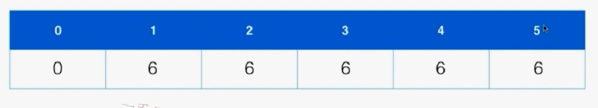

更新i=1这一行。已经更新了c=5,现在更新c=4.

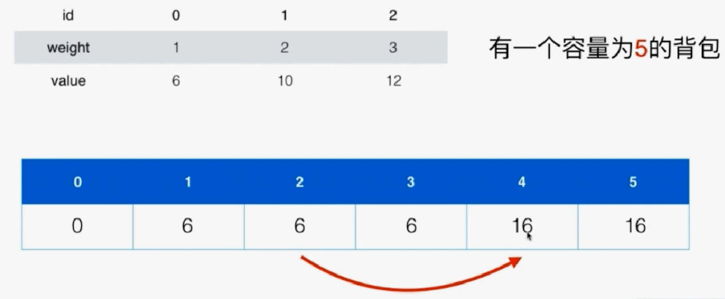

使用这个方法，还能使得算法提前终止，所以不仅节省了空间，也节省了时间。

```java
/// 背包问题
/// 动态规划改进
/// 时间复杂度: O(n * C) 其中n为物品个数; C为背包容积
/// 空间复杂度: O(C), 只使用了C的额外空间
public class Solution2 {
    public int knapsack01(int[] w, int[] v, int C){

        if(w == null || v == null || w.length != v.length)
            throw new IllegalArgumentException("Invalid w or v");

        if(C < 0)
            throw new IllegalArgumentException("C must be greater or equal to zero.");

        int n = w.length;
        if(n == 0 || C == 0)
            return 0;

        int[] memo = new int[C+1];
		// 初始化
        for(int j = 0 ; j <= C ; j ++)
            memo[j] = (j >= w[0] ? v[0] : 0);
		//对于列，是从后往前
        for(int i = 1 ; i < n ; i ++)
            // j<w[i]的时候就不能放了，就是左边没修改的部分
            for(int j = C ; j >= w[i] ; j --)
                memo[j] = Math.max(memo[j], v[i] + memo[j - w[i]]);

        return memo[C];
    }

    public static void main(String[] args) {
    }
}
```

# 可能的变种问题

完全背包问题：每个物品可以无限使用。（背包容量有限，所以每个物品能放的数量是有限的，转换为有限数量问题；对任意一个数字而言，都可以用一个二进制码来表示，可以用1,2,4,8代表1,1,1）

多重背包问题：每个物品不止1个，有num(i)个

多维费用背包问题：考虑物品的体积、重量两个维度。

物品间加入更多约束：互相排斥或者互相依赖。


