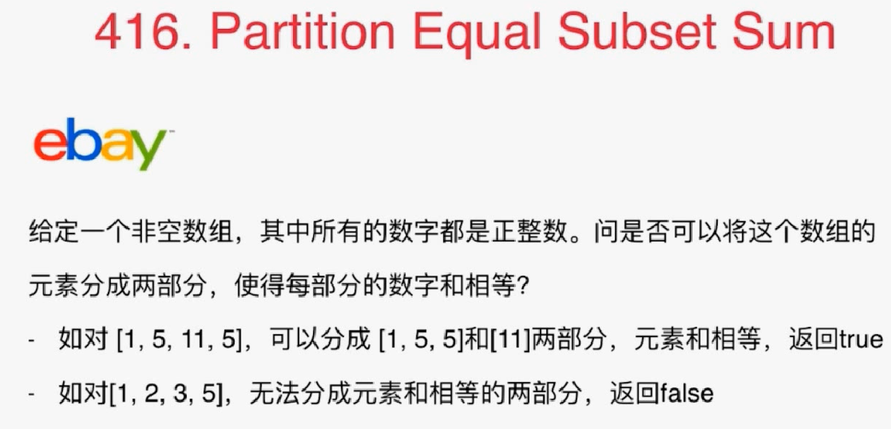
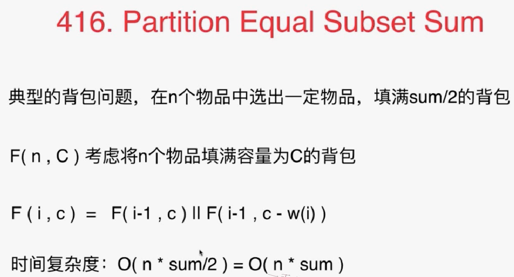
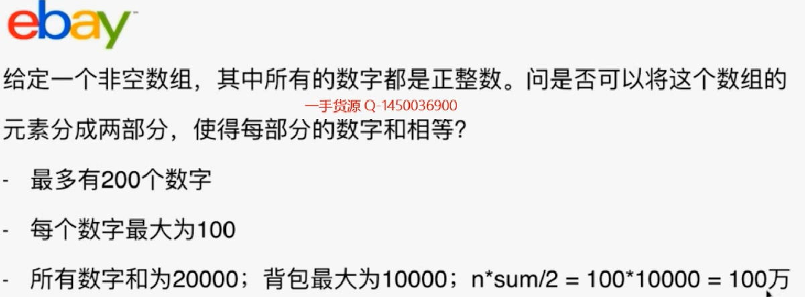
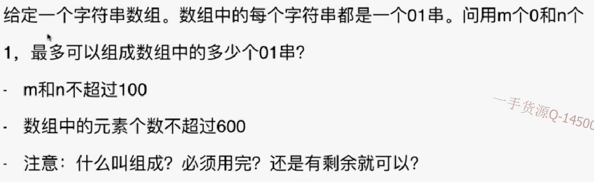

# 416



其实这是一个典型的背包问题：注意要完全填满



根据题目中的约束条件计算出，复杂度为100万。是能够在1s内算出来的，所以思路正确。



## 记忆化搜索

```java
import java.util.Arrays;

/// 416. Partition Equal Subset Sum
/// https://leetcode.com/problems/partition-equal-subset-sum/description/
/// 记忆化搜索
/// 时间复杂度: O(len(nums) * O(sum(nums)))
/// 空间复杂度: O(len(nums) * O(sum(nums)))
public class Solution {
    // memo[i][c] 表示使用索引为[0...i]的这些元素,是否可以完全填充一个容量为c的背包
    // -1 表示为未计算; 0 表示不可以填充; 1 表示可以填充
    private int[][] memo;

    public boolean canPartition(int[] nums) {
        int sum = 0;
        for(int i = 0 ; i < nums.length ; i ++){
            if(nums[i] <= 0)
                throw new IllegalArgumentException("numbers in nums must be greater than zero.");
            sum += nums[i];
        }

        if(sum % 2 == 1)
            return false;
	   // 初始化
        memo = new int[nums.length][sum / 2 + 1];
        for(int i = 0 ; i < nums.length ; i ++)
            Arrays.fill(memo[i], -1);
        return tryPartition(nums, nums.length - 1, sum / 2);
    }

    // 使用nums[0...index], 是否可以完全填充一个容量为sum的背包
    private boolean tryPartition(int[] nums, int index, int sum){
        if(sum == 0)
            return true;

        if(sum < 0 || index < 0)
            return false;

        if(memo[index][sum] != -1)
            return memo[index][sum] == 1;
	   //这两种情况有一个正确就行
        memo[index][sum] = (tryPartition(nums, index - 1, sum) ||
                tryPartition(nums, index - 1, sum - nums[index])) ? 1 : 0;

        return memo[index][sum] == 1;
    }

    private static void printBool(boolean res){
        System.out.println(res ? "True" : "False");
    }

    public static void main(String[] args) {
        int[] nums1 = {1, 5, 11, 5};
        printBool((new Solution1()).canPartition(nums1));

        int[] nums2 = {1, 2, 3, 5};
        printBool((new Solution1()).canPartition(nums2));
    }
}
```

## 动态规格

```java
import java.util.Arrays;

/// 416. Partition Equal Subset Sum
/// https://leetcode.com/problems/partition-equal-subset-sum/description/
/// 动态规划
/// 时间复杂度: O(len(nums) * O(sum(nums)))
/// 空间复杂度: O(len(nums) * O(sum(nums)))
public class Solution {
    public boolean canPartition(int[] nums) {
        int sum = 0;
        for(int i = 0 ; i < nums.length ; i ++){
            if(nums[i] <= 0)
                throw new IllegalArgumentException("numbers in nums must be greater than zero.");
            sum += nums[i];
        }

        if(sum % 2 == 1)
            return false;

        int n = nums.length;
        int C = sum / 2;
		// 因为动态规划是从小到大，所以肯定是未计算过的。所以要先初始化为false。然后计算第一行。
        //这里的动态规划采用最优的方法，只用一个一维数组进行更新。
        boolean[] memo = new boolean[C + 1];
        for(int i = 0 ; i <= C ; i ++)
            memo[i] = (nums[0] == i); 
		
        // 因为复用了数组，所以注意不能覆盖掉当前数组未被改变的值，所以要从后往前考虑第i个物品，每次多考虑一个物品。即：dp[i,c] = dp[i-1,c] || dp[i-1,c-wi]. 现在是dp[c] = dp[c] || dp[c-wi]。当前数组还是i-1时候的值，所以从后往前修改
        for(int i = 1 ; i < n ; i ++)
            for(int j = C; j >= nums[i] ; j --)
                memo[j] = memo[j] || memo[j - nums[i]];

        return memo[C];
    }

    private static void printBool(boolean res){
        System.out.println(res ? "True" : "False");
    }

    public static void main(String[] args) {
        int[] nums1 = {1, 5, 11, 5};
        printBool((new Solution2()).canPartition(nums1));

        int[] nums2 = {1, 2, 3, 5};
        printBool((new Solution2()).canPartition(nums2));
    }
}
```

## 练习

322  coin change

377 combination sum IV

474 ones and zeroes



139 word break ❤

494 target sum（本质是一个2^n的解空间问题）

