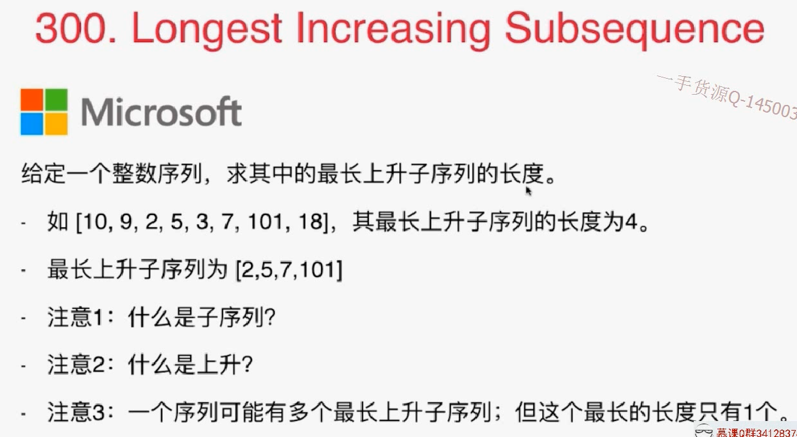
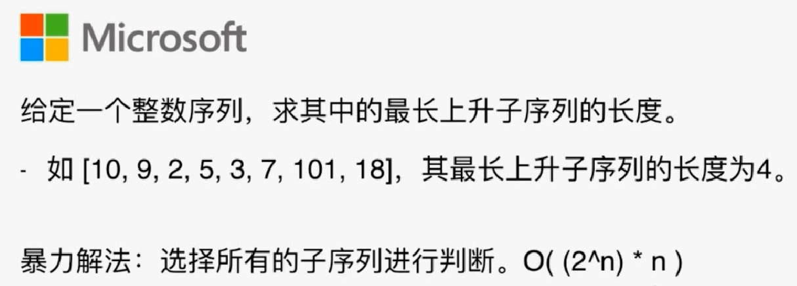
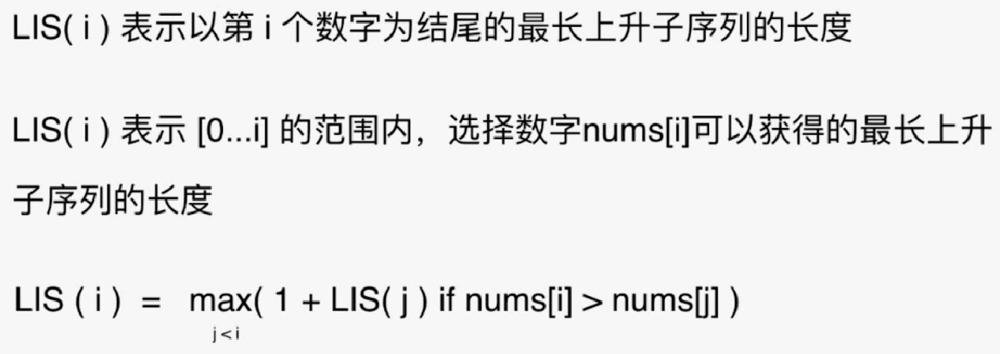

# 300 LIS最长递增子序列



暴力解：解空间是给定元素的组合。所以可以用递归做



关注当选择一个数字后能发生什么，但选择后位置不固定不好。所以给这个数字一个特殊位置。即：



## 动态规划

```java
import java.util.Arrays;

/// 300. Longest Increasing Subsequence
/// https://leetcode.com/problems/longest-increasing-subsequence/description/
/// 记忆化搜索
/// 时间复杂度: O(n^2)
/// 空间复杂度: O(n)
public class Solution2 {
    public int lengthOfLIS(int[] nums) {
        if(nums.length == 0)
            return 0;

        // memo[i] 表示以 nums[i] 为结尾的最长上升子序列的长度
        int memo[] = new int[nums.length];
        Arrays.fill(memo, 1);
        for(int i = 1 ; i < nums.length ; i ++)
            for(int j = 0 ; j < i ; j ++)
                if(nums[i] > nums[j])
                    memo[i] = Math.max(memo[i], 1 + memo[j]);

        int res = memo[0];
        for(int i = 1 ; i < nums.length ; i ++)
            res = Math.max(res, memo[i]);

        return res;
    }

    public static void main(String[] args) {
        int nums4[] = {1, 3, 6, 7, 9, 4, 10, 5, 6};
        System.out.println((new Solution2()).lengthOfLIS(nums4));
    }
}
```

## 记忆化搜索

```java
import java.util.Arrays;

/// 300. Longest Increasing Subsequence
/// https://leetcode.com/problems/longest-increasing-subsequence/description/
/// 记忆化搜索
/// 时间复杂度: O(n^2)
/// 空间复杂度: O(n)
public class Solution1 {
    private int[] memo;
    
    public int lengthOfLIS(int[] nums) {
        if(nums.length == 0)
            return 0;

        memo = new int[nums.length];
        Arrays.fill(memo, -1);
        int res = 1;
        for(int i = 0 ; i < nums.length ; i ++)
            res = Math.max(res, getMaxLength(nums, i));

        return res;
    }

    // 以 nums[index] 为结尾的最长上升子序列的长度
    private int getMaxLength(int[] nums, int index){
        if(memo[index] != -1)
            return memo[index];

        int res = 1;
        for(int i = 0 ; i <= index-1 ; i ++)
            if(nums[index] > nums[i])
                res = Math.max(res, 1 + getMaxLength(nums, i));

        return memo[index] = res;
    }

    public static void main(String[] args) {
        int nums4[] = {1, 3, 6, 7, 9, 4, 10, 5, 6};
        System.out.println((new Solution1()).lengthOfLIS(nums4));
    }
}
```

## 练习

376 wiggle subsequence

