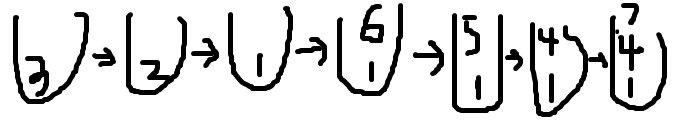
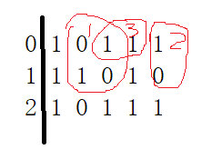
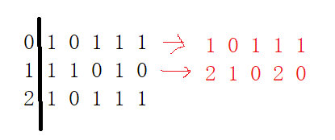

# 单调栈

## 定义：

 栈：元素进入的一端是栈顶，另一端是栈底

 单调递增栈：堆栈中的元素从栈底部到栈顶部单调递增 

 单调递减栈：堆栈中的元素从堆底部到栈顶部单调递减

 单调栈只能在操作栈顶部的元素。

## 背景：

假设当前是**递增单调栈**，给定一个包含若干个**不重复整数**的数组，从第 1 个元素开始依次加入单调栈里，后面每个元素加入后更新单调栈。

## 性质：

单调栈的维护是 O(n) 级的时间复杂度，因为所有元素只会进入栈一次，并且出栈后再也不会进栈了。

1.单调栈里的元素具有单调性

2.元素加入栈前，会在栈顶端把破坏栈单调性的元素都删除

3.使用递减单调栈可以找到元素左边第一个比他小的和元素右边第一个比他小的元素，使用递增单调栈可以找到元素左边第一个比他大和右边第一个比他大的元素。

4.数组元素不重复

## 操作：

1：对于单调递增的栈，如果此时栈顶元素为 b，在加入新元素 a 时同时进行更新。

2：如果 a 大于 b，就直接将a压入栈顶，则a是b右边第一个比他大的元素。

3：如果 a 小于 b，为了保持单调栈的单调性，应该弹出b和之前的元素，直到找到了某个元素小于a，再将a压栈。

4：此时，当要弹出b时，b在栈中下面的元素就是左边第一个比她小的元素，b是因为a要被弹出，则a就是b右边第一个比b小的元素。即某个元素要被弹出的时候清算他的左边第一个最小和右边第一个最小元素。

4：当整个数组遍历完以后栈里面还有元素时，还要对栈进行清空处理。将栈中的元素挨个弹出，此时每个弹出的元素b都知道其左边第一个比b小的元素是b在栈中下面的元素，而b右边第一个比b小的元素是无。

## 举例：

数组：3 2 1 6 5 4 7  （数组元素不重复，单调递增栈）

--> 3直接进栈

--> 2要进栈，此时3要被弹出，得知3右边第一个比3小的是2，3在栈中下面没有元素，所以3左边第一个比3小的是无。3被弹出，放入2，此时栈中只有2.

--> 1要进栈，此时2要被弹出，得知2右边第一个比2小的是1，2在栈中下面没有元素，所以2左边第一个比2小的是无。2被弹出，放入1，此时栈中只有1.

--> 6要进栈，此时6>1,6可以直接进栈。栈中有 1.6

--> 5要进栈，此时6要被弹出，得知6右边第一个比6小的是5，6在栈中下面的元素是1，所以6左边第一个比6小的是1。6被弹出，放入5，此时栈中有1.5.

--> 4要进栈，此时5要被弹出，得知5右边第一个比5小的是4，5在栈中下面的元素是1，所以5左边第一个比5小的是1。5被弹出，放入4，此时栈中有1.4.

--> 7要进栈，此时7>4,7可以直接进栈。栈中有 1.4.7

--> 此时数组遍历结束，但栈中还有元素，所以要开始清算栈。

按规律清算，每个元素右边最小无，左边最小为栈中下面的元素。所以

  左    右

 7     4      无

 4     1      无

 1     无    无



# 例题

## 84. Largest Rectangle in Histogram

### 题目：

Given *n* non-negative integers representing the histogram's bar height where the width of each bar is 1, find the area of largest rectangle in the histogram. 

width of each bar is 1, given height = `[2,1,5,6,2,3]`. The largest rectangle is shown in the shaded area, which has area = `10` unit.

 


### 暴力法：

对每个位置找其左边第一个比他小和右边第一个比他小的位置，再乘以这个位置的高度就是这个位置能组成的最大的面积。（超时）

### 单调栈思想

1：利用单调递增栈，当某个元素要被弹出来的时候结算截至该元素对应的直方图面积是多少，每弹出一个元素，用（当前位置-上一个元素位置-1）* 上一个元素的大小。

当最后清理栈中元素的时候依次算此时面积，每弹出一个元素结算该位置的面积。如果最后的栈是 1 2 3 4 则4位置的最大面积就是他自己 4*1，依次向前，因为后面的数都比前面的大，所以在清理到3的时候，最大值变为3*2,同理，依次为2*3 ，1*4。后面的就代表几个这样的元素。

2：数组元素有重复的时候，可以按照1来操作。

3：为了记录某个值的位置，在栈中存数组下标。

在找左右两边比他小的位置上进行优化。

```java
public int largestRectangleArea_stack(int[] heights) {
    if (heights == null || heights.length == 0)
        return 0;

    int maxArea = 0;
    Stack<Integer> stack = new Stack<>();
    for (int i = 0; i < heights.length; i++) {
        while (!stack.isEmpty() && heights[i] <= heights[stack.peek()]) //当前元素<=栈顶元素，所以不断弹出栈中的元素
        {
            int center = stack.pop(); //弹出栈顶元素的时候就是知道栈顶元素右边第一个比他小的数的时候，所以此时计算栈顶元素作为中心的面积
            int left = stack.isEmpty() ? -1 : stack.peek();  //弹出的栈顶元素左边第一个比他小的元素就是栈顶下面的那个数
            int curArea = (i - left -1) * heights[center]; //right 和 left的坐标都是比栈顶小的元素，所以要- 1
            maxArea = Math.max(maxArea, curArea);
        }
        stack.push(i);
    }
    while (!stack.isEmpty()) //处理剩下的这些元素，这些元素右边全是比他们大的，所以
    {
        int center = stack.pop();
        int left = stack.isEmpty() ? -1 : stack.peek();
        int curArea = (heights.length - left - 1) * heights[center];
        maxArea = Math.max(maxArea, curArea);
    }
    return maxArea;
}
```
## 85. Maximal Rectangle

### 题目：

Given a 2D binary matrix filled with 0's and 1's, find the largest rectangle containing only 1's and return its area.

**Example:**

```
Input:
[
  ["1","0","1","0","0"],
  ["1","0","1","1","1"],
  ["1","1","1","1","1"],
  ["1","0","0","1","0"]
]
Output: 6
```

### 单调栈思路：

1：对于本问题而言，以某一行为底都可表示出一个直方图，通过求出0-（n-1）行只能以该行为底时的直方图中最大面积共n个面积来求出整个矩形最大面积。

只能以某一行为底是指如下图矩阵，情况1和情况2都代表只能以第一行为底，情况3就不对。



2：累计矩阵：假设矩阵 m[i][j] , 使用辅助数组h[j] , 将m[0]这一行都复制到h[j]求出最大值；然后将第二行也添加到h[j]中，添加时保存的是当前位置连续1的个数。红字表示h[j] ，对应第一个位置两个连续1，所以h[0] =2 ,第二个位置只有一个1，h[1] = 1，而第二个位置此时是0，没有连续的1，h[2] = 0. 



```java
public int maximalRectangle(char[][] matrix) {
    if(matrix == null || matrix.length == 0)
        return 0;

    int ans = 0;
    int[] height = new int[matrix[0].length];
    for (int i = 0; i < matrix.length; i++) {
        for (int j = 0; j < matrix[0].length; j++) {
            height[j] = matrix[i][j] == '0' ? 0 : height[j] + 1;  //每一行累加起来，算此时的连续的高度
        }
        ans = Math.max(largestRectangleArea_stack(height), ans);  // 每一行算一下面积
    }
    return ans;
}

public int largestRectangleArea_stack(int[] heights) {
    if (heights == null || heights.length == 0)
        return 0;

    int maxArea = 0;
    Stack<Integer> stack = new Stack<>();
    for (int i = 0; i < heights.length; i++) {
        while (!stack.isEmpty() && heights[i] <= heights[stack.peek()]) //当前元素<=栈顶元素，所以不断弹出栈中的元素
        {
            int center = stack.pop(); //弹出栈顶元素的时候就是知道栈顶元素右边第一个比他小的数的时候，所以此时计算栈顶元素作为中心的面积
            int left = stack.isEmpty() ? -1 : stack.peek();  //弹出的栈顶元素左边第一个比他小的元素就是栈顶下面的那个数
            int curArea = (i - left -1) * heights[center]; //right 和 left的坐标都是比栈顶小的元素，所以要- 1
            maxArea = Math.max(maxArea, curArea);
        }
        stack.push(i);
    }
    while (!stack.isEmpty()) //处理剩下的这些元素，这些元素右边全是比他们大的，所以
    {
        int center = stack.pop();
        int left = stack.isEmpty() ? -1 : stack.peek();
        int curArea = (heights.length - left - 1) * heights[center];
        maxArea = Math.max(maxArea, curArea);
    }
    return maxArea;
}
```
