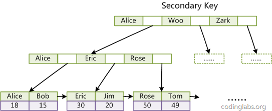

# MySQL

| 数据库软件DBMS           | 使用它访问数据库                 |
| ------------------------ | -------------------------------- |
| 数据库                   | 文件                             |
| 表                       |                                  |
| 模式                     | 关于数据库和表的布局及特性的信息 |
| 列-数据类型，行-一条记录 |                                  |
| 主键primary key          | 一列或一组列，非空且唯一         |
| key (键码，码)           |                                  |

## 全文索引


## 存储过程：

定义：一条或多条mysql语句的集合，可视为批文件

为什么使用：简单/安全/高性能

缺陷：编写复杂

**1.创建存储过程**

返回产品平均价格的存储过程代码：

```
CREATE PROCEDURE productpricing(参数)
BEGIN
	SELECT Avg(prod_price) AS priceaverage
	FROM products;
END;
```

如果使用命令行进行操作，存储过程内的`;`会解析错误。所以要临时更改命令行实用程序的语句分隔符：DELIMITER告诉命令行实用程序使用//作为新的语句结束分隔符，最后恢复原来的分隔符`,`  除`\`外，任何字符都可以用作分隔符。

```mysql
DELIMITER //

CREATE PROCEDURE productpricing()
BEGIN
	SELECT Avg(prod_price) AS priceaverage
	FROM products;
END //
DELIMITER ;
```

**2. 执行存储过程**

mysql成存储过程的执行为调用:call. call接收存储过程的名字以及需要传递给他的任意参数

```
CALL productpricing();
```

**3.  删除存储过程**

`DROP PROCEDURE productpricing;`

## 游标

游标可以在语句检索出的结果集上进行滚动和浏览。mysql游标只能用于存储过程和函数

**使用介绍**

1. 先定义
2. 一旦声明后，就要打开游标使用，根据需要取出各行，在结束游标时，关闭游标。

```mysql
CREATE PROCEDURE processorders()
BEGIN
	-- Declare local variables
	DECLARE o INT;
	
	-- Declare the cursor
	DECLARE ordernumbers CURSOR
	FOR
	SELECT order_num FROM orders;
	
	-- Open the cursor
	OPEN ordernumbers;
	
	-- Get order number
	FETCH ordernumbers INTO o;
	
	-- Close the cursor
	CLOSE ordernumbers;
END;
```

fetch用来检索当前行的order_num列，到一个名为o的局部声明的遍历中，对检索出的数据不做任何处理。

## 触发器

- 定义：面对以下语句能够自动执行的一条MySQL语句

  DELETE /  INSERT / UPDATE / BEGIN和END语句之间的一组语句

- 创建触发器：唯一的触发器名/触发器关联的表/触发器应该响应的活动/何时执行

## 字符集和校对顺序

字符集：字母和符号的集合

编码：为某个字符集成员的内部表示

校对：为规定字符如何比较的指令（e.g. APE, ape  区分大小写的校对顺序）。 \_cs--区分大小写，_ci--不区分大小写。在对用ORDER BY子句检索出来的数据排序时起重要作用。如果要用与创建表时不同的校对顺序排序特定的select语句，可以在select语句自身中进行。

## Offset分页

Mysql limit offset示例

> 例1，假设[数据库](http://www.ahlinux.com/db/)表student存在13条数据。

代码示例:

语句1：select * from student limit 9,4

语句2：slect * from student limit 4 offset 9

// 语句1和2均返回表student的第10、11、12、13行  

//语句2中的4表示返回4行，9表示从表的第十行开始

## 回表

# 查询处理与优化

## 查询处理

 

1. 客户端发送一条查询给服务器。
2. 服务器先检查查询缓存，如果命中了缓存，则立刻返回存储在缓存中的结果。否则进入3
3. 服务器端进行SQL解析、预处理，再由优化器生成对应的执行计划。
4. MySQL根据优化器生成的执行计划，再调用存储引擎的API来执行查询。将结果返回给客户端。

## 查找优化

1. 是否向数据库请求了不需要的数据

   不要轻易使用select * from ，能明确多少数据就查多少个 

2. mysql是否扫描额外的纪录

   衡量查询开销三个指标如下：响应时间，扫描的行数，返回的行数。 

   这三个指标都会记录到mysql的慢日志中，所以检查慢日志记录是找出扫描行数过多的查询的好办法。
   **响应时间：**服务时间和排队时间之和。服务时间是指数据库处理这个查询真正花了多长时间。 排队时间是指服务器因为等待某些资源而没有真正执行查询的时间。—可能是等io操作完成，也可能是等待行锁，等等。

   **扫描的行数和返回的行数：**查看该查询扫描的行数是非常有帮助的。这在一定程度上能够说明该查询找到需要的数据的效率高不高。

   **扫描的行数和访问类型：**在expain语句中的type列反应了访问类型。访问类型有很多种，从全表扫描（ALL）到索引扫描（index）到范围扫描（）到唯一索引查询到常数引用等。这里列的这些，速度由慢到快，扫描的行数也是从小到大。

   如果发现查询需要扫描大量的数据但只返回少数的行，那么通常可以尝试下面的技巧去优化它：

   1. 使用索引覆盖扫描。
   2. 改变库表结构。例如使用单独的汇总表。
   3. 重写这个复杂的查询。让mysql优化器能够以更优化的方式执行这个查询。

3. 查询方式：

   1. 一个复杂查询 or 多个简单查询
       设计查询的时候一个需要考虑的重要问题是，是否需要将一个复杂的查询分成多个简单的查询。

   2. 切分查询

      有时候对于一个大查询我们需要“分而治之”，将大查询切分为小查询，每个查询功能完全一样，只完成一小部分，每次只返回一小部分查询结果。

   3. 分解关联查询

> 让缓存的效率更高：将查询分解后，执行单个查询可以减少锁的竞争、在应用层做关联，可以更容易对数据库进行拆分，更容易做到高性能和可扩展、查询本身效率也可能会有所提升、可以减少冗余记录的查询

[参考：查询优化](https://blog.csdn.net/jack__frost/article/details/71512404)

## **MySQL优化**

1、开启查询缓存，优化查询

2、explain你的select查询，这可以帮你分析你的查询语句或是表结构的性能瓶颈。EXPLAIN 的查询结果还会告诉你你的索引主键被如何利用的，你的数据表是如何被搜索和排序的

3、当只要一行数据时使用limit 1，MySQL数据库引擎会在找到一条数据后停止搜索，而不是继续往后查少下一条符合记录的数据

4、为搜索字段建索引

5、使用 ENUM 而不是 VARCHAR，如果你有一个字段，比如“性别”，“国家”，“民族”，“状态”或“部门”，你知道这些字段的取值是有限而且固定的，那么，你应该使用 ENUM 而不是VARCHAR。

6、Prepared StatementsPrepared Statements很像存储过程，是一种运行在后台的SQL语句集合，我们可以从使用 prepared statements 获得很多好处，无论是性能问题还是安全问题。Prepared Statements 可以检查一些你绑定好的变量，这样可以保护你的程序不会受到“SQL注入式”攻击

7、垂直分表

8、选择正确的存储引擎

# 索引

## 基础概念

1. 定义：索引是一种数据结构，提升数据库的查找速度。
2. 索引的类型

**（逻辑角度）**

- 唯一索引：唯一索引不允许两行具有相同索引值
- 主键索引：定义一个主键将自动创建主键索引,主键索引是唯一索引的特殊类型.**唯一，不为空**
- 普通索引：没有任何限制
- 全文索引

**（数据结构角度）**

- B+树索引
- hash索引
- FULLTEXT索引
- R-tree索引

3. 相关语法

- 创建索引

```mysql
# 唯一
CREATE UNIQUE INDEX indexName ON mytable(username(length))； 
# 普通
CREATE INDEX indexName ON mytable(username(length)); 
```

- 修改表结构（添加索引）

```mysql
# 唯一
ALTER table mytable ADD UNIQUE username(length)
# 普通
ALTER table mytable ADD INDEX indexName()
```

- 创建表的时候直接指定

```mysql
# 唯一
CREATE TABLE mytable(  
ID INT NOT NULL,   
username VARCHAR(16) NOT NULL,  
UNIQUE [indexName] (username(length))
);  
# 普通
CREATE TABLE mytable(   
ID INT NOT NULL,   
username VARCHAR(16) NOT NULL,  
INDEX [indexName] (username(length))  
);  
```

4. 何时建索引：

**应该在这些列上创建索引：**

1. 在经常需要搜索的列上，可以加快搜索的速度；
2. 在作为主键的列上
3. 在经常用在连接的列上，这些列主要是一些外键，可以加快连接的速度；
4. 在经常需要根据范围进行搜索的列上创建索引，因为索引已经排序，其指定的范围是连续的；
5. 在经常需要排序的列上创建索引，因为索引已经排序，这样查询可以利用索引的排序，加快排序查询时间；
6. 在经常使用在WHERE子句中的列上面创建索引，加快条件的判断速度。

**不应该创建索引列：**

1. 在查询中很少使用或者参考的列不应该创建索引。
2. 只有很少数据值的列也不应该增加索引。
3. 定义为text, image和bit数据类型的列不应该增加索引。这是因为，这些列的数据量要么相当大，要么取值很少,不利于使用索引。
4. 当修改性能远远大于检索性能时，不应该创建索引。二者是互相矛盾的
5. 一个表不要超过6个索引

## 索引底层数据结构

### hash表和tree

**哈希：**查询/插入/修改/删除的平均时间复杂度都是O(1)

**树：**查询/插入/修改/删除的平均时间复杂度都是O(lg(n))

- **不管是读请求，还是写请求**，哈希类型的索引，都要比树型的索引更快，为什么索引结构要设计成树型呢？ 

1. 对于**单行查询、没有大量重复键值的情况**，hash更快，因为每次都只查询一条记录。e.g. `select * from t where name = "shenjian"`
2. 对于**排序查询**，例如`分组（group by）,排序（order by）,比较（<，>）` 。用hash的时间复杂度会退化为`O（n）`，而树的**有序**能保持`O(logn)`

**哈希索引不适用的场景：**

1、不支持范围查询

2、不支持索引完成排序

3、不支持联合索引的最左前缀匹配规则

### 2-3树

2-节点：含有一个键和两条连接。左链接的键都小于该节点，右链接的键都大于该节点

3-节点：含有两个键和三条连接。左链接的键都小于该节点，中链接的键位于两节点之间，右链接的键都大于该节点。

### B-树

 

**m阶的B树的特点：**

1. 根结点至少有两个子女。
2. 每个中间节点都包含k-1个元素和k个孩子，其中 m/2 <= k <= m
3. 每一个叶子节点都包含k-1个元素，其中 m/2 <= k <= m
4. 所有的叶子结点都位于同一层。
5. 每个节点中的元素从小到大排列，节点当中k-1个元素正好是k个孩子包含的元素的值域分划。 

**缺点：**

1. 需要处理的情况多，更新操作麻烦，维护的数据多

**应用：**

1. 文件系统以及部分数据库索引：MongoDB

### B+树

 

**m阶的B+树的特点：**

1. 有k个子树的中间节点包含有k个元素（B树中是k-1个元素），每个元素不保存数据，只用来索引，所有数据都保存在叶子节点。
2. 所有的叶子结点中包含了全部元素的信息，及指向含这些元素记录的指针，且叶子结点本身依关键字的大小自小而大顺序链接成为链表。
3. 所有中间节点元素都同时存在于叶子节点，是叶子节点元素中最大（或最小）元素。

**优点：**

查询性能高：单行 & 范围查询 （IO少，性能稳定，范围查询快）

**单行：**

1. B+树的中间节点没有卫星数据，同样大小的磁盘页可以容纳更多的节点元素：数据量相同的情况下，B+树的IO查询次数更少。

1. B+数的查询必须最终查到叶子节点，B-树只要找到匹配元素即可，因此B-树的查找性能并不稳定，B+树每次都是稳定的。

**范围：**

1. B-树的范围查询只能依靠繁琐的中序遍历。e.g.查找3-11的树，需要经历的遍历过程：3-5，6，8，9，11

    

   B+树：在链表上做遍历即可，找到3后通过链表指针遍历到元素9，11


**卫星数据：**索引元素所指向的数据记录，比如数据库中的某一行的指针。B-树中每个节点都有卫星数据，B+树中只有叶子节点有。

**B-树：**

 

**B+树：**

 

在数据库的聚集索引（Clustered Index）中，叶子节点直接包含卫星数据。在非聚集索引（NonClustered Index）中，叶子节点带有指向卫星数据的指针。 

### B-树，B+树对比

1. **B+的磁盘读写代价更低：**

   B+的内部结点并没有指向关键字具体信息的指针。因此其内部结点相对B树更小。如果把所有同一内部结点的关键字存放在同一盘块中，那么盘块所能容纳的关键字数量也越多。一次性读入内存中的需要查找的关键字也就越多。相对来说IO读写次数也就降低了。

2. **B+-tree的查询效率更加稳定：**

   由于非终结点并不是最终指向文件内容的结点，而只是叶子结点中关键字的索引。所以任何关键字的查找必须走一条从根结点到叶子结点的路。所有关键字查询的路径长度相同，导致每一个数据的查询效率相当。

## 数据库索引

数据库的索引分为**主键索引**（Primary Inkex）与**普通索引**（Secondary Index） 

数据库索引是存储在磁盘上的，当数据量比较大时，索引的大小上G，不能把整个索引都加载到内存，只能逐一加载每一磁盘页（即对应的索引树的节点）。

数据库索引是创建在表的某列上的，并且**存储了这一列的所有值、指向表中的相应行的指针**。 但并不存储这个表中其他列（字段）的值。 

1)很适合磁盘存储，能够充分利用局部性原理，磁盘预读；

(2)很低的树高度，能够存储大量数据；

(3)索引本身占用的内存很小；叶子节点存储实际记录行，记录行相对比较紧密的存储，适合大数据量磁盘存储；非叶子节点存储记录的PK，用于查询加速，适合内存存储；

(4)能够很好的支持单点查询，范围查询，有序性查询；

### MyISAM的索引

- B-TREE索引，底层使用B+树
- **非聚集索引**（UnClustered Index）：索引与行记录是分开存储

 

其主键索引与普通索引没有本质差异（MyISAM的表可以没有主键。）： 

- 有连续聚集的区域单独存储行记录
- 主键索引的叶子节点，存储主键，与对应行记录的指针
- 普通索引的叶子结点，存储索引列，与对应行记录的指针

主键索引与普通索引是两棵独立的索引B+树，通过索引列查找时，先定位到B+树的叶子节点，再通过指针定位到行记录。 


### **InnoDB的索引**

- B-TREE索引，底层使用B+树
- **聚集索引**（Clustered Index）：InnoDB的**主键索引与**行记录是存储在一起的，（记录还是只在叶子节点上），没有单独区域存储行记录，只能聚集一个页（16k）。因此，InnoDB的PK查询是非常快的 

 

因为这个特性，InnoDB的表必须要有聚集索引：

(1)如果表定义了PK，则PK就是聚集索引；

(2)如果表没有定义PK，则第一个非空unique列是聚集索引；

(3)否则，InnoDB会创建一个隐藏的row-id作为聚集索引；

聚集索引，也只能够有一个，因为数据行在物理磁盘上只能有一份聚集存储。

**对于普通索引：**

1. InnoDB的**普通索引**可以有多个
2. 普通索引的叶子节点，存储主键（也不是指针）
3. 实际扫描时：先由普通索引找到主键，再由主键找到该行内容

  

**建议：**

(1)不建议使用较长的列做主键，例如char(64)，因为所有的普通索引都会存储主键，会导致普通索引过于庞大；

(2)建议**使用递增的key**做主键，由于数据行与索引一体，这样不至于插入记录时，有大量索引分裂，行记录移动；

### MyISAM, InnoDB索引对比

1. InnoDB的数据文件本身就是索引文件。MyISAM索引文件和数据文件是分离的，索引文件仅保存数据记录的地址
2.  InnoDB的辅助索引data域存储相应记录主键的值而不是地址 ，MyISAM存的是指针

## 使用索引的查询语句优化

1. 索引列不能是表达式的一部分，或函数的参数，否则会使用全表扫描

   `select id from test where id + 1 = 5;`

2. 最左前缀匹配原则：查询语句里将索引列放在最左边

3. where子句中使用模糊的符号 `< , > , or` 否则会放弃索引，使用全表扫描。

4. where子句中负向查询不会使用索引：`not , not in, not like, <>, != ,!>,!<  `

5. where中：连续的数值用between，不要用in

6. 模糊查询：`like '%abc%'， like %keyword  ` 都会使用全表扫描，导致索引失效。` like keyword% `索引有效

7. 在where中使用参数也会导致全表扫描（因为变量的值未知，编译时不知道你是索引），可以强制查询使用索引。

   ```mysql
   select id from t where num = @num
   
   可以改为强制查询使用索引：
   select id from t with(index(索引名)) where num = @num
   ```

# 存储引擎

- 存储引擎的概念是MySQL的特点，Oracle有OLTP和OLAP模式的区分。
- 不同的存储引擎决定了MySQL数据库中的表可以用不同的方式（**存储机制 / 索引技巧 / 锁定水平）**来存储。可以根据数据的特点来选择不同的存储引擎。

## 如何修改，查看引擎

**修改：**

1. 修改配置文件my.ini

将mysql.ini另存为my.ini，在[mysqld]后面添加default-storage-engine=InnoDB，重启服务，数据库默认的引擎修改为InnoDB

2. 在建表的时候指定

create table mytbl(   
​    id int primary key,   
​    name varchar(50)   
)type=MyISAM;

3. 建表后更改

`alter table table_name type = InnoDB;`

**查看：**

1. show table status from table_name; 
2. show create table table_name
3. 使用数据库管理工具

## InnoDB

不支持hash索引

## MyISAM


## 对比

|                           | InnoDB                                                     | MyISAM                                             |
| ------------------------- | ---------------------------------------------------------- | -------------------------------------------------- |
| 事务                      | 具有提交、回滚和崩溃恢复能力的事务安全（ACID兼容）存储引擎 | 不支持事务的完整性和并发性                         |
| count(*)                  | 需要按行扫描                                               | 会存储总行数直接返回                               |
| 添加了where条件的count(*) | 都需要索引扫描                                             |                                                    |
| 全文索引                  | 5.6之前不支持                                              | 支持                                               |
| 外键                      | 支持                                                       | 不支持                                             |
| 关于锁                    | 支持行锁，表锁。默认行级                                   | 只支持表锁                                         |
| 存储结构                  | 文件，可以跨平台                                           | 分为3个文件：frm放表定义，myd放数据文件，myi放索引 |
| 压缩                      |                                                            |                                                    |

MyISAM适合：(1)做很多count 的计算；(2)插入不频繁，查询非常频繁；(3)没有事务。

InnoDB适合：(1)可靠性要求比较高，或者要求事务；(2)表更新和查询都相当的频繁，并且行锁定的机会比较大的情况。

# 锁

## 事务

- ACID特性：原子、一致、隔离、持久
- 破坏事务的隔离性：导致并发操作带来的数据不一致性问题

1. 丢失修改：事务T1,T2读入统一数据并修改，T2提交的结果破坏了T1提交的结果，导致T1的修改被丢失
2. 不可重复读：T1读取数据后，T2执行更新，T1无法再现前一次读取结果
   - T1读取后，T2对它修改，T1再读时得到与前一次不同的值（针对update）
   - T1读取后，T2删除，T1再读读不到（虚、幻读）（针对insert）
   - T1读取后，T2插入，T1再读多了（虚、幻读）（针对insert）
3. 脏读：T1修改某一数据并将其写回，T2读取统一数据后，T1撤销，T2读的就和数据库中的不一样，为脏数据。

- 并发控制的主要技术：封锁、时间戳、乐观控制法、多版本并发控制

## 锁定机制分类

**按封锁类型分类：（数据对象可以是表可以是记录）**

1. 排他锁：（又称写锁，X锁）

- 会阻塞其他事务读和写。
- 若**事务T**对数据对象A加上X锁，则只允许T读取和修改A，其他任何事务都不能再对加任何类型的锁，直到T释放A上的锁。保证了其他事务在T释放A上的锁之前不能再读取和修改A。

2. 共享锁：（又称读取，S锁）

- 会阻塞其他事务写。
- 若事务T对数据对象A加上S锁，则其他事务只能再对A加S锁，而不能X锁，直到T释放A上的锁。这就保证了其他事务可以读A，但在T释放A上的S锁之前不能对A做任何修改。

**按封锁的数据粒度分类如下：**

1. **行级锁定（row-level）：**

- 开销大，加锁慢；会出现死锁；锁定粒度最小，发生锁冲突的概率最低，并发度最高。

**详细：**锁定对象粒度**最小**`-->`所以发生锁定资源争用的概率也最小`-->`提高高并发应用系统的整体性能。

**缺陷：**粒度最小`-->`每次获取锁和释放锁带来的内存消耗更大`-->`行级锁定也最容易发生死锁

在大部分数据上经常进行GROUP BY操作或者扫描整个表，比其它锁定明显慢很多。

2. **表级锁定（table-level）：**

- 开销小，加锁快；不会出现死锁；锁定粒度大，发生锁冲突的概率最高，并发度最低。

**详细：**锁定对象粒度最大`--> `特点：实现逻辑非常简单，带来的系统负面影响最小`-->`获取锁和释放锁的速度很快`-->`由于表级锁一次会将整个表锁定，所以可以很好的避免困扰我们的死锁问题。

**缺陷：**最大的负面影响就是出现锁定资源争用的概率也会最高`-->`致使并发度降低。

3. **页级锁定（page-level）：（MySQL特有）**

- 开销和加锁时间界于表锁和行锁之间；会出现死锁；锁定粒度界于表锁和行锁之间，并发度一般。

**详细：**MySQL独有，其他数据库管理软件中并不常见。特点：锁定颗粒度介于行级锁定与表级锁之间，所以获取锁定所需要的资源开销，以及所能提供的并发处理能力也同样是介于上面二者之间。

**缺陷：**页级锁定和行级锁定一样，会发生死锁。

## 行锁的算法

行锁有3种算法

Record Lock： 单个行记录上的锁
Gap Lock ：间隙锁，锁定一个范围，但不包含记录本身
Next-Key Lock：Gap Lock + Record Lock，锁定一个范围，并且包含记录本身
Record Lock会锁住索引记录，如果建表时没有设置添加索引，Innodb会去锁定隐式的主键。

Next-Key Lock算法的锁定称为Next-Key Locking。采用它可以解决幻读问题

## 封锁协议

在运用X,S锁对对象加锁时，还需要约定规则，比如：何时申请、释放X,S锁，封锁时间。

1. **一级封锁协议**

   事务T在修改数据R之前必须先对其加X锁，直到事务结束（正常结束COMMIT,非正常结束ROLLBACK）才释放。

   **缺点：**保证丢失修改；但读数据不加锁，不能保证可重复读&脏读

2. **二级封锁协议**

   在一级的基础上增加事务T在读数据R之前必须先对其加S锁，读完后可释放S锁

   **举例：**T1对c加X锁后修改，T2想对c加S锁但是不行，只能等待。T1撤销后还是原值，T2再加锁并读取。

   **缺点：**保证丢失修改、脏读；但读完数据就释放S锁，不能保证可重复读。

3. **三级封锁协议**

   在一级的基础上增加事务T在读数据R之前必须先对他加S锁，直到事务结束才释放

   **举例：**T1读a,b之前先对a,b加S锁，其他事物就只能对a,b加S锁，不能加X锁。

   **优点：**全部保证

**区别：何时放锁**


## MySQL各种锁

### 乐观锁和悲观锁 

并发控制：确保多个事务同时存取数据库中同一数据时不破坏事务的隔离性和统一性以及数据库的统一性。

并发控制的技术：乐观并发控制(乐观锁)和悲观并发控制（悲观锁）

- 悲观锁：假定会发生并发冲突(对外界持有悲观态度)，屏蔽一切可能违反数据完整性的操作。

  依靠数据库底层提供的锁机制；InnoDB中用悲观锁；对任意记录进行修改前，先尝试加上排它锁

- 乐观锁：假设不会发生并发冲突，只在提交操作时检查是否违反数据完整性。

  在提交数据更新之前，每个事务会先检查在该事务读取数据后，有没有其他事务又修改了该数据。如果其他事务有更新的话，正在提交的事务会进行回滚 

  乐观锁的方式就是记录数据版本

### 意向锁

InnoDB特有，加在索引上。

**来源：**表级锁和行级锁之间的冲突

**思考：**事务A锁住了表中的一行，让这一行只能读，不能写。之后，事务B申请整个表的写锁。如果事务B申请成功，那么理论上它就能修改表中的任意一行，这与A持有的行锁是冲突的。要避免这种冲突，就要让B的申请被阻塞，直到A释放了行锁。如何判断这个冲突呢？

**两步：**

1. 判断表是否已被其他事务用表锁锁表。
2. 判断表中的每一行是否已被行锁锁住。但是这样的方法效率很低，因为要遍历整个表。

**解决方案：**意向锁。此时，事务A必须先申请表的意向共享锁，成功后再申请一行的行锁。

**步骤：**

1：判断表是否已被其他事务用表锁锁表。

2：发现表上有意向共享锁，说明表中有些行被共享行锁锁住了，因此，事务B申请表的写锁会被阻塞。

**注意：**申请意向锁的动作是数据库完成的：即事务A申请一行的行锁的时候，数据库会自动先开始申请表的意向锁，不需要我们程序员使用代码来申请。

**意向锁目的：**解决表级锁和行级锁之间的冲突

意向锁是一种表级锁，锁的粒度是整张表。结合共享与排他锁使用，分为意向共享锁（IS）和意向排他锁（IX）。意向锁为了方便检测表级锁和行级锁之间的冲突，故在给一行记录加锁前，首先给该表加意向锁。也就是同时加意向锁和行级锁。

### 事务隔离级别

mysql的InnoDB引擎用**意向锁**来解决事务并发问题，为了区别封锁协议，弄了一个新概念隔离性级别：包括Read Uncommitted、Read Committed、Repeatable Read、Serializable。mysql 一般默认Repeatable Read。

1. **读未提交(Read Uncommited，RU)**

一句总结：读取数据一致性在最低级别，只能保证不读物理上损坏的数据，事务间完全不隔离；会脏读，不可重复读，幻读；实际情况下不会使用。

2. **读已提交(Read commited，RC)**

一句总结：仅能读取到已提交的记录，读取数据一致性在语句级别；不会脏读，会不可重复读，幻读。

幻读产生的根本原因是，在RC隔离级别下，每条语句都会读取已提交事务的更新，若两次查询之间有其他事务提交，则会导致两次查询结果不一致。虽然如此，读提交隔离级别在生产环境中使用很广泛。

3. **可重复读(Repeatable Read, RR)**

一句总结：读取数据一致性在事务级别；不会脏读，不可重复读，会幻读。

可重复读隔离级别解决了不可重复读的问题，但依然没有解决幻读的问题。不可重复读重点在修改，即读取过的数据，两次读的值不一样；而幻读则侧重于记录数目变化【插入和删除】。

4. **串行化(Serializable)**

一句总结：读取数据一致性在最高级别，事务级别，不会脏读，不会不可重复读，不会幻读。

在串行化隔离模式下，事务并发度急剧下降，事务的隔离级别与事务的并发度成反比，隔离级别越高，事务的并发度越低。实际生产环境下，dba会在并发和满足业务需求之间作权衡，选择合适的隔离级别。

### InnoDB

支持事务，采用行级锁。

Innodb行锁模式以及加锁方法：

一共三类：共享锁，排他锁，意向锁。其中意向锁分为意向共享锁和意向排他锁。

表阅读姿势：先确定当前锁模式，思考另一用户请求，就去看请求锁模式，思考是否兼容。


- 对于UPDATE、DELETE、INSERT语句，Innodb会自动给涉及的数据集加排他锁（X）；对于普通SELECT语句，Innodb不会加任何锁。 

- InnoDB行锁是通过给索引项加锁来实现的，所以：只有通过索引条件检索数据，innoDB才使用行级锁，否则InnoDB将使用表锁。

  Oracle通过在数据块中，对相应数据行加锁来实现的。

**间隙锁**

**定义：**当我们用范围条件而不是相等条件检索数据，并请求共享或排他锁时，InnoDB会给符合条件的已有数据的索引项加锁；对于键值在条件范围内但并不存在的记录，叫做“间隙(GAP)”，InnoDB也会对这个“间隙”加锁，这种锁机制就是所谓的间隙锁（Next-Key锁）

**举例：**
假如user表中只有101条记录，其userid 的值分别是1,2,…,100,101，下面的SQL：SELECT * FROM user WHERE userid > 100 FOR UPDATE

上面是一个范围条件的检索，InnoDB不仅会对符合条件的userid 值为101的记录加锁，也会对userid 大于101（这些记录并不存在）的“间隙”加锁。

**目的：**
1. 为了防止幻读，以满足相关隔离级别的要求，要是不使用间隙锁，如果其他事务插入了userid 大于100的任何记录，那么本事务如果再次执行上述语句，就会发生幻读；
2. 为了满足其恢复和复制的需要。

**实际开发：**

- 在使用范围条件检索并锁定记录时，InnoDB这种加锁机制会阻塞符合条件范围内键值的并发插入，会造成严重的**锁等待**。
- 因此，实际开发中并发插入比较多的应用，要尽量优化业务逻辑，**尽量使用相等条件**来访问更新数据，避免使用范围条件。

**思考InnoDB的行锁算法：**

- InnoDB是一个支持行锁的存储引擎，锁的类型有：共享锁（S）、排他锁（X）、意向共享（IS）、意向排他（IX）。也就是LBCC，基于锁的并发控制。
- InnoDB有三种行锁的算法：

1）Record Lock：单个行记录上的锁。
2）Gap Lock：间隙锁，锁定一个范围，但不包括记录本身。GAP锁的目的，是为了防止同一事务的两次当前读，出现幻读的情况。
3）Next-Key Lock：1+2，锁定一个范围，并且锁定记录本身。对于行的查询，都是采用该方法，主要目的是解决幻读的问题。

LBCC这样的加锁访问：只能实现并发的读，因为它最终实现的是读写串行化，大大降低了数据库的读写性能。
MVCC：一基于多版本的并发控制协议。主要是解决读写的冲突。MVCC只工作在RC与RR级别下，当然最主要还是为RR级别设计。

**InnoDB的表锁：**

何时使用：1.事务需要更新大部分表。2. 事务涉及多个表

注意：

1. LOCK TALBES可以给InnoDB加表级锁。表锁不是由InnoDB存储引擎层管理的，而是由其上一层ＭySQL Server负责的，仅当autocommit=0、innodb_table_lock=1（默认设置）时，InnoDB层才能知道MySQL加的表锁，ＭySQL Server才能感知InnoDB加的行锁，这种情况下，InnoDB才能自动识别涉及表级锁的死锁；否则，InnoDB将无法自动检测并处理这种死锁。

2. 在用LOCAK TABLES对InnoDB锁时要注意，要将AUTOCOMMIT设为0，否则ＭySQL不会给表加锁；事务结束前，不要用UNLOCAK TABLES释放表锁，因为UNLOCK TABLES会隐含地提交事务；COMMIT或ROLLBACK不能释放用LOCAK TABLES加的表级锁，必须用UNLOCK TABLES释放表锁。

   ```
   set autocommit = 0;
   lock tables1 t1 write, t2 read;
   	do somethinf..
   commit;
   unlock tables;
   ```

### MyISAM

MyISAM只有表锁，其中又分为读锁和写锁。
前面得知：mysql的表锁有两种模式：表共享读锁（table read lock）和表独占写锁（table write lock）。

所以对于MyISAM引擎的锁兼容用一个常规图描述：

表阅读姿势：先确定当前锁模式，思考另一用户请求，就去看请求锁模式，思考是否兼容。

| 当前锁模式 | 请求锁模式：无 | 请求锁模式：读 | 请求锁模式：写 |
| ---------- | -------------- | -------------- | -------------- |
| 读锁       | 兼容           | 兼容           | 不兼容         |
| 写锁       | 兼容           | 不兼容         | 不兼容         |

- 表的读写操作是串行的，只有持有锁线程能对表进行更新，其他线程都要等待。
- 会自动在select语句时给涉及到的所有表加读锁，uodate语句时给涉及的表加写锁。

### MVVC

MySQL InnoDB存储引擎，实现的是基于多版本的并发控制协议——MVCC (Multi-Version Concurrency Control) (注：与MVCC相对的，是基于锁的并发控制，Lock-Based Concurrency Control)。MVCC最大的好处：读不加锁，读写不冲突。在读多写少的OLTP应用中，读写不冲突是非常重要的，极大的增加了系统的并发性能，现阶段几乎所有的RDBMS，都支持了MVCC。

1、LBCC：Lock-Based Concurrency Control，基于锁的并发控制。

2、MVCC：Multi-Version Concurrency Control，基于多版本的并发控制协议。纯粹基于锁的并发机制并发量低，MVCC是在基于锁的并发控制上的改进，主要是在读操作上提高了并发量。

**在MVCC并发控制中，读操作可以分成两类：**

1、快照读 (snapshot read)：读取的是记录的可见版本 (有可能是历史版本)，不用加锁（共享读锁s锁也不加，所以不会阻塞其他事务的写）。

2、当前读 (current read)：读取的是记录的最新版本，并且，当前读返回的记录，都会加上锁，保证其他事务不会再并发修改这条记录。

### 对比

1）两个引擎的死锁对比
ＭyISAM：表锁是无死锁的，这是因为ＭyISAM总是一次性获得所需的全部锁，要么全部满足，要么等待，因此不会出现死锁。

InnoDB：除单个SQL组成的事务外，锁是逐步获得的，这就决定了InnoDB发生死锁是可能的。
发生死锁后，InnoDB一般都能自动检测到，并使一个事务释放锁并退回，另一个事务获得锁，继续完成事务。

但在涉及外部锁，或涉及锁的情况下，InnoDB并不能完全自动检测到死锁，这需要通过设置锁等待超时参数innodb_lock_wait_timeout来解决。需要说明的是，这个参数并不是只用来解决死锁问题，在并发访问比较高的情况下，如果大量事务因无法立即获取所需的锁而挂起，会占用大量计算机资源，造成严重性能问题，甚至拖垮数据库。我们通过设置合适的锁等待超时阈值，可以避免这种情况发生。

2）通过实例介绍几种死锁的常用避免和解决方法。

1. 不同的程序并发存取多个表，应约定以相同的顺序访问表，这样可以大大降低产生死锁的机会。如果两个session访问两个表的顺序不同，发生死锁的机会就非常高！但如果以相同的顺序来访问，死锁就可能避免。
2. 在程序以批量方式处理数据的时候，如果事先对数据排序，保证每个线程按固定的顺序来处理记录，也可以大大降低死锁的可能。
3. 在事务中，如果要更新记录，应该直接申请足够级别的锁，即排他锁，而不应该先申请共享锁，更新时再申请排他锁，甚至死锁。
4. 在REPEATEABLE-READ隔离级别下，如果两个线程同时对相同条件记录用SELECT…ROR UPDATE加排他锁，在没有符合该记录情况下，两个线程都会加锁成功。程序发现记录尚不存在，就试图插入一条新记录，如果两个线程都这么做，就会出现死锁。这种情况下，将隔离级别改成READ COMMITTED，就可以避免问题。
5. 当隔离级别为READ COMMITED时，如果两个线程都先执行SELECT…FOR UPDATE，判断是否存在符合条件的记录，如果没有，就插入记录。此时，只有一个线程能插入成功，另一个线程会出现锁等待，当第１个线程提交后，第２个线程会因主键重出错，但虽然这个线程出错了，却会获得一个排他锁！这时如果有第３个线程又来申请排他锁，也会出现死锁。对于这种情况，可以直接做插入操作，然后再捕获主键重异常，或者在遇到主键重错误时，总是执行ROLLBACK释放获得的排他锁。

## 死锁

概念：事务T1锁了数据R1，T2锁了R2，T1请求锁R2，T2请求锁R1。

解决方法：1.预防死锁发生   2.允许死锁发生，采取手段排除（数据库常用）。

**预防：**

1. 一次封锁法
   要求每个事务必须一次将所有要使用的数据全部加锁，否则就不能继续执行。
   **此方法存在的问题：**

   1. 一次将以后要用到的全部数据加锁，加大封锁范围，降低系统的并发度。
   2. 数据库中数据是不断变化的，原来不要求封锁的数据，在执行过程中可能会变成封锁对象，所以很难事先精确确定每个事务要封锁的数据对象，为此只能扩大封锁范围，将事务在执行过程中可能要封锁的数据对象全部加锁，这就更降低了并发度。

2. 顺序封锁法：

   预先对数据对象规定一个封锁顺序，所有事务都按这个顺序实行封锁。如：在B树结构的索引中，规定封锁的顺序必须从根结点开始，然后是下一级的子女结点，逐级封锁。

   **此方法存在的问题：**

   1. 数据库系统中封锁的数据对象极多，随着数据的插入、删除等操作而不断变化，要维护这样的资源的封锁顺序很难，成本高。
   2. 事务的封锁请求可随着事务的执行而动态地决定，很难事先确定每一个事务要封锁哪些对象，因此很难按规定的顺序去加锁。比如：规定数据对象的封锁顺序：A、B、C、D、E。事务T3起初要求封锁数据对象B、C、E，但当它封锁了B、C后，才发现需要封锁A。！

**死锁的诊断与解除：**
数据库系统中诊断死锁的方法与操作系统类似，一般是用超时法或事务等待图法。

1. 超时法：

   如果一个事务的等待时间超过了规定的时限，就认为发送死锁。
   **不足：**

   1. 有可能误判死锁，事务因为其他原因使等待时机超过时限。
   2. 时限若设置得太长，死锁发生后不能及时发现。

2. 等待图法：

   指的是用事务等待图动态反应所有事务的等待情况。

   事务等待图是一个有向图G=(T,U)，其中T为结点的集合，每个结点表示正在运行的事务。U为边的集合，每条边表示事务等待的情况。若T1等待T2，则T1、T2之间划一条有向边，从T1指向T2。事务等待图动态地反映了所有事务的等待情况。并发控制子系统周期性地检测事务等待图，如果发现图中存在回路，则表示系统中出现了死锁。


DBMS并发控制子系统**解除死锁的办法**是：选择一个处理死锁代价最小的事务，将其撤销，释放此事务持有的所有的锁，使其他事务能继续运行下去。（而且要对撤销的事务所执行的数据修改操作进行恢复） 