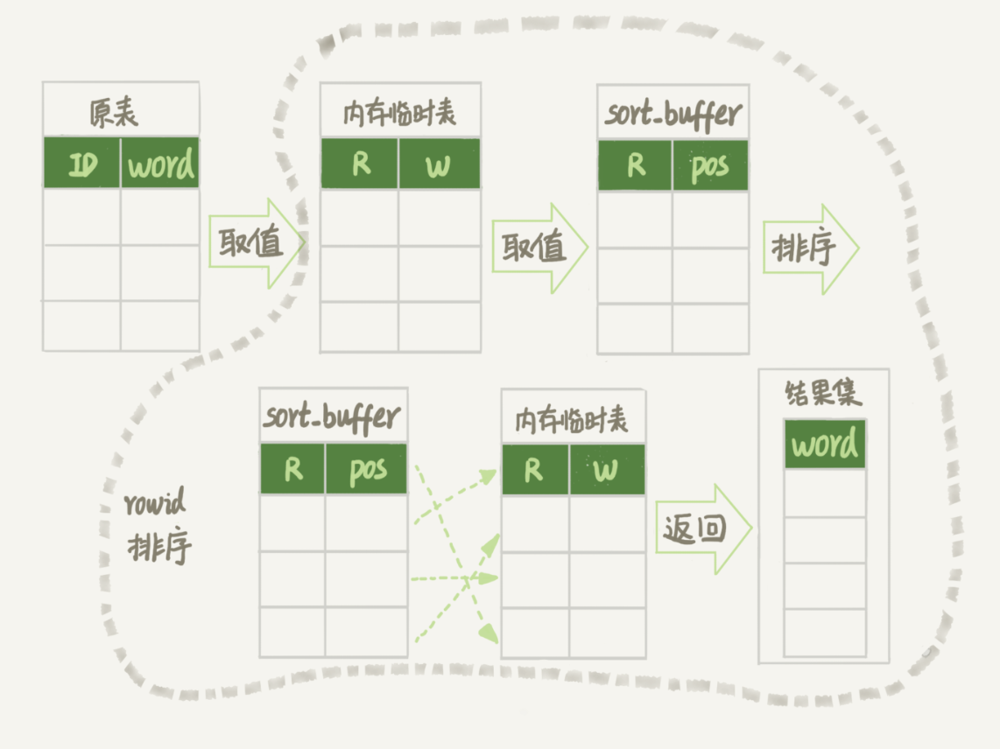

# 一：count(*)的实现方式

1. MyISAM引擎：把一个表的总行数存在了磁盘上，执行count(*)时直接返回这个数，效率很高；

2. InnoDB引擎：需要把数据一行一行地从引擎里面读出来，然后累积计数。

- **为什么InnoDB不存起来？**

1. 由于多版本并发控制（MVCC）的原因，在同一个时刻的多个查询中，InnoDB应该返回的数都是不确定的

- **InnoDB的实现原理**

1. **在保证逻辑正确的前提下，尽量减少扫描的数据量，是数据库系统设计的通用法则之一。**

   所以mysql会找到最小的树来遍历，结果准确，但会导致性能问题。

2. show table status命令：也会显示当前表的行数，但是采样估算的，不准

3. 在数据库保存计数

   - 首先解决了崩溃丢失问题：InnoDB支持crash safe

   - 其次解决了技术精确问题：由于RR，保证逻辑一致

- **不同的count用法**

count()：是一个聚合函数，对于返回的结果集，一行行地判断，如果count函数的参数不是NULL，累计值就加1，否则不加。最后返回累计值。

分析性能差别时的原则：

1. server层要什么就给什么；
2. InnoDB只给必要的值；
3. 现在的优化器只优化了count(*)的语义为“取行数”，其他“显而易见”的优化并没有做。

即：

**对于count(主键id)来说**，InnoDB引擎会遍历整张表，把每一行的id值都取出来，返回给server层。server层拿到id后，判断是不可能为空的，就按行累加。

**对于count(1)来说**，InnoDB引擎遍历整张表，但不取值。server层对于返回的每一行，放一个数字“1”进去，判断是不可能为空的，按行累加。

单看这两个用法的差别的话，你能对比出来，count(1)执行得要比count(主键id)快。因为从引擎返回id会涉及到解析数据行，以及拷贝字段值的操作。

**对于count(字段)来说**：

1. 如果这个“字段”是定义为not null的话，一行行地从记录里面读出这个字段，判断不能为null，按行累加；
2. 如果这个“字段”定义允许为null，那么执行的时候，判断到有可能是null，还要把值取出来再判断一下，不是null才累加。

也就是前面的第一条原则，server层要什么字段，InnoDB就返回什么字段。

**但是count(\*)是例外**，并不会把全部字段取出来，而是专门做了优化，不取值。count(*)肯定不是null，按行累加。

- 按照效率排序的话，count(字段)<count(主键id)<count(1)≈count(*)，所以尽量使用count(*)。

# 二：order by的实现原理

MySQL会给每个线程分配一块内存用于排序，称为sort_buffer。

## 全排序：

```
select city,name,age from t where city='杭州' order by name limit 1000  ;
```

假设满足city='杭州’条件的行，是从ID_X到ID_(X+N)的这些记录。执行流程如下所示 ：

1. 初始化sort_buffer，确定放入name、city、age这三个字段；
2. 从索引city找到第一个满足city='杭州’条件的主键id，也就是图中的ID_X；
3. 到主键id索引取出整行，取name、city、age三个字段的值，存入sort_buffer中；
4. 从索引city取下一个记录的主键id；
5. 重复步骤3、4直到city的值不满足查询条件为止，对应的主键id也就是图中的ID_Y；
6. 对sort_buffer中的数据按照字段name做快速排序；
7. 按照排序结果取前1000行返回给客户端。

将这个排序过程，称为全字段排序，


图中“按name排序”：可能在内存中完成，也可能使用外部排序，取决于排序所需的内存和参数sort_buffer_size。

sort_buffer_size：MySQL为排序开辟的内存（sort_buffer）的大小。如果要排序的数据量小于sort_buffer_size，排序就在内存中完成。否则使用磁盘临时文件辅助排序。

## rowid排序：

- **如果MySQL认为排序的单行长度太大会怎么做？**

此时，MySQL采用另外一种算法。

```
SET max_length_for_sort_data = 16;
```

max_length_for_sort_data：MySQL中专门控制用于排序的行数据的长度的参数。如果单行长度超过该值，单行太大，要换一个算法。

city、name、age 这三个字段的定义总长度是36，将max_length_for_sort_data设置为16，新的算法放入sort_buffer的字段，只有要排序的列（即name字段）和主键id。但这时，排序的结果就因为少了city和age字段的值，不能直接返回了，整个执行流程变为：

1. 初始化sort_buffer，确定放入两个字段，即name和id；
2. 从索引city找到第一个满足city='杭州’条件的主键id，也就是图中的ID_X；
3. 到主键id索引取出整行，取name、id这两个字段，存入sort_buffer中；
4. 从索引city取下一个记录的主键id；
5. 重复步骤3、4直到不满足city='杭州’条件为止，也就是图中的ID_Y；
6. 对sort_buffer中的数据按照字段name进行排序；
7. 遍历排序结果，取前1000行，并按照id的值回到原表中取出city、name和age三个字段返回给客户端。

rowid排序：


## 全字段排序 VS rowid排序

1. MySQL的设计思想：**如果内存够，就要多利用内存，尽量减少磁盘访问。**
2. 对于InnoDB表来说，rowid排序会要求回表多造成磁盘读，因此不会被优先选择。
3. 若创建联合索引，不需要临时表、排序。扫描次数减少

explain时：using index--使用了覆盖索引；using condition index--使用

using filesort：需要排序；Using temporary：需要使用临时表；

## 内存临时表排序

举例：`select word from words order by rand() limit 3;`

流程：当words表不大时：临时内存表排序

临时内存表排序方式的选择：

1. **对于InnoDB表来说**，执行全字段排序会减少磁盘访问，因此会被优先选择
2. **对于内存表，回表过程只是简单地根据数据行的位置，直接访问内存得到数据，会选择rowid排序**。

临时内存表的rowid排序流程：

1. 创建一个临时表。临时表使用memory引擎，表里有两个字段，第一个字段是double类型，记为字段R，第二个字段是varchar(64)类型，记为字段W。该表没有建索引。
2. 从words表中，按主键顺序取出所有的word值。对于每一个word值，调用rand()函数生成一个大于0小于1的随机小数，并把这个随机小数和word分别存入临时表的R和W字段中，到此，扫描行数是10000。
3. 现在临时表有10000行数据了，接下来你要在这个没有索引的内存临时表上，按照字段R排序。
4. 初始化 sort_buffer。sort_buffer中有两个字段，一个是double类型，另一个是整型。
5. 从内存临时表中一行一行地取出R值和**位置信息**，分别存入sort_buffer中的两个字段里。这个过程要对内存临时表做全表扫描，此时扫描行数增加10000，变成了20000。
6. 在sort_buffer中根据R的值进行排序。注意，这个过程没有涉及到表操作，所以不会增加扫描行数。
7. 排序完成后，取出前三个结果的位置信息，依次到内存临时表中取出word值，返回给客户端。这个过程中，访问了表的三行数据，总扫描行数变成了20003。



**位置信息：**

**MySQL的表是用什么方法来定位“一行数据”的**：rowid

rowid：如果创建的表没有主键，或者把一个表的主键删掉了，那么InnoDB会自己生成一个长度为6字节的rowid来作为主键。即排序模式里rowid名字的来历。实际上它表示的是：每个引擎用来唯一标识数据行的信息。

- 对于有主键的InnoDB表来说，这个rowid就是主键ID；
- 对于没有主键的InnoDB表来说，这个rowid就是由系统生成的；
- MEMORY引擎不是索引组织表。可以认为它就是一个数组，rowid就是数组的下标。

## 磁盘临时表排序

tmp_table_size这个配置限制了内存临时表的大小，默认值是16M。如果临时表大小超过了tmp_table_size，内存临时表就会转成磁盘临时表。

磁盘临时表使用的引擎默认是InnoDB，由参数internal_tmp_disk_storage_engine控制的。

当使用磁盘临时表时，即一个没有显式索引的InnoDB表的排序过程。

排序算法的选择：归并（会使用临时文件）、优先队列（堆排序：不用临时文件）

此时会使用堆排序：因为只需取R值最小的3个rowid。如果使用归并，结果是券都排好序了，浪费。优先队列算法只得到三个最小值。

注：若limit 1000，维护的堆会超内存，就会使用归并。

# 二：逻辑相同，性能差异很大的案例

## 案例一：条件字段函数操作

假设你现在维护了一个交易系统，其中交易记录表tradelog包含交易流水号（tradeid）、交易员id（operator）、交易时间（t_modified）等字段。为了便于描述，我们先忽略其他字段。这个表的建表语句如下：

# 三：join的原理

背景：两个表t1, t2。两个表都有一个主键索引id和一个索引a，字段b上无索引。t2里有1000行，t1里有100行。

## 1.Index Nested-Loop Join

```
select * from t1 straight_join t2 on (t1.a=t2.a);
```

1. straight_join：如果直接使用join，MySQL优化器可能会选择t1或t2作为驱动表。为了便于分析，straight_join让MySQL使用固定的连接方式执行查询：t1 是驱动表，t2是被驱动表。

2. 流程：

   从表t1中读入一行数据 R；----> 从数据行R中，取出a字段到表t2里去查找；----> 取出表t2中满足条件的行，跟R组成一行，作为结果集的一部分；----> 重复执行步骤1到3，直到表t1的末尾循环结束。

3. NLJ：遍历表t1，根据从表t1中取出的每行数据中的a值，去表t2中查找满足条件的记录。类似嵌套查询，并且用上被驱动表的索引，所以叫做“Index Nested-Loop Join”


4. 性能：对t1全表扫描有100行，根据索引对t2（先搜索引a，再搜逐渐索引）进行查找，100行，共200行。

   复杂度：假设被驱动表行数M，在被驱动表上搜索需要2*log2M，驱动表行数N，总的复杂度是：N + N\*2*log2M

   N对扫描行数的影响更大，因此应该让小表来做驱动表。

5. 总结：当可以使用被驱动表的索引时：

1. 使用join语句，性能比强行拆成多个单表执行SQL语句的性能要好；
2. 如果使用join语句的话，需要让小表做驱动表。

## 2. Simple Nested-Loop Join

场景：被驱动表用不上索引。此时，每次去t2匹配的时候要做一次全表扫描

性能：100*1000=10W

该方案未采用，使用以下方案

### Block Nested-Loop Join

1. 把表t1的数据读入线程内存join_buffer中，语句中是select *，因此是把整个表t1放入了内存；
2. 扫描表t2，把表t2中的每一行取出来，跟join_buffer中的数据做对比，满足join条件的，作为结果集的一部分返回。


性能：需要判断100*1000=10万次。因为是内存操作，所以快很多。

驱动表选择：没区别，搜需要扫描M+N行，判断M*N次

若Join_buffer放不下T1：

join_buffer的大小是由参数join_buffer_size设定的，默认值是256k。**如果放不下表t1的所有数据话，就分段放。**我把join_buffer_size改成1200，再执行：

1. 扫描表t1，顺序读取数据行放入join_buffer中，放完第88行join_buffer满了，继续第2步；
2. 扫描表t2，把t2中的每一行取出来，跟join_buffer中的数据做对比，满足join条件的，作为结果集的一部分返回；
3. 清空join_buffer；
4. 继续扫描表t1，顺序读取最后的12行数据放入join_buffer中，继续执行第2步。


这个流程才体现出了这个算法名字中“Block”的由来，表示“分块去join”。

性能：

假设，驱动表的数据行数是N，需要分K段才能完成算法流程，被驱动表的数据行数是M。K表示为λ*N，显然λ的取值范围是(0,1)。N越大，K越大

所以，在这个算法的执行过程中：

1. 扫描行数是 N+λ\*N*M；
2. 内存判断 N*M次。

显然，内存判断次数是不受选择哪个表作为驱动表影响的。而考虑到扫描行数，在M和N大小确定的情况下，N小一些，整个算式的结果会更小。

所以：应该让小表当驱动表，λ越小越好。

## 总结

- 第一个问题：能不能使用join语句？

1. 如果可以使用Index Nested-Loop Join算法，也就是说可以用上被驱动表上的索引，其实是没问题的；
2. 如果使用Block Nested-Loop Join算法，扫描行数就会过多。尤其是在大表上的join操作，这样可能要扫描被驱动表很多次，会占用大量的系统资源。所以这种join尽量不要用。

所以你在判断要不要使用join语句时，就是看explain结果里面，Extra字段里面有没有出现“Block Nested Loop”字样。

- 第二个问题是：如果要使用join，应该选择大表做驱动表还是选择小表做驱动表？

1. 如果是Index Nested-Loop Join算法，应该选择小表做驱动表；
2. 如果是Block Nested-Loop Join算法：
   - 在join_buffer_size足够大的时候，是一样的；
   - 在join_buffer_size不够大的时候（这种情况更常见），应该选择小表做驱动表。

所以，这个问题的结论就是，总是应该使用小表做驱动表。

- **什么叫作“小表”**

例一：

```
select * from t1 straight_join t2 on (t1.b=t2.b) where t2.id<=50;
select * from t2 straight_join t1 on (t1.b=t2.b) where t2.id<=50;
```

为了两条语句的被驱动表都用不上索引，所以join字段都使用了没有索引的字段b。

但如果是用第二个语句的话，join_buffer只需要放入t2的前50行，显然是更好的。所以这里，“t2的前50行”是那个相对小的表，也就是“小表”。

例二：

```
select t1.b,t2.* from  t1  straight_join t2 on (t1.b=t2.b) where t2.id<=100;
select t1.b,t2.* from  t2  straight_join t1 on (t1.b=t2.b) where t2.id<=100;
```

这个例子里，表t1 和 t2都是只有100行参加join。但是，这两条语句每次查询放入join_buffer中的数据是不一样的：

- 表t1只查字段b，因此如果把t1放到join_buffer中，则join_buffer中只需要放入b的值；
- 表t2需要查所有的字段，因此如果把表t2放到join_buffer中的话，就需要放入三个字段id、a和b。

这里，我们应该选择表t1作为驱动表。也就是说在这个例子里，“只需要一列参与join的表t1”是那个相对小的表。

所以：**在决定哪个表做驱动表的时候，应该是两个表按照各自的条件过滤，过滤完成之后，计算参与join的各个字段的总数据量，数据量小的那个表，就是“小表”，应该作为驱动表**