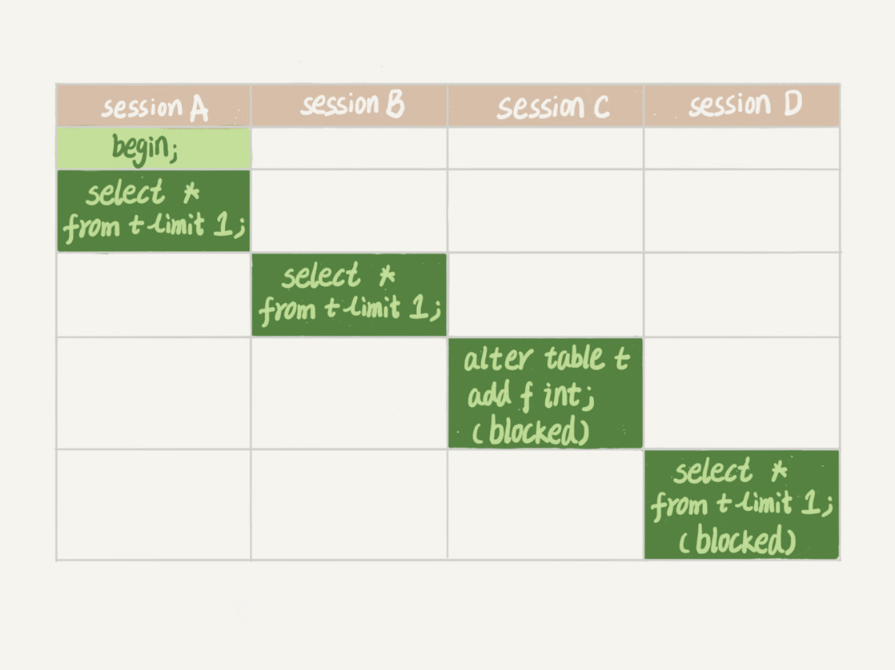
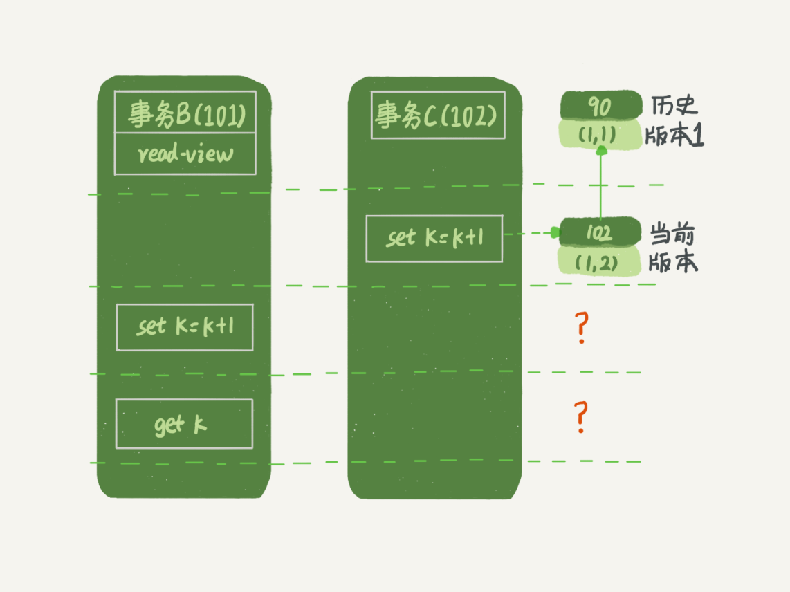
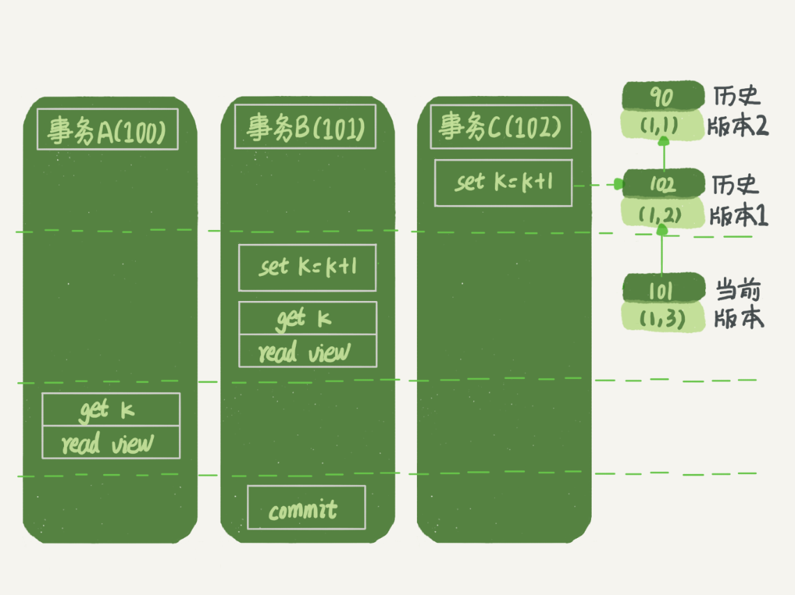

# 基础架构


1. MySQL分为Server层、存储引擎层

2. Server层：包括连接器、查询缓存、分析器、优化器、执行器、所有内置函数（如日期、时间、数学和加密函数）、所有跨存储引擎功能（如存储过程、触发器、视图）

3. 存储引擎层：负责数据的存储和提取。其架构模式是插件式的，支持InnoDB、MyISAM、Memory等。最常用的存储引擎是InnoDB，从MySQL5.5.5 开始为默认存储引擎。

   在create table语句中使用engine=memory即使用内存引擎创建表。不同存储引擎的表数据存取方式、功能不同

4. 不同的存储引擎共用一个**Server层**（从连接器到执行器的部分）

## 1.连接器

1. 连接器负责跟客户端建立连接、获取权限、维持和管理连接：

   `mysql -h$ip -p$port -u$user -p`

   - 命令中mysql是客户端工具，用来跟服务端建立连接
   - 完成TCP握手后---->连接器使用输入的用户名&密码认证身份
   - 认证通过后，连接器到权限表里查出你拥有的权限。**之后，这个连接里面的权限判断逻辑，都将依赖于此时读到的权限。**

2. 连接管理：

   - 使用`show processlist`查看连接状态，sleep为空闲。客户端若长时没动静，连接器会自动将它断开。这个时间由参数wait_timeout控制，默认值是8小时。断开后要重连。

   - 长连接：连接成功后，如果客户端持续有请求，则一直使用同一个连接。

   - 短连接：每次执行完很少的几次查询就断开连接，下次查询再重新建立。

   - 建立连接的过程比较复杂，尽量使用长连接。但此时，MySQL占用内存会涨得特别快，因为MySQL在执行过程中临时使用的内存是管理在连接对象里面的。这些资源在连接断开时才释放。所以长连接累积会导致内存占用太大，被系统强行杀掉（OOM），从现象看就是MySQL异常重启了。

     解决方案：

     1. 定期断开长连接：程序里判断执行过一个占用内存的大查询后断开
     2. 若版本》MySQL 5.7，可在每次执行一个比较大的操作后，通过执行 mysql_reset_connection来重新初始化连接资源。这个过程不会重连和重新做权限验证，会将连接恢复到刚刚创建完时的状态。

## 2.查询缓存

1. 连接建立完成后，进行查询缓存。

2. 若之前执行过，其结果可能会以key-value对的形式，被直接缓存在内存中。

3. 如果语句不在查询缓存中，就会继续后面的执行阶段。执行完成后，执行结果会被存入查询缓存中。

**但是大多数情况下不要使用查询缓存：因为查询缓存往往弊大于利。**

1. 查询缓存的失效非常频繁：只要有对一个表的更新，这个表上所有的查询缓存都会被清空。
2. 适用场景：业务只有一张静态表，很长时间才会更新一次。比如，一个系统配置表。

3. 将参数query_cache_type设置成DEMAND，这样对于默认的SQL语句都不使用查询缓存。而对于你确定要使用查询缓存的语句，可以用SQL_CACHE显式指定，像下面这个语句一样：

```
mysql> select SQL_CACHE * from T where ID=10；
```

4. MySQL 8.0及以后的版本彻底取消了“查询缓存”模块

## 3.分析器

1. 词法分析

分析sql语句中每个字符串的含义，语句是否正确、表是否存在、列是否存在

2. 语法分析

根据语法规则，SQL语句是否满足MySQL语法。（一般语法错误会提示第一个出现错误的位置，所以你要关注的是紧接“use near”的内容）

## 4.优化器

优化器是在表里面有多个索引的时候，决定使用哪个索引；或者在一个语句有多表关联（join）的时候，决定各个表的连接顺序。

## 5.执行器

1. 开始执行时，先判断一下用户对表有没有相应权限（如果命中查询缓存，会在查询缓存放回结果的时候，做权限验证)

   为什么不在优化器前做权限检查？

   - 因为SQL语句要操作的表不只是SQL字面上那些。比如如果有个触发器，得在执行器阶段（过程中）才能确定。优化器阶段前是无能为力的

2. 有权限，就打开表继续执行，根据表的引擎定义，使用这个引擎提供的接口

3. mysqld--debug--console&  使用debug模式启动，可以看到Trace日志

# 执行过程

1. 查询语句：连接器、分析器、优化器、执行器、存储引擎。
2. 更新语句：连接器、该表有关查询缓存失效、分析器得知为更新语句、优化器使用索引、执行器更新

## 日志模块

更新流程涉及两个重要的日志模块：redo log（重做日志）和 binlog（归档日志）

- redo log（InnoDB引擎特有的日志）：

  使用WAL（Write-Ahead-Logging）技术，保证crash-safe（即使数据库异常重启，之前的记录都不会丢失）。即：

  1. 当有一条记录需要更新的时候，InnoDB引擎先把记录写到redo log里并更新内存。之后，InnoDB在闲时，将操作记录更新到磁盘里面。

  2. redo log是固定大小的，从头开始写，写到末尾就又回到开头循环写

  3. 

     write pos：当前记录的位置，一边写一边后移，写到3号文件末尾后就回到0号文件开头。

     checkpoint：是当前要擦除的位置，也是往后推移并且循环的，擦除记录前要把记录更新到数据文件。

     write pos追上checkpoint时：表示写满了，需要先擦掉一些记录。

  4. innodb_flush_log_at_trx_commit这个参数设置成1的时候，表示每次事务的redo log都直接持久化到磁盘。建议设置成1，这样可以保证MySQL异常重启之后数据不丢失。

- Binlog（Server层）-用于归档：

  1. sync_binlog这个参数设置成1的时候，表示每次事务的binlog都持久化到磁盘。建议设置成1，这样可以保证MySQL异常重启之后binlog不丢失。
  2. Binlog有两种模式，statement 格式的话是记sql语句， row格式会记录行的内容，记两条，更新前和更新后都有。

## 两种日志的不同

1. redo log是InnoDB引擎特有的；binlog是MySQL的Server层实现的，所有引擎都可以使用。
2. redo log是物理日志，记录的是“在某个数据页上做了什么修改”；binlog是逻辑日志，记录的是这个语句的原始逻辑，比如“给ID=2这一行的c字段加1 ”。
3. redo log是循环写的，空间固定会用完；binlog是可以追加写入的。“追加写”是指binlog文件写到一定大小后会切换到下一个，并不会覆盖以前的日志。

## 更新操作过程

比如`update T set c=c+1 where ID=2;`

**执行器和InnoDB引擎在执行该语句时的内部流程：**

1. 执行器先找引擎取ID=2这一行。ID是主键，引擎用树搜索找到这一行。如果ID=2这一行所在的数据页本来就在内存中，就直接返回给执行器；否则，需要先从磁盘读入内存，然后再返回。
2. 执行器拿到引擎给的行数据，把这个值加上1，比如原来是N，现在就是N+1，得到新的一行数据，再调用引擎接口写入这行新数据。
3. 引擎将这行新数据更新到内存中，同时将这个更新操作记录到redo log里面，此时redo log处于prepare状态。然后告知执行器执行完成了，随时可以提交事务。
4. 执行器生成这个操作的binlog，并把binlog写入磁盘。
5. 执行器调用引擎的提交事务接口，引擎把刚刚写入的redo log改成提交（commit）状态，更新完成。

### 两阶段提交

1. 上述过程的最后三步：将redo log的写入拆成了两个步骤：prepare和commit，这就是"两阶段提交"。

2. 为什么必须有“两阶段提交”呢？为了让两份日志之间的逻辑一致，才能**让数据库恢复到半个月内任意一秒的状态**

   使用反证法证明：这两阶段任一阶段先完成都可能导致不一致状态。

## 具体过程

1. 客户端通过tcp/ip发送一条sql语句到server层的SQL interface
2. SQL interface接到该请求后，先对该条语句进行解析，验证权限是否匹配
3. 验证通过以后，分析器会对该语句分析,是否语法有错误等
4. 接下来是优化器器生成相应的执行计划，选择最优的执行计划
5. 之后会是执行器根据执行计划执行这条语句。在这一步会去open table,如果该table上有MDL，则等待。
   如果没有，则加在该表上加短暂的MDL(S)
   (如果opend_table太大,表明open_table_cache太小。需要不停的去打开frm文件)
6. 进入到引擎层，首先会去innodb_buffer_pool里的data dictionary(元数据信息)得到表信息
7. 通过元数据信息,去lock info里查出是否会有相关的锁信息，并把这条update语句需要的锁信息写入到lock info里(锁这里还有待补充)
8. 然后涉及到的老数据通过快照的方式存储到innodb_buffer_pool里的undo page里,并且记录undo log修改的redo(如果data page里有就直接载入到undo page里，如果没有，则需要去磁盘里取出相应page的数据，载入到undo page里)
9. 在innodb_buffer_pool的data page做update操作。并把操作的物理数据页修改记录到redo log buffer里.由于update这个事务会涉及到多个页面的修改，所以redo log buffer里会记录多条页面的修改信息。
   因为group commit的原因，这次事务所产生的redo log buffer可能会跟随其它事务一同flush并且sync到磁盘上
10. 同时修改的信息，会按照event的格式,记录到binlog_cache中。(这里注意binlog_cache_size是transaction级别的,不是session级别的参数,
    一旦commit之后，dump线程会从binlog_cache里把event主动发送给slave的I/O线程)
11. 之后把这条sql,需要在二级索引上做的修改，写入到change buffer page，等到下次有其他sql需要读取该二级索引时，再去与二级索引做merge(随机I/O变为顺序I/O,但是由于现在的磁盘都是SSD,所以对于寻址来说,随机I/O和顺序I/O差距不大)
12. 此时update语句已经完成，需要commit或者rollback。这里讨论commit的情况，并且双1
13. commit操作，由于存储引擎层与server层之间采用的是内部XA(保证两个事务的一致性,这里主要保证redo log和binlog的原子性),所以提交分为prepare阶段与commit阶段
14. prepare阶段,将事务的xid写入，将binlog_cache里的进行flush以及sync操作(大事务的话这步非常耗时)
15. commit阶段，由于之前该事务产生的redo log已经sync到磁盘了。所以这步只是在redo log里标记commit
16. 当binlog和redo log都已经落盘以后，如果触发了刷新脏页的操作，先把该脏页复制到doublewrite buffer里，把doublewrite buffer里的刷新到共享表空间，然后才是通过page cleaner线程把脏页写入到磁盘中

# 事务隔离

事务是什么：引擎层实现的，保证一组操作要么成功要么失败的机制。

- ACID特性：原子、一致、隔离、持久
- 破坏事务的隔离性：导致并发操作带来的数据不一致性问题
- SQL的隔离标准：

1. 读未提交：别人改数据的事务尚未提交，我在我的事务中也能读到。

2. 读已提交：别人改数据的事务已经提交，我在我的事务中才能读到。

3. 可重复读：别人改数据的事务已经提交，我在我的事务中也不去读。一个事务执行过程中看到的数据，总是跟这个事务在启动时看到的数据是一致的。当然在可重复读隔离级别下，未提交变更对其他事务也是不可见的。

4. 串行化：我的事务尚未提交，别人就别想改数据。

   对于同一行记录，“写”会加“写锁”，“读”会加“读锁”。当出现读写锁冲突的时候，后访问的事务必须等前一个事务执行完成，才能继续执行。

读未提交，串行化是两个极端；可重复读解决了读已提交问题，但会产生幻读，串行化解决了幻读问题。

## 隔离性的实现原理：

1. 数据库里会创建一个视图，访问的时候以视图的逻辑结果为准。

2. “可重复读”隔离级别下，视图在事务启动时创建，整个事务存在期间都用这个视图。

   “读已提交”隔离级别下，视图在每个SQL语句开始执行的时候创建

   “读未提交”隔离级别下，直接返回记录上的最新值，没有视图概念；

   “串行化”隔离级别下，直接用加锁的方式来避免并行访问。

## 事务隔离的具体实现：

每条记录在更新的时候都会同时记录一条回滚操作。可以通过回滚操作恢复之前的状态。（操作记录在Undo log里）

假设一个值从1被按顺序改成了2、3、4，在回滚日志里面就会有类似下面的记录：


​	当前值是4，但是在查询这条记录的时候，不同时刻启动的事务会有不同的read-view。在视图A、B、C里面，这一个记录的值分别是1、2、4，同一条记录在系统中可存在多个版本，就是数据库的多版本并发控制（MVCC）

## 事务的启动方式

MySQL的事务启动方式有以下两种：

1. 显式启动事务语句， begin 或 start transaction。配套的提交语句是commit，回滚语句是rollback。
2. set autocommit=0，将这个线程的自动提交关掉。即：如果只执行一个select语句，这个事务启动，且不会自动提交。该事务持续存在直到主动执行commit 或 rollback 语句，或者断开连接。
3. set autocommit=1，用begin显式启动的事务，如果执行commit则提交事务。如果执行 commit work and chain，则是提交事务并自动启动下一个事务

**意外的长连接：**

有些客户端连接框架会默认连接成功后先执行一个set autocommit=0的命令。这就导致接下来的查询都在事务中，如果是长连接，就导致了意外的长事务。

因此，建议使用set autocommit=1, 通过显式语句的方式来启动事务。

可以在information_schema库的innodb_trx这个表中查询长事务，比如下面这个语句，用于查找持续时间超过60s的事务。

```
select * from information_schema.innodb_trx where TIME_TO_SEC(timediff(now(),trx_started))>60
```

## 如何避免长事务对业务的影响？

**首先，从应用开发端来看：**

1. 确认是否使用了set autocommit=0。这个确认工作可以在测试环境中开展，把MySQL的general_log开起来，然后随便跑一个业务逻辑，通过general_log的日志来确认。一般框架如果会设置这个值，也就会提供参数来控制行为，你的目标就是把它改成1。
2. 确认是否有不必要的只读事务。有些框架会习惯不管什么语句先用begin/commit框起来。我见过有些是业务并没有这个需要，但是也把好几个select语句放到了事务中。这种只读事务可以去掉。
3. 业务连接数据库的时候，根据业务本身的预估，通过SET MAX_EXECUTION_TIME命令，来控制每个语句执行的最长时间，避免单个语句意外执行太长时间。（为什么会意外？）

**其次，从数据库端来看：**

1. 监控 information_schema.Innodb_trx表，设置长事务阈值，超过就报警/或者kill；
2. Percona的pt-kill这个工具不错，推荐使用；
3. 在业务功能测试阶段要求输出所有的general_log，分析日志行为提前发现问题；
4. 如果使用的是MySQL 5.6或者更新版本，innodb_undo_tablespaces设置成2（或更大的值）。如果真的出现大事务导致回滚段过大，这样设置后清理起来更方便。

# 索引

目的：提高查询效率

实现方式：有很多种，所以引入索引模型概念。具体数据结构有：哈希表、有序数组和搜索树。

​	哈希表：key不是有序的，区间查询速度很慢。适用于等值查询，比如memcached

​	有序数组：等值和范围查询都可以用二分法，不适合动态更新

​	二叉树：搜索、更新复杂度都是O(log(N)) N为节点个数

实现：在存储引擎层实现，不同存储引擎的索引的工作方式并不一样。即使多个存储引擎支持同一种类型的索引，其底层的实现也可能不同

## InnoDB的索引模型

1. 索引组织表：表根据主键顺序以索引形式存放

2. B+树索引模型，数据存在B+树中，每一个索引在InnoDB中对应一棵B+树

3. 主键索引的叶子节点存的是整行数据。在InnoDB里，主键索引也被称为聚簇索引（clustered index）。

   非主键索引的叶子节点内容是主键的值。在InnoDB里，非主键索引也被称为二级索引（secondary index）。

4. 3中二者区别？

- 如果语句是select * from T where ID=500，即主键查询方式，则只需要搜索ID这棵B+树；

- 如果语句是select * from T where k=5，即普通索引查询方式，则需要先搜索k索引树，得到ID的值为500，再到ID索引树搜索一次。这个过程称为**回表**。

  即：基于非主键索引的查询需要多扫描一棵索引树。因此，我们在应用中应该尽量使用主键查询。

## 索引维护

- 页分裂：B+树中，一页满了需要申请新的数据页，挪动数据过去。造成性能和空间利用率都下降。同时也会有合并过程。

- 如何解决：采用自增字段做主键？

1. 效率：每次插入记录都是追加操作，使得B+有序增长叶子节点，不会造成**“页分裂”**
2. 非主键索引占的存储空间：非主键索引的叶子节点上都是主键的值，若用自增整形做主键只要4字节，占用空间少。其他类型占空间大。

3. 意外情况：业务字段做主键

   只有一个索引 & 唯一索引（k-v模式），此时：该索引设置为主键，使用主键查询，避免回表。

- 重建索引：

  如果你要重建索引 k，语句如下：

  ```
  alter table T drop index k;
  alter table T add index(k);
  ```

  如果你要重建主键索引，语句如下：

  ```
  alter table T drop primary key;
  alter table T add primary key(id);
  ```

分析：

1. 重建索引会创建一个新的索引，把数据按顺序插入，页面利用率提高，索引更紧凑、更省空间
2. 重建索引k的做法是合理的，可以省空间。
3. 重建主键的过程不合理：因为不论是**删除主键还是创建主键，都会将整个表重建**。所以连着执行这两个语句的话，第一个语句就白做了。这两个语句，你可以用这个语句代替 ： alter table T engine=InnoDB。
4. InnoDB中：删除了表的部分记录,但索引还在, 只能是重新建表才能重建索引.

## 覆盖索引

含义：某个查询使用其他索引可以满足查询需求，且不用回表。

举例：表T中ID是主键，k建立了索引，查询语句：`select * from T where k between 3 and 5`。

该语句查询流程：

1. 在k索引树上找到k=3的记录，取得 ID = 300；

2. 再到ID索引树查到ID=300对应的R3；

3. 在k索引树取下一个值k=5，取得ID=500；

4. 再回到ID索引树查到ID=500对应的R4；

5. 在k索引树取下一个值k=6，不满足条件，循环结束。

   读k索引树3次，回表2次。

使用覆盖索引：

将查询语句改为：`select ID from T where k between 3 and 5`。因为ID的值已经在k索引树上了，因此可以直接提供查询结果，不需要回表。即在这个查询里面，索引k已经“覆盖了”查询需求，称为覆盖索引。

**由于覆盖索引可以减少树的搜索次数，显著提升查询性能，所以使用覆盖索引是一个常用的性能优化手段。比如：联合索引的字段都是高频查询字段**

## 联合索引

比如一个联合索引(a,b,c)，其实质是按a,b,c的顺序拼接成了一个二进制字节数组，索引记录是按该字节数组逐字节比较排序的，所以其是先按a排序，再按b排序，再按c排序的

使用举例：

下表中已有：

```
CREATE TABLE `geek` (
  `a` int(11) NOT NULL,
  `b` int(11) NOT NULL,
  `c` int(11) NOT NULL,
  `d` int(11) NOT NULL,
  PRIMARY KEY (`a`,`b`),
  KEY `c` (`c`),
  KEY `ca` (`c`,`a`),
  KEY `cb` (`c`,`b`)
) ENGINE=InnoDB;
```

问：ca, cb索引是否有必要？

答案：

```
表记录
–a--|–b--|–c--|–d--
1 2 3 d
1 3 2 d
1 4 3 d
2 1 3 d
2 2 2 d
2 3 4 d
主键 a，b的聚簇索引组织顺序相当于 order by a,b ，也就是先按a排序，再按b排序，c无序。

索引 ca 的组织是先按c排序，再按a排序，同时记录主键
–c--|–a--|–主键部分b-- （注意，这里不是ab，而是只有b）
2 1 3
2 2 2
3 1 2
3 1 4
3 2 1
4 2 3
这个跟索引c的数据是一模一样的。

索引 cb 的组织是先按c排序，在按b排序，同时记录主键
–c--|–b--|–主键部分a-- （同上）
2 2 2
2 3 1
3 1 2
3 2 1
3 4 1
4 3 2

所以，结论是ca可以去掉，cb需要保留。
```

## 最左前缀原则

背景：若为每一种查询都设计一个索引，索引太多&浪费，可以**利用索引的“最左前缀”，来定位记录**

举例：

1. 使用（name，age）联合索引时，索引项是按照索引定义里面出现的字段顺序排序的
2. 若只查询名字第一个字是“张”的人，也可以用该索引："where name like ‘张%’"。

总结：

只要满足最左前缀，就可以利用索引来加速检索。最左前缀可以是联合索引的最左N个字段，也可以是字符串索引的最左M个字符。

问题：在建立联合索引的时候，如何安排索引内的字段顺序？

**第一原则：如果通过调整顺序，可以少维护一个索引，那么这个顺序往往就是需要优先考虑采用的。**


## 索引下推

无索引下推：MySQL 5.6之前，只能从ID3开始一个个回表。到主键索引上找出数据行，再对比字段值。需回表4次（这时候的接口只能传“搜索关键字”）


索引下推：MySQL 5.6 引入索引下推优化（index condition pushdown)：在索引遍历过程中，对索引中包含的字段先做判断，直接过滤掉不满足条件的记录，减少回表次数。此时只需回表2次


## 普通索引和唯一索引的选择

### 查询操作：性能相同

背景：比如`select id from T where k=5`。该语句在索引树上查找的过程：先是通过B+树从树根开始，按层搜索到叶子节点，也就是图中右下角的这个数据页，数据页内部通过二分法来定位记录。

- 普通索引：查找到满足条件的第一个记录(5,500)后，需要查找下一个记录，直到碰到第一个不满足k=5条件的记录。
- 唯一索引：由于索引定义了唯一性，查找到第一个满足条件的记录后，就会停止继续检索。

性能差距：微乎其微。

原因：

1. InnoDB按数据页为单位来读写：当需要读一条记录的时候，以页为单位，将其整体读入内存。InnoDB中，每个数据页的大小默认是16KB。

2. 找到k=5时：

   a.数据页就都在内存里：对于普通索引来说，要多做一次“查找和判断下一条记录”的操作，只需要一次指针寻找和一次计算。

   b.是数据页的最后一个记录：下一个记录要读取下一个数据页，复杂度提高。

3. 对于整型字段，一个数据页可以放近千个key，出现2b情况概率很低。计算平均性能差异时，该操作成本不计。

### 更新操作

#### change buffer

当需要更新一个数据页时：

1. 数据页在内存中：
   - 唯一：找到位置，判断没有冲突，插入值，结束
   - 普通：找到位置，插入，结束
2. 数据页没在内存中：
   - 唯一索引：将数据页读入内存，判断到没有冲突，插入这个值；
   - 普通索引：将更新记录在change buffer，结束。

本质：持久化数据。change buffer在内存中有拷贝，也会被写入到磁盘上。

merge：

1. merge的执行流程是这样的：
   1. 从磁盘读入数据页到内存（老版本的数据页）；
   2. 从change buffer里找出这个数据页的change buffer 记录(可能有多个），依次应用，得到新版数据页；
   3. 写redo log。这个redo log包含了数据的变更和change buffer的变更。
   4. 当磁盘数据页和内存中change buffer对应的内容不一致时，内存页为“脏页”，内存写入磁盘后就为“干净页”。写入过程称为“flush”
2. merge执行：访问该数据页触发merge / 系统后台线程定期merge / 数据库正常关闭（shutdown）的过程中会执行merge操作

优点：

1. 速度提升：减少读磁盘，

2. 内存利用减少：数据读入内存要占用buffer pool，该方式提高内存利用率。

**什么条件下可以使用change buffer**：

1. 普通索引

唯一索引：更新操作要先将数据页读入内存，再判断该操作是否违反唯一性约束，不用change buffer。

普通索引：change buffer用的是buffer pool里的内存，不能无限增大，通过参数innodb_change_buffer_max_size设置。50表示change buffer最多占用buffer pool的50%。

2. 适合写多读少的业务，否则每次读都要触发merge

### change buffer 和 redo log

**redo log 主要节省的是随机写磁盘的IO消耗（转成顺序写），而change buffer主要节省的则是随机读磁盘的IO消耗。**

1. 假设执行：`mysql> insert into t(id,k) values(id1,k1),(id2,k2);`

2. k1所在的数据页在内存(InnoDB buffer pool)中，k2所在的数据页不在。             

   ​                 （带change buffer的更新状态图）


该语句涉及四个部分：内存、redo log（ib_log_fileX）、 数据表空间（t.ibd）、系统表空间（ibdata1）。

系统表空间：用来放系统信息的，比如数据字典，对应的磁盘文件是ibdata1
数据表空间：一个个的表数据文件，对应的磁盘文件就是 表名.ibd

这条更新语句做了如下的操作（按照图中的数字顺序）：

1. Page 1在内存中，直接更新内存；

2. Page 2没有在内存中，就在内存的change buffer区域，记录下“我要往Page 2插入一行”这个信息

3. 将上述两个动作记入redo log中（图中3和4）。

   ​			（带change buffer的读过程）


1. 读发生在更新后不久，内存中的数据都还在，读操作就与系统表空间（ibdata1）和 redo log（ib_log_fileX）无关
2. 读Page 1时：直接从内存返回；读Page 2时：把Page 2从磁盘读入内存中，用change buffer的操作日志，生成一个正确的版本并返回结果。

## 选错索引


# 锁

根据加锁的范围划分：全局锁、表级锁、行锁

## 全局锁

现象：

1. 对整个数据库实例加读锁，命令是 Flush tables with read lock (FTWRL)，可以用unlock tables主动释放锁，也可以在客户端断开的时候自动释放
2. 使得整个库处于只读状态，之后其他线程的以下语句会被阻塞：数据更新语句（数据的增删改）、数据定义语句（包括建表、修改表结构等）和更新类事务的提交语句

使用场景：

**全库逻辑备份：**也就是把整库每个表都select出来存成文本

解决方案：

1. 当引擎支持事务&该隔离级别时：使用官方工具mysqldump，参数–single-transaction时，导数据之前就会启动一个事务，来确保拿到一致性视图。且由于MVCC的支持，这个过程中数据是可以正常更新的。**single-transaction方法只适用于所有的表使用事务引擎的库**
2. 对于MyISAM这种不支持事务的引擎：只能用FTWRL命令。
3. **set global readonly=true的方式不可行：**
   - 一：有些系统中，readonly的值会被用来做其他逻辑，比如用来判断一个库是主库还是备库。因此，修改global变量的方式影响面更大，不建议用。
   - 二：在异常处理机制上有差异。如果执行FTWRL命令之后由于客户端发生异常断开，那么MySQL会自动释放这个全局锁，整个库回到可以正常更新的状态。而将整个库设置为readonly之后，如果客户端发生异常，则数据库就会一直保持readonly状态，这样会导致整个库长时间处于不可写状态，风险较高。
   - 三： slave上如果用户有超级权限的话，readonly 是失效的

## 表级锁

1. MySQL里面表级别的锁有两种：一种是表锁，一种是元数据锁（meta data lock，MDL)。**一般是在引擎不支持行锁的时候才会用到**

2. **表锁的语法是 lock tables … read/write**：

   释放锁：用unlock tables主动释放or在客户端断开的时候自动释放。注意：lock tables限制别的线程的读写、本线程接下来的操作对象。

   举例：在线程A中执行`lock tables t1 read, t2 write;` 

   其他线程写t1、读写t2的语句都会被阻塞。

   线程A在执行unlock tables之前，也只能执行读t1、读写t2的操作

   不允许写t1，也不能访问其他表。

3. MDL

   1. MDL不需要显式使用，在访问一个表的时候会被自动加上。
   2. MDL作用：保证读写的正确性：当对一个表做增删改查操作的时候，加MDL读锁；当要对表做结构变更操作的时候，加MDL写锁。

   - 读锁之间不互斥，因此可以有多个线程同时对一张表增删改查。

   - 读写锁之间、写锁之间是互斥的，用来保证变更表结构操作的安全性。因此，如果有两个线程要同时给一个表加字段，其中一个要等另一个执行完才能开始执行。

   - 举例：在myisam 表上更新一行，会加MDL读锁和表的写锁；
     同时另一个线程要更新这个表上另外一行，也要加MDL读锁和表写锁。

     第二个线程的DML读锁成功加上了，被表写锁堵住

   3. 可能的问题：

      **注意：**事务中的MDL锁，在语句执行开始时申请，但是语句结束后并不会马上释放，而会等到整个事务提交后再释放。

      > 备注：实验环境是MySQL 5.6。

   

   1. session A先启动，此时会对表t加一个MDL读锁。session B需要的也是MDL读锁，可以正常执行。

   2. session C会被blocked，因为session A的MDL读锁还没有释放，而session C需要MDL写锁，因此只能被阻塞。

   3. 之后所有要在表t上新申请MDL读锁的请求也会被session C阻塞。前面我们说了，所有对表的增删改查操作都需要先申请MDL读锁，此时就相当于他们都被锁住，这个表完全不可读写了。

   4. 此时若某个表查询语句频繁，且客户端有重试机制（超时后会再起一个新session再请求），此时库的线程很快就会爆满。

4. 如何安全地给小表加字段？

   首先解决长事务问题，否则事务不提交，就一直占着MDL锁。

   解决方法：

   1. 在MySQL的information_schema 库的 innodb_trx 表中，可以查到当前执行中的事务。如果你要做DDL变更的表刚好有长事务在执行，要考虑先暂停DDL，或者kill掉这个长事务。

   2. 如果要变更的表是一个热点表，虽数据量不大，但其请求频繁，不得不加个字段：此时kill可能未必管用，因为新的请求马上就来了。

      可以在alter table语句里设定等待时间，如果在等待时间内能够拿到MDL写锁最好；拿不到就先放弃，之后开发人员或DBA再通过重试命令重复这个过程。

   3. MariaDB已经合并了AliSQL的这个功能，所以这两个开源分支目前都支持DDL NOWAIT/WAIT n这个语法。

   ```
   ALTER TABLE tbl_name NOWAIT add column ...
   ALTER TABLE tbl_name WAIT N add column ... 
   ```

5. online ddl

   Online DDL的过程是这样的：
   1. 拿MDL写锁
   2. 降级成MDL读锁
   3. 真正做DDL
   4. 升级成MDL写锁
   5. 释放MDL锁

   1、2、4、5如果没有锁冲突，执行时间非常短。第3步占用了DDL绝大部分时间，这期间这个表可以正常读写数据，是因此称为“online ”

6. 问题：当备库用–single-transaction做逻辑备份的时候，如果从主库的binlog传来一个DDL语句会怎么样？

   假设DDL是针对表T1，备份过程中关键语句如下：

   ```
   Q1:SET SESSION TRANSACTION ISOLATION LEVEL REPEATABLE READ; //设置隔离级别
   Q2:START TRANSACTION  WITH CONSISTENT SNAPSHOT；//得到一致性试图
   /* other tables */
   Q3:SAVEPOINT sp; //设置保存点
   /* 时刻 1 */
   Q4:show create table `t1`;
   /* 时刻 2 */
   Q5:SELECT * FROM `t1`;
   /* 时刻 3 */
   Q6:ROLLBACK TO SAVEPOINT sp; //回滚到SAVEPOINT sp，作用是释放t1的MDL锁
   /* 时刻 4 */
   /* other tables */
   ```

   DDL从主库传过来的时间按照效果不同有四个时刻。题目设定为小表，假定到达后，如果开始执行，则很快能够执行完成。

   参考答案如下：

   1. 如果在Q4语句执行之前到达，现象：没有影响，备份拿到的是DDL后的表结构。
   2. 如果在“时刻 2”到达，则表结构被改过，Q5执行的时候，报 Table definition has changed, please retry transaction，现象：mysqldump终止；
   3. 如果在“时刻2”和“时刻3”之间到达，mysqldump占着t1的MDL读锁，binlog被阻塞，现象：主从延迟，直到Q6执行完成。
   4. 从“时刻4”开始，mysqldump释放了MDL读锁，现象：没有影响，备份拿到的是DDL前的表结构。

## 行锁

1. 在引擎层由各个引擎自己实现，不是所有的引擎都支持行锁，比如MyISAM。
2. 不支持行锁意味着并发控制只能使用表锁，对于这种引擎的表，同一张表上任何时刻只能有一个更新在执行，这就会影响到业务并发度。InnoDB是支持行锁。
3. 行锁：针对数据表中行记录的锁。比如事务A更新了一行，而这时候事务B也要更新同一行，则必须等事务A的操作完成后才能进行更新。

### 两阶段锁

1. **在InnoDB事务中，行锁是在需要的时候才加上的，但并不是不需要了就立刻释放，而是要等到事务结束时才释放。这个就是两阶段锁协议。**

   所以：如果事务中需要锁多个行，要把最可能造成锁冲突、最可能影响并发度的锁尽量往后放

   举例：

   电源票在线交易业务，涉及到以下操作：

   1. 从顾客A账户余额中扣除电影票价；
   2. 给影院B的账户余额增加这张电影票价；
   3. 记录一条交易日志。

   若多个用户在B买票，冲突部分即语句2。因为它们需要修改同一行数据。

   所以，如果把语句2安排在最后（比如3、1、2）那么影院账户余额这一行的锁时间就最少。即减少了事务之间的锁等待，提升了并发度。

2. 死锁

   举例：两个事务都修改相同的两行，都在等待对方的行锁。

   解决：

   - 一：直接进入等待，直到超时。超时时间可通过参数innodb_lock_wait_timeout设置.

     mysql中默认值为50s，太长等待无法接受；太小时间有误报。

   - 二：发起死锁检测，发现死锁后，主动回滚死锁链条中的某一个事务，让其他事务得以继续执行。将参数innodb_deadlock_detect设置为on，表示开启这个逻辑。

     若并发线程太多，检测量太大，CPU利用率过高，无法执行事务。所以：控制并发度（在MySQL里实现：对于相同行的更新，在进入引擎之前排队）/ 将一行改成多行操作，比如设置影院账户总额=10个记录的总和，冲突概率就为原来的1/10.

## 幻读

举例：表t中，id是主键，c是Key.

```
CREATE TABLE `t` (
  `id` int(11) NOT NULL,
  `c` int(11) DEFAULT NULL,
  `d` int(11) DEFAULT NULL,
  PRIMARY KEY (`id`),
  KEY `c` (`c`)
) ENGINE=InnoDB;

insert into t values(0,0,0),(5,5,5),
(10,10,10),(15,15,15),(20,20,20),(25,25,25);

begin;
select * from t where d=5 for update; //加写锁，采用当前读
commit;
```

1. 这个语句会命中d=5的这一行，其主键id=5，因此在select 语句执行完成后，id=5这一行会加一个写锁，而且由于两阶段锁协议，这个写锁会在执行commit语句的时候释放。
2. 由于字段d上没有索引，因此这条查询语句会做全表扫描
3. 如果**只在id=5这一行加锁**，而其他行的不加锁的话


幻读：

1. 在可重复读隔离级别下，普通的查询是快照读，是不会看到别的事务插入的数据的。因此，幻读在“当前读”下才会出现。

   当前读：能读到所有已经提交的记录的最新值。session B和sessionC的两条语句，执行后就会提交，所以Q2和Q3就是应该看到这两个事务的操作效果，这跟事务的可见性规则并不矛盾。

2. 上面session B的修改结果，被session A之后的select语句用“当前读”看到，不能称为幻读。幻读仅专指“新插入的行”。

## 幻读的问题

1. 语义上的问题

   session A在T1时刻就声明了，“我要把所有d=5的行锁住，不准别的事务进行读写操作”。但sessionA 只给id=5这一行加了行锁， 并没有给id=0这行加上锁。

   因此，session B在T2可以执行这两条update语句。就破坏了 session A 里Q1语句要锁住所有d=5的行的加锁声明。

   session C同理，对id=1这一行的修改，破坏了Q1的加锁声明。

2. 数据一致性问题

   一致性：数据库内部数据状态、数据和日志在逻辑上的一致性。

   

   上图执行完成后，数据库里的结果：

   1. 经过T1时刻，id=5这一行变成 (5,5,100)，当然这个结果最终是在T6时刻正式提交的;
   2. 经过T2时刻，id=0这一行变成(0,5,5);
   3. 经过T4时刻，表里面多了一行(1,5,5);
   4. 其他行跟这个执行序列无关，保持不变。

   binlog里面的内容：

   1. T2时刻，session B事务提交，写入了两条语句；
   2. T4时刻，session C事务提交，写入了两条语句；
   3. T6时刻，session A事务提交，写入了update t set d=100 where d=5 这条语句。

   使用binlog记录来恢复库时，这三行结果变成了 (0,5,100)、(1,5,100)和(5,5,100)。id=0和id=1这两行，发生了数据不一致

   **数据不一致的原因：** 是我们假设“select * from t where d=5 for update这条语句只给d=5这一行，也就是id=5的这一行加锁”导致的。

   **改变：**把扫描过程中碰到的行，也都加上写锁。

   

   在binlog里面，执行序列是这样的：

   ```
   insert into t values(1,1,5); /*(1,1,5)*/
   update t set c=5 where id=1; /*(1,5,5)*/
   
   update t set d=100 where d=5;/*所有d=5的行，d改成100*/
   
   update t set d=5 where id=0; /*(0,0,5)*/
   update t set c=5 where id=0; /*(0,5,5)*/
   ```

   1. 按照日志顺序执行，id=0这一行的最终结果也是(0,5,5)。id=0这一行的问题解决了。

   2. 但同时，id=1这一行，在数据库里面的结果是(1,5,5)，而根据binlog的执行结果是(1,5,100)

   3. 即：幻读的问题还是没有解决。因为：在T3时刻，我们给所有行加锁的时候，id=1这一行还不存在，不存在也就加不上锁。

      即：**即使把所有的记录都加上锁，还是阻止不了新插入的记录，**这也是“幻读”的问题

## 如何解决幻读

产生幻读的原因：行锁只能锁住行，但是新插入记录这个动作，要更新的是记录之间的“间隙”。因此，为了解决幻读问题，InnoDB只好引入新的锁，也就是间隙锁(Gap Lock)。

间隙锁：锁的是两个值之间的空隙。比如表t，初始化插入了6个记录，产生了7个间隙。

所以：执行 select * from t where d=5 for update的时，不止给数据库中已有的6个记录加上了行锁，还同时加了7个间隙锁。确保无法再插入新的记录。

即：数据行是可以加上锁的实体，数据行之间的间隙，也是可以加上锁的实体。

### 间隙锁Gap Lock：

**跟间隙锁存在冲突关系的，是“往这个间隙中插入一个记录”这个操作。**间隙锁之间都不存在冲突关系。

1. session B并不会被堵住。因为表t里并没有c=7这个记录
2. session A加的是间隙锁(5,10)。session B也是在这个间隙加的间隙锁。它们都是要：保护这个间隙，不允许插入值。之间无冲突。

### next-key lock：

间隙锁和行锁合称next-key lock，每个next-key lock是前开后闭区间。

比如：表t初始化以后，如果用select * from t for update要把整个表所有记录锁起来，就形成了7个next-key lock，分别是 (-∞,0]、(0,5]、(5,10]、(10,15]、(15,20]、(20, 25]、(25, +suprenum]。

> 备注：间隙锁记为开区间，next-key lock记为前开后闭区间。

suprenum：InnoDB给每个索引加了一个不存在的最大值suprenum，这样才符合“前开后闭区间”。

**间隙锁和next-key lock的引入，帮我们解决了幻读的问题，但同时也带来了一些“困扰”。**

### 间隙锁的问题及使用

- 问题

会造成死锁：A,B都会在id=9这一行加上间隙锁(5,10)，所以插入的时候造成死锁


- 使用

  1. 间隙锁是在可重复读隔离级别下才会生效的。如果把隔离级别设置为读提交的话，就没有间隙锁了。

  2. 读提交：业务不需要可重复读的包，要解决可能出现的数据和日志不一致问题，需要把binlog格式设置为row。

# 加锁规则

**两条前提说明：**

1. MySQL后面的版本可能会改变加锁策略，所以这个规则只限于截止到现在的最新版本，即5.x系列<=5.7.24，8.0系列 <=8.0.13。
2. 间隙锁在可重复读隔离级别下才有效

**加锁规则：两个“原则”、两个“优化”和一个“bug”。**

1. 原则1：加锁的基本单位是next-key lock，即前开后闭区间。
2. 原则2：查找过程中访问到的对象才会加锁。
3. 优化1：索引上的等值查询，给唯一索引加锁的时候，next-key lock退化为行锁。
4. 优化2：索引上的等值查询，从第一个满足等值条件的索引记录开始，向右遍历到第一个值不满足等值条件记录，将第一个不满足等值条件记录上的next-key lock 退化为间隙锁
5. 一个bug：唯一索引上的范围查询会访问到不满足条件的第一个值为止。

# 事务和锁

1. 在MySQL里，有两个“视图”的概念：

- 一：view。它是一个用查询语句定义的虚拟表，在调用的时候执行查询语句并生成结果。创建视图的语法是create view ... ，它的查询方法与表一样。
- 二：InnoDB在实现MVCC时用到的一致性读视图，即consistent read view，用于支持RC（Read Committed，读提交）和RR（Repeatable Read，可重复读）隔离级别的实现。它没有物理结构，作用是事务执行期间用来定义“我能看到什么数据”。

## “快照”在MVCC里的实现原理

1. `begin/start transaction`：不是事务起点，在执行到它们之后的第一个操作InnoDB表的语句，事务才真正启动

   `start transaction with consistent snapshot` ：从这个语句开始，创建一个持续整个事务的一致性快照。即马上启动一个事务，在可重复读隔离级别下用。在读提交级别下没用

2. 在可重复读隔离级别下，事务在启动的时候就“拍了个快照”。这个快照是基于整库的。（并不需要拷贝所有数据）

3. 事务：InnoDB里每个事务有一个唯一的事务ID（transaction id）。它在事务开始的时候向InnoDB的事务系统申请，按申请顺序严格递增的。

4. 数据：每行数据都有多个版本，每次事务更新数据时，会生成一个新的数据版本，并把transaction id赋值给这个数据版本的事务ID，记为row trx_id。旧的数据版本保留，在新的数据版本中，有信息可以拿到旧的。

   即：数据表中的一行记录，可能有多个版本(row)，每个版本有自己的row trx_id。


- 语句更新会生成Undo log（回滚日志）：图中三个虚线箭头，就是undo log；而V1、V2、V3并不是物理上真实存在的，而是每次需要的时候根据当前版本和undo log计算出来的。比如，需要V2的时候，就是通过V4依次执行U3、U2算出来。

### 快照原理

1. 视图数组：InnoDB为每个事务构造了一个数组，用来保存这个事务启动瞬间，当前正在“活跃”的所有事务ID。“活跃”：启动了但还没提交版本。

   “现在正在执行的所有事物ID列表”：如果一个row trx_id在这列表中，也要不可见。

2. 低水位：数组里面事务ID的最小值

   高水位：当前系统里面已经创建过的事务ID的最大值加1

   一致性试图（read-view）：由视图数组和高水位组成

   数据版本的可见性规则：①数据的row trx_id和一致性视图对比②“自己修改的“

3. 这视图数组把所有的row trx_id 分成了几种不同的情况

   

   1. 如果落在绿色部分，表示这个版本是已提交的事务或者是当前事务自己生成的，这个数据是可见的；

   2. 如果落在红色部分，表示这个版本是由将来启动的事务生成的，是肯定不可见的；
   3. 如果落在黄色部分，那就包括两种情况
      a. 若 row trx_id在数组中，表示这个版本是由还没提交的事务生成的，不可见；
      b. 若 row trx_id不在数组中，表示这个版本是已经提交了的事务生成的，可见。

   比如：对于上图来说，如果有一个事务的低水位是18，那么当它访问这一行数据时，就会从V4通过U3计算出V3，所以在它看来，这一行的值是11。

4. **InnoDB利用了“所有数据都有多个版本”的这个特性，实现了“秒级创建快照”的能力。**
5. 一个数据版本，对于一个事务视图来说，除了自己的更新总是可见以外，有三种情况：
   1. 版本未提交，不可见；
   2. 版本已提交，但是是在视图创建后提交的，不可见；
   3. 版本已提交，而且是在视图创建前提交的，可见。

## 举例


假设：

1. 事务A开始前，系统里面只有一个活跃事务ID是99；
2. 事务A、B、C的版本号分别是100、101、102，且当前系统里只有这四个事务；
3. 三个事务开始前，(1,1）这一行数据的row trx_id是90。

这样，事务A的视图数组就是[99,100], 事务B的视图数组是[99,100,101], 事务C的视图数组是[99,100,101,102]。


第一个有效更新是事务C，把数据从(1,1)改成了(1,2)。这时候，这个数据的最新版本的row trx_id是102，90成为历史版本。

第二个有效更新是事务B，把数据从(1,2)改成了(1,3)。这时候，这个数据的最新版本是101，102成为历史版本。

好，现在事务A要来读数据了，它的视图数组是[99,100]。当然了，读数据都是从当前版本读起的。所以，事务A查询语句的读数据流程是这样的：

- 找到(1,3)的时候，判断出row trx_id=101，比高水位大，处于红色区域，不可见；
- 接着，找到上一个历史版本，一看row trx_id=102，比高水位大，处于红色区域，不可见；
- 再往前找，终于找到了（1,1)，它的row trx_id=90，比低水位小，处于绿色区域，可见。

### 规则---当前读：



B读到的是（1，2），读到了C的记录，B是先当前读，再写

1. update：**更新数据都是先读后写的，而这个读，只能读当前的值，称为“当前读”（current read）。**

   在更新的时候，B当前读拿到的数据是(1,2)，更新后生成了新版本的数据(1,3)，这个新版本的row trx_id是101。

   在执行事务B查询语句的时候，一看自己的版本号是101，最新数据的版本号也是101，是自己的更新，可以直接使用，所以查询得到的k的值是3。

2. select：如果加锁，也是当前读。可以加读锁（S锁，共享锁）和写锁（X锁，排他锁）。update的加锁语义和select ...for update 是一致的

```
mysql> select k from t where id=1 lock in share mode;
mysql> select k from t where id=1 for update;
```

### 规则---两阶段协议：

如果C不是马上提交，而是C`：


C’在更新后并没有马上提交，在它提交前，事务B的更新语句先发起了。但(1,2)这个版本已经生成了，并且是当前的最新版本。

此时使用“两阶段锁协议”。事务C’没提交，也就是说(1,2)这个版本上的写锁还没释放。而事务B是当前读，必须要读最新版本，而且必须加锁，因此就被锁住了，必须等到事务C’释放这个锁，才能继续它的当前读。

## 可重复读&读已提交原理

可重复读：

1. 核心原理：一致性读（consistent read）；在事务开始的时候创建一致性视图，之后事务里的其他查询都共用这个一致性视图；
2. 而事务更新数据的时候，只能用当前读。如果当前的记录的行锁被其他事务占用的话，就需要进入锁等待。

读已提交：

1. 逻辑和可重复读的逻辑类似，

2. 最主要的区别：每一个语句执行前都会重新算出一个新的视图。

   A的视图数组在执行这个语句的时候创建的，时序上(1,2)、(1,3)的生成时间都在创建这个视图数组的时刻之前。但是，在这个时刻：

   - (1,3)还没提交，属于情况1，不可见；
   - (1,2)提交了，属于情况3，可见。

   所以，这时候事务A查询语句返回的是k=2，事务B查询结果k=3。



# 视图

l 视图并不占据物理空间，所以通过视图查询出的记录并非保存在视图中，而是保存在原表中。

l 通过视图可以对指定用户隐藏相应的表字段，起到保护数据的作用。

l 在满足一定条件时，可以通过视图对原表中的记录进行增删改操作。

l 创建视图时，只能使用单条select查询语句。