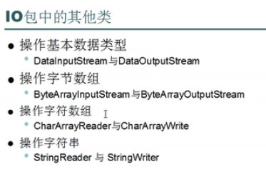
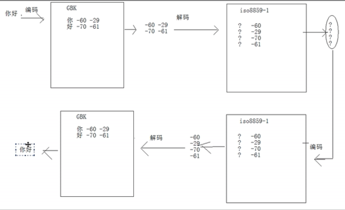
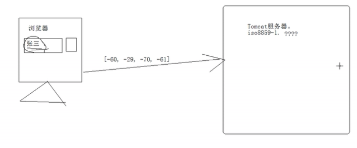

# File类

用来将文件或文件夹封装成对象，方便对文件或文件夹的属性信息进行操作。

```
1: File f1 = new File("e:\\demodir\\a.txt");  
2: File f2 = new File("e:\\demodir","b.txt");
3: File d = new File("e:\\demodir");
   File f3 = new File(d,"b.txt");
4：File f4 = new File("b.txt");
```

- 以上四个打印的都是路径，打印的路径和写的一样。
- seprator 跟系统相关的分割符

```
File d = new File("e" + File.separator + "demodir");
```

## 常见方法

### 1.创建

boolean createNewFile() ：在指定位置创建文件，若已存在返回false

```
File f4 = new File("b.txt");
f4.createNewFile();
```

boolean mkdir() : f.mkdir("aa\\\vv\\\ss") 会报错，现在只有aa这个目录，只能创建一级即vv

boolean mkdirs()：多级也可以

### 2.删除

boolean delete:  不存在返回false

void  deleteOnExit ：一个文件需要在操作完删除，如果操作中出现异常，就在finally删掉，但有时候一个文件正在使用，即使在finally中也删不掉。就用这个方法，使其一定能删掉。

在程序退出时删除指定文件

### 3.判断

boolean exists()：在判断文件对象是否是文件或目录时，必须先判断该文件是否存在。

isFile

isHidden

isAbsolute

### 4.获取信息

getPath：获取你创建file对象时写的文件名，你写了绝对就是绝对路径

getAbsolutePath

getParent：获取你创建file对象时写的文件名前面的所有父目录，如果只写了一个文件名，返回null

boolean reName：相当于剪切

String[]  list() ：返回当前目录下所有文件，文件夹的**名字**，包括隐藏文件。当f是文件的时候，返回null

File[] listFiles() : 返回文件对象数组

## 练习

### 1.文件过滤器

匿名内部类，list(FilenameFilter f)

```
String[] arr = dir.list(new FilenameFilter {
	public boolean accept(File dir, String name) {
		return name.endsWith(suffix);
	}
});
```

### 2.遍历指定目录下所有内容

```java
/*
 * 需求：对指定目录进行所有内容的列出（包含子目录中的内容）
 * 也可以理解为 深度遍历。
 */
public class FileTest {
    public static void main(String[] args) {
        File dir = new File("e:\\demodir");
        listAll(dir,0);
    }

    public static void listAll(File dir,int level) {
        System.out.println(getSpace(level)+dir.getName());
        //获取指定目录下当前的所有文件夹或者文件对象
        level++;
        File[] files = dir.listFiles();

        for(int x=0; x<files.length; x++){
            if(files[x].isDirectory()){
                listAll(files[x],level);
            }
            else        System.out.println(getSpace(level)+files[x].getName());
        }	
    }

    private static String getSpace(int level) {
        StringBuilder sb = new StringBuilder();
        sb.append("|--");
        for(int x=0; x<level; x++){
            sb.insert(0,"|  ");
        }
        return sb.toString();
    }
}
```

### 3. 删除一个带内容的目录。 

原理：必须从最里面往外删。 需要进行深度遍历。要避开隐藏文件

```java
public class RemoveDirTest {
    public static void main(String[] args) {
        File dir  = new File("e:\demodir");
        dir.delete();
        removeDir(dir);
    }

    public static void removeDir(File dir) {
        File[] files = dir.listFiles();
        for(File file : files){
            if(file.isDirectory()){
                removeDir(file);
            }else{
                System.out.println(file+":"+file.delete());
            }
        }
        System.out.println(dir+":"+dir.delete());
    }
}
```
### 4.获取指定目录下，指定扩展名的文件(包含子目录中的)这些文件的绝对路径写入到一个文本文件中。

思路：

1，必须进行深度遍历。

2，要在遍历的过程中进行过滤。将符合条件的内容都存储到容器中。

3，对容器中的内容进行遍历并将绝对路径写入到文件中。 

```java
public class Test {
	public static void main(String[] args) throws IOException {
		File dir = new File("e:\\java0331");
		FilenameFilter filter = new FilenameFilter(){
			@Override
			public boolean accept(File dir, String name) {
				return name.endsWith(".java");
			}			
		};

		List<File> list = new ArrayList<File>();
		getFiles(dir,filter,list);
		File destFile = new File(dir,"javalist.txt");
		write2File(list,destFile);
	}
    
	/**
	 * 对指定目录中的内容进行深度遍历，并按照指定过滤器，进行过滤，
	 * 将过滤后的内容存储到指定容器List中。
	 */
	public static void getFiles(File dir,FilenameFilter filter,List<File> list){
		File[] files = dir.listFiles();
		for(File file : files){
			if(file.isDirectory()){
				//递归啦！
				getFiles(file,filter,list);
			}else{
				//对遍历到的文件进行过滤器的过滤。将符合条件File对象，存储到List集合中。 
				if(filter.accept(dir, file.getName())){
					list.add(file);
				}
			}
		}
	}

	public static void write2File(List<File> list,File destFile)throws IOException{
		BufferedWriter bufw = null;
		try {
			bufw = new BufferedWriter(new FileWriter(destFile));
			for(File file : list){
				bufw.write(file.getAbsolutePath());
				bufw.newLine();
				bufw.flush();
			}
		} /*catch(IOException e){

		}*/finally{
			if(bufw!=null)
				try {
					bufw.close();
				} catch (IOException e) {
					throw new RuntimeException("关闭失败");
				}
		}
	}
}
```

## properties对象

- properties是hashtable的子类，具备map集合的特点，而且它里面存储的键值对都是字符串形式。
- properties是集合中和IO技术相结合的集合容器，该对象的特点：可以用于键值对形式的配置文件： key=value

## 练习

定义功能，获取一个应用程序运行的次数，如果超过5次，给出使用次数已到请注册的提示。并不要在运行程序。

### 思路：

1，应该有计数器。 

每次程序启动都需要计数一次,并且是在原有的次数上进行计数。

2，计数器就是一个变量。 程序启动时候进行计数，计数器必须存在于内存并进行运算。

可是程序一结束，计数器消失了。那么再次启动该程序，计数器又重新被初始化了。

而我们需要多次启动同一个应用程序，使用的是同一个计数器。 这就需要计数器的生命周期变长，从内存存储到硬盘文件中。

3,如何使用这个计数器呢？

首先，程序启动时，应该先读取这个用于记录计数器信息的配置文件。获取上一次计数器次数。 并进行试用次数的判断。

其次，对该次数进行自增，并自增后的次数重新存储到配置文件中。 

4，文件中的信息该如何进行存储并体现。

直接存储次数值可以，但是不明确该数据的含义。 所以起名字就变得很重要。
 这就有了名字和值的对应，所以可以使用键值对。
 可是映射关系map集合搞定，又需要读取硬盘上的数据，所以map+io = Properties.

	public class PropertiesTest {
	/**
	 * @param args
	 * @throws IOException 
	 * @throws Exception 
	 */
	public static void main(String[] args) throws IOException  {
		getAppCount();
	}
	
	public static void getAppCount() throws IOException{
		//将配置文件封装成File对象。
		File confile = new File("count.properties");
		if(!confile.exists()){
			confile.createNewFile();
		}
		
		FileInputStream fis = new FileInputStream(confile);
		Properties prop = new Properties();
		prop.load(fis);
		//从集合中通过键获取次数。		
		String value = prop.getProperty("time");
		//定义计数器。记录获取到的次数。
		int count =0;
		if(value!=null){
			count = Integer.parseInt(value);
			if(count>=5){
		System.out.println("使用次数已到，请注册，给钱！");
				return;
		throw new RuntimeException("使用次数已到，请注册，给钱！");
				}
		}
		
		count++;
	    //将改变后的次数重新存储到集合中。
		prop.setProperty("time", count+"");
		FileOutputStream fos = new FileOutputStream(confile);
		prop.store(fos, "");
		
		fos.close();
		fis.close();
		}
	}

# 打印流PrintStream，PrintWriter

### PrintStream

outputStream的子类，可以weite,print

```java
public static void main(String[] args) throws IOException {
		 /* PrintStream:
		 * 1,提供了打印方法可以对多种数据类型值进行打印。并保持数据的表示形式。 
		 * 2，它不抛IOException.
		 * 
		 * 构造函数，接收三种类型的值：
		 * 1，字符串路径。
		 * 2，File对象。
		 * 3，字节输出流。
		 */

    PrintStream out = new PrintStream("print.txt");
    //		int by = read();
    //		write(by);
    //		out.write(610);//只写最低8位，
    //		out.print(97);//将97先变成字符保持原样将数据打印到目的地。 
    out.close();
}
```

### PrintWriter

```java
public static void main(String[] args) throws IOException {
		 /* PrintWriter：字符打印流。
		 * 构造函数参数：
		 * 1，字符串路径。
		 * 2，File对象。
		 * 3，字节输出流。
		 * 4，字符输出流。
		 */
    BufferedReader bufr = new BufferedReader(new InputStreamReader(System.in));
    // 下面标记了true之后，有3个方法会自动刷新
     PrintWriter out = new PrintWriter(System.out,true);
    PrintWriter out = new PrintWriter(new FileWriter("out.txt"),true);

    String line =  null;
    while((line=bufr.readLine())!=null){
        if("over".equals(line))
            break;
        // 下面这句话自带换行
        out.println(line.toUpperCase());
        //			out.flush();
    }

    out.close();
    bufr.close();
}
```

# 序列流SequenceInputStream

将多个流转换成一个流，接收参数是Enumeration<>,这个迭代器只有vector有

## 三种方式获取Enumeration

### 1.自己实现enumeration接口

```java
final Iterator<FileInputStream> it = al.iterator();
Enumeration<FileInputStream> en = new Enumeration<FileInputStream>(){
    @Override
    public boolean hasMoreElements() {
        return it.hasNext();
    }

    @Override
    public FileInputStream nextElement() {
        return it.next();
    }
};
```

### 2.Vector

```
 //		Vector<FileInputStream> v = new Vector<FileInputStream>();		
    //		v.add(new FileInputStream("1.txt"));
    //		v.add(new FileInputStream("2.txt"));
    //		v.add(new FileInputStream("3.txt"));
    //		Enumeration<FileInputStream> en = v.elements();
    
```

### 3.用Collections操作ArrayList

```
ArrayList<FileInputStream> al = new ArrayList<FileInputStream>();
    for(int x=1; x<=3; x++){
        al.add(new FileInputStream(x+".txt"));
    }
    Enumeration<FileInputStream> en = Collections.enumeration(al);
```

```java
public static void main(String[] args) throws IOException {	
/*
* 需求：将1.txt 2.txt 3.txt文件中的数据合并到一个文件中。
*/
    ArrayList<FileInputStream> al = new ArrayList<FileInputStream>();
    for(int x=1; x<=3; x++){
        al.add(new FileInputStream(x+".txt"));
    }
    Enumeration<FileInputStream> en = Collections.enumeration(al);

    SequenceInputStream sis = new SequenceInputStream(en);
    FileOutputStream fos = new FileOutputStream("1234.txt");
    byte[] buf = new byte[1024];
    int len = 0;

    while((len=sis.read(buf))!=-1){
        fos.write(buf,0,len);
    }

    fos.close();
    sis.close();
}
}
```

# 切割文件

## 1. 初始版本

将一个文件切成3份。

```java
public static void splitFile(File file) throws IOException {
    // 用读取流关联源文件。
    FileInputStream fis = new FileInputStream(file);
    // 定义一个1M的缓冲区。
    byte[] buf = new byte[SIZE];
    // 创建目的。
    FileOutputStream fos = null;

    int len = 0;
    int count = 1;

    File dir = new File("c:\\partfiles");
    if (!dir.exists())
        dir.mkdirs();

    while ((len = fis.read(buf)) != -1) {
        fos = new FileOutputStream(new File(dir, (count++) + ".part"));
        fos.write(buf, 0, len);
    }

    fos.close();
    fis.close();

}
```

合并起来，用SequenceInputStream

```java
public static void mergeFile(File dir) throws IOException{
    ArrayList<FileInputStream> al = new ArrayList<FileInputStream>();
    for(int x=1; x<=3 ;x++){
        al.add(new FileInputStream(new File(dir,x+".part")));
    }
    Enumeration<FileInputStream> en = Collections.enumeration(al);
    
    SequenceInputStream sis = new SequenceInputStream(en);
    FileOutputStream fos = new FileOutputStream(new File(dir,"1.bmp"));
    byte[] buf = new byte[1024];
    int len = 0;
    
    while((len=sis.read(buf))!=-1){
        fos.write(buf,0,len);
    }
    fos.close();
    sis.close();
}
```

## 2.加上配置文件

分割：

```java
private static void splitFile_2(File file) throws IOException {
    // 用读取流关联源文件。
    FileInputStream fis = new FileInputStream(file);
    // 定义一个1M的缓冲区。
    byte[] buf = new byte[SIZE];
    // 创建目的。
    FileOutputStream fos = null;

    int len = 0;
    int count = 1;

    /*
	* 切割文件时，必须记录住被切割文件的名称，以及切割出来碎片文件的个数。 以方便于合并。
	* 这个信息为了进行描述，使用键值对的方式。用到了properties对象
	*/
    Properties prop  = new Properties();

    File dir = new File("c:\\partfiles");
    if (!dir.exists())
        dir.mkdirs();

    while ((len = fis.read(buf)) != -1) {
        fos = new FileOutputStream(new File(dir, (count++) + ".part"));
        fos.write(buf, 0, len);
        fos.close();
    }

    //将被切割文件的信息保存到prop集合中。
    prop.setProperty("partcount", count+"");
    prop.setProperty("filename", file.getName());

    fos = new FileOutputStream(new File(dir,count+".properties"));

    //将prop集合中的数据存储到文件中。 
    prop.store(fos, "save file info");

    fos.close();
    fis.close();
}
```

根据配置信息合并：

```java
public static void mergeFile_2(File dir) throws IOException {
/*
* 获取指定目录下的配置文件对象。
 */
    File[] files = dir.listFiles(new SuffixFilter(".properties"));

    if(files.length!=1)
        throw new RuntimeException(dir+",该目录下没有properties扩展名的文件或者不唯一");
    //记录配置文件对象。
    File confile = files[0];

    //获取该文件中的信息================================================。

    Properties prop = new Properties();
    FileInputStream fis = new FileInputStream(confile);

    prop.load(fis);

    String filename = prop.getProperty("filename");		
    int count = Integer.parseInt(prop.getProperty("partcount"));

    //获取该目录下的所有碎片文件。 ==============================================
    File[] partFiles = dir.listFiles(new SuffixFilter(".part"));

    if(partFiles.length!=(count-1)){
        throw new RuntimeException(" 碎片文件不符合要求，个数不对!应该"+count+"个");
    }
    //将碎片文件和流对象关联 并存储到集合中。 
    ArrayList<FileInputStream> al = new ArrayList<FileInputStream>();
    for(int x=0; x<partFiles.length; x++){

        al.add(new FileInputStream(partFiles[x]));
    }

    //将多个流合并成一个序列流。 
    Enumeration<FileInputStream> en = Collections.enumeration(al);
    SequenceInputStream sis = new SequenceInputStream(en);

    FileOutputStream fos = new FileOutputStream(new File(dir,filename));

    byte[] buf = new byte[1024];

    int len = 0;
    while((len=sis.read(buf))!=-1){
        fos.write(buf,0,len);
    }

    fos.close();
    sis.close();
}
```

# 操作对象objectInputStream

- 定义person类：本类要实现Serializable接口
- Serializable接口叫做标记接口：没有方法的接口
-  每一个可以被序列化的对象都要有一个标识，标识他是哪个类的
- 序列号是根据成员算出来的，只能序列化堆里面的成员

```
public class Person implements Serializable/*标记接口*/ {
    /**标记接口：没有方法的接口
	 * 每一个可以被序列化的对象都要有一个标识，标识他是哪个类的
	 * transient:非静态数据不想被序列化可以使用这个关键字修饰。 
	 */
    String name;
    int age;

    public Person(String name, int age) {
        super();
        this.name = name;
        this.age = age;
    }
}
```

- 有私有变量时：自己生成UID

```java
public class Person implements Serializable/*标记接口*/ {
    /**标记接口：没有方法的接口
	 * 每一个可以被序列化的对象都要有一个标识，标识他是哪个类的
	 * transient:非静态数据不想被序列化可以使用这个关键字修饰。 
	 */
    private static final long serialVersionUID = 9527l;
    private String name;
    private static int age;

    public Person(String name, int age) {
        super();
        this.name = name;
        this.age = age;
    }
}
```

- 静态成员是无法被序列化的，即读出对象文件的静态成员跟你写进去的不一样，是默认值

- transient:非静态数据不想被序列化可以使用这个关键字修饰。 保证其值在堆内存中存在，不在文本文件中，所以读取对象文件的时候就没有这个值

  ```java
  private static final long serialVersionUID = 9527l;
  private transient String name;
  private static int age;
  ```

读写对象：

```java
public static void readObj() throws IOException, ClassNotFoundException {
    ObjectInputStream ois = new ObjectInputStream(new FileInputStream("obj.object"));
    //对象的反序列化。 
    Person p = (Person)ois.readObject();
    System.out.println(p.getName()+":"+p.getAge());
    ois.close();
}

public static void writeObj() throws IOException, IOException {
    ObjectOutputStream oos = new ObjectOutputStream(new FileOutputStream("obj.object"));
    //对象序列化。  被序列化的对象必须实现Serializable接口。 
    oos.writeObject(new Person("小强",30));
    oos.close();
}
```

# 管道流PipedInputStream,PipedOutputStream

输入输出可以直接进行连接，通过结合线程使用。

```java
public static void main(String[] args) throws IOException {
        PipedInputStream input = new PipedInputStream();
        PipedOutputStream output = new PipedOutputStream();

        input.connect(output);

        new Thread(new Input(input)).start();
        new Thread(new Output(output)).start();
    }
}

class Input implements Runnable{
    private PipedInputStream in;
    Input(PipedInputStream in){
        this.in = in;
    }
    public void run(){
        try {
            byte[] buf = new byte[1024];
            // 阻塞方法read,没有数据就等
            int len = in.read(buf);

            String s = new String(buf,0,len);

            System.out.println("s="+s);
            in.close();
        } catch (Exception e) {
            // TODO: handle exception
        }
    }
}

class Output implements Runnable{
    private PipedOutputStream out;
    Output(PipedOutputStream out){
        this.out = out;
    }
    public void run(){
        try {
            Thread.sleep(5000);
            out.write("hi，管道来了！".getBytes());
        } catch (Exception e) {
            // TODO: handle exception
        }
    }
}
```

# RandomAccessFile

- 直接继承object。
- 是IO包中成员，具备读写功能
- 内部封装了一个数组，通过指针对数组的元素进行操作
- 可以通过getFilePointer获取指针位置, 同时可以通过seek改变指针的位置
- 其完成读写的原理是内部封装了字节输入，输出流
- 从构造函数看出，只能操作文件，要选定相应模式

## 1.自定义位置写seek

模式为rw：如果文件不存在，则创建，如果文件存在，不创建,直接修改，不会覆盖

```java
public static void randomWrite() throws IOException{
    // 如果文件不存在，则创建，如果文件存在，不创建,直接修改，不会覆盖
    RandomAccessFile raf = new RandomAccessFile("ranacc.txt", "rw");
    //往指定位置写入数据。
    raf.seek(3*8);
    // 只能往后调
    raf.skipBytes(8);
    //写入字节
    raf.write("哈哈".getBytes());
    //write函数会写一个字节，258超过范围，所被截断
    raf.write(258);
    raf.writeInt(108);

   raf.close();
}
```

## 2. 自定义位置读seek

模式为r：读取已有文件，不存在报异常。

```java
public static void readFile() throws IOException {
	RandomAccessFile raf = new RandomAccessFile("ranacc.txt", "r");
	//通过seek设置指针的位置。
    raf.seek(1*8);//随机的读取。只要指定指针的位置即可。 
	byte[] buf = new byte[4];
    raf.read(buf);
	String name = new String(buf);
	int age = raf.readInt();
    
	System.out.println("name="+name);
    System.out.println("age="+age);
	System.out.println("pos:"+raf.getFilePointer());
	raf.close();
}
```

## 3.可以实现数据的分段写入

- 数据分段后，一个线程负责一段。互相直接也不会冲突
- 多线程下载软件的原理

# 其他类



## DataInputStream

```java
public static void readData() throws IOException {
    DataInputStream dis = new DataInputStream(new FileInputStream("data.txt"));
    
    // 只能用这个方法读下面方法写的utf中文。要按顺序读取
    String str = dis.readUTF();
    int a = dis.readInt()；
    double b = dis.readDouble();
    Boolean s = dis.readBoolean();
    System.out.println(str);
}

public static void writeData() throws IOException {
    DataOutputStream dos = new DataOutputStream(new FileOutputStream("data.txt"));

    // 只能用上面方法读
    dos.writeUTF("你好");
    // 写在文件txt里面，打开的时候看到的是乱码。
    dos.writeInt(234);
    dos.writeDouble(234.55);
    dos.writeBoolean(true);
    dos.close();
}
```

## ByteArrayInputStream

ByteArrayInputStream：在构造的时候，需要接受数据源，而且数据源是一个字节数组

ByteArrayOutputStream：在构造的时候，不用定义数据目的，该对象内部封装了可变长度的字节数组，即数据目的地。

这两个流对象都操作数组，并没有使用系统资源，所以不用进行close关闭。

```java
public static void main(String[] args) {
    ByteArrayInputStream bis = new ByteArrayInputStream("abcedf".getBytes());
    ByteArrayOutputStream bos = new ByteArrayOutputStream();

    int ch = 0;
    while((ch=bis.read())!=-1){
        bos.write(ch);
    }
    System.out.println(bos.toString());
}
```

- 对数组元素操作：读、写。本类就是用流的读写操作数组。
- CharArrayReader, StringReader 同原理

# 字符编码

- 字符流的出现为了方便操作字符
- 更重要的是加入了编码转换
- 通过子类转换流来完成
  1. InputStreamReader
  2. OutputStreamReader
- 两个对象构造的时候可以加入编码表

## 现有码表

- ASCII：美国标准信息交换码。用一个字节的7位可以表示。
- ISO8859-1：拉丁码表。欧洲码表。用一个字节的8位表示。
- GB2312：中国的中文编码表。
- GBK：中国的中文编码表升级，融合了更多的中文文字符号。
- Unicode：国际标准码，融合了多种文字。所有文字都用两个字节来表示,Java语言使用的就是unicode
- UTF-8：unicode transform format  -  最小用8位，最多用三个字节来表示一个字符。

UTF-8不同，它定义了一种“区间规则”，这种规则可以和ASCII编码保持最大程度的兼容：

它将Unicode编码为00000000-0000007F的字符，用单个字节来表示
它将Unicode编码为00000080-000007FF的字符用两个字节表示 
它将Unicode编码为00000800-0000FFFF的字符用3字节表示 

## 编码，解码

编码：string - byte[] :  string.getbytes(charasetName)

解码：byte[] - string :  new String(byte[], charasetName)

加入编码表以后要抛异常

### 举例1：

编对，解对--用同一种方法编码，解码

```java
String str1 = "你好";
byte[] b1 = str1.getBytes();  //-60 -29 -70 -61
byte[] b1 = str1.getBytes("gbk");  // 要抛出异常，-60 -29 -70 -61
byte[] b1 = str1.getBytes("utf-8"); // -28 -67 -96 -27 -91 -67 

System.out.println(Arrays.toString(b1));
String s1 = new String(b1,"gbk");
String s1 = new String(b1,"utf-8");
System.out.println("s1="+s1);
```

### 举例2：

编错--编码用了错误的码表，不能识别字符，编码就错了

```java
String str1 = "你好";
byte[] b1 = str1.getBytes("ISO8859-1");  // 不识别中文，只是找了比较像的字符拿出来
System.out.println(Arrays.toString(b1));
String s1 = new String(buf1,"ISO8859-1");
System.out.println("s1="+s1);
```

### 举例3：

编对，解错--ISO8859不识别GBK,解码的时候，虽然得到的字符都是错误的。但字节码没变。重新获取字节码，进行解码即可

```java
public static void main(String[] args) throws IOException {
/*
* 字符串 --> 字节数组：编码。
* 字节数组 --> 字符串：解码。

* 你好：GBK:  -60 -29 -70 -61
* 你好: utf-8: -28 -67 -96 -27 -91 -67 
*  
* 如果你编错了，解不出来。
* 如果编对了，解错了，有可能有救。
*/
	String str1 = "你好";
     byte[] b1 = str1.getBytes("gbk");  
    System.out.println(Arrays.toString(b1));
    String s1 = new String(buf1,"ISO8859-1"); // -60 -29 -70 -61在拉丁文的码表中一个字节对应一个字符，没有找到对应的字符就用未知字符?表示
     System.out.println("s1="+s1);

	// 对S1进行iso8859-1编码
     byte[] b2 = s1.getBytes("ISO8859-1");//获取源字节.
     System.out.println(Arrays.toString(b2));
    //对b2解码
     String s2 = new String(buf2,"GBK");
     System.out.println("s2="+s2);
}
```



tomcat服务器用的是ISO8859-1(可以识别英文和拉丁文)，只能重新编码再解码。



### 举例4：

编对，解错--utf-8可识别GBK,解码错误后还能拿到源字节，重新解码即可

```java
String str1 = "你好";
byte[] b1 = str1.getBytes("gbk");  
System.out.println(Arrays.toString(b1));
String s1 = new String(buf1,"utf-8"); // ???
System.out.println("s1="+s1);

// 对S1进行iso8859-1编码
byte[] b2 = s1.getBytes("utf-8");//没拿到原字节，utf-8重新对???编码，找到了对应的字节是-17 -65 -67 -17 -65 -67 -17 -65 -67 
System.out.println(Arrays.toString(b2));
//对b2解码
String s2 = new String(buf2,"GBK"); //输出：锟斤拷
System.out.println("s2="+s2);
```

**因为utf-8和gbk都识别中文，所以出错**，utf-8拿2个字节的数去找，没找着，就去未知字符区域查，就拿到了错误的编码。

### 举例5：连通 问题

GBK：两个字节代表一个字符，

UTF-8：有可能两个，有可能三个对应一个字符。对字符加了标示头信息，这样utf-8自己就知道该读几个字节

fileReader：一次读两个字节去查表，返回中文。

- 记事本程序：他一看到联通的gbk编码形式跟utf-8（标示头为110-10 、110-10）的一样（很巧合的一样），他就默认按照utf-8的去读取
- 解决：因为“联通”两个字存在文件头，所以一读取就判断了编码。所以在文件最前面加一些别的字符（gbk编码跟utf-8格式不一样的），这样记事本就能识别出来是gbk了。

```java
public static void main(String[] args) throws IOException {
    String str = "联通";
    /*
		11000001
		10101010
		11001101
		10101000
		*/
    byte[] buf = str.getBytes("gbk");

    for(byte b :buf){
        System.out.println(Integer.toBinaryString(b&255));
    }
}
```

