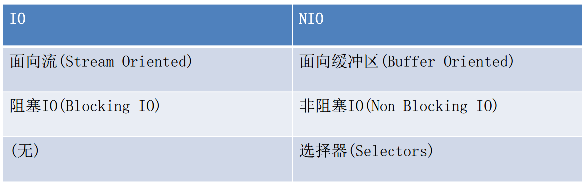
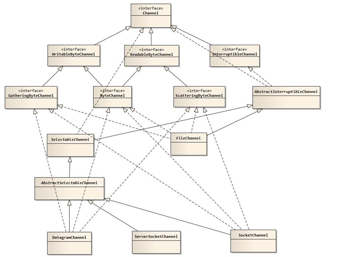
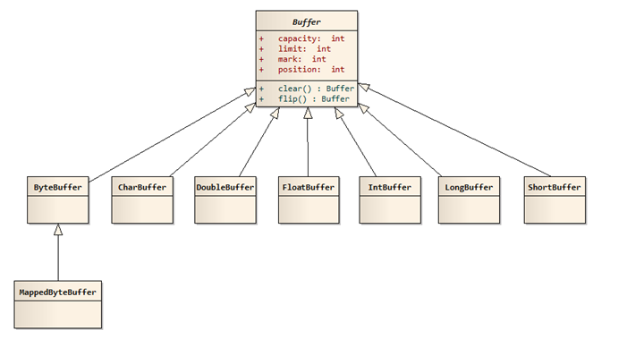

# IO概念

1. 本质：计算机和外设之间的数据流动过程。应用程序进程发起IO调用，操作系统执行IO操作。

2. 读过程：

   1. 进程向操作系统请求外部数据
   2. 操作系统将外部数据加载到内核缓冲区
   3. 操作系统将数据从内核缓冲区拷贝到进程缓冲区
   4. 进程读取数据继续后面的工作

3. 分类：

   1. 阻塞和非阻塞IO：进程对于操作系统IO是否处于就绪状态的处理方式

      阻塞：读或写操作全部完成后才返回，否则线程一直等待其完成

      非阻塞：不一直等待，去做其他事情，需要轮询就绪状态

   2. 异步和同步IO：针对当前执行线程、或进程而言，发起IO调用后，当前线程或进程是否挂起等待操作系统的IO执行完成。

      同步：程序发起调用后，当前线程或进程等待操作系统完成IO并告知进程完成后，线程或进程才继续执行

      异步：当前程序不等待操作系统IO完成，可以继续执行，操作系统完成IO后会通知当前程序。

## IO vs NIO：

1. IO面向流，NIO面向缓冲区

- IO：每次从流中读一个或多个字节，直至读取所有字节，它们没有被缓存在任何地方；
- NIO：能前后移动流中的数据，面向缓冲区

2. IO流是阻塞的，NIO流是不阻塞的

- Java IO的各种流是阻塞的。即：当一个线程调用read() 或 write()时，该线程被阻塞，直到有一些数据被读取，或数据完全写入。该线程在此期间不能再干任何事情
- Java NIO的非阻塞模式：一个线程从某通道发送请求读取数据，但是它仅能得到目前可用的数据，如果目前没有数据可用时，就什么都不会获取。 一个线程请求写入一些数据到某通道，但不需要等待它完全写入，这个线程同时可以去做别的事情。

3. 选择器

## NIO：

模型：channel + buffer

1. channel：双向通道，表示到实体如硬件设备、文件、网络套接字或可以执行一个或多个不同I/O操作的程序组件的开放的连接。可以通过它读写数据

2. buffer：缓冲区，一个连续内存块，数据只跟缓冲区进行直接读写操作

3. selector：检测多个注册的通道上是否有事件发生，如果有事件发生，便获取事件然后针对每个事件进行相应的响应处理。

   优点：

   1. 一个单线程可管理多个通道（连接）。只有在连接真正有读写事件发生时，才会调用函数来进行读写，大大地减少了系统开销
   2. 不必为每个连接都创建、维护一个线程，避免了多线程之间的上下文切换导致的开销。

特点：