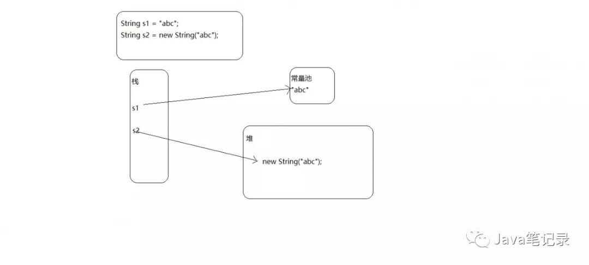
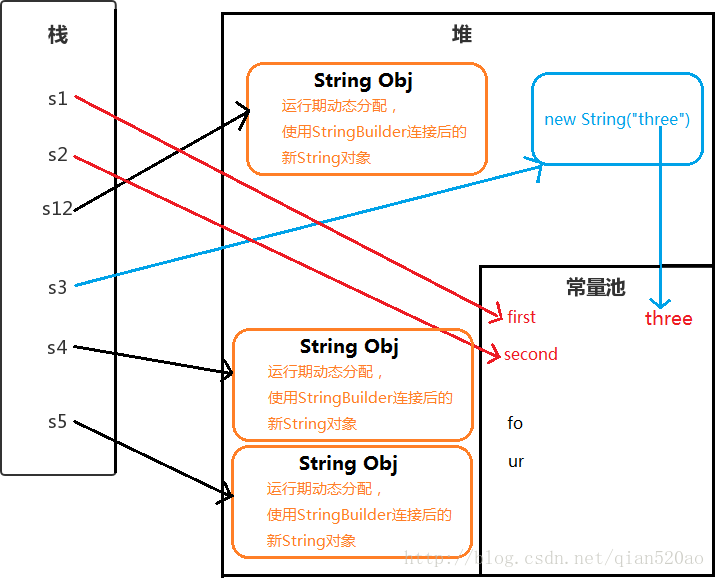

# 概括

1. String、StringBuilder、StringBuffer都是final类，不可被继承

2. **堆、栈、方法区**

   堆：java中所有用new创建的对象都在堆中，被所有线程所共享，由垃圾回收器进行回收。

   栈：栈中只保存基本数据类型和对象的引用，每个线程都有一个栈，每个栈中的数据都是私有的，当没有引用指向数据时，数据就会自动消失。

   方法区：包含的是程序中唯一的东西，如static等



​	举例：JDK1.7以上

​	1、String s1 = "abc";

（1）当常量池中不存在"abc"这个字符串的引用，在堆内存中new一个新的String对象，将这个对象的引用加入常量池。（跟1.6的区别是常量池不再存放对象，只存放引用。）

（2） 当常量池中存在"abc"这个字符串的引用，str指向这个引用；

​	2、String s2 = new String("abc");

​	在堆内存中new一个String对象，通过StringBuilder 跟StringBuffer 构建的对象也是一样。s1 == s2 返回false，因为比较的是地址值，且这是两个对象。

​	3、String s3 = new String("abc") + "abc";

​	在字符串常量池中创建常量，在堆中创建对象，之后再创建引用

3. 在编译期间就确定的变量是相等的，否则不等：输出false

```java
public class Main {
    public static void main(String[] args) {
        String a = "zsk2";
        final String b = getHello();
        String c = b + 2;
        System.out.println((a == c));
    }
     
    public static String getHello() {
        return "zsk";
    }
}
```

- intern()方法：（1.7版本，返回常量池中该字符串的引用）

  （1） **当常量池中不存在"abc"这个字符串的引用，将这个对象的引用加入常量池，返回这个对象的引用。**
  （2） **当常量池中存在"abc"这个字符串的引用，返回这个对象的引用；**

  举例：

  ```java
  String str1 = "计算机";
  String str2 = "计算机";
  System.out.println("str1==str2:" + (str1 == str2));
  
  String str3 = new String("计算机");
  System.out.println("str1==str3:" + (str1 == str3));
  System.out.println("str1==str3.intern():" + (str1 == str3.intern()));
  System.out.println("str2==str3.intern():" + (str2 == str3.intern()));
  
  String str4 = new String("计算机");
  System.out.println("str3==str4:" + (str3 == str4));
  System.out.println("str3.intern()==str4.intern():" + (str3.intern() == str4.intern()));
  
  String str5 = new StringBuilder("软件").append("工程").toString();
  System.out.println("str5.intern() == str5:" + (str5.intern() == str5));
  
  String str6 = new String(new StringBuilder("物联网").append("工程").toString());
  System.out.println("str6.intern() == str6:" + (str6.intern() == str6));
  
  String str7 = new String("物联网");
  System.out.println("str7.intern() == str7:" + (str7.intern() == str7));
  结果：
  str1==str2:true
  str1==str3:false
  str1==str3.intern():true
  str2==str3.intern():true
  str3==str4:false
  str3.intern()==str4.intern():true
  str5.intern() == str5:true
  str6.intern() == str6:true
  str7.intern() == str7:false
  ```

1. str7直接用new String（“物联网”），"物联网"这字符串在一出现就自动创建成对象存放到常量池中，所以常量池里面存放的是"物联网"字符串的引用，并不是str7创建的对象的引用。

2. str5是通过StringBuilder构建，在new StringBuilder(“软件”).append(“工程”).toString方法运行后,"软件工程"这个字符串对象才第一次出现。执行了intern方法后str5才被放到常量池中，此时str5跟str5.intern是同一个对象。

3. str6为对照组，为了确认StringBuilder在toString方法执行后会不会把最终字符串放进常量池。很显然并没有，所以str6的intern才会跟str6是同一个对象。同时证明str7的new String()方式在初始化的时候就会把"物联网"字符串放进常量池中，同理我们可以得出在str5构建的时候常量池里面加入了"软件","工程"这两个字符串

## 总结：

1.String对象可能会在堆内存中分配一块空间创建一个String对象，在常量池中创建该对象的复制jdk 1.6（或引用jdk 1.7及以上），也可能直接指向常量池（永久带）中的引用（例String str=“xxx”）。还有一种可能是直接在堆内存中分配一块空间创建一个String对象（例 String str=new String(xxx)）。

2.intern方法可以看成返回常量池中该字符串对象的引用。如果没有该字符串对象就把这个对象（或引用）加到常量池。

3.jdk1.6跟jdk1.7以上的区别是当常量池中不存在这个字符串，jdk1.6是直接复制对象到常量池，而jdk1.7以上是把对象的引用加入常量池。

4.类似于”abc”这样的字符串,在第一次被使用到(比如String a=”abc”或者String a=new String(“abc”)或者"abc".equals(xxx))后就会被加载到常量池中去。

5.面试问题：

（1）现在当有人问 String str = new String(“abc”);创建了几个对象，常量池有abc字段是1个，常量池没有"abc"字段则是2个。
（2）String str=“abc”;创建了几个对象（如果常量池里面已经有对象了就是0个。如果没有就是1个）;

（3）new String(“abc”).intern();创建了几个对象（如果常量池里面已经有该字符串对象了就是1个，如果没有就是两个）

# 一：String

- String 是一个被 final修饰的类（不可继承）
- 其本质是使用final字符数组来存储数据. final字段不可变。但只是该字段指向的数组地址不可变，可以改变数组的值

## 为什么用final

- 安全：作为形参不会被随意改变；作为map键值，有唯一性（ 因为字符串是不可变的，所以在它创建的时候**HashCode**就被缓存了，不需要重新计算。这就使得字符串很适合作为Map中的键，字符串的处理速度要快过其它的键对象。这就是HashMap中的键往往都使用字符串。）；不可变对象不能写，多线程环境下是安全的（同一个字符串实例可以被多个线程共享。这样便不用因为线程安全问题而使用同步）。否则比如数据库的用户名、密码、socket编程中的主机和端口都要由字符串的形式传入，此时黑客可以篡改字符串对象的值，造成问题。
- 效率高：jsk1.7之后，方法区的字符串常量池移到堆中，节省空间。只有当字符串不可变，字符串池才有可能实现。否则，intern方法不能实现，因为变量改变了它的值，其他指向这个值的变量的值也会一起改变。

## 使用方式

- 使用 ” ” 双引号创建 ： String s1 = “first”;
- 使用字符串连接符拼接 ： String s2=”se”+”cond”;
- 使用字符串加引用拼接 ： String s12=”first”+s2;
- 使用new String(“”)创建 ： String s3 = new String(“three”);
- 使用new String(“”)拼接 ： String s4 = new String(“fo”)+”ur”;
- 使用new String(“”)拼接 ： String s5 = new String(“fo”)+new String(“ur”);

 

**解析**
Java 会确保一个字符串常量只有一个拷贝。

- s1 ： ”first” 是字符串常量，在编译期就被确定了，先检查字符串常量池中是否含有”first”字符串,若没有则添加”first”到字符串常量池中，并且直接指向它。所以s1直接指向字符串常量池的”first”对象。
- s2 ： “se”和”cond”也都是字符串常量，当一个字符串由多个字符串常量连接而成时，它自己肯定也是字符串常量，所以s2也同样在编译期就被解析为一个字符串常量，并且s2是常量池中”second”的一个引用。
- s12 ： JVM对于字符串引用，由于在字符串的”+”连接中，有字符串引用存在，而引用的值在程序编译期是无法确定的，即("first"+s2)无法被编译器优化，只有在程序运行期来动态分配使用StringBuilder连接后的新String对象赋给s12。 

(编译器创建一个StringBuilder对象，并调用append()方法，最后调用toString()创建新String对象，以包含修改后的字符串内容)

- s3 ： 用new String() 创建的字符串不是常量，不能在编译期就确定，所以new String() 创建的字符串不放入常量池中，它们有自己的地址空间。 

  但是”three”字符串常量在编译期也会被加入到字符串常量池（如果不存在的话）。

  对于通过new产生一个字符串（假设为”china”）时，会先去常量池中查找是否已经有了”china”对象，如果没有则在常量池中创建一个此字符串对象，然后堆中再创建一个常量池中此”china”对象的拷贝对象。 

- s4 ： 同样不能在编译期确定，但是”fo”和”ur”这两个字符串常量也会添加到字符串常量池中，并且在堆中创建String对象。（字符串常量池并不会存放”four”这个字符串）

- s5 ： 原理同s4。

## 拼接

**1. 引用拼接**

```
public class StringConcat {
    String a = "hello";
    String b = "moto";
    String result = a + b + "2018";
}
```

当Java编译器遇到字符串拼接的时候，会创建一个StringBuilder对象，后面的拼接，实际上是调用StringBuilder对象的append()方法。 
（1）”hello” + “moto”： 首先创建新的StringBuilder对象，使用append()添加”hello”和”moto”; 
（2）append() 拼接”2018”; 
（3）引用result 指向最终生成的String。

因为有字符串引用存在，而引用的值在程序编译期是无法确定的。

“hello”、”moto”和”2018”都会添加到字符串常量池中（如果没有的话），因为它们都是编译期确定的字符串常量，但是最后的”hellomoto2018”并不会添加到字符串常量池。

有兴趣的可以尝试拼接null。即String a=null;

**2.字符串常量拼接**

但是如果是下面这种拼接情况 ：

```
public class StringConcat {
    String result = "hello" + "moto" + "2018";
}
```

“hello”、”moto”、”2018”都是字符串常量，当一个字符串由多个字符串常量连接而成时，它自己肯定也是字符串常量，所以result也同样在编译期就被解析为一个字符串常量。

**3.final引用拼接**

```
public class StringConcat {
    final String a = "hello";
    final String b = "moto";
    String result = a + b + "2018";
}
```

和引用拼接中唯一不同的是a和b这两个局部变量加了final修饰。 
对于final修饰的局部变量，它在编译时被解析为常量值的一个本地拷贝存储到自己的常量池中或嵌入到它的字节码流中。 

所以此时的(a + b + “2018”)和(“hello” + “moto” + “2018”)效果是一样的。

## 方法

**1.获取**

​	1.1 获取字符串中字符的个数(长度).
​	  	int length();
​	1.2 根据位置获取字符。
​	  	char charAt(int index);
​	1.3 根据字符获取在字符串中的第一次出现的位置.
​	  	int indexOf(int ch)
​	 	int indexOf(int ch,int fromIndex):从指定位置进行ch的查找第一次出现位置 
​		int indexOf(String str);
​		int indexOf(String str,int fromIndex);根据字符串获取在字符串中的第一次出现的位置.
​		int lastIndexOf(int ch)
​		int lastIndexOf(int ch,int fromIndex):从指定位置进行ch的查找第一次出现位置 
​	  	int lastIndexOf(String str);
​	  	int lastIndexOf(String str,int fromIndex);
​	1.4 获取字符串中一部分字符串。也叫子串.
​		String substring(int beginIndex, int endIndex)//包含begin 不包含end 。
​		String substring(int beginIndex);

**2.转换**

​	2.1 将字符串变成字符串数组(字符串的切割)
​		  String[]  split(String regex):涉及到正则表达式.
​	2.2 将字符串变成字符数组。
​		  char[] toCharArray();
​	2.3 将字符串变成字节数组。
​		  byte[] getBytes();
​	2.4 将字符串中的字母转成大小写。
​		  String toUpperCase():大写
​		  String toLowerCase():小写
​	2.5  将字符串中的内容进行替换
​		 String replace(char oldch,char newch);
​		 String replace(String s1,String s2);
​	2.6 将字符串两端的空格去除。
​		  String trim();
​	2.7 将字符串进行连接 。
​		 String concat(string);

------------------------------------------------------------------------------------------------

​	2.1 将字符数组转换成字符串

​	构造函数：String(char[])

​			   String(char[], offset, count)  字符数组一部分转换成字符串

​	静态方法：static String copyValueOf(char[])

​			    static String copyValueOf(char[],offset, count)

​			     static String valueOf(char[])

​	2.2 将字符串转换成字符数据

​		char[]  toCharArray()

​	2.3 将字节数组转换成字符串

​		String(byte[])

​     	        String(byte[], offset, count) 

​	2.4 将字符串转换成字节数组串	

​		byte[]  getBytes()

​	2.5 将基本数据类型转换成字符串

​		static String valueOf(int)

​		static  String valueOf(double)

​	字符串和字节数组的转换过程中，可以指定编码表

**3.判断**

​	3.0 字符串是否有内容

​		boolean isEmpty() .  就是判断length 是否为0

​	3.1 两个字符串内容是否相同
​		 boolean equals(Object obj);
​		 boolean equalsIgnoreCase(string str);忽略大写比较字符串内容。
​	3.2 字符串中是否包含指定字符串？

​		contains, indexof : 都可以判断字符串是否存在

​		  boolean contains(string str);    //stringbuffer也可以，定义的参数是实现charsequence的类

​		  indexof(str) //索引str第一次位置，-1表示不存在

​		只判断：contains

​		判断的同时取得位置：

```
int n = s.indexof(s1)
if(n == -1)
```

​	3.3 字符串是否以指定字符串开头。是否以指定字符串结尾。
​		  boolean startsWith(string);
​		  boolean endsWith(string);	

​	3.4 判断字符串内容是否相同，覆写了object类的equals

​		boolean equals(str);

​	3.4 判断字符串内容是否相同，忽略大小写

​		boolean  equalsIngoreCase();

**4.替换**

 String replace(oldchar, newchar)	

```
String s = "hello"
String s1 = s.repolace('l','a')
print(s)  //还是hello，因为字符串一旦声明不呢能改，s1是返回了一个新的字符串
print(s1) // heaao
```

## 练习

### 1，模拟一个trim功能一致的方法。去除字符串两端的空白 

思路：

1，定义两个变量。

 * 一个变量作为从头开始判断字符串空格的角标。不断++。
 * 一个变量作为从尾开始判断字符串空格的角标。不断--。

2,判断到不是空格为止，取头尾之间的字符串即可。

```
public class StringTest_4 {
  public static void main(String[] args) {
  	String s = "    ab   c     ";
  	s = myTrim(s);
  	System.out.println("-" + s + "-");
  }

public static String myTrim(String s) {
	int start = 0, end = s.length() - 1;
	while (start <= end && s.charAt(start) == ' ') {
		start++;
	}
	while (start <= end && s.charAt(end) == ' ') {
		end--;
	}
	return s.substring(start, end + 1);
}
```
### 2，将字符串反转

思路：

1，将字符串变成数组

2，对数组翻转

4：将数组变成字符串

```
char[] cha = a.toCharrArray()
reverse(cha)
return new Sting(cha);

public static void reverse(char[] arr)
{
	for(int start=0,end = arr.length-1; start<end;start++,end--)
    {
    	swap(arr, start, end);
	}
}
public static void swap(cha[] arr,int x,int y)
{
	char temp = arr[x];
    arr[x] = arr[y];
    arr[y] = temp;
}
```

指定位置反转，思路一样，还是三步走(包含头，尾)

```
public static void reverse(char[] arr，int x, int y)
{
	for(int start=x, end=y; start<end;start++,end--)
    {
    	swap(arr, start, end);
	}
}
public static void swap(cha[] arr,int x,int y)
{
	char temp = arr[x];
    arr[x] = arr[y];
    arr[y] = temp;
}
```

指定位置反转，思路一样，还是三步走(包含头，不包含尾)

`	for(int start=x, end=y-1; start<end;start++,end--)`

### 3，一个子串在整串中出现的次数。

思路：

1，要找的子串是否存在，如果存在获取其出现的位置。这个可以使用indexOf完成。

2，如果找到了，那么就记录出现的位置并在剩余的字符串中继续查找该子串，

​	而剩余字符串的起始位是出现位置+子串的长度.

3,以此类推，通过循环完成查找，如果找不到就是-1，并对 每次找到用计数器记录。 

	// 获取子串在整串中出现的次数。
	public static int getKeyStringCount(String str, String key) {
		//1,定义计数器。 
		int count = 0;
		//2，定义变量记录key出现的位置。
		int index = 0;
		
		while((index = str.indexOf(key))!=-1){
			str = str.substring(index+key.length());
			count++;
		}
		return count;
	}
	
	// 第二种方式，避免产生太多字符串
	public static int getKeyStringCount_2(String str, String key) {
		int count = 0;
		int index = 0;
		
		while((index = str.indexOf(key,index))!=-1){
			index = index + key.length();
			count++;
		}
		return count;
	}
	
	// 如果string = "kkaakkakk", key = “kk”， 返回结果会是4，因为第一个kk切割完最前面是个空串，所以数组长度是4
	// count = string.split(key)

### 4，两个字符串中最大相同的子串

1，既然取得是最大子串，先看短的那个字符串是否在长的那个字符串中。

如果存在，短的那个字符串就是最大子串。

2，如果不是呢，那么就将短的那个子串进行长度递减的方式取子串，去长串中判断是否存在。（长度递减的方式：取子串为:头--(尾-1)，然后头,尾指针都后移直到尾到末尾）

如果存在就已找到，就不用在找了。

```
public static String getMaxSubstring(String s1, String s2) {
		String max = null,min = null;
		max = (s1.length()>s2.length())?s1:s2;		
		min = max.equals(s1)?s2:s1;
		
		for (int i = 0; i < min.length(); i++) {			
			for(int a = 0,b = min.length()-i; b != min.length()+1; a++,b++){
				String sub = min.substring(a, b);
				if(max.contains(sub))
					return sub;
			}
		}
		return null;
}
```

# 二：StringBuffer

StringBuffer:  就是**字符串缓冲区**，是一个容器，用于存储数据的容器。缓冲区可以不断修改

### 与数组区别：

1，长度是可变的。数组不可变
2，可以存储不同类型数据。（byte,short没有）     数组只能有一种类型
3，最终要转成字符串进行使用。
4，可以对字符串进行修改。		  

### 既然是一个容器对象。应该具备的功能--CURD增删改查

1，添加：
		  StringBuffer append(data);     // 末尾添加
		  StringBuffer insert(index,data);  //在当前字符串的Index位置添加data
2，删除：
		  StringBuffer delete(start,end):包含头，不包含尾。
		  StringBuffer deleteCharAt(int index):删除指定位置的元素 
3，查找：
		 char charAt(index);
  		  int indexOf(string);
		  int lastIndexOf(string);

​		  String   substring(int start,int end)

 4，修改：
		  StringBuffer replace(start,end,string);
		  void setCharAt(index,char);		  

5，反转：

​		  StringBuffer reverse()

6，将缓冲区中指定数据存到指定字符数组中

getChars(int srcBegin, int srcEnd, char[] dst, int dstBegin) : 取原来字符串的srcB-srcE(含头不含尾)，存到dst中，从dstB开始存

**增删改查  C(create)U(update)R(read)D(delete)**

# 三：StringBuilder

jdk1.5以后出现了功能和StringBuffer**一模一样（方法都一样）**的对象。就是StringBuilder

## 不同：

StringBuffer是线程同步的（相当于有锁）。通常用于多线程。
StringBuilder是线程不同步的。**通常用于单线程。** 它的出现提高效率。 

### jdk升级目的：

1，简化书写。
2，提高效率。
3，增加安全性。

# 基本数据类型对象包装类

基本数据类型对象包装类的最常见作用：基本数据类型和字符串类型之间做转换

### 基本数据类型转成字符串

基本数据类型 + “”

基本数据类型包装类.toString(基本数据类型值)

e.g. Integer.toString(34)   //将整数34变成“34”

### 字符串转成基本数据类型

// 静态调用方法

xxx    a =   Xxx.parseXxx(String)

int a = Integer.parseInt("123")

double b = Double.parseDouble("12.2")

boolean b = Boolean.parseBoolean("true")

// 非静态调用

int num = a.intValue();

### 十进制转成其他进制的字符串

toBinaryString()

toHexString()

toOctalString()

### 其他进制转成十进制

Integer.parseInt(string, radix)  //将string的数字按照radix进制转换成十进制数

### 自动装箱，拆箱

```
Integer x = new Integer(4);

Integer x = 4;  //对4自动装箱，相当于new Integer(4)
x = x +2 //对x自动拆箱，相当于 x.intValue() + 2. 
Integer x =null;
x = x +2 //此时会报错，因为x是空指针，没有intValue方法
```

### Integer的范围

```
Integer a = new Integer(128);
Integer b = new Integer(128);
		
System.out.println(a==b);//false
System.out.println(a.equals(b));//true,比较的是值
		
Integer x = 127;//jdk1.5以后，自动装箱，如果装箱的是一个字节以内的数，那么该数据会被共享不会重新开辟空间。
Integer y = 127;
System.out.println(x==y);  //true
System.out.println(x.equals(y));//true
```

