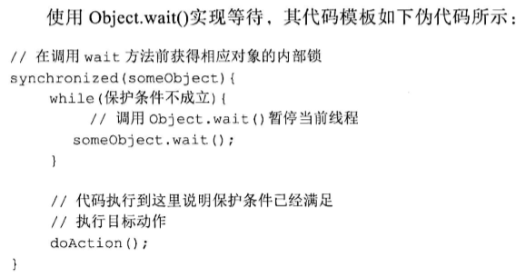

# 多线程实战指南

# 一：多线程编程的目标与挑战

并行：可一人交替做多个事情

并发：多人同时开始做各自的事

竟态：计算结果的正确性依赖于相对顺序

原因：多个线程在没有采取控制的情况下并发地更新、读取一个共享变量

## 竟态模式：

1. read-modify-write：

   e.g.   id++ .该代码是三个指令的组合：先读到寄存器①、寄存器加一②、写回内存③

   e.g. help = new Helper(data);

   分为3个子操作：

   ① obj = allocate(Helper.class) 分配Helper实例所需的内存空间，并获得一个指向该空间的引用

   ② invokeConstructor(obj)：调用Helper类的构造器初始化obj引用指向的Helper实例

   ③ helper = obj; 将Helper实例引用obj赋值给实例变量helper

2. check-then-act（读取某个共享变量值，根据值决定下一步做什么）

   e.g.   if ( a = 1)①check {②操作} else {}

   这个操作有2个子操作：在结束①到开始②之间，a可能被更新导致if不成立。

竟态产生条件：

设O1,O2是并发访问共享变量V的两个非都是读的操作，若一个线程在执行O1期间，另一个线程在执行O2，就会导致竟态。

## 线程安全问题：原子性、可见性、有序性

### 1.**原子性：**

操作不可分割。使一个操作具备原子性也就消除了该操作导致竟态的可能性。

Java中有两种方式来实现原子性：

1. lock锁，有排他性，软件层面
2. cas指令，硬件层面

java中，除long/double外，其他基础类型or引用类型变量的**写操作**都是原子的。此时可用volatile关键字修饰。对于任何变量的读操作都是原子的。

### 2.**可见性：** 

一个线程对共享变量的更新的结果，对于读取变量的线程而言是否可见。

**可见性问题原因：**

处理器通过：寄存器、高速缓存cache、写缓冲器、无效化队列等（统称为处理器缓存）执行内存的读写操作。处理器只能读到内存的数据，当处理器上运行的线程将共享变量更新到处理器缓存时，另一个线程的处理器不一定能读到，即内存可见性问题。

e.g. 

1. 每个处理器都有其寄存器，一个处理器无法读取另一个处理器中寄存器的内容。所以如果两个线程分别运行在不同的处理器上，且共享变量被分到寄存器存储，就会有可见性问题。
2. 单处理器上：一个线程对寄存器变量的修改被当做线程上下文保存起来，其他线程看不到修改，也是可见性问题。

**可见性解决方案：**

缓存同步：处理器可以通过缓存一致性协议来读取其他处理器的高速缓存中的数据，并将读到的数据更新到该处理器的高速缓存中。

冲刷处理器缓存：使一个处理器对共享变量所做的更新最终被写入该处理器的高速缓存or主内存中。而不是停留在其写缓冲器中。

刷新处理器缓存：一个处理器在读取共享变量时，若其他处理器在此之前已经更新了改变量，该处理器必须从其他处理器的高速缓存或主内存中对相应的变量进行缓存同步。

可见性的保障：更新共享变量的处理器执行冲刷，读取共享变量的处理器执行刷新操作。

**Java实现可见性：使用volatile**

1. 防止jit编译器优化
2. 使得读写的处理器进行处理器缓存的冲刷or刷新。

约定：

对于共享变量而言，

相对新值：一个线程更新了改变量的值之后，其他线程能读到的这个值

最新值：读取这个变量的线程在读取并使用改变量的时候，其他线程无法更新改变量的值，该线程读到的相对新值就是最新值。

可见性只能保障线程读到相对新值，不能保障最新值。

### 3.有序性：

多核处理器环境下的重排序：

1. 编译器可能改变操作的先后顺序
2. 处理器不按照代码顺序执行
3. 一个处理器上执行的操作，从其他处理器的角度来看顺序与代码不一致。

重排序：对内存访问有关操作的优化


**编译器重排序：**

Java平台包含两种编译器：静态编译器（ javac ）和动态编译器（JIT编译器）。前者的作用是将Java 源代码（ .java文本文件）编译为字节码（ .class 二进制文件），它是在代码编译阶段介入的。后者的作用是将字节码动态编译为Java虚拟机宿主机的本地代码（机器码），它是在Java程序运行过程中介入的。

javac不会进行指令重排，jit会。

**处理器重排序：**

也叫作乱序执行：指令按程序顺序被处理器读取，然后哪条指令就绪就先执行哪条，然后进入重排序缓冲器（ROB），而不是直接写入寄存器或主内存。ROB会将结果按照读取顺序写入寄存器或主内存。

乱序执行还采用了猜测执行技术：先执行再判断，多线程时导致错误结果。

## 线程的活性故障

线程活性故障：由于一些问题导致线程一直处于非runnable状态，或处于runnable状态但其要执行的任务却一直无法进展的状态（活锁）。

比如：死锁，锁死，活锁，饥饿

## 本章总结


# 二：线程同步机制

注意是：协调线程间共享数据访问的相关关键字和API

# 2.1锁

## 锁的概念

排它锁、读写锁

**按java虚拟机对锁的实现方式划分：**java平台中的锁包括：内部锁（intrinsic lock）、显式锁。

内部锁：synchronized关键字

显式锁：lock接口的实现类：ReentrantLock

**锁的作用：**保障原子性、可见性、有序性

通过互斥保障原子性、

锁的获取与释放保障了刷新处理器缓存与冲刷处理器缓存保障可见性

**锁的使用条件：**

1. 线程在访问同一组共享数据的时候必须使用同一个锁
2. 线程中的任一线程，即使只是读取这组数据而不更新也要在读取时获得锁

**与锁相关的概念：**

1.可重入性

2.锁的调度：公平or非公平

内部锁是非公平锁，显示锁两个都支持

3.锁的粒度

4.锁的开销

5.锁的不正确使用导致的活性故障

### 适用场景

1. check-then-act：读取共享数据，并在此基础上决定下一步做什么
2. read-modify-write：读取并操作
3. 多个线程对多个共享数据操作，数据间有关联关系

## 内部锁synchronized

1. 任何一个对象都有一个与之关联的锁，称为监视器或内部锁。常用private final修饰的变量来当锁句柄(对象的引用，也称锁句柄为锁，锁句柄对于的监视器对同步块的引导锁，称同步块为锁引导的同步块)。
2. 没有得到锁资源的线程进入BLOCKED状态，在争夺到锁资源后回复RUNNABLE状态，这个过程涉及操作系统用户模式和内核模式的转换，代价高。

3. 使用：用来修饰方法or代码块

```
public class multiThread {
    private short seq = -1;
    public synchronized short nextSeq(){
        if (seq >= 99) {
            seq = 0;
        } else {
            seq++;
        }
        return seq
    }
}
```

4. 异常：内部锁不会导致锁泄漏，javac在将同步块代码编译为字节码时，对临界区中可能抛出的而代码未捕获的异常进行了特殊处理，所以临界区代码抛出异常也不会影响内部锁的释放。

5. 调度：

- 只有一个申请成功，其他失败申请不会抛异常，会被暂停BLOCKED，存入entry set

- 锁有一个entry set（入口集），未申请成功的线程在集合中排队等待唤醒。
- 仅支持非公平调度

- java1.7对其进行优化，比如：偏向锁

### JDK对内部锁的优化

- **偏向锁**

意义：在没有别的线程竞争的时候，一直偏向我，可以让我一直执行下去。

account对象的“对象头”中有个叫做Mark Word的数据结构，包含一些标识位，还有其他数据。


操作：使用CAS操作把javaThread对象的指针地址记录到了这个Mark Word当中，修改了标识位，即拥有这把锁了，可以去执行代码，不用跟os交互

- **轻量级锁**

**意义：**轻度的竞争，轻量级锁仅仅使用CAS操作和Lock record就避免了重量级互斥锁的开销。两个线程交替着进入临界区。即使出现了竞争，想获得锁的线程只要自旋几次，等待一会儿，锁就可能释放了。

**操作：**

1. 把锁对象account恢复成无锁状态

2. 在两个竞争线程的栈帧中各自分配了一个空间，叫做Lock Record， 把锁对象account的Mark Word各自复制了一份，叫做Displaced Mark Word

3. 将线程a的Lock Record的**地址**使用CAS放到了Mark Word当中，并且把锁标志位改为00，意味着a已经获得了这个轻量级的锁了，可以继续进入临界区执行。B自旋等待

   

4. 线程a退出，释放锁，需要把Displaced markd word 使用CAS复制回去。接下来b就可以加锁了。

- **重量级锁**

轻量级锁时，一个线程自旋太多，浪费cpu，转为重量级锁，需要Os的mutex lock。创建monitor对象，把该对象地址更新到了Mark word当中。

- **自旋锁**

竞争锁失败的线程，JVM会让线程做几个空循环(基于预测在不久的将来就能获得)，在经过若干次循环后，如果可以获得锁，就进入临界区，如果还不能获得锁，才会真实的将线程在操作系统层面进行挂起。 

优点：减少线程的阻塞

适用场景：锁竞争不激烈，且占用锁时间非常短的代码块来说。如果锁的竞争激烈，造成cpu的浪费。 

## 显示锁lock

1. 使用：juc包中Lock接口的具体实现类，在finally执行，避免死锁

```
private final Lock lock=new ReentrantLock();
myLock.lock();  // 申请锁
try{
    临界区
} finally {
    myLock.unlock(); //为避免锁泄漏
}
```

2. 调度

   - 支持公平、非公平锁，通过ReentrantLock(boolean fair)构造

     公平锁：上下文切换代价大。适合锁被持有的时间相对长或线程申请锁的平均时间相对长

3. 公平锁和非公平锁

   公平锁：公平和非公平锁的队列都基于锁内部维护的一个双向链表，表结点Node的值就是每一个请求当前锁的线程。公平锁则在于每次都是依次从队首取值

   非公平锁：在等待锁的过程中， 如果有任意新的线程妄图获取锁，都是有很大的几率直接获取到锁的

### 二者比较

1. 内部锁基于代码块不灵活，只能在一个方法内。显示锁基于对象，可以跨方法。
2. lock有更多方法可以对锁进行监控，比如：isLocked()监测相应锁是否被某个线程持有
3. 通过lock的lockInterruptibly方法申请到的显示锁可以响应中断，可处理死锁；内部锁不能，只能通过
4. tryLock（）方法可以限定时间，线程等待期被中断会抛出异常，打破死锁。lock方法不能被中断，如果一个线程在等待锁时被中断处于阻塞，若死锁则lock无法终止。

## 读写锁

之前的锁无法使多个线程对共享变量进行读操作，读写锁是一种改进型的排它锁。

多个线程同时读，一次只能一个线程更新；

任何线程读，其他线程都不能写；

一个线程写，其他线程都不能读。

juc中的ReadWriteLock接口是对读写锁的抽象，其实现类是：juc的ReentrantReadWriteLock.

使用场景：

1.只读操作比写操作频繁得多

2.读线程持有锁的时间较长

## 线程同步机制的底层：内存屏障

刷新与冲刷处理器缓存是借助java虚拟机底层的内存屏障实现的。

内存屏障：插入到两个指令之间，禁止编译器、处理器重排，仅针对内存读、写操作指令的跨处理器架构的底层抽象。

load：将主内存中数据（通过cache）读到寄存器

store：将数据写入共享内存

**按可见性保障划分：**

加载屏障（load）：刷新cache读到最新值，在MonitorEnter对应的机器码指令之后，临界区开始之前加，保障读线程读到最新数据，LoadLoad

存储屏障（store）：冲刷cache将值写入cache，在MonitorExit之后添加，保障写线程对临界区的更新同步. StoreLoad

可见性的保障是通过写线程和读线程成对地使用存储、加载屏障实现

**按有序性保障划分：**

以下的读写操作都是指：将主内存读到寄存器操作。

获取屏障（acquire）：读操作（read-modify-write以及普通的读操作）后加，禁止该读操作与之后的读写操作重排。相当于LoadLoad+LoadStore

释放屏障（release）：写操作前加，禁止该写操作与前面的读写操作重排.相当于LoadStore+StoreStore

在monitorEnter之后的临界区开始之前插入获取屏障，临界区结束之后monitorExit对应机器码之前插入释放屏障。

## 锁与重排序

jit编译器、处理器必须遵守一些重排序规则。

当多个临界区时：

1. 锁申请与释放操作不能被重排序

2. 两个锁申请不能重排序
3. 两个锁释放不能重排序

# 2.2：轻量级同步机制:volatile关键字

表示易改变不稳定，用于修饰共享可变变量，没用final的。对这种变量的读写都要从cache或主内存中读取最新值，该变量不会被分到寄存器进行存储。

仅能保障变量读操作、写操作的原子性，没有锁的排他性。

## 作用

保障可见性、有序性、long/double变量读写原子性。但不一定保障其对volatile的赋值操作有原子性，比如：v1 = v2 + 1; v2若是共享变量就没有原子。

**有序性保证：**

volatile变量的**写操作**，jvm在其前面放释放屏障，后面存储屏障。

1. 禁止了volatile写操作与该操作之前的重排序，保证其他线程看到写线程对volatile进行更新时，写线程在更新volatile变量之前的操作对读线程是可见的。即与代码顺序一致，保证有序性。
2. 存储屏障可以冲刷处理器缓存，所以volatile变量写操作插入存储屏障使得该存储屏障前所有操作的结果对其他处理器而言是同步的。

volatile变量的**读操作**，jvm在其前面放加载屏障，后面获取屏障。

1. 加载屏障冲刷处理器缓存，使读线程同步其他线程对共享变量的更新到cache中
2. 获取屏障禁止volatile读操作与之后的读写操作重排序，保障了volatile读之后的操作在开始之前，写线程对相关共享变量的更新对当前线程可见。

## 开销

1. 无上下文切换，开销比锁小
2. 因为需要从cache或内存读取，比普通变量大

## 适用场景

1. 作为状态标志
2. 多个线程共享一个可变状态变量，其他线程不加锁也能看到其更新
3. 多个线程共享一组可变状态变量时，可以把变量封装成一个对象，通过Volatile变量引用该对象

# 2.3：CAS与原子变量

CAS是一个原子的if-then-act操作，背后假设是：当一个客户（线程）执行CAS操作的时候，如果变量V的当前值和客户请求（即调用）CAS时所提供的变量值A（即变量的旧值）是相等的，那么就说明其他线程并没有修改过变量V的值'。执行CAS时如果没有其他线程修改过变量V的值，那么下手最快的客户（当前线程）就会抢先将变量V的值更新为B （新值），而其他客户（线程）的更新请求则会失败。这些失败的客户（线程）通常可以选择再次尝试，直到成功。

CAS是一种对处理器指令的称呼。将read-modify-write和check-and-act转换为原子操作。保证了共享变量更新这个操作的**原子性，不保证可见性**。

用锁开销大，volatile不能保障a++操作原子性，所以用CAS。

```
    public void increment() {
        long oldValue;
        long newValue;
        do {
            oldValue = count;// 读取共享变量当前值
            newValue = oldValue + 1;// 计算共享变量的新值
        } while (/* 调用CAS来更新共享变量的值 */!compareAndSwap(oldValue, newValue));
    }

    /*
     * 该方法是个实例方法，且共享变量count是当前类的实例变量，因此这里我们没有必要在方法参数中声明一个表示共享变量的参数
     */
    private boolean compareAndSwap(long oldValue, long newValue) {
        boolean isOK = fieldUpdater.compareAndSet(this, oldValue, newValue);
        return isOK;
    }
```

## 原子变量类(Atomics)

他是基于CAS实现的能够保障对共享变量进行read-modify-write更新操作（a++）的原子性和可见性的一组工具类。其内部实现是借助一个volatile变量，并保证对该变量的read-modify-write操作的原子性。


AtomicReference类的主要功能是：更新引用变量时确保该变量的确是我们要修改的那个，没有被其他线程修改过。

CAS实现原子操作的背后假设：共享变量的当前值和当前线程提供的旧值一样，我们就认为这个变量没有被其他线程修改过。

该假设成立是有条件的。例如，对于共享变量V，当前线程看
到它的值为A的那一刻，其他线程已经将其更新为B.在当前线程执行CAS的时候该变量的值又被其他线程更新为A，这种结果是否可以接受呢？

这就是ABA问题，即共享变量的值经历了A→B-->A的更新。某些情
形下我们无法容忍ABA问题。那就是为共享变量的更新引人一个修订号（ 也称时间戳）。每次更新共享变量时相应的修订号的值就会被增加1。 也就是说，我们将共享变量V的值“扩展”成一个由变量实际值和相应的修订号所组成的元组.此时就能够准确判断变量的值是否被其他线程修改过。AtomicStampedReference类就是基于这种思想而产
生的。

## 对象的发布与逸出

对象发布：对象能够被作用域之外的线程访问。比如私有变量被多个线程访问。

**发布形式：**


**static关键字在多线程环境下的涵义：**

由于java类的延迟加载，它能够保证一个线程即使在未使用其他同步机制的情况下也总是可以读取到一个类的静态变量的初始值（而不是默认值）。但是，这种可见性保障仅限于线程初次读取该变量。

**final关键字在多线程环境的作用：**

​     由于重排序的作用，一个线程读取到一个对象引用时，该对象可能未初始化完毕，即这些线程可能读取到该对象字段的默认值而不是初始值（通过构造器或者初始化语句指定的值）。
​     当一个对象被发布到其他线程的时候，该对象的所有final 字段（实例变量）都是初始化完毕的，即其他线程读取这些字段的时候所读取到的值都是相应字段的初始值（而不是默认值）。

**对象逸出：** 一个对象的发布出现我们不期望的结果

一个对象在其初始化过程中没有出现this逸出，我们就称该对象为正确创建的对象（ Properly Constructed Object）。要安全发布一个正确创建的对象，我们可以根据情况从以下几种方式中选择。

- 使用static关键字修饰引用该对象的变量。
- 使用final关键字修饰引用该对象的变量。
- 使用volatile关键字修饰引用该对象的变量。
- 使用AtomicReference 来引用该对象。
- 对访问该对象的代码进行加锁。

# 本章总结


# 三：线程间协作

# 3.1等待与通知

## wait/notify原理与使用

jvm为每个对象维护一个：

入口集（entry set)：存储申请该对象内部锁的线程

等待集（wait set)：存储该对象上的等待线程

Object.wait：将当前线程暂停，释放相应内部锁，将当前线程（的引用）存入该方法所属对象的等待集中。

notify方法：使该对象等待集中的一个任意线程被唤醒。被唤醒的线程仍然会停留在相应对象的等待集之中，直到该线程再次持有相应内部锁的时候（此时Object.wait（）调用尚未返回） ，Object.wait（）会使当前线程从其所在的等待集移除，接着Object.wait（）调用就返回了. Object.wait（）/notify（）实现的等待/通知中的几个关键动作，包括将当前线程加入等待集、
暂停当前线程、释放锁以及将唤醒后的等待线程从等待集中移除等，都是在Object.wait（）中实现的。Object.wait（）的部分内部实现相当于如下伪代码：


**使用：**




## wait/notify的开销与问题

1. 过早唤醒（wakeup too soon) ：过早执行notifyAll，唤醒所有等待线程，但很多的线程还不满足条件需要继续等。用juc的Condition接口解决
2. 信号丢失（missed signal)，欺骗性唤醒
3. 上下文切换

建议：

1. 保证正确的前提下，用notify，而不是Notifyall
2. 通知线程在执行完notify后尽快是否相应的内部锁

## notify,notifyall的选用

Notify只有在下列条件全满足时才能替代notifyall：

1. 一次通知仅需要唤醒至多一个线程。
2. 相应对象的等待集中仅包含同质等待线程。所谓同质等待线程指这些线程使用同一个保护条件，并且这些线程在Object. wait（）调用返回之后的处理逻辑一致。 最为典型的同质线程是使用同一个Runnable接口实例创建的不同线程（实例）或者从同一个
   Thread子类的new出来的多个实例。

# 3.2 JAVA条件变量

之前问题：object.wait/notify过于底层、过早唤醒、object无法区分其返回是等待超时还是被线程唤醒

解决：juc.locks的Condition接口，作为wait,notify的替代品，解决上述问题。

1. Condition接口定义的await方法、signal 方法和signalAll方法分别相当于Object. wait（）、Object.notify（）和Object.notifyAll（）。

2. Lock.newCondition的返回值就是一个Condition实例，被称为条件变量或条件队列
3. Condition.await（）/signal（）要求其执行线程持有创建该Condition实例的显式锁。

解决过早唤醒：每个Condition 实例内部都维护了一个用于存储等待线程的队列。设cond1和cond2是两个不同的Condition 实例，一个线程执行cond1.await（）会导致其被暂停（线程生命周期状态变为WAITING） 并被存入cond1的等待队列。cond1.signal（）会使 cond1 的等待队列中的一个任意线程被唤醒。cond1.signalAll（）会使cond1的等待队列中的所有线程被唤醒.cond2就不会被影响

## 使用

```java
class ConditionUsage {
    private final Lock 1ock = new ReentrantLock（） ；
        private final Condition condition = 1ock . newCondition（） ；
        public void aGuaredMethod（） throws Inter ruptedException {
        lock.1ock（） ；
            try {
                while （保护条件不成立） {
                    condition .await（） ；
                        //执行目标动作
                        doAction（） ；
                } finally {
                    1ock . un1ock（） ；
                }
            }
        private void doAction（） {
            public void anNoti ficationMethod（） throws InterruptedException {
                1ock.1ock（） ；
                    try {
                        //更新共享变量
                        changeState （） ；
                            condition. signal（） ；
                    } finally {
                        1ock . unlock（） ；
                    }
            }
            private void changeState（） {
                . // ...
            }
        }
```

**如何解决过早唤醒问题：**同步对象someObject内部维护两个条件变量：cond1 和cond2.由于w1,w2等待条件相同，w3不同，所以使等待线程W1，W2调用cond1 .await（）来实现其等待，等待线程W3则调用cond2.await（）来实现其等待。

当通知线程更新了状态变量state之后，该线程只需要调用cond1.signalAll（）来唤醒cond1等待队列中的所有等待线程（ W1和W2），即避免了等待线程W3被过早地唤醒。

总结：让使用不同保护条件的线程条用

**解决object.wait(long)无法区分其返回是由于等待超时还是被通知：**Condition.awaitUntil(Date deadline)用于实现带超时时间的等待，通过返回值区分。false表示超时

# 3.3倒计时协调器：CountDownLatch

**背景：**Thread.join（）实现的是一个线程等待另外一个线程结束。有时候一 个线程可能只需要等待其他线程执行的特定操作结束即可，而不必等待这些线程终止。此时可以使用juc.CountDownLatch。
**原理：**

1. CountDownLatch可以用来实现一个（ 或者多个）线程等待其他线程完成一组特定的操作之后才继续运行。这组操作被称为**先决操作。**
2. CountDownLatch内部会维护一个用于表示未完成的先决操作数量的计数器。
3. CountDownLatch. countDown（）每被执行一次就会使相应实例的计数器值减少1。
4. CountDownLatch.await（）相当于一个受保护方法，其保护条件为“计数器值为0” 。因此，当计数器值不为0时CountDownLatch.await（）的执行线程会被暂停，这些线程就被称为相应CountDownLatch上的等待线程。
5. CountDownLatch.countDown（）相当于 一个通知方法，它会在计数器值达到0的时候唤醒相应实例上的所有等待线程。当计数器的值达到0之后，该计数器的值就不再发生变化。此时，调用CountDownLatch.countDown（）并不会导致异常的抛出，并且后续执行CountDownLatch.await（）的线程也不会被暂停。因此，CountDownLatch的使用是一次性的：一个CountDownLatch实例只能够实现一次等待和唤醒。

# 3.4栅栏CyclicBarrier

多个线程需要相互等待对方执行到代码中的某个集合点，这些线程才能继续执行。JUC的cyclicBarrier可以实现这种等待。

**原理：**

1. 使用CyclicBarrier实现等待的线程被称为参与方（Party）。参与方只需要执行CyclicBarrier.await（）就可以实现等待。
2. CyclicBarrier 内部维护了一个显式锁，这使得其总是可以
   在所有参与方中区分出一个最后执行CyclicBarrier.await（）的线程，该线程被称为最后一个线程。
3. 除最后一个线程外的任何参与方执行CyclicBarrier.await（）都会导致该线程被暂停（线程生命周期状态变为WAITING）。 最后一个线程执行CyclicBarrier.await（）会使得使用相应CyclicBarrier实例的其他所有参与方被唤醒，而最后一个线程自身并不会被暂停。
4. 与CountDownLatch不同的是，CyclicBarrier 实例是
   可重复使用的：所有参与方被唤醒的时候，任何线程再次执行CyclicBarrierawait（）又会被暂停，直到这些线程中的最后-一个线程执行了CyclicBarrier,await（）。

# 3.4.1 CountDownLatch 和 CyclicBarrier的区别

1. CountDownLatch 是不可以重置的，所以无法重用；而 CyclicBarrier 则没有这种限制，可 以重用。
2. CountDownLatch 的基本操作组合是 countDown/await。调用 await 的线程阻塞等待 countDown 足够的次数，不管你是在一个线程还是多个线程里 countDown，只要次数足够 即可。所以就像 Brain Goetz 说过的，CountDownLatch 操作的是事件。
3. CyclicBarrier 的基本操作组合，则就是 await，当所有的伙伴（parties）都调用了 await， 才会继续进行任务，并自动进行重置。注意，正常情况下，CyclicBarrier 的重置都是自动发生的，如果我们调用 reset 方法，但还有线程在等待，就会导致等待线程被打扰，抛出 BrokenBarrierException 异常。CyclicBarrier 侧重点是线程，而不是调用事件，它的典型应 用场景是用来等待并发线程结束。

# 3.5生产者-消费者模式

## 阻塞队列

1. 阻塞队列：队列满or空时，操作需要等待。juc的BlockingQueue是线程安全的队列接口，实现类有：ArrayBlockingQueue/LinkedBlockingQueue/SynchronousQueue

   也支持非阻塞操作：该接口的offer和poll是put, take的非阻塞形式，用特殊返回值表示操作结果。

2. 有界队列：程序指定容量.可以造成“反压”（当消费者的处理能力跟不上生产者的处理能力时，队列中的产品会逐渐积压到队列满。此时生产者会被暂停，直到消费者消费了部分产品而使队列非满。这里的代价是可能增加的上下文切换。）

   无界队列：最大容量是Integer.MAX_VALUE

- ArrayBlockingQueue：内部使用一个数组作为其存储空间。
  **缺点：**是其内部在实现put、 take 操作的时候使用的是同一个锁（显
  式锁），从而可能导致锁的高争用，进而导致较多的上下文切换。

  **优点：**无GC负担

  **公平性：**决定哪个线程可以进行put或take操作的调度，两种都可以

- LinkedBlockingQueue：既能实现无界队列，也能实现有界队列。其中一个构造器允许我们创建队列的时候指定队列容量。链表为其存储结构

  **优点：**其内部在实现put、take 操作的时候分别使用了两个显式锁（ putLock和takeLock），这降低了锁争用的可能性。

  **缺点：**

  1. 链表节点（对象）所需的存储空间是动态分配的，put操作.take操作都会导致链表节点的动态创建和移除，可能增加垃圾回收的负担。
  2. 由于用两个锁，队列的当前长度（ size）只能用原子变量描述，
     这个原子变量可能会被生产者线程和消费者线程争用，因此它可能导致
     额外的开销

  **公平性：**只支持非公平

- SynchronousQueue：只有一个元素的特殊有界队列。内部并不维护用于存储队列元素的存储空间。

  **介绍：**生产者线程执行q.put（E）时如果没有消费者线程执行q.take（），那么该生产者线程会被暂停，直到有消费者线程执行了q.take（）；类似地，消费者线程执行q.take（）时如果没有生产者线程执行了q.put（E），那么该消费者线程会被暂停，直到有生产者线程执行了q.put（E）。

  **适合场景：**消费者处理能力与生产者处理能力相差不大的情况下使用。否则，会有较多的等待（这意味着上下文切换）。

  **公平性：**决定哪个线程可以进行put或take操作的调度，两种都可以

3. 总结：

LinkedBlockingQueue适合在生产者线程和消费者线程之间的并发程度比较大的情况下使用。
ArrayBlockingQueue适合在生产者线程和消费者线程之间的并发程度较低的情况下使用。
SynchronousQueue适合在消费者处理能力与生产者处理能力相差不大的情况下使用。

## 信号量Semaphore-限流

作用：流量控制。比如使用无界队列，生产者不会被阻塞，但一直积压会占据过多资源，所以进行流量控制限制生产者的速率。

Juc的semaphore用来限流。

1. 把代码所访问的特定资源或者执行特定操作的机会统一看作一种虛拟资源（VirtualResource）。Semaphore相当于虚拟资源配额管理器，它
   用来控制同一时间内对虚拟资源的访问次数，即对虚拟资源的访问进行流量控制。使相应代码只有在获得相应配额的情况下才能够访问这些资源。为此，相应代码在访问虚拟资源前必须先申请相应的配额，并在资源访问结束后返还相应的配额。
2. Semaphore.acquire（）/release（）分别用于申请配额和返还配额。Semaphore.acquire（）在成功获得一个配额后会立即返回。如果当前的可用配额不足，那么Semaphore.acquire（）会使其执行线程暂停。**Semaphore内部会维护一个等待队列用于存储这些被暂停的线程。**
   Semaphore.acquire（）在其返回之前总是会将当前的可用配额减少1.Semaphore.release（）会使当前可用配额增加1，并唤醒相应Semaphore实例的等待队列中的一一个任意等待线程。

3. Semaphore本身并不强制这种配对，即一个线程可以在未执行Semaphore.acquire（）的情况下执行Semaphore.release（）， 因此
   Semaphore.acquire（）/release（）的配对使用需要由应用代码来保证。
4. Semaphore.release（）调用总是应该放在一个finally 块中，以避免虚拟资源访问出现异常的情况下当前线程所获得的配额无法返还（类似于锁泄漏）。
5. 创建Semaphore实例时如果构造器中的参数permits值为1，那么所创建的
   Semaphore实例相当于-一个互斥锁。与其他互斥锁不同的是，由于一个线程可以在未执行过Semaphore.acquire（）的情况下执行相应的Semaphore.release（）， 因此这种互斥锁允许一个线程释放另外一个线程锁所持有的锁。
6. 配额本身可被看作程序执行特定操作前所需持有的资源，因此对配额的调度也涉及公平性问题。默认情况下，Semaphore 采用的是非公平性调度策略，因此在可用配额数为0的情况下，一个线程返回一个配额之后获得配额的那个线程可能是等待队列中那个被唤醒的线程，也可能是其他申请配额的活跃线程。

## 管道：线程间的直接输入输出

PipedOutputStream、PipedInputStream适合在单生产-单消费模式中用

## 双缓冲与Exchanger

**双缓冲定义：**

在多线程环境下，有时候我们会使用两个（或者更多）缓冲区来实现数据从数据源到数据使用方的移动。其中一个缓冲区填充满来自数据源的数据后可以被数据使用方进行“消费”，而另外一个空的（ 或者已经使用过的）缓冲区则用来填充来自数据源的新的数据。

因此，当消费者线程消费一个已填充的缓冲区时，另外一个缓冲区可以由生产者线程进行填充，从而实现了数据生成与消费的并发。这种缓冲技术就被称为双缓冲（DoubleBuffering）。

**实现：**

juc的Exchanger用来实现双缓冲

# 3.6线程中断机制

线程间协作的一种形式：一个线程请求另一个线程停止其正在执行的操作。

1. 一个线程向另一个发起中断请求，目标线程可能会满足，也可能不理会。

2. Java平台会为每个线程维护一个被称为中断标记（InterruptStatus）的布尔型状态变量，表示相应线程是否接收到了中断，中断标记值为true表示相应线程收到了中断。

3. Thread.currentThread（）.isInterrupted（）：获取该线程的中断标记值
   Thread.interrupted（）：获取并重置（也称清空）中断标记为false

   Thread.interrupt（）：将目标线程的中断标记置为true。

4. 中断响应：目标线程检查中断标记后所执行的操作

   设发起线程originator和目标线程target，target对中断的响应包括：

   - 无影响。 originator 调用target.interrupt（）不会对target的运行产生任何影响。InputStream.read（）、ReentrantLock.lock（）以及申请内部锁等阻塞方法/操作就属于这种类型。
   - 取消任务的运行。originator 调用target,interrupt（）会使target在侦测到中断（ 即中断标记值为true） 那一刻所执行的任务被取消（中止），而这并不会运行target继续处理其他任务。
   - 工作者线程停止。originator 调用target.interrupt（）会使 target 终止，即target的生命周期状态变更TERMINATED。

5. 许多阻塞方法对中断的响应方式都是抛出InterruptedExceptin异常，有些阻塞方法无法响应中断，比如：InputStream.read()，Lock.lock()，内部锁的申请

6. 能够响应中析的方法通常是在执行阻塞操作前判断中断标志，若中断标志值为true则抛出InterruptedException。

   例如：ReentrantLock.lockInterruptibly功能与ReentrantLock.lock类似，都能用于申请相应的显式锁。

   但是ReentrantLock.lockInterruptibly（）能够对中断做出响应：

   1. 通过其调用acquirelnterruptibly的方法实现中断响应

   2. acquirelnterruptibly方法会在执行申请锁这个阻塞操作前检查当前线程的中断标记，若中断标记值为true则抛出InterruptedException 异常.
      通常在抛出异常之前将当前线程的线程中断标记重置为false. 因此，acquireInterruptibly方法在判断中断标记时调用的是Thread.interrupted（）而非Thread.currentThread().isInterrupted（）。

      ```java
      public final void acquireInterruptibly（int arg）
      throws InterruptedException {
      if （Thread. interrupted （））
      	throw new InterruptedException（） ；
      if （！tryAcquire （arg） ）
      	doAcquireInterruptibly（arg） ；
      }
      ```

# 3.7线程停止

主动停止线程的场景：

1. 服务或者系统关闭

2. 异常时错误处理

3. 用户取消任务

停止线程操作：Java标准库中没有API可以直接停止线程，自己实现

单生产者-单消费者模式的线程停止：生产者在传输通道中存入停止标志

# 3.8ThreadLocal使用


# 总结：


# 四：保证线程安全的设计技术

从面向对象设计的角度出发保障线程安全，使得不必借助锁的情况下保障线程安全。


# 五：线程的活性故障

# 5.1死锁

**死锁产生的必要条件，非充分条件：**

1. 资源互斥 （ Mutual Exclusion）。涉及的资源必须是独占的，即每个资源一次只能够被一个线程使用。
2. 资源不可抢夺（ No Preemption）。涉及的资源只能够被其持有者（线程）主动释放，而无法被资源的持有者和申请者之外的第三方线程所抢夺（被动释放）。
3. 占用并等待资源（ Hold and Wait）。涉及的线程当前至少持有一个资源（资源A）并申请其他资源（资源B），而这些资源（资源B）恰好被其他线程持有。
4. 循环等待资源（CircularWait）。涉及的线程必须在等待别的线程持有的资源，而这些线程又反过来在等待第1个线程所持有的资源。

## 消除死锁

**消除任一必要条件即可消除死锁：**

只有3,4能改：

### **方法1：**采用一个粗粒度的锁代替多个细粒度的锁，这样涉及的线程只需要申请一个锁-消除3

比如，原来的哲学家吃饭：

```java
public class DeadlockingPhilosopher extends AbstractPhilosopher {
    public DeadlockingPhilosopher(int id, Chopstick left, Chopstick right) {
        super(id, left, right);
    }

    @Override
    public void eat() {
        synchronized (left) {
            Debug.info("%s is picking up %s on his left...%n", this, left);
            left.pickUp();// 拿起左边的筷子
            synchronized (right) {
                Debug.info("%s is picking up %s on his right...%n", this, right);
                right.pickUp();// 拿起右边的筷子
                doEat();// 同时拿起两根筷子的时候才能够吃饭
                right.putDown();
            }
            left.putDown();
        }
    }
}
```

现在：

```java
public class GlobalLckBasedPhilosopher extends AbstractPhilosopher {
    // GLOBAL_LOCK必须使用static修饰
    private final static Object GLOBAL_LOCK = new Object();
    public GlobalLckBasedPhilosopher(int id, Chopstick left,
                                     Chopstick right) {
        super(id, left, right);
    }

    @Override
    public void eat() {
        synchronized (GLOBAL_LOCK) {
            Debug.info("%s is picking up %s on his left...%n", this, left);
            left.pickUp();
            Debug.info("%s is picking up %s on his right...%n", this, right);
            right.pickUp();
            doEat();
            right.putDown();
            left.putDown();
        }
    }// eat方法结束
}
```

**缺点：**降低并发性，可能导致资源浪费

### 方法2：锁排序法-消除循环等待4

相关线程使用**全局统一**的顺序申请锁，一般使用对象的hashcode作为资源的排序依据。

```java

public class FixedPhilosopher extends AbstractPhilosopher {
    private final Chopstick one;
    private final Chopstick theOther;

    public FixedPhilosopher(int id, Chopstick left, Chopstick right) {
        super(id, left, right);
        // 对资源（锁）进行排序
        int leftHash = System.identityHashCode(left);
        int rightHash = System.identityHashCode(right);
        if (leftHash < rightHash) {
            one = left;
            theOther = right;
        } else if (leftHash > rightHash) {
            one = right;
            theOther = left;
        } else {
            // 两个对象的identityHashCode值相等是可能的，尽管这个几率很小
            one = null;
            theOther = null;
        }
    }

    @Override
    public void eat() {
        if (null != one) {
            synchronized (one) {
                Debug.info("%s is picking up %s on his %s...%n", this, one,
                           one == left ? "left" : "right");
                one.pickUp();
                synchronized (theOther) {
                    Debug.info("%s is picking up %s on his %s...%n", this,
                               theOther, theOther == left ? "left" : "right");
                    theOther.pickUp();
                    doEat();
                    theOther.putDown();
                }
                one.putDown();
            }
        } else {
            // 退化为使用粗锁法
            synchronized (FixedPhilosopher.class) {
                Debug.info("%s is picking up %s on his left...%n", this, left);
                left.pickUp();

                Debug.info("%s is picking up %s on his right...%n", this, right);
                right.pickUp();
                doEat();
                right.putDown();

                left.putDown();
            }
        }// if语句结束
    }// eat方法结束
}
```

### 方法3：tryLock方法-消除3

trylock方法设置超时时间，超时就申请失败返回，避免一个线程无限制等待另一个线程持有的资源。

```java
public class FixedLockBasedPhilosopher extends
    BuggyLckBasedPhilosopher {
    public FixedLockBasedPhilosopher(int id, Chopstick left,
                                     Chopstick right) {
        super(id, left, right);
    }

    @Override
    protected boolean pickUpChopstick(Chopstick chopstick) {
        //map保存筷子和对应的锁
        final ReentrantLock lock = LOCK_MAP.get(chopstick);
        boolean pickedUp = false;
        boolean lockAcquired = false;
        try {
            lockAcquired = lock.tryLock(50, TimeUnit.MILLISECONDS);
            if (!lockAcquired) {
                // 锁申请失败
                Debug.info("%s is trying to pick up %s on his %s,"
                           + "but it is held by other philosopher ...%n",
                           this, chopstick, chopstick == left ? "left" : "right");
                return false;
            }
        } catch (InterruptedException e) {
            // 若当前线程已经拿起另外一根筷子，则使其放下
            Chopstick theOtherChopstick = chopstick == left ? right : left;
            if (LOCK_MAP.get(theOtherChopstick).isHeldByCurrentThread()) {
                theOtherChopstick.putDown();
                LOCK_MAP.get(theOtherChopstick).unlock();
            }
            return false;
        }

        try {
            Debug.info("%s is picking up %s on his %s...%n",
                       this, chopstick, chopstick == left ? "left" : "right");
            chopstick.pickUp();
            pickedUp = true;
        } catch (Exception e) {
            // 不大可能走到这里
            if (lockAcquired) {
                lock.unlock();
            }
            pickedUp = false;
            e.printStackTrace();
        }
        return pickedUp;
    }
}
```

## 死锁情况

在持有一个锁的情况下调用外部的同步方法。

e.g. classA有synA1, synA2两个同步方法，classB有synB1,synB2两个方法。synA调用synB1, synB2调用synA2.

**解决方案：**开放调用（open call）：一个方法在调用外部方法（其他类的方法or当前类的可覆盖方法）时不持有任何锁。

e.g. 采用CopyOnWriteArraySet类替代Synchronize

### 总结：

规避死锁的常见方法：
●粗锁法（ Coarsen-grained Lock）一使用一个粗粒度的锁代替多个锁。
●锁排序法（LockOrdering）一相关线程使用全局统--的顺序申请锁。
●使用ReentrantLock.tryLock（long,TimeUnit）来申请锁。
●使用开放调用（ Open Call）-在调用外部方法时不加锁。
●使用锁的替代品。
规避死锁的“终极”方法就是不使用锁！锁的替代品（无状态对象、线程特有对象以及volatile 关键字等）。

## 死锁的恢复

- 死锁的自动恢复依赖于线程的中断机制：定义一个工作者线程DeadLockDecetor专用于死锁监测与恢复，监测到死锁就选出一个线程给他发中断，抛出InterruptedException异常，捕获到异常后主动释放资源。

不可恢复：内部锁、锁的申请通过Lock.lock()调用实现

可恢复：通过Lock.lockInterruptibly()调用申请的锁，通过给死锁线程发中断，使其抛出异常，目标线程捕获异常释放资源

# 5.2锁死

含义：等待线程被唤醒的条件一直无法成立

### 5.2.1 信号丢失锁死

信号丢失锁死：没有通知线程来唤醒等待线程，等待线程一直处于等待状态。
e.g. 

1. 等待线程在执行Object.wait（）/Condition.await（）前没有对保护条件进行判断，而保护条件实际上已然成立，但并无其他线程更新相应保护条件涉及的共享变量使其成立并通知等待线程，这就使得等待线程一直处于等待状态，所以：Object.wait（）/Condition.await（）必须放在一个循环语句中的原因之一。
2. CountDownLatch.countDown（）调用没有放在finally 块中导致CountDownLatch.await（）的执行线程一直处于等待状态，从而使其任务一直无法进展。

### 5.2.2 嵌套监视器锁死

嵌套监视器锁死（Nested Monitor Lockout）：是嵌套锁导致等待线程永远无法被唤醒的一种活性故障。

本质：由于通知线程无法获得锁，导致其无法唤醒等待线程，最终使等待线程永远处于等待状态的活性故障；而死锁是由于所有故障线程都无法获得其所需的
锁而导致的活性故障。

# 5.3 线程饥饿

# 5.4 活锁

线程一直在做无用功导致任务无法进展

# 总结：


# 六：JAVA内存模型

1. 缓存一致性协议MESI：保障一个线程对共享变量的更新对其他处理器上运行的线程来说是可见的。

   **缺点：**处理器执行写内存操作时，必须等待其他所有处理器将其高速缓存中的相应副本数据删除，并接收到这些处理器所回复的Invalidate Acknowledge/Read Response消息之后才能将数据写人高速缓存。该等待造成了写操作的延迟（ Latency），硬件设计者引人了写缓冲器和无效化队列，
   **解决：**


​	写缓冲器（StoreBuffer，也被称为WriteBuffer）是处理器内部的一个容量比高速缓存还小的私有高速存储部件，每个处理器都有，其内部包含若干条目（Entry）。一个处理器无法读取另外一个处理器上的写缓冲器中的内容。

2. 写缓冲器导致内存重排序与可见性问题----存储屏障

解决：处理器在特定情况下将写缓冲区排空或冲刷，将其内容写入高速缓存。为保证这种更新能够及时被其他处理器同步

3. 无效化队列---加载屏障

## 基本内存屏障

处理器支持哪种内存重排序（ LoadLoad重排序、LoadStore 重排序. StoreStore 重排序和StoreLoad重排序），就会提供能够禁止相应重排序的指令，这些指令就被称为基本内存屏障。

基本内存屏障可以用XY表示：禁止X与Y之间重排，保障X先于Y被提交


获取屏障和释放屏障也是由基本内存屏障组合成的，

获取屏障：loadload + loadStore，禁止屏障前的任何读，屏障后的任何读写之前的重排序

释放屏障：loadStore + StoreStore，禁止屏障前的任何读写，屏障后的任何写直接的重排序

## 同步机制与内存屏障

### volatile的实现

举例：


1. A. B是普通共享变量，V是volatile变量。
2. 释放屏障：确保写线程对共享变量A. B的更新会先于对V的更新被提交，即：读线程在读取到写线程对V的更新情况下也能够读取到写线程对A和B的更新。
3. 由于读线程中的读操作（或写操作）也可能会被重排序（包括指令重排序和内存重排序），因此Java虚拟机会在读线程中的volatile读操作之后插入一个获取屏障，以保证该线程对变量V的读取操作先于对A.B的读取操作被提交。
4. 写线程、读线程通过释放屏障和获取屏障的这种配对使用保障了读线程对写线程执行的写操作的感知顺序与程序顺序一致，即保障了有序性。


volatile变量的**写操作**，jvm在其前面放释放屏障，后面存储屏障。

1. 禁止了volatile写操作与该操作之前的重排序，保证其他线程看到写线程对volatile进行更新时，写线程在更新volatile变量之前的操作对读线程是可见的。即与代码顺序一致，保证有序性。
2. 存储屏障可以冲刷处理器缓存，所以volatile变量写操作插入存储屏障使得该存储屏障前所有操作的结果对其他处理器而言是同步的。

volatile变量的**读操作**，jvm在其前面放加载屏障，后面获取屏障。

1. 加载屏障冲刷处理器缓存，使读线程同步其他线程对共享变量的更新到cache中
2. 获取屏障禁止volatile读操作与之后的读写操作重排序，保障了volatile读之后的操作在开始之前，写线程对相关共享变量的更新对当前线程可见。

### synchronized的实现

monitorenter：用于申请锁的字节码指令

monitorexit：用于释放锁的字节码指令

1. jvm在monitorenter指令后临界区开始前的地方插入一个获取屏障，在临界区结束后monitorexit指令前的地方插入一个释放屏障。
2. 获取屏障和释放屏障一起保障了临界区内的任何读，写操作都无法被重排序到临界区之外，再加上锁的排他性，这使得临界区内的操作具有原子性。

有序性保障：

同volatile，通过释放屏障和获取屏障的配对使用实现。释放屏障使得写线程在临界区中执行的读、写操作先于monitorexit 对应的指令（ 相当于写操作）被提交，而获取屏障使得读线程必须在获得锁（相当于read-modify-write操作）之后才能够执行临界区中的操作。
写线程以及读线程通过这种释放屏障和获取屏障的配对使用实现了有序性。

## JAVA内存模型说明

是什么？

1. Java内存模型（ Java Memory Model， JMM）是Java语言规范（ The Java Language Specification， JLS） 的一部分。

2. Java内存模型定义了final、volatile 和synchronized关键字的行为、确保正确同步的Java程序能够准确地运行在不同架构的处理器之上。

解答的问题：

1. 原子性问题： 针对实例变量、静态变量的读、写操作，哪些是具备原子性的，哪些可能不具备原子性？
2. 可见性问题。 一个线程对实例变量、静态变量（即共享变量）进行的更新在什么情况下能够被其他线程所读取？
3. 有序性问题。 一个线程对多个实例变量、静态变量（即共享变量）进行的更新在什么情况下在其他线程看来可以是乱序的（即感知顺序与程序顺序不同）。

答案：

1. 原子性方面：

- Java 内存模型规定对long/double型以外的基本数据类型以及引用类型的共享变量进行读、写操作都具有原子性。
- Java内存模型还特别规定对volatile修饰的long/double 型共享变量进行读、写操作也具有原子性。
  对于可见性问题和有序性问题. Java内存模型则使用happens-before这个术语来解答。

### happens-before

**happens-before关系：**假设动作A和动作B之间存在happens-before关系（ happens-before relationship），称之为A happens-before B，Java内存模型保证A的操作结果对B可见，即A的操作结果会在B被执行前提交（比如写人高速缓存或者主内存）。happens-before 关系具有传递性。

Java内存模型定义了一些关于happens-before关系的规则，这些规则规定了两个动作
在什么情况下具有happens-before关系。

**常用的规则：**

1. 程序顺序规则（ Program Order Rule）。即“貌似串行语义”
   （ As-if-serial Semantics）。一个线程中的每一个动作都happens- before该线程中程序顺序上排在该动作之后的每一个动作。

   ​       程序顺序规则意味着一个线程内任何一个动作的结果对程序顺序上该动作之后的其他动作都是可见的，并且这些动作在该线程自身看来就像是完全依照程序顺序执行和提交的。只要这些动作之间不存在数据依赖关系，那么Java虚拟机都可能对这些动作进行重排序，只要这种重排序不违反程序顺序规则即可。因此，程序顺序上先后的两个动作A和B，尽管它们之间存在happens-before关系，但这并不意味着在时间上动作A必须先于动作B被执行。由此可见，happens-before关系与时间上的先后关系并无必然的联系。

2. 内部锁规则 （ Monitor Lock Rule）。内部锁的释放（ unlock ） happens-before后续每一个对该锁的申请（ lock）。

   - 该规则中的“释放”和“申请”必须是针对同一个锁实例，也就是说一个锁的释放与另外一个锁的申请之间并无happens-before 关系

   - 所谓“后续”是指时间上的先后关系，即一个线程释放锁后另外一个线程再来申请这个锁的情况下，这两个线程的“释放”和“申请”之间才存在happens-before 关系。

     这就是我们在介绍线程同步机制的时候强调访问同一组共享变量的线程必须同步在同一个锁实例之上的原因一不是同步在同一锁实例之上就无法保证happens-before关系，因此也就无法保证可见性和有序性。

# 七：线程管理


# 八：JAVA异步编程

# 九：如何实现一个Immutable类

Java 语言目前并没有原生的不可变支 持，如果要实现 immutable 的类，我们需要做到：

- 将 class 自身声明为 final，这样别人就不能扩展来绕过限制了。
- 将所有成员变量定义为 private 和 final，并且不要实现 setter 方法。
- 通常构造对象时，成员变量使用深度拷贝来初始化，而不是直接赋值，这是一种防御措施， 因为你无法确定输入对象不被其他人修改。
- 如果确实需要实现 getter 方法，或者其他可能会返回内部状态的方法，使用 copy-on-write 原则，创建私有的 copy。                                                                                                                                                                     

# 十：Java并发包中的工具类

- 并发包也就是 java.util.concurrent 及其子包，集中了 Java 并发的各种基础工 具类，具体主要包括几个方面：

1. 提供了比 synchronized 更加高级的各种同步结构，包括 CountDownLatch、 CyclicBarrier、Sempahore 等，可以实现更加丰富的多线程操作，比如利用 Semaphore 作 为资源控制器，限制同时进行工作的线程数量。
2. 各种线程安全的容器，比如常见的 ConcurrentHashMap、有序的 ConcunrrentSkipListMap，或者通过类似快照机制，实现线程安全的动态数组CopyOnWriteArrayList 等。
3. 各种并发队列实现，如各种 BlockedQueue 实现，比较典型的 ArrayBlockingQueue、 SynchorousQueue 或针对特定场景的 PriorityBlockingQueue 等。
4. 强大的 Executor 框架，可以创建各种不同类型的线程池，调度任务运行等，绝大部分情况 下，不再需要自己从头实现线程池和任务调度器。

# 十一：同步集合与并发集合

## 并发集合类：

阻塞式+非阻塞式

- ConcurrentHashMap
- CopyOnWriteArrayList
- CopyOnWriteHashSet

java.util.concurrent 包提供的容器（Queue、List、Set）、Map，从 命名上可以大概区分为 Concurrent、CopyOnWrite和 Blocking* 等三类

- Concurrent：

  1. 没有类似 CopyOnWrite 之类容器相对较重的修改开销。

  2. 提供了较低的遍历一致性(弱一致性)：

     - 当利用迭代器遍历时，如果容器发生修改，迭代器仍然可以继续进行遍历。

     - size操作不一定准确
     - 读取的性能不确定。

- 与弱一致性对应的，就是我介绍过的同步容器常见的行为“fast-fail”，也就是检测到容器在遍历过程中发生了修改，则抛出 ConcurrentModificationException，不再继续遍历。

## 同步集合类：

- Hashtable
- Vector
- 同步集合包装类，Collections.synchronizedMap()和Collections.synchronizedList() 

## 二者比较

二者同：都支持线程安全

二者异：性能与可扩展性区别。 同步集合会把整个Map或List锁起来，并发集合使用更高效的方法剥离锁。

## 并发集合类详解

严格来讲，类似 ConcurrentLinkedQueue 这种“Concurrent*”容器，才是真正代表并发。
ConcurrentLinkedQueue 和 LinkedBlockingQueue的区别：

- Concurrent 类型基于 lock-free，在常见的多线程访问场景，一般可以提供较高吞吐量。
- LinkedBlockingQueue 内部则是基于锁，并提供了 BlockingQueue 的等待性方法。

**JUC包中的所有线程安全队列：**


**1. Deque的实现：**ConcurrentLinkedDeque 和 LinkedBlockingDeque

- 尾部插入时需要的addLast(e)、offerLast(e)。
- 尾部删除所需要的removeLast()、pollLast()。

**2. 绝大部分 Queue 都是实现了 BlockingQueue 接口：**

Blocking 意味着其提供了特定的等待性操作，获取时（take）等待元素进队，或者插入时 （put）等待队列出现空位

**2.1 BlockingQueue是否有界（Bounded、Unbounded）**

- **ArrayBlockingQueue--典型的有界队列**，其内部以 final 的数组保存数据，数组的大小 就决定了队列的边界，所以我们在创建 ArrayBlockingQueue 时，都要指定容量，如

`public ArrayBlockingQueue(int capacity, boolean fair) `

- LinkedBlockingQueue，容易被误解为无边界，但其实其行为和内部代码都是基于有界的逻辑实现的，只不过如果我们没有在创建队列时就指定容量，那么其容量限制就自动被设置为 Integer.MAX_VALUE，成为了无界队列。
- SynchronousQueue，这是一个非常奇葩的队列实现，每个删除操作都要等待插入操作，反之每个插入操作也都要等待删除动作。这个队列的内部容量是 0。
- **PriorityBlockingQueue --无边界的优先队列**，虽然严格意义上来讲，其大小总归是要受系统资源影响。
- **DelayedQueue 和 LinkedTransferQueue--无边界的队列**。对于无边界的队列，有一 个自然的结果，就是 put 操作永远也不会发生其他 BlockingQueue 的那种等待情况。

**2.2 BlockingQueue 基本都是基于锁实现**

典型的 LinkedBlockingQueue。

- ArrayBlockingQueue中notEmpty、notFull 都是同一个再入锁的条件变量
- LinkedBlockingQueue则改进了锁操作的粒度，头、尾操作使用不同的锁，所以在通用场景下，它的吞吐量相对要更好一些。
- ConcurrentLinkedQueue 等，则是基于 CAS 的无锁技术，不需要在每个操作时使用锁， 所以扩展性表现要更加优异。

**3. 并发队列总结**

以 LinkedBlockingQueue、ArrayBlockingQueue 和 SynchronousQueue 为例，根据需求可以从很多方面考量：

1. 对队列边界的要求：ArrayBlockingQueue有明确的容量限制，LinkedBlockingQueue取决于我们是否在创建时指定，SynchronousQueue不能缓存任何元素。
2. 空间利用角度：ArrayBlockingQueue 要比 LinkedBlockingQueue 紧凑，因为其不需要创建所谓节点，但是其初始分配阶段需要一段连续的空间，所以初始内存需求更大。
   通用场景中，LinkedBlockingQueue 的吞吐量一般优于 ArrayBlockingQueue，因为它实现了更加细粒度的锁操作。
   ArrayBlockingQueue 实现比较简单，性能更好预测，属于表现稳定

# 十二：类ThreadLocal的使用

空间换时间，synchronized是时间换空间

作用：提供线程局部变量，每一个访问该变量的线程在其内部都有一个独立的初始化的变量副本，当一个线程结束时，其持有的实例副本都可被回收；ThreadLocal 实例变量通常采用`private static`在类中修饰。

适合场景：变量在线程间隔离，在方法或类间共享的场景。

原理：

1. 对象实例与 ThreadLocal 变量的映射关系是由线程 Thread 来维护的，其映射关系存放在一个 `Map` 里面（这个 `Map` 是抽象的，并不是 `java.util` 中的 `Map` ）

2. 这个 `Map` 是 `Thread` 类的一个字段，真正存放映射关系的 `Map` 是 `ThreadLocalMap`

3. 一个线程一个ThreadLocalMap，可以存储多个ThreadLocal对象

## ThreadLocalMap源码分析


1. 每个Thread 维护一个 ThreadLocalMap 映射表，映射表的 key 是 ThreadLocal实例本身，value 是真正需要存储的 Object。
2. 即ThreadLocal 本身并不存储值，它只是作为一个 key 来让线程从 ThreadLocalMap 获取 value。图中的虚线表示 ThreadLocalMap使用ThreadLocal 的弱引用作为 Key 
3. 当把threadlocal实例置为null以后，没有任何强引用指向threadlocal实例，所以threadlocal将会被gc回收。ThreadLocalMap中就会出现key为null的Entry，就没办法访问key为null的Entry的value，如果当前线程迟迟不结束，key为null的Entry的value就会一直存在一条强引用链：Thread Ref -> Thread -> ThreaLocalMap -> Entry -> value永远无法回收，造成内存泄漏。在ThreadLocal的`get(),set(),remove()`的时候都会清除线程ThreadLocalMap里所有key为null的value。
4. 若不使用remove，则只有当前thread结束，thread, map, value都会被gc。

## ThreadLocal类源码分析：

1. set方法：获取当前线程，通过 `getMap` 获取到当前线程的 `ThreadLocalMap` 类型的变量 `threadLocals`，存在则直接赋值，否则给该线程创建`ThreadLocalMap` 变量并赋值。赋值时这里的 `this` 就是调用变量的对象实例本身。

```java
//set 方法
public void set(T value) {
    Thread t = Thread.currentThread();
    ThreadLocalMap map = getMap(t);
    if (map != null)
        map.set(this, value);
    else
        createMap(t, value);
}

//获取线程中的ThreadLocalMap 字段！！
ThreadLocalMap getMap(Thread t) {
    return t.threadLocals;
}

//创建线程的变量
void createMap(Thread t, T firstValue) {
     t.threadLocals = new ThreadLocalMap(this, firstValue);
}
```

2. get方法：先获取当前线程的 `ThreadLocalMap` 变量，如果存在则返回值，不存在则创建并返回初始值。

```java
public T get() {
    Thread t = Thread.currentThread();
    ThreadLocalMap map = getMap(t);
    if (map != null) {
        ThreadLocalMap.Entry e = map.getEntry(this);
        if (e != null) {
            @SuppressWarnings("unchecked")
            T result = (T)e.value;
            return result;
        }
    }
    return setInitialValue();
}


private T setInitialValue() {
    T value = initialValue();
    Thread t = Thread.currentThread();
    ThreadLocalMap map = getMap(t);
    if (map != null)
        map.set(this, value);
    else
        createMap(t, value);
    return value;
}
```

ThreadLocalMap是ThreadLocal的静态内部类。

```java
static class ThreadLocalMap {
    static class Entry extends WeakReference<ThreadLocal<?>> {
        Object value;

        Entry(ThreadLocal<?> k, Object v) {
            super(k);
            value = v;
        }
    }

    private Entry[] table;
}
```

1. `ThreadLocalMap` 中使用 `Entry[]` 数组存放对象实例与变量的关系，实例对象作为 key，变量作为 value 。

```java
private void set(ThreadLocal<?> key, Object value) {
    Entry[] tab = table;
    int len = tab.length;
    //获取 hash 值，用于数组中的下标
    int i = key.threadLocalHashCode & (len-1);

    //如果数组该位置有对象则进入
    for (Entry e = tab[i];
         e != null;
         e = tab[i = nextIndex(i, len)]) {
        ThreadLocal<?> k = e.get();

        //k 相等则覆盖旧值
        if (k == key) {
            e.value = value;
            return;
        }

        //此时说明此处 Entry 的 k 中的对象实例已经被回收了，需要替换掉这个位置的 key 和 value
        if (k == null) {
            replaceStaleEntry(key, value, i);
            return;
        }
    }

    //创建 Entry 对象
    tab[i] = new Entry(key, value);
    int sz = ++size;
    if (!cleanSomeSlots(i, sz) && sz >= threshold)
        rehash();
}


//获取 Entry
private Entry getEntry(ThreadLocal<?> key) {
    int i = key.threadLocalHashCode & (table.length - 1);
    Entry e = table[i];
    if (e != null && e.get() == key)
        return e;
    else
        return getEntryAfterMiss(key, i, e);
}
```

2. set/getEntry方法中，当key为null（entry.get()==null）表示不再引用该键，所以会从表中删除(expunged)这一条目（即把value置位null），这些条目在代码里叫做“stale entries”

3. 内存泄漏举例：

   ```java
   public class UserContext {
   		private static final ThreadLocal<UserInfo> userInfoLocal = new ThreadLocal<UserInfo>();
    
   		public static UserInfo getUserInfo() {
   			return userInfoLocal.get();
   		}
    
   		public static void setUserInfo(UserInfo userInfo) {
   			userInfoLocal.set(userInfo);
   		}
    
   		public static void clear() {
   			userInfoLocal.remove();
   		}
   }
   ```

   ThreadLocalMap的key为弱引用，key 指向ThreadLocal\<UserInfo> 对象，Key只是userInfoLocal强引用的副本，value是userInfo对象。

   1. userInfoLocal=null，只剩key一个弱引用，key会被回收，但value还在。value会在ThreadLocalMap下一次调用get、set、remove的时候也会被清除。（发现Key为null，就设置value为null）
   2. 避免threadLocal=null的操作，尽量用threadLocal.remove()：因为前者中userInfo对象强引用在当前线程中，只有当前线程结束，强引用断开才会被GC回收，如果是线程池那map就没有被回收，还存在value的强引用，导致内存溢出。