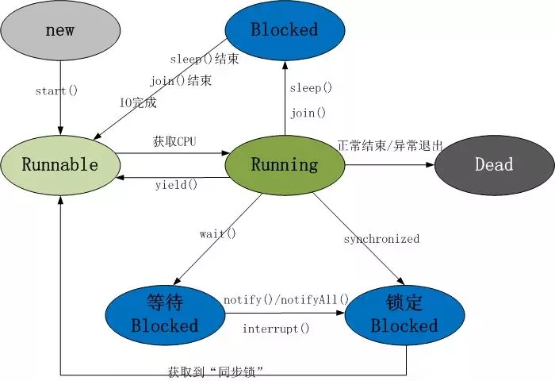
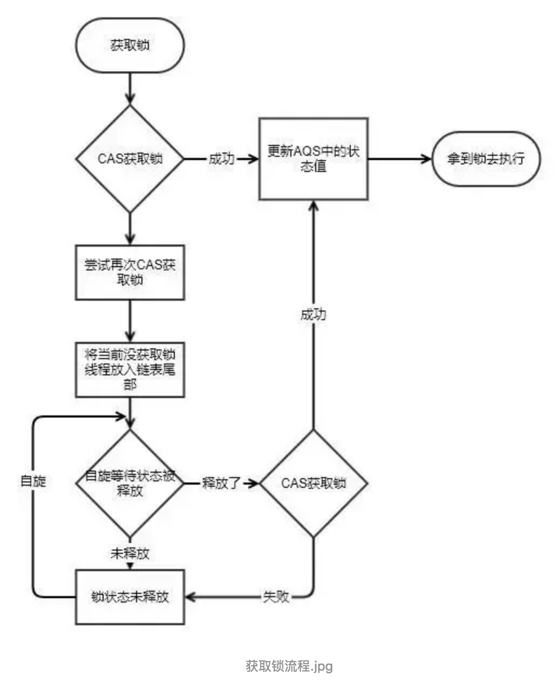
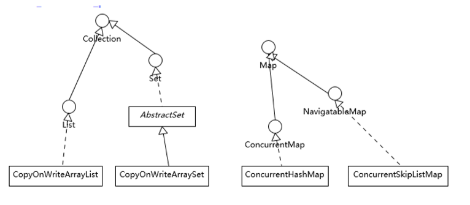
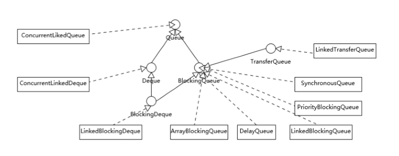

# 线程

进程中的一个独立的控制单元。多个执行路径

cpu是nm级别，越小越好

## 状态周期


- 新建：`new Thread()` 还没开始运行代码

- runnable**可运行**：调用`start()` 后，但该线程**可能正在运行也可能没有运行**，取决于操作系统给线程提供运行的时间。

  抢占式调度(桌面以及服务器OS)：一个线程运行一个时间片，到时候OS剥夺该线程的运行权，根据优先级选择下一个线程

  协作式调度(手机小设备)：一个线程只有在调用yield方法、或者被阻塞、或者等待时，线程才失去控制权。

- 被阻塞或等待：此时该线程不运行任何代码，消耗最少资源知道线程调度器重新激活它。

  1. 被阻塞：一个线程试图获取一个内部的对象锁，而该锁被其他线程持有，进入阻塞状态；当所有其他线程释放该锁，并且线程调度器允许该线程持有他的时候，该线程变成非阻塞状态。
  2. 等待：线程等待另一个线程通知调度器一个条件时，他自己进入等待状态(在调用Object.wait方法或者Thread.join方法，或者是等待java.util.concurrent库中的Lock或Condition时就会出现)
  3. 计时等待：有几个方法有一个超时参数，调用它们导致线程进入计时等待状态。这一状态将一直保持到超时期满或接收到适当的通知。带有超时参数的方法有Thread.sleep,Object.wait,Thread.join,Lock.tryLock以及Condition.await的计时版.

- 被终止：run()方法正常退出而自然死亡；因为一个没有捕获的异常终止了run方法而意外死亡

 

## 线程创建

1. 创建一个线程就是创建一个Thread类的实例。其两个常用构造器：Thread()和Thread(Runnable target)，相应JAVA就有两种创建线程的方式
2. 线程属于一次性的，start方法只能被调用一次，多次调用会抛异常。

### 创建方式1：Thread子类

1. 定义一个类继承Thread类。覆盖其run方法。
2. 创建子类对象创建线程。**创建一个对象就是创建一个线程，所以创建多个线程需要创建多个类对象**
3. 调用start方法，该方法有两个作用：启动线程 & 调用线程的任务run方法执行。（如果只写run()就直接去执行该方法，打印完再回主函数，并没有开启线程）
4. 这种方法不推荐，要从运行机制上减少需要并行运行的任务数量**

```
class Demo extends Thread
{
	public void run()
	{
		System.out.println("aaa");
	}
}

class ThreadDemo2 
{
	public static void main(String[] args) 
	{
		Demo d1 = new Demo();  //创建好一个县城
		d1.start();//开启线程，start方法会调用run方法。
		d1.run(); //如果这么写的话，就直接是去执行对象的方法，并没有开启线程
		System.out.println("bbb");
	}
}

结果可能是：aaa  bbb 、 bbb  aaa
```

**为什么要覆盖run方法？**

Thread类中的run方法，用于存储线程要运行的代码。java虚拟机执行run方法。run方法只是存储线程要执行的代码，如果在主函数中只写了d1.run，就是去执行该代码，并没有开启线程。

```
class ThreadDemo2 
{
	public static void main(String[] args) 
	{
		Demo d1 = new Demo();  //创建好一个线程
		d1.run(); //如果这么写的话，就直接是去执行对象的方法，并没有开启线程
	}
}

结果一定是：aaa  bbb。
```

**设置线程名字**

- 可以手动设定线程名字： super()  /  setname

```
class Demo extends Thread
{
	private String name;
	Demo(String name)
	{
		// 两种
		super(name);
		//this.name = name;
	}
}
```

**每个线程的对象都是自己的，不共享: 创建两个线程, 两个线程进去后x都是0分别自增。**

```
class Demo extends Thread
{
	public void run()
	{
		for( int x; x <= 5; x++)
			System.out.println(x);
	}
}
```

### 创建方式2：声明实现Runnable接口的类（最常用）

1. 创建java.lang.Runnable接口的实例，在该实例的run方法中实现逻辑
2. 以该接口实例作为构造器参数new一个Thread类实例

```java
class Ticket implements Runnable
{
    private  int num = 100;
    public void run()
    {
        while(true)
        {
            if(num>0)
            {
                System.out.println(Thread.currentThread().getName()+".....sale...."+num--);
            }
        }
    }
}


class  TicketDemo
{
    public static void main(String[] args)
    {
        Ticket t = new Ticket();
        Thread t1 = new Thread(t);
        Thread t2 = new Thread(t);

        t1.start();
        t2.start();
    }
}
```

### 实现Runnable接口 和 继承Thread的区别

1. 因为java只支持单继承，e.g. student类继承了Person类，但其中有代码需要多线程执行，所以用接口可避免单继承局限。
2. 实现接口是组合方式，耦合更低，多个线程实例可以共享同一个Runnable实例，更灵活
3. Thread类实际上是Runnable接口的实现类，其run(Runnable)方法就是调用了Runnable.run()中的内容，run()方法就是自行实现

### run()与start()的区别

1. start()方法用来启动新创建的线程，内部调用了run()方法
2. 直接调用run()方法不启动新线程，在原来线程中调用

## **中断线程：**

1. stop方法：被弃用

2. run方法的return语句返回：执行完毕

3. **中断机制** ：interrupt方法**中断**：线程的**中断状态被置位**，这是每个线程的boolean标志。

  1. 每个线程都应该不时地检查这个标志，以判断线程是否被中断，使用`Thread.currentThread().isInterrupted()方法`。

  2. 但是，如果线程被阻塞，就无法检测中断，会产生`InterruptedException`异常

  3. 中断不一定会导致线程终止，需要由代码决定。

  ```java
  public void run(){
      try{
          while(!Thread.currentThread.isInterrupted()&& working) {
              do work;
          }
      } catch (InterruptedException e){
          //线程在sleep或者wait的时候被中断
      } finally {
          //清理
      }
  }
  ```

  4. 如果在中断被置位时调用sleep会清除这一状态并抛出`InterruptedException`异常。所以如果每次工作之后都调用`sleep方法(其他可中断方法)`，`isInterrupted`检查没用没必要。直接捕获异常

  ```java
  public void run(){
      try{
          while(working) {
              do work;
              Thread.sleep(delay);
          }
      } catch (InterruptedException e){
          //线程在sleep的时候被中断
      } finally {
          //清理
      }
  }
  ```

  5. interrupted()和isInterrupted()方法

     interrupted()：Thread类的静态方法，内部调用的也是isInterrupted()方法。检测是否中断并清除中断状态

     isInterrupted()：Thread对象的静态方法，仅检测不清除状态。

## 其他方法：

thread.join()：等待该线程终止

thread.yield()：暂停当前正在执行的线程对象，并执行其他线程

**获取当前线程对象 & 名字**

1. Thread.currentThread()  (更通用)   ---  Thread.currentThread().getName()
2. this ---  this.getName()
3. 线程的名字都是：Thread-编号(从0开始)  
4. 主线程的名字就是main。

## 线程属性

**优先级**：1-10（低-高），**线程优先级是高度依赖于系统的，当虚拟机依赖于宿主机平台的线程实现机制时，JAVA线程的优先级被映射到宿主机平台的优先级上，就不一定**

守护线程：setDaemon(true)：在启动前调用。该线程为其它线程提供服务。当只剩守护线程时，虚拟机就退出了。

未捕获异常处理器：run方法不能抛出任何被检测的异常，但是这样会导致线程死亡。所以可将该异常传递到一个用于捕获异常的处理器。

## ReentrantLock原理

lock实现过程中的几个关键词：计数值、双向链表、CAS+自旋，node是由volatile修饰。

在lock的构造函数中，定义了一个NonFairSync，继承于AbstractQueuedSynchronizer（简称AQS），AOS主要是保存获取当前锁的线程对象。



### 实现分析

`ReentrantLock` 的公平锁和非公平锁都委托了 `AbstractQueuedSynchronizer#acquire` 去请求获取

```java
public final void acquire(int arg) {
    if (!tryAcquire(arg) &&
        acquireQueued(addWaiter(Node.EXCLUSIVE), arg))
        selfInterrupt();
}
```

- `tryAcquire` 是一个抽象方法，是**公平与非公平**的实现原理所在。
- `addWaiter` 是将当前线程结点加入等待队列之中。**公平锁在锁释放后会严格按照等到队列去取后续值**，而非公平锁在对于新晋线程有很大优势。
- `acquireQueued` 在多次循环中尝试获取到锁或者将当前线程阻塞。
- `selfInterrupt` 如果线程在阻塞期间发生了中断，调用 `Thread.currentThread().interrupt()`中断当前线程。

公平锁和非公平锁在锁的获取上都使用到了 `volatile `关键字修饰的`state`字段， 这是保证多线程环境下锁的获取与否的核心。 
但是当并发情况下多个线程都读取到 `state == 0`时，则必须用到CAS技术，一门CPU的原子锁技术，可通过CPU对共享变量加锁的形式，实现数据变更的原子操作。 
`volatile `和 CAS的结合是并发抢占的关键

> `volatile`可以保证：
>
> - 任何进程在读取的时候，都会清空本进程里面持有的共享变量的值，强制从主存里面获取
> - 任何进程在写入完毕的时候，都会强制将共享变量的值写会主存。 
> - volatile 会干预指令重排
> - volatile 实现了JMM规范的 happen-before 原则
>
> CAS是CPU提供的一门技术：
>
> - 使用CAS技术可以锁定住元素的值。[Intel开发文档, 第八章](https://www.intel.com/content/www/us/en/architecture-and-technology/64-ia-32-architectures-software-developer-vol-3a-part-1-manual.html) 
> - 编译器在将线程持有的值与被锁定的值进行比较，相同则更新为更新的值。 
> - CAS同样遵循JMM规范的 happen-before 原则。
>
> JMM 允许编译器在指令重排上自由发挥，除非程序员通过 **volatile**等 显式干预这种重排机制，建立起同步机制，保证多线程代码正确运行。见文章：[Java并发：volatile内存可见性和指令重排](http://blog.csdn.net/jiyiqinlovexx/article/details/50989328)。

#### 公平锁

公平锁的实现机理在于每次有线程来抢占锁的时候，都会检查一遍有没有等待队列，如果有， 当前线程会执行如下步骤：

```java
if (!hasQueuedPredecessors() && compareAndSetState(0, acquires)) {
    setExclusiveOwnerThread(current);
    return true;
}
```

其中`hasQueuedPredecessors`是用于检查是否有等待队列的。

```java
public final boolean hasQueuedPredecessors() {
    Node t = tail; // Read fields in reverse initialization order
    Node h = head;
    Node s;
    return h != t && ((s = h.next) == null || s.thread != Thread.currentThread());
}
```

#### 非公平锁

非公平锁在实现的时候多次强调随机抢占：

```java
if (c == 0) {
    if (compareAndSetState(0, acquires)) {
        setExclusiveOwnerThread(current);
        return true;
    }
}
```

与公平锁的区别在于新晋获取锁的进程会有多次机会去抢占锁。如果被加入了等待队列后则跟公平锁没有区别。

#### 释放锁

ReentrantLock锁的释放是**逐级释放**的，也就是说在**可重入性**场景中，必须要等到场景内所有的加锁的方法都释放了锁，当前线程持有的锁才会被释放！ 
释放的方式很简单，state字段减一即可：

```java
protected final boolean tryRelease(int releases) {
    //  releases = 1
    int c = getState() - releases;
    if (Thread.currentThread() != getExclusiveOwnerThread())
        throw new IllegalMonitorStateException();
    boolean free = false;
    if (c == 0) {
        free = true;
        setExclusiveOwnerThread(null);
    }
    setState(c);
    return free;
}
```

#### 等待队列中元素的唤醒

当当前拥有锁的线程释放锁之后， 且非公平锁无线程抢占，就开始线程唤醒的流程。 
通过`tryRelease`释放锁成功，调用`LockSupport.unpark(s.thread);` 终止线程阻塞。

```java
private void unparkSuccessor(Node node) {
    // 强行回写将被唤醒线程的状态
    int ws = node.waitStatus;
    if (ws < 0)
        compareAndSetWaitStatus(node, ws, 0);
    Node s = node.next;
    // s为h的下一个Node, 一般情况下都是非Null的
    if (s == null || s.waitStatus > 0) {
        s = null;
        // 否则按照FIFO原则寻找最先入队列的并且没有被Cancel的Node
        for (Node t = tail; t != null && t != node; t = t.prev)
            if (t.waitStatus <= 0)
                s = t;
    }
    // 再唤醒它
    if (s != null)
        LockSupport.unpark(s.thread);
}
```

[Java中的公平锁和非公平锁实现详解](http://blog.csdn.net/qyp199312/article/details/70598480)

## Synchronized和lock的区别

|          | Synchronized                                                 | Lock                                                         |
| -------- | ------------------------------------------------------------ | ------------------------------------------------------------ |
| 存在层次 | Java的关键字，在jvm层面上                                    | 一个类                                                       |
| 锁的释放 | 1、以获取锁的线程执行完同步代码，释放锁 2、线程执行发生异常，jvm会让线程释放锁 | 在finally中必须释放锁，不然容易造成线程死锁                  |
| 锁的获取 | 假设A线程获得锁，B线程等待。如果A线程阻塞，B线程会一直等待   | 分情况而定，Lock有多个锁获取的方式，具体下面会说道，大致就是可以尝试获得锁，线程可以不用一直等待 |
| 锁状态   | 无法判断                                                     | 可以判断                                                     |
| 锁类型   | 可重入 不可中断 非公平                                       | 可重入 可判断 可公平（两者皆可）                             |
| 性能     | 少量同步                                                     | 大量同步                                                     |

ReentrantLock 能实现如：

- 带超时的获取锁尝试。

- 可以判断是否有线程，或者某个特定线程，在排队等待获取锁。

- 可以响应中断请求：

  线程A和B都要获取对象O的锁定，假设A获取了对象O锁，B将等待A释放对O的锁定，

  ​     如果使用 synchronized ，如果A不释放，B将一直等下去，不能被中断

  ​     如果 使用ReentrantLock，如果A不释放，可以使B在等待了足够长的时间以后，中断等待，而干别的事情

## AQS

**AQS核心思想是，如果被请求的共享资源空闲，则将当前请求资源的线程设置为有效的工作线程，并且将共享资源设置为锁定状态。如果被请求的共享资源被占用，那么就需要一套线程阻塞等待以及被唤醒时锁分配的机制，这个机制AQS是用CLH队列锁实现的，即将暂时获取不到锁的线程加入到队列中。**

> CLH(Craig,Landin,and Hagersten)队列是一个虚拟的双向队列（虚拟的双向队列即不存在队列实例，仅存在结点之间的关联关系）。AQS是将每条请求共享资源的线程封装成一个CLH锁队列的一个结点（Node）来实现锁的分配。

看个AQS(AbstractQueuedSynchronizer)原理图：

AQS使用一个int成员变量来表示同步状态，通过内置的FIFO队列来完成获取资源线程的排队工作。AQS使用CAS对该同步状态进行原子操作实现对其值的修改。

```java
private volatile int state;//共享变量，使用volatile修饰保证线程可见性
```

状态信息通过procted类型的getState，setState，compareAndSetState进行操作

```java
//返回同步状态的当前值
protected final int getState() {  
        return state;
}
 // 设置同步状态的值
protected final void setState(int newState) { 
        state = newState;
}
//原子地（CAS操作）将同步状态值设置为给定值update如果当前同步状态的值等于expect（期望值）
protected final boolean compareAndSetState(int expect, int update) {
        return unsafe.compareAndSwapInt(this, stateOffset, expect, update);
}
```

### AQS 对资源的共享方式

**AQS定义两种资源共享方式**

- **Exclusive**（独占）：只有一个线程能执行，如ReentrantLock。又可分为公平锁和非公平锁：

- - 公平锁：按照线程在队列中的排队顺序，先到者先拿到锁
  - 非公平锁：当线程要获取锁时，无视队列顺序直接去抢锁，谁抢到就是谁的

- **Share**（共享）：多个线程可同时执行，如Semaphore/CountDownLatch。Semaphore、CountDownLatCh、 CyclicBarrier、ReadWriteLock 我们都会在后面讲到。

ReentrantReadWriteLock 可以看成是组合式，因为ReentrantReadWriteLock也就是读写锁允许多个线程同时对某一资源进行读。

不同的自定义同步器争用共享资源的方式也不同。自定义同步器在实现时只需要实现共享资源 state 的获取与释放方式即可，至于具体线程等待队列的维护（如获取资源失败入队/唤醒出队等），AQS已经在顶层实现好了。

## QS底层使用了模板方法模式

同步器的设计是基于模板方法模式的，如果需要自定义同步器一般的方式是这样（模板方法模式很经典的一个应用）：

1. 使用者继承AbstractQueuedSynchronizer并重写指定的方法。（这些重写方法很简单，无非是对于共享资源state的获取和释放）
2. 将AQS组合在自定义同步组件的实现中，并调用其模板方法，而这些模板方法会调用使用者重写的方法。

这和我们以往通过实现接口的方式有很大区别，这是模板方法模式很经典的一个运用。

**AQS使用了模板方法模式，自定义同步器时需要重写下面几个AQS提供的模板方法：**

```java
isHeldExclusively()//该线程是否正在独占资源。只有用到condition才需要去实现它。
tryAcquire(int)//独占方式。尝试获取资源，成功则返回true，失败则返回false。
tryRelease(int)//独占方式。尝试释放资源，成功则返回true，失败则返回false。
tryAcquireShared(int)//共享方式。尝试获取资源。负数表示失败；0表示成功，但没有剩余可用资源；正数表示成功，且有剩余资源。
tryReleaseShared(int)//共享方式。尝试释放资源，成功则返回true，失败则返回false。
```

默认情况下，每个方法都抛出 `UnsupportedOperationException`。 这些方法的实现必须是内部线程安全的，并且通常应该简短而不是阻塞。AQS类中的其他方法都是final ，所以无法被其他类使用，只有这几个方法可以被其他类使用。

以ReentrantLock为例，state初始化为0，表示未锁定状态。A线程lock()时，会调用tryAcquire()独占该锁并将state+1。此后，其他线程再tryAcquire()时就会失败，直到A线程unlock()到state=0（即释放锁）为止，其它线程才有机会获取该锁。当然，释放锁之前，A线程自己是可以重复获取此锁的（state会累加），这就是可重入的概念。但要注意，获取多少次就要释放多么次，这样才能保证state是能回到零态的。

再以CountDownLatch以例，任务分为N个子线程去执行，state也初始化为N（注意N要与线程个数一致）。这N个子线程是并行执行的，每个子线程执行完后countDown()一次，state会CAS(Compare and Swap)减1。等到所有子线程都执行完后(即state=0)，会unpark()主调用线程，然后主调用线程就会从await()函数返回，继续后余动作。

一般来说，自定义同步器要么是独占方法，要么是共享方式，他们也只需实现`tryAcquire-tryRelease`、`tryAcquireShared-tryReleaseShared`中的一种即可。但AQS也支持自定义同步器同时实现独占和共享两种方式，如`ReentrantReadWriteLock`。

推荐两篇 AQS 原理和相关源码分析的文章：

- [http://www.cnblogs.com/waterystone/p/4920797.html](https://link.zhihu.com/?target=http%3A//www.cnblogs.com/waterystone/p/4920797.html)
- [https://www.cnblogs.com/chengxiao/archive/2017/07/24/7141160.html](https://link.zhihu.com/?target=https%3A//www.cnblogs.com/chengxiao/archive/2017/07/24/7141160.html)

## 5.3 AQS 组件总结

- **Semaphore(信号量)-允许多个线程同时访问：** synchronized 和 ReentrantLock 都是一次只允许一个线程访问某个资源，Semaphore(信号量)可以指定多个线程同时访问某个资源。
- **CountDownLatch （倒计时器）：** CountDownLatch是一个同步工具类，用来协调多个线程之间的同步。这个工具通常用来控制线程等待，它可以让某一个线程等待直到倒计时结束，再开始执行。
- **CyclicBarrier(循环栅栏)：** CyclicBarrier 和 CountDownLatch 非常类似，它也可以实现线程间的技术等待，但是它的功能比 CountDownLatch 更加复杂和强大。主要应用场景和 CountDownLatch 类似。CyclicBarrier 的字面意思是可循环使用（Cyclic）的屏障（Barrier）。它要做的事情是，让一组线程到达一个屏障（也可以叫同步点）时被阻塞，直到最后一个线程到达屏障时，屏障才会开门，所有被屏障拦截的线程才会继续干活。CyclicBarrier默认的构造方法是 CyclicBarrier(int parties)，其参数表示屏障拦截的线程数量，每个线程调用await方法告诉 CyclicBarrier 我已经到达了屏障，然后当前线程被阻塞。

关于AQS这部分的更多内容可以查看我的这篇文章:[并发编程面试必备：AQS 原理以及 AQS 同步组件总结](https://link.zhihu.com/?target=https%3A//mp.weixin.qq.com/s/joa-yOiTrYF67bElj8xqvg)

# CAS

CAS（Compare and Swap），即比较并替换，实现并发算法时常用到的一种技术，Doug lea在java同步器中大量使用了CAS技术，实现了多线程执行的安全性。

CAS的思想很简单：三个参数，一个当前内存值V、旧的预期值A、即将更新的值B，当且仅当预期值A和内存值V相同时，将内存值修改为B并返回true，否则什么都不做，并返回false。

**使用JDK自带的CAS方案**

其中：比较和替换是一组原子操作，不会被打断，性能更好

**举例：AtomicInteger**

```java
public class AtomicInteger extends Number implements java.io.Serializable {
    // setup to use Unsafe.compareAndSwapInt for updates
    private static final Unsafe unsafe = Unsafe.getUnsafe();
    private static final long valueOffset;

    static {
        try {
            valueOffset = unsafe.objectFieldOffset
                (AtomicInteger.class.getDeclaredField("value"));
        } catch (Exception ex) { throw new Error(ex); }
    }

    private volatile int value;
    public final int get() {return value;}
}
```

1. Unsafe，是CAS的核心类，由于Java方法无法直接访问底层系统，需要通过本地（native）方法来访问，Unsafe相当于一个后门，基于该类可以直接操作特定内存的数据。
2. 变量valueOffset，表示该变量值在内存中的偏移地址，因为Unsafe就是根据内存偏移地址获取数据的。
3. 变量value用volatile修饰，保证了多线程之间的内存可见性。

## 悲观锁和乐观锁 

- 悲观锁（Pessimistic Lock）：每次去拿数据的时候都认为别人会修改，所以每次在拿数据的时候都会上锁，这样别人想拿这个数据就会block直到它拿到锁。 

- 乐观锁（Optimistic Lock）：每次去拿数据的时候都认为别人不会修改，所以不会上锁，但是在提交更新的时候会判断一下在此期间别人有没有去更新这个数据。乐观锁适用于读多写少的应用场景，这样可以提高吞吐量。 

  乐观锁的实现：

  1. 数据版本记录
  2. 时间戳

  Java JUC中的atomic包就是乐观锁的一种实现，AtomicInteger 通过CAS（Compare And Set）操作实现线程安全的自增。 

##  CAS底层是如何实现的

依赖于 CPU 提供的特定指令，具体根据体系结构的不同还存在着明显区别。

1. x86 CPU 提供 cmpxchg 指令；
2. 在精简指令集的体系架构中，则通常是靠一对指令（如“load and reserve”和“store conditional”） 实现的，在大多数处理器上 CAS 都是个非常轻量级的操作，这也是其优势所在。

## 在什么场景下，可以采用 CAS 技术

在数据库产品中，为保证索引的一致性，保证只有一个线程能够排他性地修改一个索引分区。在 Java 代码中，怎么实现锁操作呢？

 java.util.concurrent.atomic.AtomicLongFieldUpdater，是基于反射机制创建， 需要保证类型和字段名称正确。

## ABA问题

比如说一个线程one从内存位置V中取出A，这时候另一个线程two也从内存中取出A，并且two进行了一些操作变成了B，然后two又将V位置的数据变成A，这时候线程one进行CAS操作发现内存中仍然是A，然后one操作成功。 

尽管线程one的CAS操作成功，但是不代表这个过程就是没有问题的。

这是通常只在 lock-free 算法下暴露的问题。我前面说过 CAS 是在更新时比较前值，如果对方只是恰好相同，例如期间发生了 A -> B -> A 的更新，仅仅判 断数值是 A，可能导致不合理的修改操作。针对这种情况，Java 提供了 AtomicStampedReference 工具类，通过为引用建立类似版本号（stamp）的方式，来保证 CAS 的正确性，具体用法请参考这里的介绍。

# 同步器

`java.concurrent.atomic`包包含了许多实用的类，用于执行原子操作。 

原子操作严重依赖于比较与交换（CAS），它是由多数现代CPU直接支持的原子指令。这些指令通常比同步块要快。所以在只需要并发修改单个可变变量的情况下，优先使用原子类。

信号量：semaphore，线程池+信号量，控制运行线程池中同时运行的最大线程数。

倒计时门栓：

障栅

交换器

同步队列

countDownLatch：类，适合保证线程执行完后去进行其他的处理

## violate&transient&final

现代处理器和编译器出错可能性更大

1. 多处理器在寄存器或本地内存缓冲区中保存内存的值：运行在不同处理器上的线程可能在同一个内存位置取到不同的值
2. 编译器：可以改变指令执行的顺序使吞吐量变大，编译器假定内存的值仅仅在代码中有显示的修改指令时才会改变，但这个值可以被另外的线程改变

- 使用锁可以不考虑上述问题：编译器被要求通过在必要的时候刷新本地缓存来保持锁的效应 & 不能不正当的重新排序指令。
- 同步：向一个变量写入，接下来会被另外线程读取；从一个变量读，这个变量可能是之前被另外线程写入的。就要同步。

**violate：**编译器会对代码优化，将常用变量缓存起来，程序读取就从缓存(寄存器)读，而不是内存中读。但多线程编程时，变量的值可能因为别的线程改变了，而缓存值不变，造成实际值与读取的不同。该关键字修饰被不同线程访问和修改的变量，每次用它都是从内存中读。

**final:** 使用final会保证其他线程在后早函数完成构造之后才看到这个变量，如果不用就不一定是null还是构造的。

**transient：**java语言关键字，用它声明一个实例变量，当对象存储时，它的值不需要维持。

## 线程局部变量，多个线程中生成随机数

- ThreadLocal辅助类。为每个线程创建一个实例

```
public static final ThreadLocal<SimpleDateFormat> dateFormat = new ThreadLocal<SimpleDateFormat>()
{
    protected SimpleDateFormat initialValue()
    {
        return new SimpleDateFormat("yyyy-MM-dd");
    }
};

String date = dateFormat.get().format(new Date());
```

在一个线程中首次调用get方法会调用initialValue方法。之后get会返回属于当前线程的实例

- 用ThreadLocal为各个线程提供一个单独的生成器

## 读写锁

java.util.concurrent.locks中的两个类ReentrantLock，ReentrantReadWriteLock。

ReentrantReadWriteLock适合很多线程读时用。

```
//构造对象
private ReentrantReadWriteLock rwl = new ReentrantReadWriteLock();
//抽取读，写锁
private Lock read = rwl.readLock();
private Lock write = rwl.writeLock();
//分别加锁
public double get{
    read.lock();
    try{}
    finally{read.unlock};
}

```

## 为什么弃用stop,suspend方法

stop: 中止方法，释放所有锁

suspend:如果挂起一个持有锁的线程，锁在恢复前不可用，调用suspend的线程试图获得同一个锁，会死锁。

# 阻塞队列

remove，take，poll：移出并返回头元素

- put，take：队列空，则阻塞  --- **适合做线程管理工具**
- add，remove，element(返回队列的头元素)：队列空，抛出异常
- offer，poll，peek：返回false, null, null。因此向这些队列里插入null是非法的。

LinkedBlockingDeque：双端队列，容量无上界，可以指定

ArrayBlockingQueue：构造时要指定

PriorityBlockingQueue：容量无上界，

DelayQueue：getDelay方法返回对象的残留延迟

BlockingQueue，BlockingDeque

# 死锁

三种情况

1. 所有线程拿到锁后，但不满足执行条件
2. 线程a执行：A--B操作，线程b执行B---A操作。a获得A的锁，b获得B的锁后双方都卡在下一步。
3. 使用signal而不是signalAll方法

## 如何定位修复

1. 利用 jstack 等工具获取线程栈，然后定位互相之间的依赖关系，进而找到死锁。
2. 如果是比较明显的死锁，往往 jstack 等就能直接定位，类似 JConsole 甚至可以在图形界面进行有限的死锁检测。
3. 操作系统对死锁的处理：如果有多个线程对多个资源进行访问时， 需要对资源进行排序（排序的方法你自己确定）， 然后所有的线程都按同样的次序来访问资源，这样就不会出现环路等待了。

## 写一个死锁程序

```java
public class DeadLockSample extends Thread {    
    private String first;   
    private String second;  
    public DeadLockSample(String name, String first, String second) {
        super(name);
        this.first = first;        
        this.second = second;   
    } 
 
    public  void run() {        
        synchronized (first) {  
            System.out.println(this.getName() + " obtained: " + first);   
            try {             
                Thread.sleep(1000L);           
                synchronized (second) {  
                    System.out.println(this.getName() + " obtained: " + second);               
                }     
            } catch (InterruptedException e) {       
                // Do nothing           
            }      
        }    
    }    
    public static void main(String[] args) throws InterruptedException {         	 String lockA = "lockA";                                             
        String lockB = "lockB";     
        DeadLockSample t1 = new DeadLockSample("Thread1", lockA, lockB);             DeadLockSample t2 = new DeadLockSample("Thread2", lockB, lockA);             t1.start();      
        t2.start();     
        t1.join();    
        t2.join();  
	} 
} 
```

##  定位死锁

1. 首先，可以使用 jps 或者系统的 ps 命令、任务管理器等工具，确定进程 ID。
2. 其次，调用 jstack 获取线程栈：

`${JAVA_HOME}\bin\jstack your_pid `

**总之：**区分线程状态 -> 查看等待目标 -> 对比 Monitor 等持有状态。

## 基本上死锁的发生是因为：

1. 互斥条件，类似 Java 中 Monitor 都是独占的，要么是我用，要么是你用。
2. 互斥条件是长期持有的，在使用结束之前，自己不会释放，也不能被其他线程抢占。
3. 循环依赖关系，两个或者多个个体之间出现了锁的链条环。

所以，我们可以据此分析可能的避免死锁的思路和方法。

1. 尽量避免使用多个锁，并且只有需要时才持有锁
2. 设计好锁的获取顺序：参考银行家算法
3. 使用带超时的方法
4. 静态代码分析去查找固定的模式，定位可能的死锁或竞争情况

# Java并发包中的工具类

- 并发包也就是 java.util.concurrent 及其子包，集中了 Java 并发的各种基础工 具类，具体主要包括几个方面：

1. 提供了比 synchronized 更加高级的各种同步结构，包括 CountDownLatch、 CyclicBarrier、Sempahore 等，可以实现更加丰富的多线程操作，比如利用 Semaphore 作 为资源控制器，限制同时进行工作的线程数量。
2. 各种线程安全的容器，比如常见的 ConcurrentHashMap、有序的 ConcunrrentSkipListMap，或者通过类似快照机制，实现线程安全的动态数组CopyOnWriteArrayList 等。
3. 各种并发队列实现，如各种 BlockedQueue 实现，比较典型的 ArrayBlockingQueue、 SynchorousQueue 或针对特定场景的 PriorityBlockingQueue 等。
4. 强大的 Executor 框架，可以创建各种不同类型的线程池，调度任务运行等，绝大部分情况 下，不再需要自己从头实现线程池和任务调度器。

## 高级同步结构

- CountDownLatch，允许一个或多个线程等待某些操作完成。
- CyclicBarrier，一种辅助性的同步结构，允许多个线程等待到达某个屏障。
- Semaphore，Java 版本的信号量实现。

 **CountDownLatch 和 CyclicBarrier区别**

- CountDownLatch 是不可以重置的，所以无法重用；而 CyclicBarrier 则没有这种限制，可 以重用。
- CountDownLatch 的基本操作组合是 countDown/await。调用 await 的线程阻塞等待 countDown 足够的次数，不管你是在一个线程还是多个线程里 countDown，只要次数足够 即可。所以就像 Brain Goetz 说过的，**CountDownLatch 操作的是事件**。
- CyclicBarrier 的基本操作组合，则就是 await，当所有的伙伴（parties）都调用了 await， 才会继续进行任务，并自动进行重置。注意，正常情况下，CyclicBarrier 的重置都是自动发生的，如果我们调用 reset 方法，但还有线程在等待，就会导致等待线程被打扰，抛出 BrokenBarrierException 异常。**CyclicBarrier 侧重点是线程，而不是调用事件，它的典型应 用场景是用来等待并发线程结束。**

**CountDownLatch:**

1. **实现最大的并行性**：有时我们想同时启动多个线程，实现最大程度的并行性。例如，我们想测试一个单例类。如果我们创建一个初始计数为1的CountDownLatch，并让所有线程都在这个锁上等待，那么我们可以很轻松地完成测试。我们只需调用 一次countDown()方法就可以让所有的等待线程同时恢复执行。
2. **开始执行前等待n个线程完成各自任务**：例如应用程序启动类要确保在处理用户请求前，所有N个外部系统已经启动和运行了。
3. **死锁检测：**一个非常方便的使用场景是，你可以使用n个线程访问共享资源，在每次测试阶段的线程数目是不同的，并尝试产生死锁。

## **线程安全容器：**

CopyOnWriteArrayList，CopyOnWriteArraySet，ConcurrentHashMap，ConcurrentSkipListMap



- 应用侧重于 Map 放入或者获取的速度，而不在乎顺序，大多推荐使用 ConcurrentHashMap，反之则使用 ConcurrentSkipListMap；
- 如果我们需要对大量数据进行非常频繁地修改， ConcurrentSkipListMap 也可能表现出优势。

**为什么并发容器里面没有 ConcurrentTreeMap?**

- TreeMap 要实现高效的线程安全是非常困难的，它的实现基于复杂的红黑树。为保证访问效率，当我们插入或删除节点时，会移动节点进行平衡操作，这导致在并发场景中难以进行 合理粒度的同步。
- SkipList 结构相对简单很多，通过层次结构提高访问速度，虽然不够紧凑，空间使用有一定提高（O(nlogn)），但是在增删元素时线程安全的开销要好很多

**CopyOnWriteArrayList，CopyOnWriteArraySet**

- CopyOnWriteArraySet 是通过包装了 CopyOnWriteArrayList 来实现的
- CopyOnWrite ：原理是任何修改操作，如 add、set、 remove，都会拷贝原数组，修改后替换原来的数组，通过这种防御性的方式，实现另类的线程 安全。
- 适合读多写少的操作

## 并发队列： 

严格来讲，类似 ConcurrentLinkedQueue 这种“Concurrent*”容器，才是真正代表并发。
ConcurrentLinkedQueue 和 LinkedBlockingQueue的区别：

- Concurrent 类型基于 lock-free，在常见的多线程访问场景，一般可以提供较高吞吐量。
- LinkedBlockingQueue 内部则是基于锁，并提供了 BlockingQueue 的等待性方法。

java.util.concurrent 包提供的容器（Queue、List、Set）、Map，从 命名上可以大概区分为 Concurrent、CopyOnWrite和 Blocking* 等三类，同样是线程安全容器，可以简单认为：

- Concurrent 类型没有类似 CopyOnWrite 之类容器相对较重的修改开销。
- 但是Concurrent 往往提供了较低的遍历一致性。你可以这样理解所谓的弱一致性，例如，当利用迭代器遍历时，如果容器发生修改，迭代器仍然可以继续进行遍历。
- 弱一致性的另外一个体现是，size 等操作准确性是有限的，未必是 100% 准确。与此同时，读取的性能具有一定的不确定性。
- 与弱一致性对应的，就是我介绍过的同步容器常见的行为“fast-fail”，也就是检测到容器在遍历过程中发生了修改，则抛出 ConcurrentModificationException，不再继续遍历。

**JUC包中的所有线程安全队列：**



**1. Deque的实现：**ConcurrentLinkedDeque 和 LinkedBlockingDeque

- 尾部插入时需要的addLast(e)、offerLast(e)。
- 尾部删除所需要的removeLast()、pollLast()。

**2. 绝大部分 Queue 都是实现了 BlockingQueue 接口：**

Blocking 意味着其提供了特定的等待性操作，获取时（take）等待元素进队，或者插入时 （put）等待队列出现空位

**2.1 BlockingQueue是否有界（Bounded、Unbounded）**

- **ArrayBlockingQueue--典型的有界队列**，其内部以 final 的数组保存数据，数组的大小 就决定了队列的边界，所以我们在创建 ArrayBlockingQueue 时，都要指定容量，如

`public ArrayBlockingQueue(int capacity, boolean fair) `

- LinkedBlockingQueue，容易被误解为无边界，但其实其行为和内部代码都是基于有界的逻辑实现的，只不过如果我们没有在创建队列时就指定容量，那么其容量限制就自动被设置为 Integer.MAX_VALUE，成为了无界队列。
- SynchronousQueue，这是一个非常奇葩的队列实现，每个删除操作都要等待插入操作，反之每个插入操作也都要等待删除动作。这个队列的内部容量是 0。
- **PriorityBlockingQueue --无边界的优先队列**，虽然严格意义上来讲，其大小总归是要受系统资源影响。
- **DelayedQueue 和 LinkedTransferQueue--无边界的队列**。对于无边界的队列，有一 个自然的结果，就是 put 操作永远也不会发生其他 BlockingQueue 的那种等待情况。

**2.2 BlockingQueue 基本都是基于锁实现**

典型的 LinkedBlockingQueue。

- ArrayBlockingQueue中notEmpty、notFull 都是同一个再入锁的条件变量
- LinkedBlockingQueue则改进了锁操作的粒度，头、尾操作 使用不同的锁，所以在通用场景下，它的吞吐量相对要更好一些。
- ConcurrentLinkedQueue 等，则是基于 CAS 的无锁技术，不需要在每个操作时使用锁， 所以扩展性表现要更加优异。

**3. 并发队列总结**

以 LinkedBlockingQueue、ArrayBlockingQueue 和 SynchronousQueue 为例，我们一起来 分析一下，根据需求可以从很多方面考量：
考虑应用场景中对队列边界的要求。ArrayBlockingQueue 是有明确的容量限制的，而 LinkedBlockingQueue 则取决于我们是否在创建时指定，SynchronousQueue 则干脆不能 缓存任何元素。
从空间利用角度，数组结构的 ArrayBlockingQueue 要比 LinkedBlockingQueue 紧凑，因 为其不需要创建所谓节点，但是其初始分配阶段就需要一段连续的空间，所以初始内存需求 更大。
通用场景中，LinkedBlockingQueue 的吞吐量一般优于 ArrayBlockingQueue，因为它实 现了更加细粒度的锁操作。
ArrayBlockingQueue 实现比较简单，性能更好预测，属于表现稳定的“选手”。
如果我们需要实现的是两个线程之间接力性（handoff）的场景，按照专栏上一讲的例子，你 可能会选择 CountDownLatch，但是SynchronousQueue也是完美符合这种场景的，而且 线程间协调和数据传输统一起来，代码更加规范。
可能令人意外的是，很多时候 SynchronousQueue 的性能表现，往往大大超过其他实现， 尤其是在队列元素较小的场景。