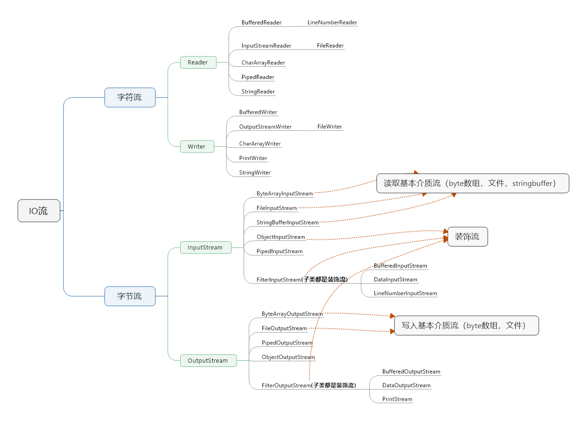
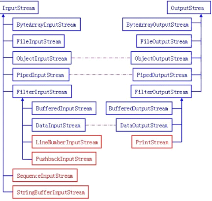
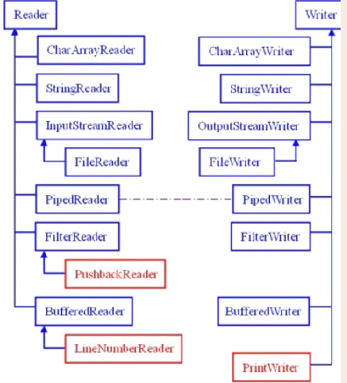

# IO流：



## 输入流：

## 输出流：

## 字节流：InputStream，OutputStream

## 字符流：FileReader，FileWriter，BufferedReader，BufferedWriter

- 为了处理文字数据方便而出现的对象。这些对象的内部使用的还是字节流(因为文字最终也是字节数据)
- 只不过，通过字节流读取了相对应的字节数，没有对这些字节直接操作。而是去查了指定的(本机默认的)编码表，获取到了对应的文字。
- 简单说：字符流就是 ： 字节流+编码表。

## 操作文件的字节流对象：FileOutputStream，FileInputStream，BufferedOutputStream，BufferedInputStream

-----------------------

## 缓冲区：

- 提高流的操作数据的效率。所以创建缓冲区之前必须先有流。
- 缓冲区的基本思想：其实就是定义容器将数据进行临时存储。对于缓冲区对象，其实就是将这个容器进行了封装，并提供了更多高效的操作方法。
- 是使用了一种设计思想完成。设计模式：装饰设计模式。

### 缓冲区说明：先将数据写到缓冲区中，再将缓冲区中的数据一次性写到目的地。

Writer
	|--TextWriter
	|--MediaWriter

- 现在要对该体系中的对象进行功能的增强。增强的最常见手段就是缓冲区。先将数据写到缓冲区中，再将缓冲区中的数据一次性写到目的地。
- 按照之前学习过的基本的思想，那就是对对象中的写方法进行覆盖。产生已有的对象子类，复写write方法。不往目的地写，而是往缓冲区写。

------

所以这个体系会变成这样。
Writer
	|--TextWriter write:往目的地
		|--BufferTextWriter write：往缓冲区写
	|--MediaWriter
		|--BufferMediaWriter
想要写一些其他数据。就会产生子类：DataWriter，为了提高其效率，还要创建该类的子类。BufferDataWriter
Writer
	|--TextWriter write:往目的地
		|--BufferTextWriter write：往缓冲区写
	|--MediaWriter
		|--BufferMediaWriter
	|--DataWriter
		|--BufferDataWriter

- 发现这个体系相当的麻烦。每产生一个子类都要有一个高效的子类。
- 而且这写高效的子类使用的功能原理都一样，都是缓冲区原理。无论数据是什么。都是通过缓冲区临时存储提高效率的。
- 那么，对于这个体系就可以进行优化，因为没有必要让每一个对象都具备相同功能的子类。
- 哪个对象想要进行效率的提高，只要让缓冲区对其操作即可。也就说，单独将缓冲区进行封装变成对象。
- 它的出现为了提高对象的效率。所以必须在创建它的时候先有需要被提高效率的对象

```
class BufferWriter
{
	[];
	BufferedWriter(Writer w)
	{
	}
/*
BufferWriter(TextWriter w)
{
	
}
BufferedWriter(MediaWriter w)
{
	
}
*/
}
```

------

- BufferWriter的出现增强了Writer中的write方法。但是增强过后，BufferWriter对外提供的还是write方法。只不过是高效的。
- 所以写的实质没有变，那么BufferWriter也是Writer中的一员。
- 所以体系就会变成这样。

Writer
	|--TextWriter
	|--MediaWriter
	|--BufferWriter
	|--DataWriter

- BufferWriter出现了避免了继承体系关系的臃肿，比继承更为灵活。如果是为了增强功能，这样方式解决起来更为方便。所以就把这种优化，总结出来，起个名字：装饰设计模式。
- 装饰类和被装饰类肯定所属于同一个体系。
- 既然明确了BufferedReader由来。我们也可以独立完成缓冲区的建立

### 原理；

​	1，使用流的read方法从源中读取一批数据存储到缓冲区的数组中。
	2，通过计数器记录住存储的元素个数。
	3，通过数组的角标来获取数组中的元素(从缓冲区中取数据).
	4，指针会不断的自增，当增到数组长度，会归0.计数器会自减，当减到0时，就在从源拿一批数据进缓冲区。

## 转换流：

字符流和字节流之间的转换动作。

InputStreamReader ：字节到字符的桥梁。解码。
OutputStreamWriter：字符到字节的桥梁。编码。


InputStreamReader isr = new InputStreamReader(new FileInputStream("a.txt"));
InputStreamReader isr = new InputStreamReader(new FileInputStream("a.txt"),"gbk");
FileReader fr = new FileReader("a.txt");

FileWriter fw = new FileWriter("b.txt");
OutputStreamWriter osw = new OutputStreamWriter(new FileOutputStream("b.txt"));
OutputStreamWriter osw = new OutputStreamWriter(new FileOutputStream("b.txt"),"gbk");

- 转换流：字节流+编码表。
- 转换流的子类：FileReader，FileWriter：字节流+本地默认码表(GBK)。
- 如果操作文本文件使用的本地默认编码表完成编码。可以使用FileReader，或者FileWriter。因为这样写简便。
- 如果对操作的文本文件需要使用指定编码表进行编解码操作，这时必须使用转换流来完成。 


# IO流的操作规律总结：

## 1，明确体系：

```
	数据源：InputStream ，Reader
	数据汇：OutputStream，Writer
```

## 2，明确数据：因为数据分两种：字节，字符。

```
数据源：是否是纯文本数据呢？
		是：Reader
		否：InputStream		

数据汇：
		是：Writer
		否：OutputStream
```

到这里就可以明确具体要使用哪一个体系了。剩下的就是要明确使用这个体系中的哪个对象。

## 3，明确设备：

	数据源：
	    键盘：System.in
	    硬盘：FileXXX
	    内存：数组。
	    网络：socket  socket.getInputStream();
	
	数据汇：
		控制台：System.out
		硬盘：FileXXX
		内存：数组
		网络：socket socket.getOutputStream();

## 4，明确额外功能：

```
1，需要转换？是，使用转换流。InputStreamReader OutputStreamWriter
2，需要高效？是，使用缓冲区。Buffered
3，需要其他？
```

--------------------

## 5，举例

### 1，复制一个文本文件。

	1，明确体系：
		源：InputStream ，Reader
		目的：OutputStream ，Writer
	2，明确数据：
		源：是纯文本吗？是 Reader
		目的；是纯文本吗？是 Writer
	3，明确设备：
		源：硬盘上的一个文件。	FileReader
		目的：硬盘上的一个文件。FileWriter
		FileReader fr = new FileReader("a.txt");
		FileWriter fw = new FileWriter("b.txt");
	4，需要额外功能吗？
		需要，高效，使用buffer
		BufferedReader bufr = new BufferedReader(new FileReader("a.txt"));
		BufferedWriter bufw = new BufferedWriter(new FileWriter("b.txt"));

### 2，读取键盘录入，将数据存储到一个文件中。

```
	1，明确体系：
		源：InputStream ，Reader
		目的：OutputStream ，Writer
	2，明确数据：
		源：是纯文本吗？是 Reader
		目的；是纯文本吗？是 Writer
	3，明确设备：
		源：键盘，System.in
		目的：硬盘，FileWriter
		InputStream in = System.in;
		FileWriter fw = new FileWriter("a.txt");
	4，需要额外功能吗？
		需要，因为源明确的体系时Reader。可是源的设备是System.in。
		所以为了方便于操作文本数据，将源转成字符流。需要转换流。InputStreamReader
		InputStreamReader isr = new InputStreamReader(System.in);
		FileWriter fw  = new FileWriter("a.txt");
		需要高效不?需要。Buffer
		BufferedReader bufr = new BufferedReader(new InputStreamReader(System.in));
		BufferedWriter bufw = new BufferedWriter(new FileWriter("a.txt"));
```

### 3，读取一个文本文件，将数据展现在控制台上。

			1，明确体系：
				源：InputStream ，Reader
				目的：OutputStream ，Writer
			2，明确数据：
				源：是纯文本吗？是 Reader
				目的；是纯文本吗？是 Writer
			3，明确设备：
				源：硬盘文件，FileReader。
				目的：控制台：System.out。
				FileReader fr = new FileReader("a.txt");
				OutputStream out = System.out;
			4，需要额外功能？
				因为源是文本数据，确定是Writer体系。所以为了方便操作字符数据，
				需要使用字符流，但是目的又是一个字节输出流。
				需要一个转换流，OutputStreamWriter
				FileReader fr = new FileReader("a.txt");
				OutputStreamWriter osw = new OutputStreamWriter(System.out);
				
			需要高效吗？需要。
			BufferedReader bufr = new BufferedReader(new FileReader("a.txt"));
			BufferedWriter bufw = new BufferedWriter(new OutputStreamWriter(System.out));

### 4，读取键盘录入，将数据展现在控制台上。

```
		1，明确体系：
			源：InputStream ，Reader
			目的：OutputStream ，Writer
		2，明确数据：
			源：是纯文本吗？是 Reader
			目的；是纯文本吗？是 Writer
		3，明确设备：
			源：键盘：System.in
			目的：控制台：System.out
			InputStream in = System.in;
			OutputStream out = System.out;
		4，需要额外功能吗？
			因为处理的数据是文本数据，同时确定是字符流体系。
			为方便操作字符数据的可以将源和目的都转成字符流。使用转换流。
			为了提高效率，使用Buffer
			BufferedReader bufr  =new BufferedReader(new InputStreamReader(Systme.in));
			BufferedWriter bufw = new BufferedWriter(new OutputStreamWriter(System.out));
```

### 5，读取一个文本文件，将文件按照指定的编码表UTF-8进行存储，保存到另一个文件中。

		1，明确体系：
				源：InputStream ，Reader
				目的：OutputStream ，Writer
			2，明确数据：
				源：是纯文本吗？是 Reader
				目的；是纯文本吗？是 Writer
		3，明确设备：
			源：硬盘：FileReader.
			目的：硬盘：FileWriter
			
			FileReader fr = new FileReader("a.txt");
			FileWriter fw = new FileWriter("b.txt");
		4，额外功能：
			注意：目的中虽然是一个文件，但是需要指定编码表。
			而直接操作文本文件的FileWriter本身内置的是本地默认码表。无法明确具体指定码表。
			这时就需要转换功能。OutputStreamWriter,而这个转换流需要接受一个字节输出流，而且
			对应的目的是一个文件。这时就使用字节输出流中的操作文件的流对象。FileOutputStream.
			FileReader fr = new FileReader("a.txt");			
			OutputStreamWriter osw = new OutputStreamWriter(new FileOutputStream("b.txt"),"UTF-8");
			
			需要高效吗？
			BufferedReader bufr = new BufferedReader(new FileReader("a.txt"));
			BufferedWriter bufw = 
				new BufferedWriter(new OutputStreamWriter(new FileOutputStream("b.txt"),"UTF-8"));			

## 目前为止，10个流对象重点掌握。

## 字符流：

FileReader
FileWriter

BufferedReader
BufferedWriter

InputStreamReader
OutputStreamWrier

## 字节流：

FileInputStream
FileOutputStream

BufferedInputStream
BufferedOutputStream

--------------------------------
# File类：

用于将文件和文件夹封装成对象。

	1，创建。
		boolean createNewFile():如果该文件不存在，会创建，如果已存在，则不创建。不会像输出流一样会覆盖。
		boolean mkdir();
		boolean mkdirs();
	2，删除。
		boolean delete();
		void deleteOnExit();
	3，获取：
		String getAbsolutePath();
		String getPath();
		String getParent();
		String getName();
		long length();
		long lastModified();
	4，判断：
		boolean exists();
		boolean isFile();
		boolean isDirectory();

----------------------

# IO中的其他功能流对象：

## 1,打印流：

### PrintStream：字节打印流。

### 特点：

1，构造函数接收File对象，字符串路径，字节输出流。意味着打印目的可以有很多。
2，该对象具备特有的方法 打印方法 print println,可以打印任何类型的数据。
3，特有的print方法可以保持任意类型数据表现形式的原样性，将数据输出到目的地。
      对于OutputStream父类中的write，是将数据的最低字节写出去。
			

### PrintWriter：字符打印流。

### 特点：

​	1，当操作的数据是字符时，可以选择PrintWriter，比PrintStream要方便。
	2，它的构造函数可以接收 File对象，字符串路径，字节输出流，字符输出流。
	3，构造函数中，如果参数是输出流，那么可以通过指定另一个参数true完成自动刷新，该true对println方法有效。

### 什么时候用？

- 当需要保证数据表现的原样性时，就可以使用打印流的打印方法来完成，这样更为方便。
- 保证原样性的原理：其实就是将数据变成字符串，在进行写入操作。

## 2. SequenceInputStream

## 特点：

​	1，将多个字节读取流和并成一个读取流，将多个源合并成一个源，操作起来方便。
	2，需要的枚举接口可以通过Collections.enumeration(collection);
	

## ObjectInputStream 和 ObjectOutputStream

对象的序列化和反序列化。

writeObject  readObject

Serializable标记接口

关键字：transient

## RandomAccessFile:

## 特点：

​	1，即可读取，又可以写入。
	2，内部维护了一个大型的byte数组，通过对数组的操作完成读取和写入。
	3，通过getFilePointer方法获取指针的位置，还可以通过seek方法设置指针的位置。
	4，该对象的内容应该封装了字节输入流和字节输出流。
	5，该对象只能操作文件。
	6，通过seek方法操作指针，可以从这个数组中的任意位置上进行读和写

​	7，可以完成对数据的修改。但是要注意：数据必须有规律。


## 管道流：需要和多线程技术相结合的流对象。 

PipedOutputStream
PipedInputStream 


## 用操作基本数据类型值的对象。

​	DataInputStream
	DataOutputStream


## 设备是内存的流对象。

ByteArrayInputStream             ByteArrayOutputStream

CharArrayReader                      CharArrayWriter

# IO流体系：

## 字符流：

Reader
	|--BufferedReader:
		|--LineNumberReader
	|--CharArrayReader
	|--StringReader
	|--InputStreamReaer
		|--FileReader


Writer
	|--BufferedWriter
	|--CharArrayWriter
	|--StringWriter
	|--OutputStreamWriter
		|--FileWriter
	|--PrintWriter


## 字节流：

InputStream
	|--FileInputStream:
	|--FilterInputStream
		|--BufferedInputStream
		|--DataInputStream
	|--ByteArrayInputStream
	|--ObjectInputStream
	|--SequenceInputStream
	|--PipedInputStream


OutputStream
	|--FileOutputStream
	|--FilterOutputStream
		|--BufferedOutputStream
		|--DataOutputStream
	|--ByteArrayOutputStream
	|--ObjectOutputStream
	|--PipedOutputStream
	|--PrintStream

RandomAccessFile:

# 对应关系

## 字节流的输入与输出的对应

 

### 6.字符流的输入与输出的对应

 ޼��


