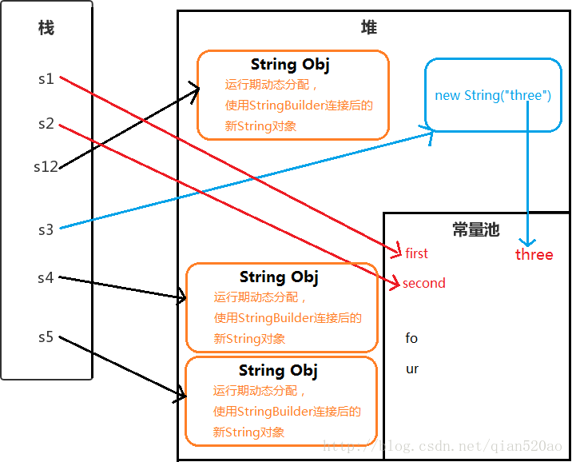

# String

- String 是一个被 final修饰的类（不可继承）
- 其本质是使用final字符数组来存储数据. final字段不可变。但只是该字段指向的数组地址不可变，可以改变数组的值

## 为什么用final

- 安全：作为形参不会被随意改变；作为map键值，有唯一性；不可变对象不能写，多线程环境下是安全的
- 效率高：jsk1.7之后，方法区的字符串常量池移到堆中，节省空间。

## 使用方式

- 使用 ” ” 双引号创建 ： String s1 = “first”;
- 使用字符串连接符拼接 ： String s2=”se”+”cond”;
- 使用字符串加引用拼接 ： String s12=”first”+s2;
- 使用new String(“”)创建 ： String s3 = new String(“three”);
- 使用new String(“”)拼接 ： String s4 = new String(“fo”)+”ur”;
- 使用new String(“”)拼接 ： String s5 = new String(“fo”)+new String(“ur”);

 

**解析**
Java 会确保一个字符串常量只有一个拷贝。

- s1 ： ”first” 是字符串常量，在编译期就被确定了，先检查字符串常量池中是否含有”first”字符串,若没有则添加”first”到字符串常量池中，并且直接指向它。所以s1直接指向字符串常量池的”first”对象。
- s2 ： “se”和”cond”也都是字符串常量，当一个字符串由多个字符串常量连接而成时，它自己肯定也是字符串常量，所以s2也同样在编译期就被解析为一个字符串常量，并且s2是常量池中”second”的一个引用。
- s12 ： JVM对于字符串引用，由于在字符串的”+”连接中，有字符串引用存在，而引用的值在程序编译期是无法确定的，即("first"+s2)无法被编译器优化，只有在程序运行期来动态分配使用StringBuilder连接后的新String对象赋给s12。 

(编译器创建一个StringBuilder对象，并调用append()方法，最后调用toString()创建新String对象，以包含修改后的字符串内容)

- s3 ： 用new String() 创建的字符串不是常量，不能在编译期就确定，所以new String() 创建的字符串不放入常量池中，它们有自己的地址空间。 

  但是”three”字符串常量在编译期也会被加入到字符串常量池（如果不存在的话）。

  对于通过new产生一个字符串（假设为”china”）时，会先去常量池中查找是否已经有了”china”对象，如果没有则在常量池中创建一个此字符串对象，然后堆中再创建一个常量池中此”china”对象的拷贝对象。 

- s4 ： 同样不能在编译期确定，但是”fo”和”ur”这两个字符串常量也会添加到字符串常量池中，并且在堆中创建String对象。（字符串常量池并不会存放”four”这个字符串）

- s5 ： 原理同s4。

## 拼接

### 引用拼接

```
public class StringConcat {
    String a = "hello";
    String b = "moto";
    String result = a + b + "2018";
}
```

当Java编译器遇到字符串拼接的时候，会创建一个StringBuilder对象，后面的拼接，实际上是调用StringBuilder对象的append()方法。 
（1）”hello” + “moto”： 首先创建新的StringBuilder对象，使用append()添加”hello”和”moto”; 
（2）append() 拼接”2018”; 
（3）引用result 指向最终生成的String。

因为有字符串引用存在，而引用的值在程序编译期是无法确定的。

“hello”、”moto”和”2018”都会添加到字符串常量池中（如果没有的话），因为它们都是编译期确定的字符串常量，但是最后的”hellomoto2018”并不会添加到字符串常量池。

有兴趣的可以尝试拼接null。即String a=null;

### 字符串常量拼接

但是如果是下面这种拼接情况 ：

```
public class StringConcat {
    String result = "hello" + "moto" + "2018";
}
```

“hello”、”moto”、”2018”都是字符串常量，当一个字符串由多个字符串常量连接而成时，它自己肯定也是字符串常量，所以result也同样在编译期就被解析为一个字符串常量。

### final引用拼接

```
public class StringConcat {
    final String a = "hello";
    final String b = "moto";
    String result = a + b + "2018";
}
```

和引用拼接中唯一不同的是a和b这两个局部变量加了final修饰。 
对于final修饰的局部变量，它在编译时被解析为常量值的一个本地拷贝存储到自己的常量池中或嵌入到它的字节码流中。 

所以此时的(a + b + “2018”)和(“hello” + “moto” + “2018”)效果是一样的。

# 基础介绍

final：不可能有子类

String s1 = "abc"     //创建一个字符串对象在常量池中。

String s2 = new String("abc")

1：s1是一个类类型变量。“abc”是一个对象

2：对象（"abc"）一旦初始化就不可以被改变，即“abc”的对象内容是不会变的

3：s1 == s2 : 返回false，因为比较的是地址值，这是两个不同的对象

4：s1在内存中有一个对象，s2在内存中有两个对象

## 方法

### 1，获取

​	1.1 获取字符串中字符的个数(长度).
	  	int length();
	1.2 根据位置获取字符。
	  	char charAt(int index);
	1.3 根据字符获取在字符串中的第一次出现的位置.
	  	int indexOf(int ch)
	 	int indexOf(int ch,int fromIndex):从指定位置进行ch的查找第一次出现位置 
		int indexOf(String str);
		int indexOf(String str,int fromIndex);根据字符串获取在字符串中的第一次出现的位置.
		int lastIndexOf(int ch)
		int lastIndexOf(int ch,int fromIndex):从指定位置进行ch的查找第一次出现位置 
	  	int lastIndexOf(String str);
	  	int lastIndexOf(String str,int fromIndex);
	1.4 获取字符串中一部分字符串。也叫子串.
		String substring(int beginIndex, int endIndex)//包含begin 不包含end 。
		String substring(int beginIndex);

### 2，转换

​	2.1 将字符串变成字符串数组(字符串的切割)
		  String[]  split(String regex):涉及到正则表达式.
	2.2 将字符串变成字符数组。
		  char[] toCharArray();
	2.3 将字符串变成字节数组。
		  byte[] getBytes();
	2.4 将字符串中的字母转成大小写。
		  String toUpperCase():大写
		  String toLowerCase():小写
	2.5  将字符串中的内容进行替换
		 String replace(char oldch,char newch);
		 String replace(String s1,String s2);
	2.6 将字符串两端的空格去除。
		  String trim();
	2.7 将字符串进行连接 。
		 String concat(string);

------------------------------------------------------------------------------------------------

​	2.1 将字符数组转换成字符串

​	构造函数：String(char[])

​			   String(char[], offset, count)  字符数组一部分转换成字符串

​	静态方法：static String copyValueOf(char[])

​			    static String copyValueOf(char[],offset, count)

​			     static String valueOf(char[])

​	2.2 将字符串转换成字符数据

​		char[]  toCharArray()

​	2.3 将字节数组转换成字符串

​		String(byte[])

​     	        String(byte[], offset, count) 

​	2.4 将字符串转换成字节数组串	

​		byte[]  getBytes()

​	2.5 将基本数据类型转换成字符串

​		static String valueOf(int)

​		static  String valueOf(double)

​	字符串和字节数组的转换过程中，可以指定编码表

### 3，判断

​	3.0 字符串是否有内容

​		boolean isEmpty() .  就是判断length 是否为0

​	3.1 两个字符串内容是否相同
		 boolean equals(Object obj);
		 boolean equalsIgnoreCase(string str);忽略大写比较字符串内容。
	3.2 字符串中是否包含指定字符串？

​		contains, indexof : 都可以判断字符串是否存在

​		  boolean contains(string str);    //stringbuffer也可以，定义的参数是实现charsequence的类

​		  indexof(str) //索引str第一次位置，-1表示不存在

​		只判断：contains

​		判断的同时取得位置：

```
int n = s.indexof(s1)
if(n == -1)
```

​	3.3 字符串是否以指定字符串开头。是否以指定字符串结尾。
		  boolean startsWith(string);
		  boolean endsWith(string);	

​	3.4 判断字符串内容是否相同，覆写了object类的equals

​		boolean equals(str);

​	3.4 判断字符串内容是否相同，忽略大小写

​		boolean  equalsIngoreCase();

### 4，比较

### 5，替换

 String replace(oldchar, newchar)	

```
String s = "hello"
String s1 = s.repolace('l','a')
print(s)  //还是hello，因为字符串一旦声明不呢能改，s1是返回了一个新的字符串
print(s1) // heaao
```

### 6，切割

String[]  split(regex);

## 练习

### 1，模拟一个trim功能一致的方法。去除字符串两端的空白 

思路：

1，定义两个变量。

 * 一个变量作为从头开始判断字符串空格的角标。不断++。
 * 一个变量作为从尾开始判断字符串空格的角标。不断--。

2,判断到不是空格为止，取头尾之间的字符串即可。

```
public class StringTest_4 {
  public static void main(String[] args) {
  	String s = "    ab   c     ";
  	s = myTrim(s);
  	System.out.println("-" + s + "-");
  }

public static String myTrim(String s) {
	int start = 0, end = s.length() - 1;
	while (start <= end && s.charAt(start) == ' ') {
		start++;
	}
	while (start <= end && s.charAt(end) == ' ') {
		end--;
	}
	return s.substring(start, end + 1);
}
```
### 2，将字符串反转

思路：

1，将字符串变成数组

2，对数组翻转

4：将数组变成字符串

```
char[] cha = a.toCharrArray()
reverse(cha)
return new Sting(cha);

public static void reverse(char[] arr)
{
	for(int start=0,end = arr.length-1; start<end;start++,end--)
    {
    	swap(arr, start, end);
	}
}
public static void swap(cha[] arr,int x,int y)
{
	char temp = arr[x];
    arr[x] = arr[y];
    arr[y] = temp;
}
```

指定位置反转，思路一样，还是三步走(包含头，尾)

```
public static void reverse(char[] arr，int x, int y)
{
	for(int start=x, end=y; start<end;start++,end--)
    {
    	swap(arr, start, end);
	}
}
public static void swap(cha[] arr,int x,int y)
{
	char temp = arr[x];
    arr[x] = arr[y];
    arr[y] = temp;
}
```

指定位置反转，思路一样，还是三步走(包含头，不包含尾)

`	for(int start=x, end=y-1; start<end;start++,end--)`

### 3，一个子串在整串中出现的次数。

思路：

1，要找的子串是否存在，如果存在获取其出现的位置。这个可以使用indexOf完成。

2，如果找到了，那么就记录出现的位置并在剩余的字符串中继续查找该子串，

​	而剩余字符串的起始位是出现位置+子串的长度.

3,以此类推，通过循环完成查找，如果找不到就是-1，并对 每次找到用计数器记录。 

	// 获取子串在整串中出现的次数。
	public static int getKeyStringCount(String str, String key) {
		//1,定义计数器。 
		int count = 0;
		//2，定义变量记录key出现的位置。
		int index = 0;
		
		while((index = str.indexOf(key))!=-1){
			str = str.substring(index+key.length());
			count++;
		}
		return count;
	}
	
	// 第二种方式，避免产生太多字符串
	public static int getKeyStringCount_2(String str, String key) {
		int count = 0;
		int index = 0;
		
		while((index = str.indexOf(key,index))!=-1){
			index = index + key.length();
			count++;
		}
		return count;
	}
	
	// 如果string = "kkaakkakk", key = “kk”， 返回结果会是4，因为第一个kk切割完最前面是个空串，所以数组长度是4
	// count = string.split(key)

### 4，两个字符串中最大相同的子串

1，既然取得是最大子串，先看短的那个字符串是否在长的那个字符串中。

如果存在，短的那个字符串就是最大子串。

2，如果不是呢，那么就将短的那个子串进行长度递减的方式取子串，去长串中判断是否存在。（长度递减的方式：取子串为:头--(尾-1)，然后头,尾指针都后移直到尾到末尾）

如果存在就已找到，就不用在找了。

```
public static String getMaxSubstring(String s1, String s2) {
		String max = null,min = null;
		max = (s1.length()>s2.length())?s1:s2;		
		min = max.equals(s1)?s2:s1;
		
		for (int i = 0; i < min.length(); i++) {			
			for(int a = 0,b = min.length()-i; b != min.length()+1; a++,b++){
				String sub = min.substring(a, b);
				if(max.contains(sub))
					return sub;
			}
		}
		return null;
}
```

