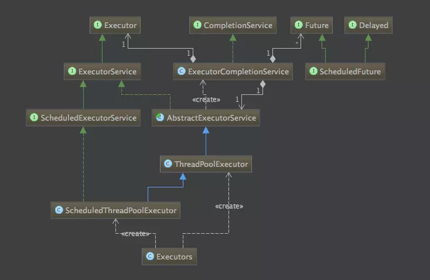
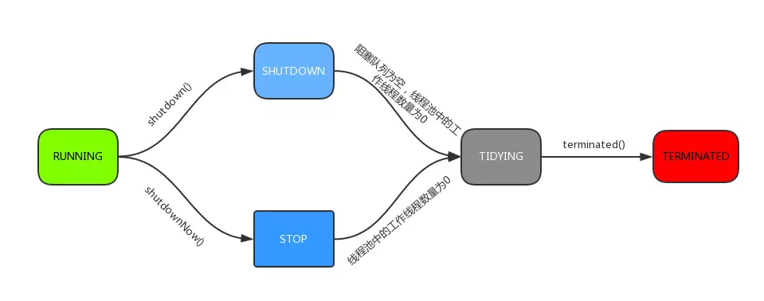
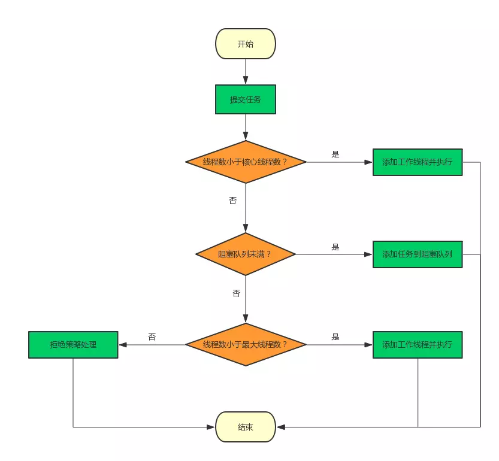
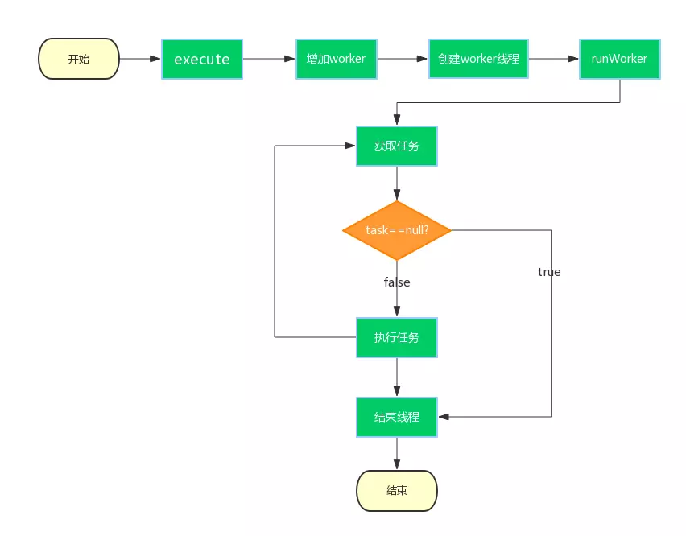
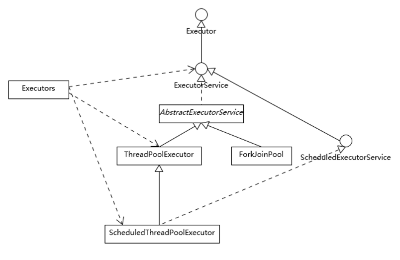
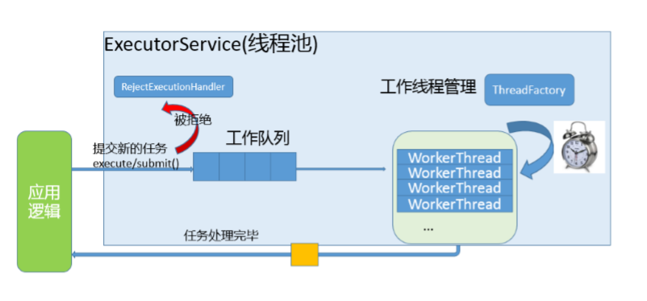
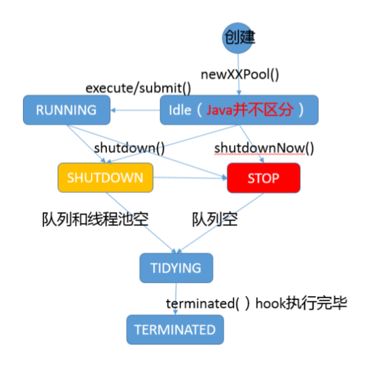
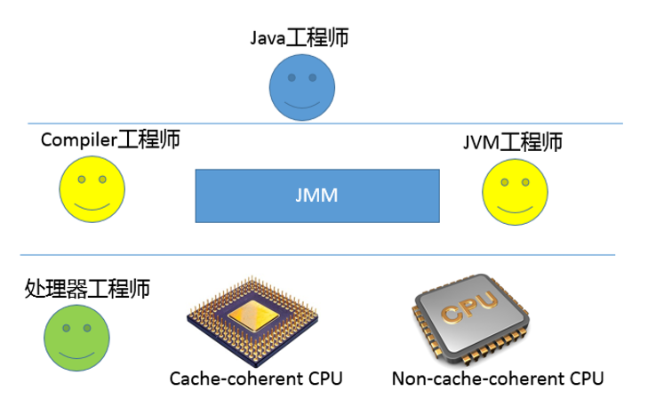
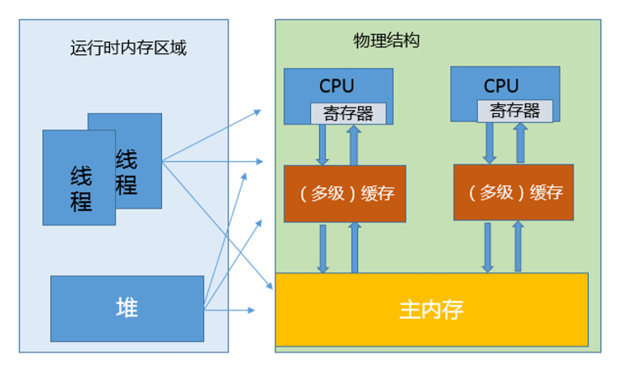

# 一：线程池介绍

# Semaphore

在web开发中，服务器需要接受并处理请求，所以会为一个请求来分配一个线程来进行处理。如果每次请求都新创建一个线程的话实现起来非常简便，但是存在一个问题：

**如果并发的请求数量非常多，但每个线程执行的时间很短，这样就会频繁的创建和销毁线程，如此一来会大大降低系统的效率。可能出现服务器在为每个请求创建新线程和销毁线程上花费的时间和消耗的系统资源要比处理实际的用户请求的时间和资源更多。**

那么有没有一种办法使执行完一个任务，并不被销毁，而是可以继续执行其他的任务呢？

这就是线程池的目的了。线程池为线程生命周期的开销和资源不足问题提供了解决方案。通过对多个任务重用线程，线程创建的开销被分摊到了多个任务上。

**什么时候使用线程池？**

- 单个任务处理时间比较短
- 需要处理的任务数量很大

**使用线程池的好处**

引用自 [http://ifeve.com/java-threadpool/](https://link.jianshu.com?t=http://ifeve.com/java-threadpool/) 的说明：

- 降低资源消耗。通过重复利用已创建的线程降低线程创建和销毁造成的消耗。
- 提高响应速度。当任务到达时，任务可以不需要的等到线程创建就能立即执行。
- 提高线程的可管理性。线程是稀缺资源，如果无限制的创建，不仅会消耗系统资源，还会降低系统的稳定性，使用线程池可以进行统一的分配，调优和监控。

Java中的线程池是用ThreadPoolExecutor类来实现的. 本文就结合JDK 1.8对该类的源码来分析一下这个类内部对于线程的创建, 管理以及后台任务的调度等方面的执行原理。

先看一下线程池的类图：

 

# Executor框架接口

Executor框架是一个根据一组执行策略调用，调度，执行和控制的异步任务的框架，目的是提供一种将”任务提交”与”任务如何运行”分离开来的机制。

J.U.C中有三个Executor接口：

-  **Executor**：一个运行新任务的简单接口；
-  **ExecutorService**：扩展了Executor接口。添加了一些用来管理执行器生命周期和任务生命周期的方法；
-  **ScheduledExecutorService**：扩展了ExecutorService。支持Future和定期执行任务。

## Executor接口

```
public interface Executor {
    void execute(Runnable command);
}
```

Executor接口只有一个execute方法，用来替代通常创建或启动线程的方法。例如，使用Thread来创建并启动线程的代码如下：

```
Thread t = new Thread();
t.start();
```

使用Executor来启动线程执行任务的代码如下：

```
Thread t = new Thread();
executor.execute(t);
```

对于不同的Executor实现，execute()方法可能是创建一个新线程并立即启动，也有可能是使用已有的工作线程来运行传入的任务，也可能是根据设置线程池的容量或者阻塞队列的容量来决定是否要将传入的线程放入阻塞队列中或者拒绝接收传入的线程。

## ExecutorService接口

ExecutorService接口继承自Executor接口，提供了管理终止的方法，以及可为跟踪一个或多个异步任务执行状况而生成 Future 的方法。增加了shutDown()，shutDownNow()，invokeAll()，invokeAny()和submit()等方法。如果需要支持即时关闭，也就是shutDownNow()方法，则任务需要正确处理中断。

## ScheduledExecutorService接口

ScheduledExecutorService扩展ExecutorService接口并增加了schedule方法。调用schedule方法可以在指定的延时后执行一个Runnable或者Callable任务。ScheduledExecutorService接口还定义了按照指定时间间隔定期执行任务的scheduleAtFixedRate()方法和scheduleWithFixedDelay()方法。

# ThreadPoolExecutor分析

ThreadPoolExecutor继承自AbstractExecutorService，也是实现了ExecutorService接口。

## 几个重要的字段

```
private final AtomicInteger ctl = new AtomicInteger(ctlOf(RUNNING, 0));
private static final int COUNT_BITS = Integer.SIZE - 3;
private static final int CAPACITY   = (1 << COUNT_BITS) - 1;

// runState is stored in the high-order bits
private static final int RUNNING    = -1 << COUNT_BITS;
private static final int SHUTDOWN   =  0 << COUNT_BITS;
private static final int STOP       =  1 << COUNT_BITS;
private static final int TIDYING    =  2 << COUNT_BITS;
private static final int TERMINATED =  3 << COUNT_BITS;
```

`ctl`是对线程池的运行状态和线程池中有效线程的数量进行控制的一个字段， 它包含两部分的信息: 线程池的运行状态 (runState) 和线程池内有效线程的数量 (workerCount)，这里可以看到，使用了Integer类型来保存，高3位保存runState，低29位保存workerCount。COUNT_BITS 就是29，CAPACITY就是1左移29位减1（29个1），这个常量表示workerCount的上限值，大约是5亿。

下面再介绍下线程池的运行状态. 线程池一共有五种状态, 分别是:

1. **RUNNING **：能接受新提交的任务，并且也能处理阻塞队列中的任务；
2.  **SHUTDOWN**：关闭状态，不再接受新提交的任务，但却可以继续处理阻塞队列中已保存的任务。在线程池处于 RUNNING 状态时，调用 shutdown()方法会使线程池进入到该状态。（finalize() 方法在执行过程中也会调用shutdown()方法进入该状态）；
3.  **STOP**：不能接受新任务，也不处理队列中的任务，会中断正在处理任务的线程。在线程池处于 RUNNING 或 SHUTDOWN 状态时，调用 shutdownNow() 方法会使线程池进入到该状态；
4.  **TIDYING**：如果所有的任务都已终止了，workerCount (有效线程数) 为0，线程池进入该状态后会调用 terminated() 方法进入TERMINATED 状态。
5.  **TERMINATED**：在terminated() 方法执行完后进入该状态，默认terminated()方法中什么也没有做。
    进入TERMINATED的条件如下：

- 线程池不是RUNNING状态；
- 线程池状态不是TIDYING状态或TERMINATED状态；
- 如果线程池状态是SHUTDOWN并且workerQueue为空；
- workerCount为0；
- 设置TIDYING状态成功。

下图为线程池的状态转换过程：

 

## ctl相关方法

这里还有几个对ctl进行计算的方法：

```
private static int runStateOf(int c)     { return c & ~CAPACITY; }
private static int workerCountOf(int c)  { return c & CAPACITY; }
private static int ctlOf(int rs, int wc) { return rs | wc; }
```

-  **runStateOf**：获取运行状态；
-  **workerCountOf**：获取活动线程数；
-  **ctlOf**：获取运行状态和活动线程数的值。

## ThreadPoolExecutor构造方法

```
public ThreadPoolExecutor(int corePoolSize,
                          int maximumPoolSize,
                          long keepAliveTime,
                          TimeUnit unit,
                          BlockingQueue<Runnable> workQueue,
                          ThreadFactory threadFactory,
                          RejectedExecutionHandler handler) {
    if (corePoolSize < 0 ||
        maximumPoolSize <= 0 ||
        maximumPoolSize < corePoolSize ||
        keepAliveTime < 0)
        throw new IllegalArgumentException();
    if (workQueue == null || threadFactory == null || handler == null)
        throw new NullPointerException();
    this.corePoolSize = corePoolSize;
    this.maximumPoolSize = maximumPoolSize;
    this.workQueue = workQueue;
    this.keepAliveTime = unit.toNanos(keepAliveTime);
    this.threadFactory = threadFactory;
    this.handler = handler;
}
```

构造方法中的字段含义如下：

- **corePoolSize**：核心线程数量，当有新任务在execute()方法提交时，会执行以下判断：

  1. 如果运行的线程少于 corePoolSize，则创建新线程来处理任务，即使线程池中的其他线程是空闲的；
  2. 如果线程池中的线程数量大于等于 corePoolSize 且小于 maximumPoolSize，则只有当workQueue满时才创建新的线程去处理任务；
  3. 如果设置的corePoolSize 和 maximumPoolSize相同，则创建的线程池的大小是固定的，这时如果有新任务提交，若workQueue未满，则将请求放入workQueue中，等待有空闲的线程去从workQueue中取任务并处理；
  4. 如果运行的线程数量大于等于maximumPoolSize，这时如果workQueue已经满了，则通过handler所指定的策略来处理任务；

  所以，任务提交时，判断的顺序为 corePoolSize --> workQueue --> maximumPoolSize。

- **maximumPoolSize**：最大线程数量；

- **workQueue**：等待队列，当任务提交时，如果线程池中的线程数量大于等于corePoolSize的时候，把该任务封装成一个Worker对象放入等待队列；

- **workQueue**：保存等待执行的任务的阻塞队列，当提交一个新的任务到线程池以后, 线程池会根据当前线程池中正在运行着的线程的数量来决定对该任务的处理方式，主要有以下几种处理方式:

  1.  **直接切换**：这种方式常用的队列是SynchronousQueue，但现在还没有研究过该队列，这里暂时还没法介绍；
  2.  **使用无界队列**：一般使用基于链表的阻塞队列LinkedBlockingQueue。如果使用这种方式，那么线程池中能够创建的最大线程数就是corePoolSize，而maximumPoolSize就不会起作用了（后面也会说到）。当线程池中所有的核心线程都是RUNNING状态时，这时一个新的任务提交就会放入等待队列中。
  3.  **使用有界队列**：一般使用ArrayBlockingQueue。使用该方式可以将线程池的最大线程数量限制为maximumPoolSize，这样能够降低资源的消耗，但同时这种方式也使得线程池对线程的调度变得更困难，因为线程池和队列的容量都是有限的值，所以要想使线程池处理任务的吞吐率达到一个相对合理的范围，又想使线程调度相对简单，并且还要尽可能的降低线程池对资源的消耗，就需要合理的设置这两个数量。

  - 如果要想降低系统资源的消耗（包括CPU的使用率，操作系统资源的消耗，上下文环境切换的开销等）, 可以设置较大的队列容量和较小的线程池容量, 但这样也会降低线程处理任务的吞吐量。
  - 如果提交的任务经常发生阻塞，那么可以考虑通过调用 setMaximumPoolSize() 方法来重新设定线程池的容量。
  - 如果队列的容量设置的较小，通常需要将线程池的容量设置大一点，这样CPU的使用率会相对的高一些。但如果线程池的容量设置的过大，则在提交的任务数量太多的情况下，并发量会增加，那么线程之间的调度就是一个要考虑的问题，因为这样反而有可能降低处理任务的吞吐量。

- **keepAliveTime**：线程池维护线程所允许的空闲时间。当线程池中的线程数量大于corePoolSize的时候，如果这时没有新的任务提交，核心线程外的线程不会立即销毁，而是会等待，直到等待的时间超过了keepAliveTime；

- **threadFactory**：它是ThreadFactory类型的变量，用来创建新线程。默认使用Executors.defaultThreadFactory() 来创建线程。使用默认的ThreadFactory来创建线程时，会使新创建的线程具有相同的NORM_PRIORITY优先级并且是非守护线程，同时也设置了线程的名称。

- **handler**：它是RejectedExecutionHandler类型的变量，表示线程池的饱和策略。如果阻塞队列满了并且没有空闲的线程，这时如果继续提交任务，就需要采取一种策略处理该任务。线程池提供了4种策略：

  1. AbortPolicy：直接抛出异常，这是默认策略；
  2. CallerRunsPolicy：用调用者所在的线程来执行任务；
  3. DiscardOldestPolicy：丢弃阻塞队列中靠最前的任务，并执行当前任务；
  4. DiscardPolicy：直接丢弃任务；

## execute方法：提交任务

execute()方法用来提交任务，代码如下：

```java
public void execute(Runnable command) {
    if (command == null)
        throw new NullPointerException();
    /*
     * clt记录着runState和workerCount
     */
    int c = ctl.get();
    /*
     * workerCountOf方法取出低29位的值，表示当前活动的线程数；
     * 如果当前活动线程数小于corePoolSize，则新建一个线程放入线程池中；
     * 并把任务添加到该线程中。
     */
    if (workerCountOf(c) < corePoolSize) {
        /*
         * addWorker中的第二个参数表示限制添加线程的数量是根据corePoolSize来判断还是maximumPoolSize来判断；
         * 如果为true，根据corePoolSize来判断；
         * 如果为false，则根据maximumPoolSize来判断
         */
        if (addWorker(command, true))
            return;
        /*
         * 如果添加失败，则重新获取ctl值
         */
        c = ctl.get();
    }
    /*
     * 如果当前线程池是运行状态并且任务添加到队列成功
     */
    if (isRunning(c) && workQueue.offer(command)) {
        // 重新获取ctl值
        int recheck = ctl.get();
        // 再次判断线程池的运行状态，如果不是运行状态，由于之前已经把command添加到workQueue中了，
        // 这时需要移除该command
        // 执行过后通过handler使用拒绝策略对该任务进行处理，整个方法返回
        if (! isRunning(recheck) && remove(command))
            reject(command);
        /*
         * 获取线程池中的有效线程数，如果数量是0，则执行addWorker方法
         * 这里传入的参数表示：
         * 1. 第一个参数为null，表示在线程池中创建一个线程，但不去启动；
         * 2. 第二个参数为false，将线程池的有限线程数量的上限设置为maximumPoolSize，添加线程时根据maximumPoolSize来判断；
         * 如果判断workerCount大于0，则直接返回，在workQueue中新增的command会在将来的某个时刻被执行。
         */
        else if (workerCountOf(recheck) == 0)
            addWorker(null, false);
    }
    /*
     * 如果执行到这里，有两种情况：
     * 1. 线程池已经不是RUNNING状态；
     * 2. 线程池是RUNNING状态，但workerCount >= corePoolSize并且workQueue已满。
     * 这时，再次调用addWorker方法，但第二个参数传入为false，将线程池的有限线程数量的上限设置为maximumPoolSize；
     * 如果失败则拒绝该任务
     */
    else if (!addWorker(command, false))
        reject(command);
}
```

简单来说，在执行execute()方法时如果状态一直是RUNNING时，的执行过程如下：

1. 如果`workerCount < corePoolSize`，则创建并启动一个线程来执行新提交的任务；
2. 如果`workerCount >= corePoolSize`，且线程池内的阻塞队列未满，则将任务添加到该阻塞队列中；
3. 如果`workerCount >= corePoolSize && workerCount < maximumPoolSize`，且线程池内的阻塞队列已满，则创建并启动一个线程来执行新提交的任务；
4. 如果`workerCount >= maximumPoolSize`，并且线程池内的阻塞队列已满, 则根据拒绝策略来处理该任务, 默认的处理方式是直接抛异常。

这里要注意一下`addWorker(null, false);`，也就是创建一个线程，但并没有传入任务，因为任务已经被添加到workQueue中了，所以worker在执行的时候，会直接从workQueue中获取任务。所以，在`workerCountOf(recheck) == 0`时执行`addWorker(null, false);`也是为了保证线程池在RUNNING状态下必须要有一个线程来执行任务。

execute方法执行流程如下：

 

### addWorker方法：线程池中创建一个新的线程并执行

addWorker方法的主要工作是在线程池中创建一个新的线程并执行，firstTask参数用于指定新增的线程执行的第一个任务，core参数为true表示在新增线程时会判断当前活动线程数是否少于corePoolSize，false表示新增线程前需要判断当前活动线程数是否少于maximumPoolSize，代码如下：

```java
private boolean addWorker(Runnable firstTask, boolean core) {
    retry:
    for (;;) {
        int c = ctl.get();
        // 获取运行状态
        int rs = runStateOf(c);
        
        /*
         * 这个if判断
         * 如果rs >= SHUTDOWN，则表示此时不再接收新任务；
         * 接着判断以下3个条件，只要有1个不满足，则返回false：
         * 1. rs == SHUTDOWN，这时表示关闭状态，不再接受新提交的任务，但却可以继续处理阻塞队列中已保存的任务
         * 2. firsTask为空
         * 3. 阻塞队列不为空
         * 
         * 首先考虑rs == SHUTDOWN的情况
         * 这种情况下不会接受新提交的任务，所以在firstTask不为空的时候会返回false；
         * 然后，如果firstTask为空，并且workQueue也为空，则返回false，
         * 因为队列中已经没有任务了，不需要再添加线程了
         */
        // Check if queue empty only if necessary.
        if (rs >= SHUTDOWN &&
            ! (rs == SHUTDOWN &&
               firstTask == null &&
               ! workQueue.isEmpty()))
            return false;

        for (;;) {
            // 获取线程数
            int wc = workerCountOf(c);
            // 如果wc超过CAPACITY，也就是ctl的低29位的最大值（二进制是29个1），返回false；
            // 这里的core是addWorker方法的第二个参数，如果为true表示根据corePoolSize来比较，
            // 如果为false则根据maximumPoolSize来比较。
            // 
            if (wc >= CAPACITY ||
                wc >= (core ? corePoolSize : maximumPoolSize))
                return false;
            // 尝试增加workerCount，如果成功，则跳出第一个for循环
            if (compareAndIncrementWorkerCount(c))
                break retry;
            // 如果增加workerCount失败，则重新获取ctl的值
            c = ctl.get();  // Re-read ctl
            // 如果当前的运行状态不等于rs，说明状态已被改变，返回第一个for循环继续执行
            if (runStateOf(c) != rs)
                continue retry;
            // else CAS failed due to workerCount change; retry inner loop
        }
    }

    boolean workerStarted = false;
    boolean workerAdded = false;
    Worker w = null;
    try {
        // 根据firstTask来创建Worker对象
        w = new Worker(firstTask);
        // 每一个Worker对象都会创建一个线程
        final Thread t = w.thread;
        if (t != null) {
            final ReentrantLock mainLock = this.mainLock;
            mainLock.lock();
            try {
                // Recheck while holding lock.
                // Back out on ThreadFactory failure or if
                // shut down before lock acquired.
                int rs = runStateOf(ctl.get());
                // rs < SHUTDOWN表示是RUNNING状态；
                // 如果rs是RUNNING状态或者rs是SHUTDOWN状态并且firstTask为null，向线程池中添加线程。
                // 因为在SHUTDOWN时不会在添加新的任务，但还是会执行workQueue中的任务
                if (rs < SHUTDOWN ||
                    (rs == SHUTDOWN && firstTask == null)) {
                    if (t.isAlive()) // precheck that t is startable
                        throw new IllegalThreadStateException();
                    // workers是一个HashSet
                    workers.add(w);
                    int s = workers.size();
                    // largestPoolSize记录着线程池中出现过的最大线程数量
                    if (s > largestPoolSize)
                        largestPoolSize = s;
                    workerAdded = true;
                }
            } finally {
                mainLock.unlock();
            }
            if (workerAdded) {
                // 启动线程
                t.start();
                workerStarted = true;
            }
        }
    } finally {
        if (! workerStarted)
            addWorkerFailed(w);
    }
    return workerStarted;
}
```

注意一下这里的`t.start()`这个语句，启动时会调用Worker类中的run方法，Worker本身实现了Runnable接口，所以一个Worker类型的对象也是一个线程。

### Worker类

线程池中的每一个线程被封装成一个Worker对象，ThreadPool维护的其实就是一组Worker对象，看一下Worker的定义：

```
private final class Worker
        extends AbstractQueuedSynchronizer
        implements Runnable
{
    /**
     * This class will never be serialized, but we provide a
     * serialVersionUID to suppress a javac warning.
     */
    private static final long serialVersionUID = 6138294804551838833L;

    /** Thread this worker is running in.  Null if factory fails. */
    final Thread thread;
    /** Initial task to run.  Possibly null. */
    Runnable firstTask;
    /** Per-thread task counter */
    volatile long completedTasks;

    /**
     * Creates with given first task and thread from ThreadFactory.
     * @param firstTask the first task (null if none)
     */
    Worker(Runnable firstTask) {
        setState(-1); // inhibit interrupts until runWorker
        this.firstTask = firstTask;
        this.thread = getThreadFactory().newThread(this);
    }

    /** Delegates main run loop to outer runWorker  */
    public void run() {
        runWorker(this);
    }

    // Lock methods
    //
    // The value 0 represents the unlocked state.
    // The value 1 represents the locked state.

    protected boolean isHeldExclusively() {
        return getState() != 0;
    }

    protected boolean tryAcquire(int unused) {
        if (compareAndSetState(0, 1)) {
            setExclusiveOwnerThread(Thread.currentThread());
            return true;
        }
        return false;
    }

    protected boolean tryRelease(int unused) {
        setExclusiveOwnerThread(null);
        setState(0);
        return true;
    }

    public void lock()        { acquire(1); }
    public boolean tryLock()  { return tryAcquire(1); }
    public void unlock()      { release(1); }
    public boolean isLocked() { return isHeldExclusively(); }

    void interruptIfStarted() {
        Thread t;
        if (getState() >= 0 && (t = thread) != null && !t.isInterrupted()) {
            try {
                t.interrupt();
            } catch (SecurityException ignore) {
            }
        }
    }
}
```

Worker类继承了AQS，并实现了Runnable接口，注意其中的firstTask和thread属性：firstTask用它来保存传入的任务；thread是在调用构造方法时通过ThreadFactory来创建的线程，是用来处理任务的线程。

在调用构造方法时，需要把任务传入，这里通过`getThreadFactory().newThread(this);`来新建一个线程，newThread方法传入的参数是this，因为Worker本身继承了Runnable接口，也就是一个线程，所以一个Worker对象在启动的时候会调用Worker类中的run方法。

Worker继承了AQS，使用AQS来实现独占锁的功能。为什么不使用ReentrantLock来实现呢？可以看到tryAcquire方法，它是不允许重入的，而ReentrantLock是允许重入的：

1. lock方法一旦获取了独占锁，表示当前线程正在执行任务中；
2. 如果正在执行任务，则不应该中断线程；
3. 如果该线程现在不是独占锁的状态，也就是空闲的状态，说明它没有在处理任务，这时可以对该线程进行中断；
4. 线程池在执行shutdown方法或tryTerminate方法时会调用interruptIdleWorkers方法来中断空闲的线程，interruptIdleWorkers方法会使用tryLock方法来判断线程池中的线程是否是空闲状态；
5. 之所以设置为不可重入，是因为我们不希望任务在调用像setCorePoolSize这样的线程池控制方法时重新获取锁。如果使用ReentrantLock，它是可重入的，这样如果在任务中调用了如setCorePoolSize这类线程池控制的方法，会中断正在运行的线程。

所以，Worker继承自AQS，用于判断线程是否空闲以及是否可以被中断。

此外，在构造方法中执行了`setState(-1);`，把state变量设置为-1，为什么这么做呢？是因为AQS中默认的state是0，如果刚创建了一个Worker对象，还没有执行任务时，这时就不应该被中断，看一下tryAquire方法：

```
protected boolean tryAcquire(int unused) {
    if (compareAndSetState(0, 1)) {
        setExclusiveOwnerThread(Thread.currentThread());
        return true;
    }
    return false;
}
```

tryAcquire方法是根据state是否是0来判断的，所以，`setState(-1);`将state设置为-1是为了禁止在执行任务前对线程进行中断。

正因为如此，在runWorker方法中会先调用Worker对象的unlock方法将state设置为0.

### runWorker方法

在Worker类中的run方法调用了runWorker方法来执行任务，runWorker方法的代码如下：

```
final void runWorker(Worker w) {
    Thread wt = Thread.currentThread();
    // 获取第一个任务
    Runnable task = w.firstTask;
    w.firstTask = null;
    // 允许中断
    w.unlock(); // allow interrupts
    // 是否因为异常退出循环
    boolean completedAbruptly = true;
    try {
        // 如果task为空，则通过getTask来获取任务
        while (task != null || (task = getTask()) != null) {
            w.lock();
            // If pool is stopping, ensure thread is interrupted;
            // if not, ensure thread is not interrupted.  This
            // requires a recheck in second case to deal with
            // shutdownNow race while clearing interrupt
            if ((runStateAtLeast(ctl.get(), STOP) ||
                 (Thread.interrupted() &&
                  runStateAtLeast(ctl.get(), STOP))) &&
                !wt.isInterrupted())
                wt.interrupt();
            try {
                beforeExecute(wt, task);
                Throwable thrown = null;
                try {
                    task.run();
                } catch (RuntimeException x) {
                    thrown = x; throw x;
                } catch (Error x) {
                    thrown = x; throw x;
                } catch (Throwable x) {
                    thrown = x; throw new Error(x);
                } finally {
                    afterExecute(task, thrown);
                }
            } finally {
                task = null;
                w.completedTasks++;
                w.unlock();
            }
        }
        completedAbruptly = false;
    } finally {
        processWorkerExit(w, completedAbruptly);
    }
}
```

这里说明一下第一个if判断，目的是：

- 如果线程池正在停止，那么要保证当前线程是中断状态；
- 如果不是的话，则要保证当前线程不是中断状态；

这里要考虑在执行该if语句期间可能也执行了shutdownNow方法，shutdownNow方法会把状态设置为STOP，回顾一下STOP状态：

> 不能接受新任务，也不处理队列中的任务，会中断正在处理任务的线程。在线程池处于 RUNNING 或 SHUTDOWN 状态时，调用 shutdownNow() 方法会使线程池进入到该状态。

STOP状态要中断线程池中的所有线程，而这里使用`Thread.interrupted()`来判断是否中断是为了确保在RUNNING或者SHUTDOWN状态时线程是非中断状态的，因为Thread.interrupted()方法会复位中断的状态。

总结一下runWorker方法的执行过程：

1. while循环不断地通过getTask()方法获取任务；
2. getTask()方法从阻塞队列中取任务；
3. 如果线程池正在停止，那么要保证当前线程是中断状态，否则要保证当前线程不是中断状态；
4. 调用`task.run()`执行任务；
5. 如果task为null则跳出循环，执行processWorkerExit()方法；
6. runWorker方法执行完毕，也代表着Worker中的run方法执行完毕，销毁线程。

这里的beforeExecute方法和afterExecute方法在ThreadPoolExecutor类中是空的，留给子类来实现。

completedAbruptly变量来表示在执行任务过程中是否出现了异常，在processWorkerExit方法中会对该变量的值进行判断。

### getTask方法

getTask方法用来从阻塞队列中取任务，代码如下：

```
private Runnable getTask() {
    // timeOut变量的值表示上次从阻塞队列中取任务时是否超时
    boolean timedOut = false; // Did the last poll() time out?

    for (;;) {
        int c = ctl.get();
        int rs = runStateOf(c);

        // Check if queue empty only if necessary.
        /*
         * 如果线程池状态rs >= SHUTDOWN，也就是非RUNNING状态，再进行以下判断：
         * 1. rs >= STOP，线程池是否正在stop；
         * 2. 阻塞队列是否为空。
         * 如果以上条件满足，则将workerCount减1并返回null。
         * 因为如果当前线程池状态的值是SHUTDOWN或以上时，不允许再向阻塞队列中添加任务。
         */
        if (rs >= SHUTDOWN && (rs >= STOP || workQueue.isEmpty())) {
            decrementWorkerCount();
            return null;
        }

        int wc = workerCountOf(c);

        // Are workers subject to culling?
        // timed变量用于判断是否需要进行超时控制。
        // allowCoreThreadTimeOut默认是false，也就是核心线程不允许进行超时；
        // wc > corePoolSize，表示当前线程池中的线程数量大于核心线程数量；
        // 对于超过核心线程数量的这些线程，需要进行超时控制
        boolean timed = allowCoreThreadTimeOut || wc > corePoolSize;
        
        /*
         * wc > maximumPoolSize的情况是因为可能在此方法执行阶段同时执行了setMaximumPoolSize方法；
         * timed && timedOut 如果为true，表示当前操作需要进行超时控制，并且上次从阻塞队列中获取任务发生了超时
         * 接下来判断，如果有效线程数量大于1，或者阻塞队列是空的，那么尝试将workerCount减1；
         * 如果减1失败，则返回重试。
         * 如果wc == 1时，也就说明当前线程是线程池中唯一的一个线程了。
         */
        if ((wc > maximumPoolSize || (timed && timedOut))
            && (wc > 1 || workQueue.isEmpty())) {
            if (compareAndDecrementWorkerCount(c))
                return null;
            continue;
        }

        try {
            /*
             * 根据timed来判断，如果为true，则通过阻塞队列的poll方法进行超时控制，如果在keepAliveTime时间内没有获取到任务，则返回null；
             * 否则通过take方法，如果这时队列为空，则take方法会阻塞直到队列不为空。
             * 
             */
            Runnable r = timed ?
                workQueue.poll(keepAliveTime, TimeUnit.NANOSECONDS) :
                workQueue.take();
            if (r != null)
                return r;
            // 如果 r == null，说明已经超时，timedOut设置为true
            timedOut = true;
        } catch (InterruptedException retry) {
            // 如果获取任务时当前线程发生了中断，则设置timedOut为false并返回循环重试
            timedOut = false;
        }
    }
}
```

这里重要的地方是第二个if判断，目的是控制线程池的有效线程数量。由上文中的分析可以知道，在执行execute方法时，如果当前线程池的线程数量超过了corePoolSize且小于maximumPoolSize，并且workQueue已满时，则可以增加工作线程，但这时如果超时没有获取到任务，也就是timedOut为true的情况，说明workQueue已经为空了，也就说明了当前线程池中不需要那么多线程来执行任务了，可以把多于corePoolSize数量的线程销毁掉，保持线程数量在corePoolSize即可。

什么时候会销毁？当然是runWorker方法执行完之后，也就是Worker中的run方法执行完，由JVM自动回收。

getTask方法返回null时，在runWorker方法中会跳出while循环，然后会执行processWorkerExit方法。

### processWorkerExit方法

```
private void processWorkerExit(Worker w, boolean completedAbruptly) {
    // 如果completedAbruptly值为true，则说明线程执行时出现了异常，需要将workerCount减1；
    // 如果线程执行时没有出现异常，说明在getTask()方法中已经已经对workerCount进行了减1操作，这里就不必再减了。  
    if (completedAbruptly) // If abrupt, then workerCount wasn't adjusted
        decrementWorkerCount();

    final ReentrantLock mainLock = this.mainLock;
    mainLock.lock();
    try {
        //统计完成的任务数
        completedTaskCount += w.completedTasks;
        // 从workers中移除，也就表示着从线程池中移除了一个工作线程
        workers.remove(w);
    } finally {
        mainLock.unlock();
    }

    // 根据线程池状态进行判断是否结束线程池
    tryTerminate();

    int c = ctl.get();
    /*
     * 当线程池是RUNNING或SHUTDOWN状态时，如果worker是异常结束，那么会直接addWorker；
     * 如果allowCoreThreadTimeOut=true，并且等待队列有任务，至少保留一个worker；
     * 如果allowCoreThreadTimeOut=false，workerCount不少于corePoolSize。
     */
    if (runStateLessThan(c, STOP)) {
        if (!completedAbruptly) {
            int min = allowCoreThreadTimeOut ? 0 : corePoolSize;
            if (min == 0 && ! workQueue.isEmpty())
                min = 1;
            if (workerCountOf(c) >= min)
                return; // replacement not needed
        }
        addWorker(null, false);
    }
}
```

至此，processWorkerExit执行完之后，工作线程被销毁，以上就是整个工作线程的生命周期，从execute方法开始，Worker使用ThreadFactory创建新的工作线程，runWorker通过getTask获取任务，然后执行任务，如果getTask返回null，进入processWorkerExit方法，整个线程结束，如图所示：

 

### tryTerminate方法

tryTerminate方法根据线程池状态进行判断是否结束线程池，代码如下：

```
final void tryTerminate() {
    for (;;) {
        int c = ctl.get();
        /*
         * 当前线程池的状态为以下几种情况时，直接返回：
         * 1. RUNNING，因为还在运行中，不能停止；
         * 2. TIDYING或TERMINATED，因为线程池中已经没有正在运行的线程了；
         * 3. SHUTDOWN并且等待队列非空，这时要执行完workQueue中的task；
         */
        if (isRunning(c) ||
            runStateAtLeast(c, TIDYING) ||
            (runStateOf(c) == SHUTDOWN && ! workQueue.isEmpty()))
            return;
        // 如果线程数量不为0，则中断一个空闲的工作线程，并返回
        if (workerCountOf(c) != 0) { // Eligible to terminate
            interruptIdleWorkers(ONLY_ONE);
            return;
        }

        final ReentrantLock mainLock = this.mainLock;
        mainLock.lock();
        try {
            // 这里尝试设置状态为TIDYING，如果设置成功，则调用terminated方法
            if (ctl.compareAndSet(c, ctlOf(TIDYING, 0))) {
                try {
                    // terminated方法默认什么都不做，留给子类实现
                    terminated();
                } finally {
                    // 设置状态为TERMINATED
                    ctl.set(ctlOf(TERMINATED, 0));
                    termination.signalAll();
                }
                return;
            }
        } finally {
            mainLock.unlock();
        }
        // else retry on failed CAS
    }
}
```

### shutdown方法

shutdown方法要将线程池切换到SHUTDOWN状态，并调用interruptIdleWorkers方法请求中断所有空闲的worker，最后调用tryTerminate尝试结束线程池。

```
public void shutdown() {
    final ReentrantLock mainLock = this.mainLock;
    mainLock.lock();
    try {
        // 安全策略判断
        checkShutdownAccess();
        // 切换状态为SHUTDOWN
        advanceRunState(SHUTDOWN);
        // 中断空闲线程
        interruptIdleWorkers();
        onShutdown(); // hook for ScheduledThreadPoolExecutor
    } finally {
        mainLock.unlock();
    }
    // 尝试结束线程池
    tryTerminate();
}
```

这里思考一个问题：在runWorker方法中，执行任务时对Worker对象w进行了lock操作，为什么要在执行任务的时候对每个工作线程都加锁呢？

下面仔细分析一下：

- 在getTask方法中，如果这时线程池的状态是SHUTDOWN并且workQueue为空，那么就应该返回null来结束这个工作线程，而使线程池进入SHUTDOWN状态需要调用shutdown方法；
- shutdown方法会调用interruptIdleWorkers来中断空闲的线程，interruptIdleWorkers持有mainLock，会遍历workers来逐个判断工作线程是否空闲。但getTask方法中没有mainLock；
- 在getTask中，如果判断当前线程池状态是RUNNING，并且阻塞队列为空，那么会调用`workQueue.take()`进行阻塞；
- 如果在判断当前线程池状态是RUNNING后，这时调用了shutdown方法把状态改为了SHUTDOWN，这时如果不进行中断，那么当前的工作线程在调用了`workQueue.take()`后会一直阻塞而不会被销毁，因为在SHUTDOWN状态下不允许再有新的任务添加到workQueue中，这样一来线程池永远都关闭不了了；
- 由上可知，shutdown方法与getTask方法（从队列中获取任务时）存在竞态条件；
- 解决这一问题就需要用到线程的中断，也就是为什么要用interruptIdleWorkers方法。在调用`workQueue.take()`时，如果发现当前线程在执行之前或者执行期间是中断状态，则会抛出InterruptedException，解除阻塞的状态；
- 但是要中断工作线程，还要判断工作线程是否是空闲的，如果工作线程正在处理任务，就不应该发生中断；
- 所以Worker继承自AQS，在工作线程处理任务时会进行lock，interruptIdleWorkers在进行中断时会使用tryLock来判断该工作线程是否正在处理任务，如果tryLock返回true，说明该工作线程当前未执行任务，这时才可以被中断。

下面就来分析一下interruptIdleWorkers方法。

### interruptIdleWorkers方法

```
private void interruptIdleWorkers() {
    interruptIdleWorkers(false);
}

private void interruptIdleWorkers(boolean onlyOne) {
    final ReentrantLock mainLock = this.mainLock;
    mainLock.lock();
    try {
        for (Worker w : workers) {
            Thread t = w.thread;
            if (!t.isInterrupted() && w.tryLock()) {
                try {
                    t.interrupt();
                } catch (SecurityException ignore) {
                } finally {
                    w.unlock();
                }
            }
            if (onlyOne)
                break;
        }
    } finally {
        mainLock.unlock();
    }
}
```

interruptIdleWorkers遍历workers中所有的工作线程，若线程没有被中断tryLock成功，就中断该线程。

为什么需要持有mainLock？因为workers是HashSet类型的，不能保证线程安全。

### shutdownNow方法

```
public List<Runnable> shutdownNow() {
    List<Runnable> tasks;
    final ReentrantLock mainLock = this.mainLock;
    mainLock.lock();
    try {
        checkShutdownAccess();
        advanceRunState(STOP);
        // 中断所有工作线程，无论是否空闲
        interruptWorkers();
        // 取出队列中没有被执行的任务
        tasks = drainQueue();
    } finally {
        mainLock.unlock();
    }
    tryTerminate();
    return tasks;
}
```

shutdownNow方法与shutdown方法类似，不同的地方在于：

1. 设置状态为STOP；
2. 中断所有工作线程，无论是否是空闲的；
3. 取出阻塞队列中没有被执行的任务并返回。

shutdownNow方法执行完之后调用tryTerminate方法，该方法在上文已经分析过了，目的就是使线程池的状态设置为TERMINATED。

# 线程池的监控

通过线程池提供的参数进行监控。线程池里有一些属性在监控线程池的时候可以使用

-  **getTaskCount**：线程池已经执行的和未执行的任务总数；
-  **getCompletedTaskCount**：线程池已完成的任务数量，该值小于等于taskCount；
-  **getLargestPoolSize**：线程池曾经创建过的最大线程数量。通过这个数据可以知道线程池是否满过，也就是达到了maximumPoolSize；
-  **getPoolSize**：线程池当前的线程数量；
-  **getActiveCount**：当前线程池中正在执行任务的线程数量。

通过这些方法，可以对线程池进行监控，在ThreadPoolExecutor类中提供了几个空方法，如beforeExecute方法，afterExecute方法和terminated方法，可以扩展这些方法在执行前或执行后增加一些新的操作，例如统计线程池的执行任务的时间等，可以继承自ThreadPoolExecutor来进行扩展。

# 二：Java 并发类库提供的线程池有哪几种？ 分别有什么特点？

- 通常都是利用 Executors 提供的通用线程池创建方法，去创建不同配置的线程池

  主要区别在于：**不同的 ExecutorService 类型或者不同的初始参数。**

Executors 目前提供了 5 种不同静态工厂方法去创建线程池：

1. newCachedThreadPool()，它是一种用来处理大量短时间工作任务的线程池.

   **特点：**它会试图缓存线程并重用，当无缓存线程可用时，就会创建新的工作线程；如果线程闲置的时间超过 60 秒，则被终止并移出缓存；长时间闲置时，这种线程池，不会消耗什么资源。其内部使用 SynchronousQueue 作为工作队列。

2. newFixedThreadPool(int nThreads)，重用指定数目（nThreads）的线程，其背后使用的是无界的工作队列，任何时候最多有 nThreads 个工作线程是活动的。这意味着，如果任务数量超过了活动队列数目，将在工作队列中等待空闲线程出现；如果有工作线程退出，将会有新的工作线程被创建，以补足指定的数目 nThreads。

3. newSingleThreadExecutor()，它创建的是个 ScheduledExecutorService，也就是可以进行定时或周期性的工作调度。工作线程数目被限制为 1，所以它保证了所有任务的都是被顺序执行，最多会有一个任务处于活动状态，并且不允许使用者改动线程池实例，因此可以避免其改变线程数目。

4. newScheduledThreadPool(int corePoolSize)，同样是 ScheduledExecutorService，区别 在于它会保持 corePoolSize 个工作线程。

5. newWorkStealingPool(int parallelism)，这是一个经常被人忽略的线程池，Java 8 才加入 这个创建方法，其内部会构建ForkJoinPool，利用Work-Stealing算法，并行地处理任务， 不保证处理顺序。

## **Executor 框架的基本组成**



- Executor 是一个基础的接口，其初衷是将任务提交和任务执行细节解耦，这一点可以体会其 定义的唯一方法。

​      `void execute(Runnable command); `

- ExecutorService 则更加完善，不仅提供 service 的管理功能，比如 shutdown 等方法，也 提供了更加全面的提交任务机制，如返回Future而不是 void 的 submit 方法。

  `<T> Future<T> submit(Callable<T> task); `

- Java 标准类库提供了几种基础实现，比如ThreadPoolExecutor、 ScheduledThreadPoolExecutor、ForkJoinPool。这些线程池的设计特点在于其高度的可调 节性和灵活性，以尽量满足复杂多变的实际应用场景.

## ThreadPoolExecutor介绍：

1. 最基础的 ThreadPoolExecutor
2. ScheduledThreadPoolExecutor是ThreadPoolExecutor的扩展，主要是增加了调度逻辑
3. ForkJoinPool 则是为 ForkJoinTask 定制的线 程池，与通常意义的线程池有所不同。



1. 工作队列负责存储用户提交的各个任务，这个工作队列，可以是容量为 0 的 SynchronousQueue（使用 newCachedThreadPool），也可以是像固定大小线程池 （newFixedThreadPool）那样使用 LinkedBlockingQueue。

​      `private final BlockingQueue<Runnable> workQueue; `

2. 内部的“线程池”，这是指保持工作线程的集合，线程池需要在运行过程中管理线程创建、 销毁。例如，对于带缓存的线程池，当任务压力较大时，线程池会创建新的工作线程；当业 务压力退去，线程池会在闲置一段时间（默认 60 秒）后结束线程。

   `private final HashSet<Worker> workers = new HashSet<>(); `
   线程池的工作线程被抽象为静态内部类 Worker，基于AQS实现。

3. ThreadFactory 提供上面所需要的创建线程逻辑。

4. 如果任务提交时被拒绝，比如线程池已经处于 SHUTDOWN 状态，需要为其提供处理逻辑， Java 标准库提供了类似`ThreadPoolExecutor.AbortPolicy`等默认实现，也可以按照实际需求 自定义。

从上面的分析，可以看出线程池的几个基本组成部分，一起都体现在线程池的构造函数中：

1. corePoolSize，所谓的核心线程数，可以大致理解为长期驻留的线程数目（除非设置了 allowCoreThreadTimeOut）。对于不同的线程池，这个值可能会有很大区别，比如 newFixedThreadPool 会将其设置为 nThreads，而对于 newCachedThreadPool 则是为 0。
2. maximumPoolSize，顾名思义，就是线程不够时能够创建的最大线程数。同样进行对比， 对于 newFixedThreadPool，当然就是 nThreads，因为其要求是固定大小，而 newCachedThreadPool 则是 Integer.MAX_VALUE。
3. keepAliveTime 和 TimeUnit，这两个参数指定了额外的线程能够闲置多久，显然有些线程 池不需要它。
4. workQueue，工作队列，必须是 BlockingQueue。



## 拒绝策略

AbortPolicy：不执行新任务，直接抛出异常，提示线程池已满，线程池默认策略

DiscardPolicy：不执行新任务，也不抛出异常，基本上为静默模式。

DisCardOldSetPolicy：将消息队列中的第一个任务替换为当前新进来的任务执行

CallerRunPolicy：拒绝新任务进入，如果该线程池还没有被关闭，那么这个新的任务在执行线程中被调用）

## 相关问题

1. **避免任务堆积。**newFixedThreadPool 是创建指定数目的线程，但是其工作队列是无界的，如果工作线程数目太少，导致处理跟不上入队的速度，这就很有可能占用大量系统内存，甚至是出现 OOM。诊断时，你可以使用 jmap 之类的工具，查看是否有大量的任 务对象入队。
2. **避免过度扩展线程。**通常在处理大量短时任务时，使用缓存的线程池，比如在最新的 HTTP/2 client API 中，目前的默认实现就是如此。我们在创建线程池的时候，并不能准确预计任务压力有多大、数据特征是什么样子（大部分请求是 1K 、100K 还是 1M 以上？），所 以很难明确设定一个线程数目。
3. **如果线程数目不断增长（可用jstack检查），有可能线程泄漏。** 这种情况往往是因为任务逻辑有问题，导致工作线程迟迟不能被释放。 建议排查下线程栈，很有可能多个线程都是卡在近似的代码处。
4. 避免死锁等同步问题
5. 尽量避免在使用线程池时操作 ThreadLocal，通过今天 的线程池学习，应该更能理解其原因，工作线程的生命周期通常都会超过任务的生命周期。

## 线程池大小的选择策略

1. **如果任务主要是进行计算：**那么 CPU 的处理能力是稀缺的资源。---- 但往往不能通过大量增加线程数提高计算能力 ----  反倒可能导致大量的上 下文切换开销。-----  所以建议线程池大小按照 CPU 核的数目 N 或者 N+1。

2. **如果是需要较多等待的任务：**例如 I/O 操作比较多

   `线程数 = CPU 核数 × （1 + 平均等待时间 / 平均工作时间） `
   这些时间并不能精准预计，需要根据采样或者概要分析等方式进行计算，然后在实际中验证和调整。

3. 不要把解决问题的思路全部指望到调整线程池上，很多时候架构上的改变 更能解决问题，比如利用背压机制的Reactive Stream、合理的拆分等。

# 总结

本文比较详细的分析了线程池的工作流程，总体来说有如下几个内容：

- 分析了线程的创建，任务的提交，状态的转换以及线程池的关闭；
- 这里通过execute方法来展开线程池的工作流程，execute方法通过corePoolSize，maximumPoolSize以及阻塞队列的大小来判断决定传入的任务应该被立即执行，还是应该添加到阻塞队列中，还是应该拒绝任务。
- 介绍了线程池关闭时的过程，也分析了shutdown方法与getTask方法存在竞态条件；
- 在获取任务时，要通过线程池的状态来判断应该结束工作线程还是阻塞线程等待新的任务，也解释了为什么关闭线程池时要中断工作线程以及为什么每一个worker都需要lock。

在向线程池提交任务时，除了execute方法，还有一个submit方法，submit方法会返回一个Future对象用于获取返回值.

#  三：JUC之AQS

## AQS简介

将基础的同步相关操作抽象在 AbstractQueuedSynchronizer 中，利用 AQS 为我们构建同步结构提供了范本。

## AQS 内部数据和方法，可以简单拆分为：

1. 一个 volatile 的整数成员表征状态，同时提供了 setState 和 getState 方法

   `private volatile int state;`

2. 一个先入先出（FIFO）的等待线程队列，以实现多线程间竞争和等待，这是 AQS 机制的核心之一。

3. 各种基于 CAS 的基础操作方法，以及各种期望具体同步结构去实现的 acquire/release 方 法。

利用 AQS 实现一个同步结构，至少要实现两个基本类型的方法，分别是 acquire 操作，获取资 源的独占权；还有就是 release 操作，释放对某个资源的独占。

AQS：AbstractQueuedSynchronizer，即队列同步器。它是构建锁或者其他同步组件的基础框架（如ReentrantLock、ReentrantReadWriteLock、Semaphore等），JUC并发包的作者（**Doug Lea**）期望它能够成为实现大部分同步需求的基础。它是JUC并发包中的核心基础组件。

**AQS主要提供了如下一些方法：**

- getState()：返回同步状态的当前值；
- setState(int newState)：设置当前同步状态；
- compareAndSetState(int expect, int update)：使用CAS设置当前状态，该方法能够保证状态设置的原子性；
- tryAcquire(int arg)：独占式获取同步状态，获取同步状态成功后，其他线程需要等待该线程释放同步状态才能获取同步状态
- tryRelease(int arg)：独占式释放同步状态；
- tryAcquireShared(int arg)：共享式获取同步状态，返回值大于等于0则表示获取成功，否则获取失败；
- tryReleaseShared(int arg)：共享式释放同步状态；
- isHeldExclusively()：当前同步器是否在独占式模式下被线程占用，一般该方法表示是否被当前线程所独占；
- acquire(int arg)：独占式获取同步状态，如果当前线程获取同步状态成功，则由该方法返回，否则，将会进入同步队列等待，该方法将会调用可重写的tryAcquire(int arg)方法；
- acquireInterruptibly(int arg)：与acquire(int arg)相同，但是该方法响应中断，当前线程为获取到同步状态而进入到同步队列中，如果当前线程被中断，则该方法会抛出InterruptedException异常并返回；
- tryAcquireNanos(int arg,long nanos)：超时获取同步状态，如果当前线程在nanos时间内没有获取到同步状态，那么将会返回false，已经获取则返回true；
- acquireShared(int arg)：共享式获取同步状态，如果当前线程未获取到同步状态，将会进入同步队列等待，与独占式的主要区别是在同一时刻可以有多个线程获取到同步状态；
- acquireSharedInterruptibly(int arg)：共享式获取同步状态，响应中断；
- tryAcquireSharedNanos(int arg, long nanosTimeout)：共享式获取同步状态，增加超时限制；
- release(int arg)：独占式释放同步状态，该方法会在释放同步状态之后，将同步队列中第一个节点包含的线程唤醒；
- releaseShared(int arg)：共享式释放同步状态；

##  ReentrantLock 为例分析

它内部通过扩展 AQS 实现了 Sync 类型，以 AQS 的 state 来反映锁 的持有情况。

```java
private final Sync sync; 
abstract static class Sync extends AbstractQueuedSynchronizer { …} 
// ReentrantLock 对应 acquire 和 release 操作
public void lock() {
    sync.acquire(1);
} 
public void unlock() { 
    sync.release(1); 
}
```

- acquire 方法逻辑，其直接实现是在 AQS 内部，调用了 tryAcquire 和 acquireQueued，这是两个需要搞清楚的基本部分。

```java
public final void acquire(int arg) {    
    if (!tryAcquire(arg) && acquireQueued(addWaiter(Node.EXCLUSIVE), arg))         selfInterrupt(); 
}
```

在 ReentrantLock 中，tryAcquire 逻辑实现在 NonfairSync 和 FairSync 中，分别提供了进一步的非公平或公平性方法，而 AQS 内部 tryAcquire 仅仅是个 接近未实现的方法（直接抛异常），这是留个实现者自己定义的操作。

- 以非公平的 tryAcquire 为例，其内部实现了如何配合状态与 CAS 获取锁.

  注意，对比公平版本的 tryAcquire，它在锁无人占有时，并不检查是否有其他等待者，这里体现了非公平的语义。

```java
final boolean nonfairTryAcquire(int acquires) {    
    final Thread current = Thread.currentThread();   
    int c = getState();// 获取当前 AQS 内部状态量   
    if (c == 0) { // 0 表示无人占有，则直接用 CAS 修改状态位，    
        if (compareAndSetState(0, acquires)) {// 不检查排队情况，直接争抢        			setExclusiveOwnerThread(current);  // 并设置当前线程独占锁        
            return true;  
        } 
    } else if (current == getExclusiveOwnerThread()) { // 即使状态不是 0，也可能当前线程是锁持有者        
        int nextc = c + acquires;  
        if (nextc < 0) // overflow   
            throw new Error("Maximum lock count exceeded");                               setState(nextc);      
        return true;  
    }   
    return false; 
} 
```

- 如果tryAcquire 失败，代表着锁争抢失败，进入排队竞争阶段。就是利用 FIFO 队列，实现线程间对锁的竞争的部分，算是是 AQS 的核心逻辑。

- 当前线程会被包装成为一个排他模式的节点（EXCLUSIVE），通过 addWaiter 方法添加到队列 中。

  acquireQueued 的逻辑，就是如果当前节点的前面是头节点，则试图获取锁， 一切顺利则成为新的头节点；否则，有必要则等待，具体处理逻辑参考注释

```java
final boolean acquireQueued(final Node node, int arg) {    
    boolean interrupted = false; 
    try {     
          for (;;) {// 循环      
              final Node p = node.predecessor();// 获取前一个节点             
              if (p == head && tryAcquire(arg)) { // 如果前一个节点是头结点，表示当前节点合适去 try               
                  setHead(node); // acquire 成功，则设置新的头节点             
                  p.next = null; // 将前面节点对当前节点的引用清空             
                  return interrupted;        
              }           
              if (shouldParkAfterFailedAcquire(p, node)) // 检查是否失败后需要 park                
                  interrupted |= parkAndCheckInterrupt();    
          }     
    } catch (Throwable t) {    
        cancelAcquire(node);// 出现异常，取消      
        if (interrupted)            
            selfInterrupt();      
        throw t;      
    } 
} 
```

- 即：tryAcquire 是按照特定场景需要开发者去实现 的部分，而线程间竞争则是 AQS 通过 Waiter 队列与 acquireQueued 提供的，在 release 方 法中，同样会对队列进行对应操作。

# 四：一个线程两次调用 start() 方法会出现什么情况？谈谈线程的生命周期和状态转移。

回答:Java 的线程是不允许启动两次的，第二次调用必然会抛出 IllegalThreadStateException，这是 一种运行时异常，多次调用 start 被认为是编程错误。

##  线程生命周期的不同状态

在 Java 5 以后，线程状态被明确定义在其公共内部枚举类型 java.lang.Thread.State 中，分别是：

- 新建（NEW），表示线程被创建出来还没真正启动的状态，可以认为它是个 Java 内部状 态。 
- 就绪（RUNNABLE），表示该线程已经在 JVM 中执行，当然由于执行需要计算资源，它可 能是正在运行，也可能还在等待系统分配给它 CPU 片段，在就绪队列里面排队。

在其他一些分析中，会额外区分一种状态 RUNNING，但是从 Java API 的角度，并不能表示 出来。

- 阻塞（BLOCKED），这个状态和我们前面两讲介绍的同步非常相关，阻塞表示线程在等待 Monitor lock。比如，线程试图通过 synchronized 去获取某个锁，但是其他线程已经独占 了，那么当前线程就会处于阻塞状态。

- 等待（WAITING），表示正在等待其他线程采取某些操作。一个常见的场景是类似生产者消费者模式，发现任务条件尚未满足，就让当前消费者线程等待（wait），另外的生产者线程 去准备任务数据，然后通过类似 notify 等动作，通知消费线程可以继续工作了。 Thread.join() 也会令线程进入等待状态。

- 计时等待（TIMED_WAIT），其进入条件和等待状态类似，但是调用的是存在超时条件的方 法，比如 wait 或 join 等方法的指定超时版本，如下面示例：

  `public final native void wait(long timeout) throws InterruptedException; `

- 终止（TERMINATED），不管是意外退出还是正常执行结束，线程已经完成使命，终止运 行，也有人把这个状态叫作死亡。

在第二次调用 start() 方法的时候，线程可能处于终止或者其他（非 NEW）状态，但是不论如 何，都是不可以再次启动的。

## 线程是什么

- **从操作系统的角度**，线程是系统调度的最小单元，一个进程可以包含多个线程， 作为任务的真正运作者，有自己的栈（Stack）、寄存器（Register）、本地存储（Thread Local）等，但是会和进程内其他线程共享文件描述符、虚拟地址空间等。
- **在具体实现中，**线程还分为内核线程、用户线程，**Java 的线程实现与虚拟机相关**。对于我们最熟悉的 Sun/Oracle JDK，其线程也经历了一个演进过程，基本上在 Java 1.2 之后， JDK 已经抛弃了所谓的Green Thread，也就是用户调度的线程，**现在的模型是一对一映射到操作系统内核线程。**

 Thread 的源码中基本操作逻辑大都是以 JNI 形式调用的本地代码。

Runnable实现的好处：

1. 不受类多继承的限制
2. 能与并发库中的Executor

守护线程

```
Thread daemonThread = new Thread(); 
daemonThread.setDaemon(true); 
daemonThread.start();
```

## 慎用ThreadLocal

ThreadLocal为解决多线程程序的并发问题，目的是为了解决多线程访问资源时的共享问题

场景：多个线程之间不需要共享，同一线程的不同方法之间需要共享

e.g. 数据库连接：

```java
class ConnectionManager {
  private static Connection connect = null;

  public static Connection openConnection() {
    if(connect == null){
      connect = DriverManager.getConnection();
    }
    return connect;
  }

  public static void closeConnection() {
    if(connect!=null)
      connect.close();
  }
}
```

​	在多线程中使用呢？很显然，在多线程中使用会存在线程安全问题：第一，这里面的2个方法都没有进行同步，很可能在openConnection方法中会多次创建connect；第二，由于connect是共享变量，那么必然在调用connect的地方需要使用到同步来保障线程安全，因为很可能一个线程在使用connect进行数据库操作，而另外一个线程调用closeConnection关闭链接。

　　所以出于线程安全的考虑，必须将这段代码的两个方法进行同步处理，并且在调用connect的地方需要进行同步处理。这样将会大大影响程序执行效率，因为一个线程在使用connect进行数据库操作的时候，其他线程只有等待。

　　那么仔细分析一下这个问题，这地方到底需不需要将connect变量进行共享？事实上，是不需要的。假如每个线程中都有一个connect变量，各个线程之间对connect变量的访问实际上是没有依赖关系的，即一个线程不需要关心其他线程是否对这个connect进行了修改的。

　　到这里，可能会有朋友想到，既然不需要在线程之间共享这个变量，可以直接这样处理，在每个需要使用数据库连接的方法中具体使用时才创建数据库链接，然后在方法调用完毕再释放这个连接。

​	致命的影响：导致服务器压力非常大，并且严重影响程序执行性能。由于在方法中需要频繁地开启和关闭数据库连接，这样不尽严重影响程序执行效率，还可能导致服务器压力巨大。

　　那么这种情况下使用ThreadLocal是再适合不过的了，因为ThreadLocal在每个线程中对该变量会创建一个副本，即每个线程内部都会有一个该变量，且在线程内部任何地方都可以使用，线程之间互不影响，这样一来就不存在线程安全问题，也不会严重影响程序执行性能。

　　但是要注意，虽然ThreadLocal能够解决上面说的问题，但是由于在每个线程中都创建了副本，所以要考虑它对资源的消耗，比如内存的占用会比不使用ThreadLocal要大。

### 实现原理

1. ThreadLocal维护线程与实例的映射

既然每个访问 ThreadLocal 变量的线程都有自己的一个“本地”实例副本。一个可能的方案是 ThreadLocal 维护一个 Map，键是 Thread，值是它在该 Thread 内的实例。线程通过该 ThreadLocal 的 get() 方案获取实例时，只需要以线程为键，从 Map 中找出对应的实例即可。该方案如下图所示


[](http://www.jasongj.com/img/java/threadlocal/VarMap.png)

该方案可满足上文提到的每个线程内一个独立备份的要求。每个新线程访问该 ThreadLocal 时，需要向 Map 中添加一个映射，而每个线程结束时，应该清除该映射。这里就有两个问题：

- 增加线程与减少线程均需要写 Map，故需保证该 Map 线程安全。虽然[从ConcurrentHashMap的演进看Java多线程核心技术](http://www.jasongj.com/java/concurrenthashmap/)一文介绍了几种实现线程安全 Map 的方式，但它或多或少都需要锁来保证线程的安全性

- 线程结束时，需要保证它所访问的所有 ThreadLocal 中对应的映射均删除，否则可能会引起内存泄漏。（后文会介绍避免内存泄漏的方法）

  其中锁的问题，是 JDK 未采用该方案的一个原因。

2. Thread维护ThreadLocal与实例的映射

   上述方案中，出现锁的问题，原因在于多线程访问同一个 Map。如果该 Map 由 Thread 维护，从而使得每个 Thread 只访问自己的 Map，那就不存在多线程写的问题，也就不需要锁。该方案如下图所示。

   
   [](http://www.jasongj.com/img/java/threadlocal/ThreadMap.png)

   该方案虽然没有锁的问题，但是由于每个线程访问某 ThreadLocal 变量后，都会在自己的 Map 内维护该 ThreadLocal 变量与具体实例的映射，如果不删除这些引用（映射），则这些 ThreadLocal 不能被回收，可能会造成内存泄漏。后文会介绍 JDK 如何解决该问题。

### 源码说明

​	get()方法是用来获取ThreadLocal在当前线程中保存的变量副本，set()用来设置当前线程中变量的副本，remove()用来移除当前线程中变量的副本，initialValue()是一个protected方法，一般是用来在使用时进行重写的，它是一个延迟加载方法。

### ThreadLocalMap与内存泄漏(ThreadLocal 在 JDK 8 中的实现)

该方案中，Map 由 ThreadLocal 类的静态内部类 ThreadLocalMap 提供。该类的实例维护某个 ThreadLocal 与具体实例的映射。与 HashMap 不同的是，ThreadLocalMap 的每个 Entry 都是一个对 **键** 的弱引用，这一点从`super(k)`可看出。另外，每个 Entry 都包含了一个对 **值** 的强引用。

```
static class Entry extends WeakReference<ThreadLocal<?>> {
  /** The value associated with this ThreadLocal. */
  Object value;

  Entry(ThreadLocal<?> k, Object v) {
    super(k);
    value = v;
  }
}
```

使用弱引用的原因在于，当没有强引用指向 ThreadLocal 变量时，它可被回收，从而避免上文所述 ThreadLocal 不能被回收而造成的内存泄漏的问题。

但是，这里又可能出现另外一种内存泄漏的问题。ThreadLocalMap 维护 ThreadLocal 变量与具体实例的映射，当 ThreadLocal 变量被回收后，该映射的键变为 null，该 Entry 无法被移除。从而使得实例被该 Entry 引用而无法被回收造成内存泄漏。

**注：**Entry虽然是弱引用，但它是 ThreadLocal 类型的弱引用（也即上文所述它是对 **键** 的弱引用），而非具体实例的的弱引用，所以无法避免具体实例相关的内存泄漏。

### 防止内存泄漏

对于已经不再被使用且已被回收的 ThreadLocal 对象，它在每个线程内对应的实例由于被线程的 ThreadLocalMap 的 Entry 强引用，无法被回收，可能会造成内存泄漏。

针对该问题，ThreadLocalMap 的 set 方法中，通过 replaceStaleEntry 方法将所有键为 null 的 Entry 的值设置为 null，从而使得该值可被回收。另外，会在 rehash 方法中通过 expungeStaleEntry 方法将键和值为 null 的 Entry 设置为 null 从而使得该 Entry 可被回收。通过这种方式，ThreadLocal 可防止内存泄漏。

- 这是 Java 提供的一种保存线程私有信息的机制，因为其在整个线程生命周期内有效，所以可以方便地在一个线程关联的不同业务模块之间传递信息，比如事务 ID、Cookie 等上下文相关信息。
- 它的数据存储于线程相关的 ThreadLocalMap，其内部条目是弱引用。

问题：

通常弱引用都会和引用队列配 合清理机制使用，但是 ThreadLocal 是个例外，它并没有这么做。

- 即：废弃项目的回收依赖于显式地触发，否则就要等待线程结束，进而回收相应 ThreadLocalMap！这就是很多 OOM 的来源，所以建议：应用要自己负责 remove，并且不要和线程池配合，因为 worker 线程往往是不会退出的。
- 

# 五：Java 内存模型中的 happen-before 是什么？

Happen-before 关系，是 Java 内存模型中保证多线程操作可见性的**机制**，包含很多具体的关系。

它的具体表现形式，例如：

1. 线程内执行的每个操作，都保证 happen-before 后面的操作，这就保证了基本的程序顺序规则，这是开发者在书写程序时的基本约定。
2. 对于 volatile 变量，对它的写操作，保证 happen-before 在随后对该变量的读取操作。
3. 对于一个锁的解锁操作，保证 happen-before 加锁操作。
4. 对象构建完成，保证 happen-before 于 finalizer 的开始动作。
5. 甚至是类似线程内部操作的完成，保证 happen-before 其他 Thread.join() 的线程等。

## 为什么需要 JMM，它试图解决什么问题？

Java 是最早尝试提供内存模型的语言，这是简化多线程编程、保证程序可移植性的一个飞跃。

随着 Java 被运行在越来越多的平台上，人们发现，过于泛泛的内存模型定义，存在很多模棱两可之处，对 synchronized 或 volatile 等，类似指令重排序的行为，并没有提供清晰规范。这里说的指令重排序，既可以是编译器优化行为，也可能是源自于现代处理器的乱序执行等。

所以：

- 对于编译器、JVM 开发者，关注点可能是如何使用类似内存屏障（Memory-Barrier）之类技术，保证执行结果符合 JMM 的推断。
- 对于 Java 应用开发者，则可能更加关注 volatile、synchronized 等语义，如何利用类似 happen-before 的规则，写出可靠的多线程应用，而不是利用一些“秘籍”去糊弄编译器、 JVM。

不同工程师分工合作，其实所处的层面是有区别的。**JMM 为 Java 工程师隔离了不同处理器内存排序的区别**，这也是为什么我通常不建议过早深入处理器体系结构，某种意义上来说，这样本就违背了 JMM 的初衷。 



## JMM 是如何解决可见性等各种问题的？类似 volatile，体现在具体用例中有什么效果？

JVM 内部的运行时数据区，但是真正程序执行，实际是要跑在具体的处 理器内核上。你可以简单理解为，把本地变量等数据从内存加载到缓存、寄存器，然后运算结束 写回主内存。你可以从下面示意图，看这两种模型的对应。 



JMM 内部的实现通常是依赖于所谓的内存屏障，通过禁止某些重排序的方式，提供内存可见性保证，也就是实现了各种 happen-before 规则。与此同时，更多复杂度在于，需要尽量确保各种编译器、各种体系结构的处理器，都能够提供一致的行为。

以 volatile 为例，看看如何利用内存屏障实现 JMM 定义的可见性？
对于一个 volatile 变量：

- 对该变量的写操作之后，编译器会插入一个写屏障。
- 对该变量的读操作之前，编译器会插入一个读屏障。

内存屏障能够在类似变量读、写操作之后，保证其他线程对 volatile 变量的修改对当前线程可见，或者本地修改对其他线程提供可见性。

换句话说，线程写入，写屏障会通过类似强迫刷出处理器缓存的方式，让其他线程能够拿到最新数值。内存屏障之类只是实现 JMM 规范的技 术手段，并不是规范的要求。

## 从应用开发者的角度，JMM 提供的可见性，体现在类似 volatile 上，具体行为是什么样呢？

