# 垃圾回收

垃圾回收（Garbage Collection，GC），是一种自动的存储管理机制。当一些被占用的内存不再需要时，就应该予以释放，以腾出空间。

不管选择哪种GC算法，当垃圾回收开始清理资源时，其余的所有线程都会被停止**（stop-the-world）**。所以，我们要做的就是尽可能的让它执行的时间变短。如果清理的时间过长，在我们的应用程序中就能感觉到明显的卡顿。 

## 哪些内存需要回收

1. **程序计数器，虚拟机栈，本地方法栈这3个区域的内存分配和回收都具备确定性，不用考虑回收：**Java内存运行时区域，其中程序计数器，虚拟机栈，本地方法栈3个区域随线程而生，随线程而灭；栈中的栈帧随着方法的进入和退出而有条不紊的执行着出栈和入栈操作。每一个栈帧中分配多少内存基本上是在类结构确定下来时就已知的。
2. **垃圾收集关注是堆：**而Java堆和方法区则不一样，我们只有在程序处于运行期才能知道会创建哪些对象，（实现类的内存可能不一样，执行方法需要的内存也可能不一样）这部分内存的分配和回收都是动态的。

## 什么时候回收

有两个条件会触发主GC : (除手动触发以外)

1. 当应用**程序空闲或者转为后台应用**时
2. **堆内存不足时**，GC会被调用。当应用线程在运行，并在运行过程中创建新对象，若这时内存空间不足，JVM就会强制地调用GC线程，以便回收内存用于新的分配。若一次GC之后（minor GC）仍不能满足内存分配的要求，JVM会再进行一次GC（major GC）作进一步的尝试,若仍无法满足要求,则 JVM将报“out of memory”的错误，应用将停止。

## 如何回收

在堆里面存放着Java世界中几乎所有的对象实例，垃圾收集器会判定对象是否”存活”（与引用有关），不“存活”的对象便会在适当的时候通过垃圾收集器回收。

# 对象回收判定

对象的回收判定通常有两种算法 ： **引用计数算法和可达性分析算法。**

## 引用计数算法

> 给对象中添加一个引用计数器，每当有一个地方引用它时，计数器值就加1；当引用失效时，计数器值就减1； 
> 任何时刻计数器为0的对象就是不可能再被使用的，这时候变可通知GC收集器回收这些对象。

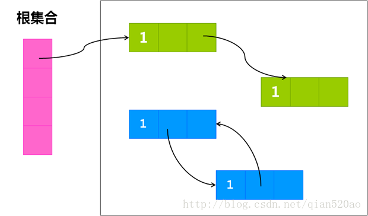 


**Java虚拟机里面没有选用引用计数算法来管理内存，其中最主要的原因是它很难解决对象之间相互循环引用的问题。**

> 优点：简单，高效，现在的objective-c用的就是这种算法。 
> 缺点：很难处理循环引用，相互引用的两个对象则无法释放。（需要开发者自己处理）
>

```Java
ClassA a=new ClassA();
ClassB b=new ClassB();
a.setMethod(b);
b.setMethod(a);
```

## 可达性分析算法

**Java虚拟机中，是通过可达性分析（Reachability Analysis）来判定对象是否存活的。** 

> 这个算法的基本思路是通过一系列称为“GC Roots”的对象作为起始点，从这些节点开始向下搜索，搜索所走过的路径称为引用链（Reference Chain），当一个对象到GC Roots没有任何引用链项链时，则证明此对象是不可用的。（也可以说是可达GC Roots分析）

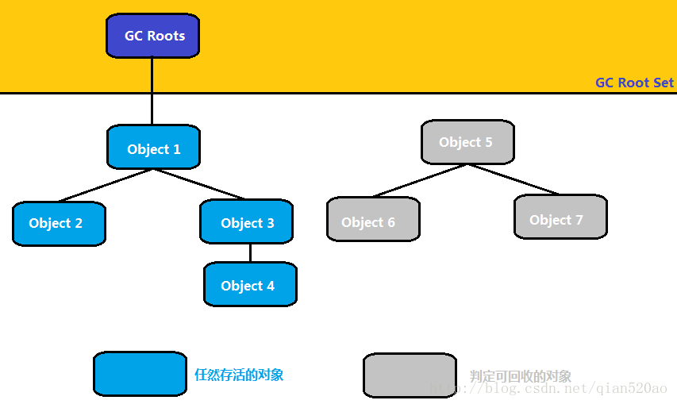 

### GC Roots的对象

1.虚拟机栈（栈帧中的局部变量表）中的引用对象

2.方法区中类静态属性（静态对象）引用的对象

3.方法区中常量（final 修饰的成员对象）引用的对象。

4.本地方法栈中JNI（Native）引用的对象。

PS : 成员对象（即存储在堆）的引用的对象为何不在GC Roots？

# 对象引用

> 判定对象是否存活（需要回收）都与“引用”有关。Java对引用的概念扩充，将引用分为强引用（Strong Reference），软引用（Soft Reference），弱引用（Weak Reference），虚引用（Phantom Refernce）。

- 强引用 ： 类似Object obj=new Object()这类的引用，只要强引用还在，垃圾收集器永远不会回收掉被引用的对象。

- 软引用 ： 软引用是用来描述一些有用但非必须的对象，在系统将要发生内存溢出（OOM）异常之前，将会把这些对象列进回收范围之中进行二次回收。如果这次回收还没有足够的内存，才会抛出内存溢出（OOM）异常。JDK1.2之后提供了SoftReference类来实现软引用。

  软引用通常用来实现内存敏感的缓存，如 果还有空闲内存，就可以暂时保留缓存，当内存不足时清理掉，这样就保证了使用缓存的同时， 不会耗尽内存。

- 弱引用 ： 弱引用也是用来描述非必需对象的，但是它的引用比软引用更弱一些，被弱引用关联的对象只能生存到下一次垃圾收集发生之前。JDK1.2之后提供了`WeakReference`类来实现软引用。

  这就可以用来构建一种没有特定约束的关系，比如，维护一种非强制性的映射关 系，如果试图获取时对象还在，就使用它，否则重现实例化。它同样是很多缓存实现的选择。

- 虚引用 ： 虚引用也成为幽灵引用或者幻影引用，它是最弱的一种引用关系。无法通过虚引用来取得一个对象的实例。为一个对象设置虚引用的唯一目的就是能够在这个对象被回收的时候收到一个系统通知。

  幻象引用仅仅是提供了一种确 保对象被 finalize 以后，做某些事情的机制，比如，通常用来做所谓的 Post-Mortem 清理机 制，我在专栏上一讲中介绍的 Java 平台自身 Cleaner 机制等，也有人利用幻象引用监控对象的 创建和销毁。

# 垃圾回收算法

## 标记 - 清除算法

> 标记清除算法是最基础的收集算法，后面的几种算法都是基于这种思路并对其不足进行改进而得到的。 
> 算法分为“标记”和“清除”两个阶段。

- **标记 ：** 首先标记处所有需要回收的对象，在标记完成后统一回收所有被标记的对象。标记的判定就是通过可达性分析算法分析出可回收对象。
- **清除 ：** 标记完成后会回收对象。但是这其中存在着两个不足问题 ： 第一是标记和清除这两个过程效率不高。其次是清除之后会产生大量不连续的内存碎片。

**空间碎片太多**可能会导致以后在程序运行过程中需要分配比较大对象时，无法找到足够连续内存。从而提前触发依次GC。

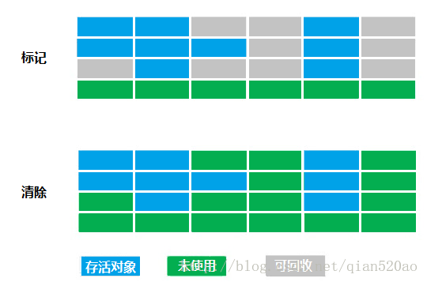 

> 相当于生活中标记不需要的物品，然后找几个人把这些东西丢了。 
> 但是由于房间的空间是有限的，如果一直没有整理房间，如果有大件家具搬进来时，没有足够的空间可能要再标记清除一下不需要的物品，如果还是没有办法放下这件大家具，抛出OOM异常。丢（Out）到（Of）门外（Memory）。
>


## 复制算法(存活对象少，垃圾对象多)

> 为了解决效率问题，复制收集算法出现了.

1. 它将可用内存按容量划分为大小相等的两块，每次只使用其中的一块。
2. 当这一块的内存用完了，就将还存活的对象复制到另一块上面，然后把已使用过的那一块内存空间全部清理。
3. 这样便不用考虑内存碎片问题，只要移动堆顶指针，重新按顺序分配内存即可，实现简单，运行高效。
4. **只是**这种算法的代价是将活动使用的内存缩小为原来的一半。

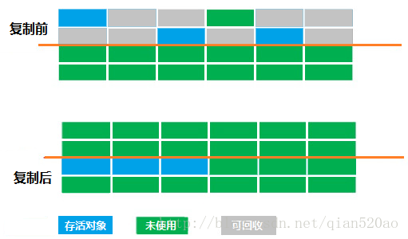 

复制算法当存活对象越少（或者垃圾很容易产生）时，它的效率越高。 
也就是你只要将一些少量需要用到的对象丢到另一片干净的内存中，就可以轻松的大扫除。 

## 标记 - 整理算法(存活对象多，垃圾对象少)

> 复制收集算法在对象存活率较高时就要进行较多的操作，效率就会变得很低。并且只能使用50%的空间。

那么针对存活对象多，垃圾对象少的情况，就可以用“标记 - 整理”（Mark-Compat）算法。

- **标记 ：** 因为存活的对象比较多，我们将这些对象标记起来。然后接下来整理到一块。
- **整理 ：** 让所有标记过的对象都向一端移动，然后直接清理掉端边界以外的内存。（按内存地址一次排列）

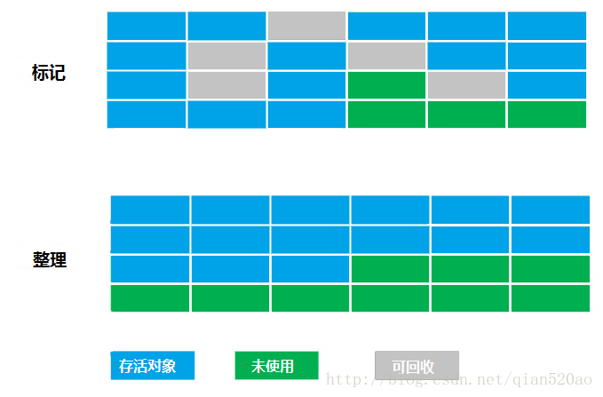 


## 分代收集算法

> 当前很多商业虚拟机都采用**分代收集（Generational Collection）算法**作为垃圾收集器。这种算法只是根据对象存活周期的不同将内存划分为几块，进而采用不同的回收算法的策略。

一般是把Java堆分成新生代和老年代。

- 新生代 ： 对象朝生暮死，存活的对象少，可回收对象多。 

选用复制算法，只要付出少量存活对象的复制成本就可以完成收集。

- 老年代 ： 对象存活率高，回收的对象很少。 

选用标记 - 清理算法，或者标记 - 整理算法来进行回收。

```
具体分割：
1. Young(年轻代)：
	- Eden（伊利园）：存放新生对象。
	- Survivor（幸存者）：存放经过垃圾回收没有被清除的对象。
2. Tenured(老年代)：对象多次回收没有被清除，则移到该区块。
3. Perm：存放加载的类别还有方法对象。
```

### 新生代

1. 对于新生代采取复制算法，因为新生代中每次垃圾回收都要回收大部分对象，也就是说需要复制的操作次数较少，采用复制算法效率最高。
2. 但实际中并不是按照上面算法中说的1：1的比例来划分新生代的空间的，而是将新生代划分为一块较大的Eden空间和两块较小的Survivor空间，比例为8：1：1（比例可以调整）。
3. 每次使用Eden和其中一块Survivor，当回收时，将Eden和刚才用过的Survivor空间中还存活的对象一次性的复制到另一块Survivor空间上，最后清理掉Eden和刚才用过的Survivor空间。

### 老年代

由于老年代的特点是每次回收都只回收少量对象，使用的是标记 - 清理算法，或者标记 - 整理算法来进行回收。它与新生代的比例为 2（老年代） : 1（新生代）。当然这个比例也是可以调整的。

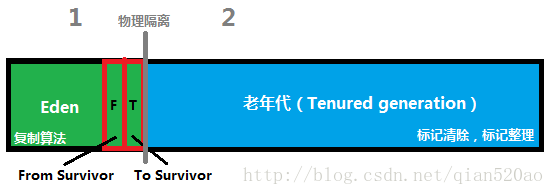 


### 分代收集算法工作流程

1 . 分配了一个又一个对象 ： 放到Eden区。

2 . 不好，Eden区满了，只能GC(新生代GC：Minor GC)了 ： 把Eden区的存活对象copy到Survivor A区，然后清空Eden区（本来Survivor B区也需要清空的，不过本来就是空的）

3 . 又分配了一个又一个对象 ： 放到Eden区。

4 . 不好，Eden区满了，只能GC(新生代GC：Minor GC)了 ： 把Eden区和Survivor A区的存活对象copy到Survivor B区，然后清空Eden区和Survivor A区。

5 . 又分配了一个又一个对象 ： 放到Eden区。

6 . 不好，Eden区满了，只能GC(新生代GC：Minor GC)了 ： 把Eden区和Survivor B区的存活对象copy到Survivor A区，然后清空Eden区和Survivor B区

> 有的对象来回在Survivor A区或者B区呆了比如15次，就被分配到老年代Old区
> 有的对象太大，超过了Eden区，直接被分配在Old区
> 有的存活对象，放不下Survivor区，也被分配到Old区
> // ...
> // 在某次Minor GC的过程中突然发现：
> // 不好，老年代Old区也满了，这是一次大GC(老年代GC：Major GC)
> Old区慢慢的整理一番，空间又够了
> // 继续Minor GC

### 为什么不是一块Survivor空间而是两块？

这里涉及到一个新生代和老年代的存活周期的问题，比如一个对象在新生代经历15次（仅供参考）GC，就可以移到老年代了。问题来了，当我们第一次GC的时候，我们可以把Eden区的存活对象放到Survivor A空间，但是第二次GC的时候，Survivor A空间的存活对象也需要再次用Copying算法，放到Survivor B空间上，而把刚刚的Survivor A空间和Eden空间清除。第三次GC时，又把Survivor B空间的存活对象复制到Survivor A空间，如此反复。 所以，这里就需要两块Survivor空间来回倒腾。

### 为什么Eden空间这么大而Survivor空间要分的少一点？

新创建的对象都是放在Eden空间，这是很频繁的，尤其是大量的局部变量产生的临时对象，这些对象绝大部分都应该马上被回收，能存活下来被转移到survivor空间的往往不多。所以，设置较大的Eden空间和较小的Survivor空间是合理的，大大提高了内存的使用率，缓解了Copying算法的缺点。 
我看8：1：1就挺好的，当然这个比例是可以调整的，包括上面的新生代和老年代的1：2的比例也是可以调整的。 

### Eden空间往Survivor空间转移的时候Survivor空间不够了怎么办？

直接放到老年代去。

# 垃圾收集器

## 知识点

### Stop The World

**可达性分析对执行时间的敏感还体现在GC停顿上**。因为这项分析工作必须在一个能确保一致性快照中进行，即在整个分析期间执行系统看起来就像被冻结在某个时间点上，不可以出现分析过程中对象引用关系还在不断变化的情况。这点是导致GC进行时必须停顿所有Java执行线程的重要原因之一。

### 枚举GC Roots

从可达性分析中从GC Roots节点找引用链这个操作为例，可作为GC Roots的节点主要在全局性的引用（例如常量或者静态属性）与执行上下文（栈帧中的局部变量表）中，现在很多应用仅仅方法区就有数百兆，如果要逐个检查这里面的引用，那么必然会消耗很多时间。

**上面提到提现在GC停顿上，即枚举这些根节点的效率将会影响到GC的停顿时间。**

当然在虚拟机中还是有办法直接得知哪些地方存放着对象的引用。在HotSpot的实现中，使用一组称为OopMap的数据结构来达到这个目的的，在类加载完成之后，HotSpot就会把对象内什么偏移量上是什么类型的数据计算出来，在JIT编译过程中，也只会在**特定的位置（安全点）**在记录下栈和寄存器中哪些位置是引用。

### 安全点

在OopMap的协助下，HotSpot可以快速且准确的完成GC Roots枚举，只会在特定的位置记录了这些信息，这些位置称为安全点（Safepoint）。

只有在安全点程序才能暂停下来开始GC，**并且安全点的选定标准是 ： 是否具有让程序长时间执行的特征为标准 。**也就是说这个安全点不能因为指令长时间执行而导致停顿时间长。

一般来说下面这三种情况的指令才会产生SafePoint。

- 方法调用（临返回前/调用方法的call指令后）
- 循环跳转（循环的末尾）
- 异常跳转（可能抛出异常的位置）

另外一个问题是 ： 如何在GC发生时让所有的线程都“跑”到最近的安全点上再停顿下来？

在JVM中采用的是主动式中断思想。

> 主动式中断 ： 当GC需要中断线程时，不直接对线程操作，简单的在安全点设置一个标志，各个线程执行到安全点的时候主动去轮询这个标志，发现中断标志为true就自己中断挂起。
>

总结一下，安全点的主要作用是：

- OopMap记录GC Roots信息。
- 设置GC标志，当需要GC的时候，中断挂起所有执行的线程。

### 安全区域

**但是**如果线程处于Sleep或者Blocked状态时，无法响应JVM的中断请求。也就是说无法主动“跑”到安全点的位置并中断挂起。那么就需要安全区域（Safe Region）来处理。

安全区域是指在一段代码之中**，引用关系不会发生变化**。在这个区域的任意地方开始GC都是安全的。

所以只要线程执行到了Safe Region中的代码时做到以下两点即可 ：

- 首先标识自己已经进入了Safe Region。
- 在线程要离开Safe Region时，检查系统是否完成了GC过程，如果完成了，那就继续执行。否则就等待到GC执行完毕的信号为止。

————————– 事不关己高高挂起，等你们处理完了我才来瞎掺和。 ————————–

---------------------
## 垃圾收集器的名词

### 吞吐量

CPU用于运行用户代码的时间与CPU总消耗时间的比值。`吞吐量 = 运行用户代码时间/（运行用户代码时间 + 垃圾收集时间）。`

比如说虚拟机总运行了100分钟，用户代码时间99分钟，垃圾收集时间1分钟，那么吞吐量就是99%。

### GC的名词

- 新生代GC（Minor GC） ： 指发生在新生代的垃圾收集动作，因为Java对象大多都具备朝生夕灭的特性，所以Minor GC非常频繁，一般回收速度也比较快。
- 老年代GC（Major GC） ： 指发生在老年代的GC，出现了Major GC，经常会伴随至少一次的Minor GC（发生这种情况，那么整个堆都GC一遍，通常称为Full GC）。Major GC的速度一般会比Minor GC慢10倍以上。

### 并行和并发

- 串行 （Parallel） ： 单线程垃圾收集工作，但此时用户线程仍然处于等待状态。
- 并行 （Parallel） ： 指多条垃圾收集线程并行工作，但此时用户线程仍然处于等待状态。（与串行相比就是回收的执行过程中，多了几条垃圾收集线程并行工作）
- 并发 （Concurrent） ： 指用户线程与垃圾收集线程同时执行（但并不一定是并行的，可能会交替执行），用户程序在继续执行，而垃圾收集程序运行于另一个CPU上。

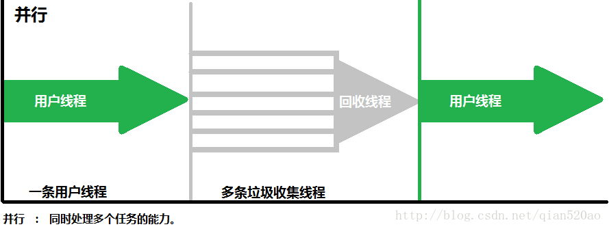 

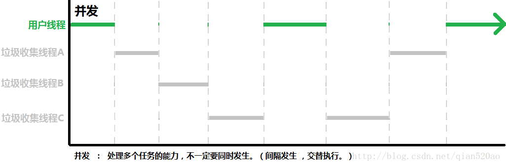 

## 常见的7种垃圾收集器有：

垃圾收集器是内存回收的具体实现，并且虚拟机会根据不同场景使用不同的垃圾回收器组合。其中Serial收集器为串行收集器，其他均为并行收集器。 

- serial收集器、ParNew收集器（seria收集器的升级版，新生代）、serial Old收集器。
- Parallel Scavenge收集器、Parallel Old 收集器。（吞吐量优先）
- CMS（Concurrent Mark-Sweep）收集器。老年代。（停顿时间优先）
- G1收集器（Garbage First）。整个堆。
- 其中Serial收集器为串行收集器，其他均为并行收集器。

### Serial 收集器（新，老）

**单线程垃圾收集: 最古老，最稳定，简单而高效，可能会产生较长的停顿。**

- 在进行垃圾收集的同时，必须暂停其他所有的工作线程，直到垃圾收集结束。
- 虽然GC时需要暂停所有其他的工作线程，但是简单高效，对于限定单个CPU环境来说，没有线程交互的开销，可以获得最高的单线程垃圾收集效率
- 因此Serial垃圾收集器依然是java虚拟机运行在Client模式下默认的新生代垃圾收集器。

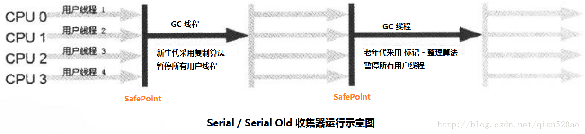 

如上图所示，Serial 收集器在新生代和老年代都有对应的版本，除了收集算法不同，两个版本并没有其他差异。

- Serial 新生代收集器采用的是复制算法。
- Serial Old 老年代采用的是标记 - 整理算法。

### ParNew 收集器（Serial 升级版）（新）

多线程垃圾收集：Serial 新生代收集器升级版

除了多线程外，其他和Serial完全一样。ParNew收集器是许多运行在Server模式下的虚拟机中首选的新生代收集器。 

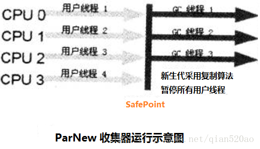 

### Parallel 收集器（吞吐量优先）（新，老）

停顿时间越短越适合需要用户交互的程序，良好的响应速度能提升用户体验。吞吐量小则可以高效率的利用CPU时间，尽快完成程序的运算任务，主要适合后台运算而且不需要太多交互的任务。

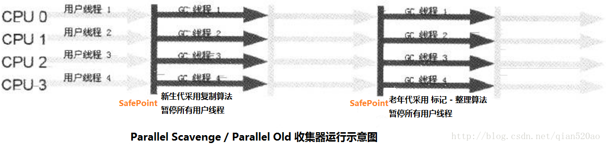 

- Parallel 收集器在新生代和老年代也都有对应的版本，除了收集算法不同，两个版本并没有其他差异。 
- Parallel 两个年代的收集器也可以说是 Serial 收集器的升级版，单线程（串行收集） – > 多线程（并行收集）。

1. Parallel Scavenge 新生代收集器采用的是复制算法。
2. Parallel Old 老年代采用的是标记 - 整理算法。
3. 在注重吞吐量以及CPU资源敏感的场合，都可以优先考虑Parallel Scavenge加Parallel Old收集器组合。

### CMS 收集器（停顿时间优先）（老）

> CMS收集器是基于“标记 - 清除”算法实现的。它是一款老年代垃圾收集器。

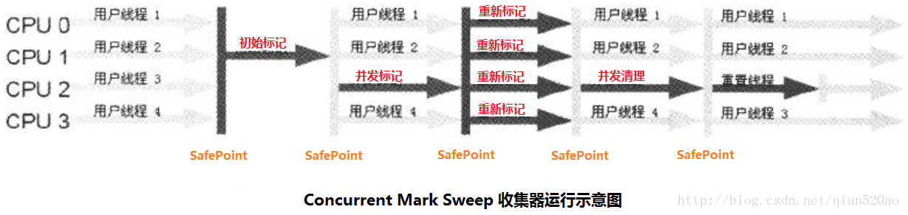 

**四个步骤：**

- 初始标记（CMS initial mark） 

初始标记仅仅只是标记一下GC Roots能直接关联到的对象，速度很快，需要“Stop The World”。（OopMap）

- 并发标记（CMS concurrent mark） 

并发标记阶段就是进行GC Roots Tracing的过程。（从GC Roots 开始对堆进行可达性分析，找出存活对象。）

- 重新标记（CMS remark） 

重新标记阶段是为了修正并发标记期间因用户程序继续运作而导致标记产生变动的那一部分对象的标记记录，这个阶段的停顿时间一般会比初始标记阶段稍长一些，但远比并发标记的时间短，也需要“Stop The World”。

- 并发清除（CMS concurrent sweep） 

并发清除阶段会清除对象。

**主要优点 ：** 并发手机、低停顿。并且它还是[ART老年代默认收集器](https://source.android.google.cn/devices/tech/dalvik/gc-debug) 。 

**缺点：**

1. CMS收集器对CPU资源非常敏感，因为在并发阶段它虽不会导致用户线程停顿，但是占用一部分线程（CPU资源），导致应用程序变慢，总吞吐量变低。CMS默认启动的回收线程数是（CPU数量+3）/4，也就是当CPU在4个以上时，并发回收时垃圾收集线程不少于25%的CPU资源，并且随着CPU数量的增加而下降。
2. CMS收集器无法处理浮动垃圾，可能出现“Concurrent Mode Failure”失败而导致另一次Full GC的产生。 
   也是由于CMS垃圾并发收集阶段用户线程还需要运行，伴随着程序运行自然还会有新的垃圾不断产生，这一部分的垃圾出现在标记过程之后，CMS无法在当次收集中处理它们，只好留待下一次GC时再清理。（所以也需要预存空间存放这些浮动垃圾。）

3. CMS是一款基于“标记—清除”算法实现的收集器，这意味着收集结束时会有大量空间碎片产生。空间碎片过多时，将会给大对象分配带来很大麻烦，往往会出现老年代还有很大空间剩余，但是无法找到足够大的连续空间来分配当前对象，不得不提前触发一次Full GC。不过CMS顶不住要FullGC时会开启内存碎片的合并整理过程。内存整理的过程是无法并发的，所以停顿的时间又会边长。！

### G1收集器（垃圾区域Region优先）（整个堆）

——————– 可预测的停顿时间，整个堆划分成多个区域 ——————–

> G1（Garbage - First）是一款**面向服务端应用**的垃圾收集器。基于**“标记 - 整理”**算法。
>
> 它将整个Java堆划分为多个大小相等的独立区域（Region），虽然还保留有新生代和老年代的概念，但新生代和老年代不再是物理隔离了，它们都是一部分Region（不需要连续）的集合。
>
> G1（Garbage - First）名称的由来是G1跟踪各个Region里面的垃圾堆的价值大小（回收所获得的空间大小以及回收所需时间的经验值），在后台维护一个优先列表，每次根据允许的收集时间，**优先回收价值最大的Region。**
>
> 这种使用Region划分内存空间以及有优先级的区域回收方式，保证G1收集器在有限的时间内可以获得尽可能高的收集效率。
>

**与其它GC收集器相比，G1具备如下4个特点 ：**

1. 并行与并发 

使用多个CPU来缩短Stop-The-World停顿的时间，部分其他收集器原本需要停顿Java线程执行的GC动作，G1收集器仍然可以通过并发的方式让Java程序继续执行。

2. 分代收集 

与其他收集器一样，分代概念在G1中依然得以保留。虽然G1可以不需要其他收集器配合就能独立管理整个GC堆，但它能够采用不同的方式去处理新创建的对象和已经存活了一段时间、熬过多次GC的旧对象以获取更好的收集效果。新生代和老年代不再是物理隔离了，是多个大小相等的独立Region。

3. 空间整合 

与CMS的“标记—清理”算法不同，G1从整体来看是基于“标记—整理”算法实现的收集器，从局部（两个Region之间）上来看是基于“复制”算法实现的，但无论如何，这两种算法都意味着G1运作期间不会产生内存空间碎片，收集后能提供规整的可用内存。这种特性有利于程序长时间运行，分配大对象时不会因为无法找到连续内存空间而提前触发下一次GC。

4. 可预测的停顿 

这是G1相对于CMS的另一大优势，降低停顿时间是G1和CMS共同的关注点，但G1除了追求低停顿外，还能建立可预测的停顿时间模型，能让使用者明确指定在一个长度为M毫秒的时间片段内，消耗在垃圾收集上的时间不得超过N毫秒。（后台维护的优先列表，优先回收价值大的Region）

> 并且在G1收集器中，每个Region都有一个与之对应Remember Set来避免全堆扫描。并且还可以根据这个Remember Set来检查Reference 引用的对象是否处于不同的Region之中。
>

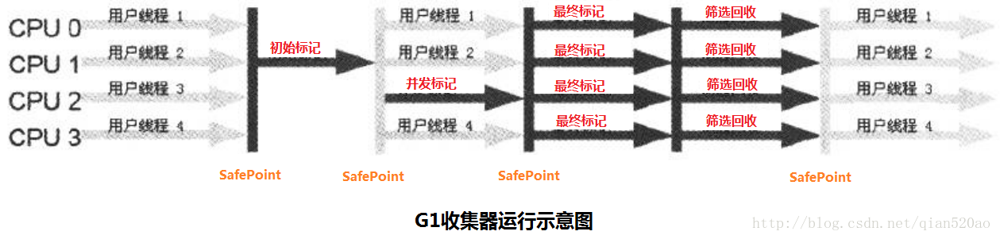 

**G1收集器和CMS收集器相似，过程分为4个步骤 ：**

1. 初始标记 

初始标记仅仅只是标记一下GC Roots能直接关联到的对象，速度很快，需要“Stop The World”。（OopMap）

2. 并发标记 

并发标记阶段就是进行GC Roots Tracing的过程。（从GC Roots 开始对堆进行可达性分析，找出存活对象。）

3. 最终标记 

最终标记和CMS的重新标记阶段一样，也是为了修正并发标记期间因用户程序继续运作而导致标记产生变动的那一部分对象的标记记录，这个阶段的停顿时间一般会比初始标记阶段稍长一些，但远比并发标记的时间短，也需要“Stop The World”。（修正Remebered Set）

4. 筛选回收 

首先对各个Region的回收价值和成本进行排行，根据用户所期望的GC停顿时间来制定回收计划，这个阶段其实也可以做到与用户程序一起并发执行，但是因为只回收一部分Region，时间是用户可控制的，而且停顿用户线程将大幅提高收集效率。

> 如果你的应用追求低停顿，那G1现在已经可以作为一个可尝试选择，如果你的应用追求吞吐量，那G1并不会为你带来什么特别的好处。
>

### 垃圾收集器组合

Java虚拟机规范中对垃圾收集器应该如何实现并没有任何规定，因此不同的厂商、不同版本的虚拟机所提供的垃圾收集器都可能会有很大差别，并且一般都会提供参数供用户根据自己的应用特点和要求组合出各个年代所使用的收集器。

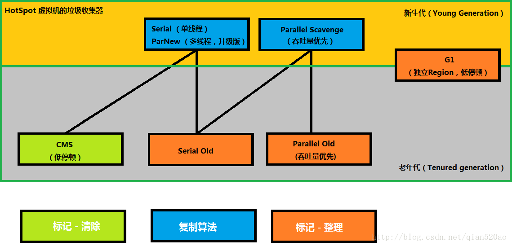 

图中展示了7种作用于不同分代的收集器，如果两个收集器之间存在连线，就说明它们可以搭配使用。虚拟机所处的区域，则表示它是属于新生代收集器还是老年代收集器
