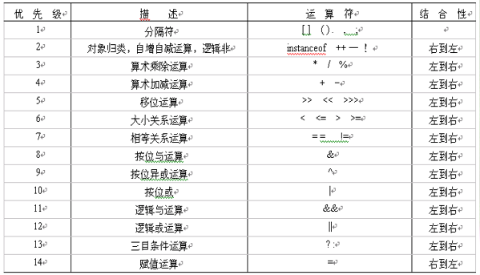

# 常量

用二进制数保存起来

# 变量：

每种类型都在内存中有专门的一片存储

## 整形

- byte(1字节)、 short(2字节)、 int(4字节)、long(8字节)

  ```
  byte a = 2;
  // 这句话会报错，因为3默认是int型，a是byte型，加起来自动提升为int型，但赋给了byte，精度溢出
  a = a + 3;
  ```

- char（2字节）可以进行运算

  ```
  System.out.println('a' + 1);
  输出的是98, 'a'进行了类型提升，转为int型
  
  // 一个中午是2个字节，所以能装的进去
  char a = '呢'
  ```

# 运算符

 

## 算术运算符

### %取模运算：

- 出现负数，只看左边（被模数）

```
-1%5 ：-1
1%-5 ： 1
```

- 其他规律

```
左 < 右：左边
左=右：0
右边是1: 0
```

### +运算符

字符串数据和任何数据的‘+’都是相连接，最终都会变成字符串

```
// 全部连起来为一个字符串：5+5=55
System.out.println(“5+5=” + 5 + 5);
// 加（）提升优先级，会输出：5+5=10
System.out.println(”5+5=“ + （5 + 5）);
```

### += 、=

+= ： 会自动类型转换

= ：只赋值，不管类型转换

```
int a,b,c;
// 这样写是可以的
a = b = c = 5;

short a = 4;
// 只赋值，没有类型转换，会报错
a = a + 5;
// 会自动转换类型
a += 5;
```

## 比较运算符：结果是 true / false

 == 、！=

## 逻辑运算符

- & 和 &&， |和||：：

  ||、&& 是短路运算符，& ，| 会两个表达式都判断

# 位运算

<< n :  左移n位，相当于 * 2 ^ n

\>> n ：右移n位，相当于 / 2 ^ n . 最高位按原有的最高位补（带符号移，负数的最高位补1；正数补0）

\>>> n :  最高位用0补

2 * 8 的高效写法： 2 << 3

两个整数互换： n = 3, m = 8;

```
1: 不用第三方变量，但是int类型最大值可能会溢出
n = n + m;
m = n - m;
n = n - m;
2：位运算
n = n ^ m;
m = n ^ m; // (n^m)^m = n
n = n ^ m; // (n^m)^n = m
```

