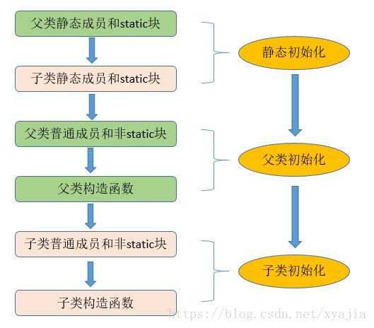
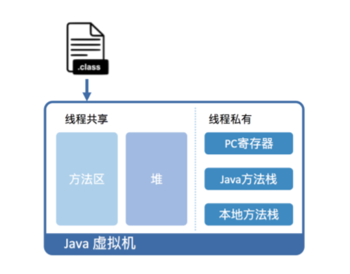

# 类加载机制

过程：加载、链接、初始化

## 1.加载：Classloader

### 基本概念

与C/C++编写的程序不同，JAVA程序并不是一个可执行文件，而是由许多独立的类文件组成，每一个文件对应一个JAVA类。此外，这些类文件并非全部装入内存，而是根据程序需要逐渐载入。

ClassLoader是JVM实现的一部分，ClassLoader包括bootstrap classloader（启动类加载器），ExtClassLoader（扩展类加载器）和AppClassLoader(系统类加载器)

- **bootstrap classloader** ：在JVM运行的时候加载**JAVA核心的类**，以满足JAVA程序最基本的需求，其中就包括后两种ClassLoader

  负责加载存放在JDK\jre\lib下，或被-X bootclasspath参数指定的路径中的，并且能被虚拟机识别的类库（如rt.jar，所有的**java.开头的类均被Bootstrap ClassLoader加载*），包括java.lang.String和java.lang.Object。启动类加载器是无法被Java程序直接引用的。

- **ExtClassLoader**：该加载器由sun.misc.Launcher$ExtClassLoader实现，它负责加载**JDK\jre\lib\ext**目录中，或者由**java.ext.dirs**系统变量指定的路径中的所有类库（如**javax.开头的类*），开发者可以直接使用扩展类加载器

- **AppClassLoader**：该类加载器由sun.misc.Launcher$AppClassLoader来实现，它负责加载用户类在运行状态中，对于任意一个类 (class文件)，都能够知道这个类的所有属性和方法路径（ClassPath）所指定的类，开发者可以直接使用该类加载器，如果应用程序中没有自定义过自己的类加载器，一般情况下这个就是程序中默认的类加载器

除了Java默认提供的三个ClassLoader之外，用户还可以根据需要定义自已的ClassLoader，而这些自定义的ClassLoader都必须继承自java.lang.ClassLoader类，也包括Java提供的另外2个ClassLoader（Extension ClassLoader和App ClassLoader）在内，但是Bootstrap ClassLoader不继承自ClassLoader，因为它不是一个普通的Java类，底层由C++编写，已嵌入到了JVM内核当中，当JVM启动后，Bootstrap ClassLoader也随着启动，负责加载完核心类库后，并构造Extension ClassLoader和App ClassLoader类加载器

### 加载过程

当运行一个程序的时候，JVM启动，运行bootstrap classloader，加载JAVA核心API，同时加载另两个ClassLoader。然后调用ExtClassLoader加载扩展API，最后AppClassLoader加载CLASSPATH目录下定义的Class.这是最基本的加载流程

### 加载原理

#### 双亲委托模式

ClassLoader使用的是双亲委托模型来搜索类的，每个ClassLoader实例都有一个父类加载器的引用，虚拟机内置的类加载器（Bootstrap ClassLoader）本身没有父类加载器。

当一个ClassLoader实例需要加载某个类时，它先把这个任务委托给它的父类加载器，从上到下检查，首先由最顶层的类加载器Bootstrap ClassLoader试图加载，如果没加载到，则把任务转交给Extension ClassLoader试图加载，如果也没加载到，则转交给App ClassLoader 进行加载，如果它也没有加载得到的话，则返回给委托的发起者，由它到指定的文件系统或网络等URL中加载该类。如果它们都没有加载到这个类时，则抛出ClassNotFoundException异常。否则将这个找到的类生成一个类的定义，并将它加载到内存当中，最后返回这个类在内存中的Class实例对象

```
protected Class<?> loadClass(String name, boolean resolve) throws ClassNotFoundException {
    // First, check if the class has already been loaded
    Class c = findLoadedClass(name);
    if (c == null) {
        long t0 = System.nanoTime();
        try {
            if (parent != null) {
                c = parent.loadClass(name, false);
            } else {
                c = findBootstrapClassOrNull(name);
            }
        } catch (ClassNotFoundException e) {
            // ClassNotFoundException thrown if class not found
            // from the non-null parent class loader
        }

        if (c == null) {
            // If still not found, then invoke findClass in order
            // to find the class.
            long t1 = System.nanoTime();
            c = findClass(name);

            // this is the defining class loader; record the stats
        }
    }
    return c;
}
```

#### 使用双亲委托的原因

1. **避免重复加载：**当父亲已经加载了该类的时候，就没有必要子ClassLoader再加载一次。
2. **安全：**如果不使用这种委托模式，那我们就可以随时使用自定义的String来动态替代java核心api中定义的类型，这样会存在非常大的安全隐患，而双亲委托的方式，就可以避免这种情况，因为String已经在启动时就被引导类加载器（Bootstrcp ClassLoader）加载，所以用户自定义的ClassLoader永远也无法加载一个自己写的String，除非你改变JDK中ClassLoader搜索类的默认算法

class相同的条件

1. 类名是否相同
2. 是否同一个类加载器实例加载的

只有两者同时满足的情况下，JVM才认为这两个class是相同的。就算两个class是同一份class字节码，如果被两个不同的ClassLoader实例所加载，JVM也会认为它们是两个不同class。在大型应用中，我们往往借助这一特性，来运 行同一个类的不同版本。

常用函数

| 方法                                                   | 说明                                                         |
| ------------------------------------------------------ | ------------------------------------------------------------ |
| `getParent()`                                          | 返回该类加载器的父类加载器。                                 |
| `loadClass(String name)`                               | 加载名称为 `name`的类，返回的结果是 `java.lang.Class`类的实例。 |
| `findClass(String name)`                               | 查找名称为 `name`的类，返回的结果是 `java.lang.Class`类的实例。 |
| `findLoadedClass(String name)`                         | 查找名称为 `name`的已经被加载过的类，返回的结果是 `java.lang.Class`类的实例。 |
| `defineClass(String name, byte[] b, int off, int len)` | 把字节数组 `b`中的内容转换成 Java 类，返回的结果是 `java.lang.Class`类的实例。这个方法被声明为 `final`的。 |
| `resolveClass(Class<?> c)`                             | 链接指定的 Java 类。                                         |

### 自定义Classloader

自定义的classloader

```
public class WebClassLoader extends ClassLoader {

    private byte[] bclazz;

    public WebClassLoader(ClassLoader parent, byte[] bclazz){
        super(parent);
        this.bclazz = bclazz;
    }

    @Override
    protected Class<?> findClass(String name) throws ClassNotFoundException {
        return defineClass(name, bclazz, 0, bclazz.length);
    }
}
```

使用反射或接口调用class中的方法

```
WebClassLoader loader = new WebClassLoader(MyApplication.getContext().getClassLoader(), module);
Class clazz = loader.loadClass("com.example.TestClass");

// 使用接口调用方法
TestInterface ti = clazz.newInstance();
ti.test();

// 或者使用反射调用方法
Object o = clazz.newInstance();
Method m = clazz.getDeclaredMethod("test");
result = (String) m.invoke(o);
```

CLassLoader类中loadClass的具体实现

## 2.链接

链接：把原始的类定义信息平滑地转化入 JVM 运行的过程中。它可分为验证、准备以及解析三个阶段。

1.验证：保障虚拟机安全，核验字节信息符合Java虚拟机规范，否则VerifyError，可能触发更多class加载。


2.准备

**为类变量分配内存并设置类变量初始值的阶段**，这些内存都将在方法区中分配。对于该阶段有以下几点需要注意：

1. 这时候进行内存分配的仅包括类变量（static），而不包括实例变量，实例变量会在对象实例化时随着对象一块分配在 Java 堆中。
2. 这里所设置的初始值"通常情况"下是数据类型默认的零值（如0、0L、null、false等），比如我们定义了`public static int value=111` ，那么 value 变量在准备阶段的初始值就是 0 而不是111（初始化阶段才会复制）。特殊情况：比如给 value 变量加上了 fianl 关键字`public static final int value=111` ，那么准备阶段 value 的值就被复制为 111。
3. 此时对string的初始值是"null"，在后面初始化函数或其他函数里若有：s = s + "1"，则输出的s为"null1"

3.解析：

将常量池中的符号引用替换为直接引用的过程。解析动作主要针对类或接口、字段、类方法、接口方法、方法类型、方法句柄和调用限定符7类符号引用进行。

符号引用就是一组符号来描述目标，可以是任何字面量。**直接引用**就是直接指向目标的指针、相对偏移量或一个间接定位到目标的句柄。在程序实际运行时，只有符号引用是不够的，举个例子：在程序执行方法时，系统需要明确知道这个方法所在的位置。Java 虚拟机为每个类都准备了一张方法表来存放类中所有的方法。当需要调用一个类的方法的时候，只要知道这个方法在方发表中的偏移量就可以直接调用该方法了。通过解析操作符号引用就可以直接转变为目标方法在类中方法表的位置，从而使得方法可以被调用。

综上，解析阶段是虚拟机将常量池内的符号引用替换为直接引用的过程，也就是得到类或者字段、方法在内存中的指针或者偏移量。

## 3.初始化

真正执行类初始化的代码逻辑，初始化顺序：

```java
public class InitializeClass extends InitializeSuperClass{
    /**静态成员*/
    private static String ret = setStaticRet();
    //静态代码块
    static {
        System.out.println("静态方法块test2");
        ret = "test2";
    }
    /**普通属性*/
    private String ret2 = setRet();
    //普通代码块
    {
        System.out.println("普通方法块test4");
        ret2="test4";
    }
    /**构造函数*/
    public InitializeClass(){
        System.out.println("ret:"+ret+" ret2:"+ret2);
        System.out.println("构造函数");
        ret = "test5";
        ret2 = "test6";
        System.out.println("ret:"+ret+" ret2:"+ret2);
    }
}
```



对于初始化阶段，虚拟机严格规范了有且只有5中情况下，必须对类进行初始化：

1. 当遇到 new 、 getstatic、putstatic或invokestatic 这4条直接码指令时，比如 new 一个类，读取一个静态字段(未被 final 修饰)、或调用一个类的静态方法时。
2. 使用 `java.lang.reflect` 包的方法对类进行反射调用时 ，如果类没初始化，需要触发其初始化。
3. 初始化一个类，如果其父类还未初始化，则先触发该父类的初始化。
4. 当虚拟机启动时，用户需要定义一个要执行的主类 (包含 main 方法的那个类)，虚拟机会先初始化这个类。
5. 当使用 JDK1.7 的动态动态语言时，如果一个 MethodHandle 实例的最后解析结构为 REF_getStatic、REF_putStatic、REF_invokeStatic、的方法句柄，并且这个句柄没有初始化，则需要先触发器初始化。

# 对象创建过程


## 创建过程

### 1.检测类是否被加载

虚拟机遇到一条new指令时，首先将去检查这个指令的参数是否能在常量池中**定位到一个类的符号引用**，并且检查这个符号引用代表的类**是否已被加载、解析和初始化过**。如果没有，那必须先执行相应的类加载过程。

### 2.为新生对象分配内存

为对象分配空间的任务等同于**把一块确定大小的内存从Java堆中划分出来**。分配的方式有两种：

1. 指针碰撞：假设Java堆中内存是绝对规整的，用过的和空闲的内存各在一边，中间放着一个指针作为分界点的指示器，分配内存就是把那个指针向空闲空间的那边挪动一段与对象大小相等的距离。
2. 空闲列表：如果Java堆中的内存不是规整的，虚拟机就需要维护一个列表，记录哪个内存块是可用的，在分配的时候从列表中找到一块足够大的空间划分给对象实例，并更新列表上的记录。

采用哪种分配方式是由Java堆是否规整决定的，而Java堆是否规整是由所采用的垃圾收集器是否带有压缩整理功能决定的。

另外一个需要考虑的问题就是对象创建时的线程安全问题，有两种解决方案：

- **CAS+失败重试：** CAS 是乐观锁的一种实现方式。所谓乐观锁就是，每次不加锁而是假设没有冲突而去完成某项操作，如果因为冲突失败就重试，直到成功为止。**虚拟机采用 CAS 配上失败重试的方式保证更新操作的原子性。**
- **TLAB：** 为每一个线程预先在 Eden 区分配一块儿内存，JVM 在给线程中的对象分配内存时，首先在 TLAB 分配，当对象大于 TLAB 中的剩余内存或 TLAB 的内存已用尽时，再采用上述的 CAS 进行内存分配

### 3.初始化为零值

内存分配完成后，虚拟机需要将分配到的内存空间都**初始化为零值（不包括对象头）**，这一步操作保证了对象的实例字段在Java代码中可以不赋初始值就直接使用，程序能访问到这些字段的数据类型所对应的零值。

### 4.对象头设置

接下来，虚拟机要对对象进行必要的设置，例如这个对象是哪个类的实例、如何才能找到类的元数据信息、对象的哈希码、对象的GC分代年龄等信息。这些信息存放在对象的对象头之中。

### 5.执行构造方法

把对象按照代码进行初始化

## 对象的内存布局

在 Hotspot 虚拟机中，对象在内存中的布局可以分为 3 块区域：**对象头**、**实例数据**和**对齐填充**。

**Hotspot 虚拟机的对象头包括两部分信息**，**第一部分用于存储对象自身的运行时数据**（哈希码、GC 分代年龄、锁状态标志等等），**另一部分是类型指针**，即对象指向它的类元数据的指针，虚拟机通过这个指针来确定这个对象是那个类的实例。

**实例数据部分是对象真正存储的有效信息**，也是在程序中所定义的各种类型的字段内容。

**对齐填充部分不是必然存在的，也没有什么特别的含义，仅仅起占位作用。** 因为 Hotspot 虚拟机的自动内存管理系统要求对象起始地址必须是 8 字节的整数倍，换句话说就是对象的大小必须是 8 字节的整数倍。而对象头部分正好是 8 字节的倍数（1 倍或 2 倍），因此，当对象实例数据部分没有对齐时，就需要通过对齐填充来补全。

## 访问定位

Java程序通过栈上的reference数据来操作堆上的具体对象。主要的访问方式有使用句柄和直接指针两种：

1. 句柄：Java堆将会划出一块内存来作为句柄池，引用中存储的就是对象的句柄地址，而句柄中包含了对象实例数据与类型数据各自的具体地址信息 。如图所示：

   

2. 直接指针：Java堆对象的布局要考虑如何放置访问类型数据的相关信息，引用中存储的就是对象地址 。如图所示：

   

两个方式各有优点，使用句柄最大的好处是引用中存储的是稳定的句柄地址，对象被移动时只会改变句柄中实例的地址，引用不需要修改、使用直接指针访问的好处是速度更快，它节省了一次指针定位的时间开销。

# Object类

## protected Object clone()

Object将clone()作为一个本地方法来实现，这意味着它的代码存放在本地的库中。当代码执行的时候，将会检查调用对象的类(或者父类)是否实现了java.lang.Cloneable接口(Object类不实现Cloneable)。如果没有实现这个接口，clone()将会抛出一个检查异常()——java.lang.CloneNotSupportedException,如果实现了这个接口，clone()会创建一个新的对象，并将原来对象的内容复制到新对象，最后返回这个新对象的引用

**浅克隆**(也叫做浅拷贝)仅仅复制了这个对象本身的成员变量，该对象如果引用了其他对象的话，也不对其复制。新的对象中的数据包含在了这个对象本身中，不涉及对别的对象的引用。

如果一个对象中的所有成员变量都是原始类型，并且其引用了的对象都是不可改变的(大多情况下都是)时，使用浅克隆效果很好！但是，如果其引用了可变的对象，那么这些变化将会影响到该对象和它克隆出的所有对象

**深克隆**(也叫做深复制)会复制这个对象和它所引用的对象的成员变量，如果该对象引用了其他对象，深克隆也会对其复制

## boolean equals(Object obj)

equals()函数可以用来检查一个对象与调用这个equals()的这个对象是否相等

调用它的对象和传入的对象的引用是否相等。也就是说，默认的equals()进行的是引用比较。如果两个引用是相同的，equals()函数返回true；否则，返回false

覆盖equals()函数的时候需要遵守的规则在Oracle官方的文档中都有申明：

- 自反性：对于任意非空的引用值x，x.equals(x)返回值为真。
- 对称性：对于任意非空的引用值x和y，x.equals(y)必须和y.equals(x)返回相同的结果。
- 传递性：对于任意的非空引用值x,y和z,如果x.equals(y)返回真，y.equals(z)返回真，那么x.equals(z)也必须返回真。
- 一致性：对于任意非空的引用值x和y，无论调用x.equals(y)多少次，都要返回相同的结果。在比较的过程中，对象中的数据不能被修改。
- 对于任意的非空引用值x，x.equals(null)必须返回假。

正确覆盖equals的方式

```java
class A {
    private String value;
    @Override
    public boolean equals(Object other) {
        if (this == other) return true;
        if (other == null) return false;
        if (getClass() != other.getClass()) return false;
        // Don't use if (other isinstanceof A)
        // if other is an instance of one child class of A, this will return true

        A o = (A) other;
        return this.value.equals(o.value);
    }
}
```

## protected void finalize()

Runtime 类里有一个 runFinalizersOnExit 方法，可以让程序在退出时执行所有对象的未被自动调用 finalize 方法，即使该对象仍被引用。但是从官方文档可以看出，该方法已经废弃，不建议使用

1. 对象的 `finalize` 方法不一定会被调用，即使是进程退出前。
2. 发生 GC 时一个对象的内存是否释放取决于是否存在该对象的引用，如果该对象包含对象成员，那对象成员也遵循本条。
3. 对象里包含的对象成员按声明顺序进行释放。

## Class< > getClass()

通过getClass()方法可以得到一个和这个类有关的java.lang.Class对象。返回的Class对象是一个被static synchronized方法封装的代表这个类的对象；例如，static sychronized void foo(){}。这也是指向反射API。因为调用gerClass()的对象的类是在内存中的，保证了类型安全

## clone()方法

作用：返回一个Object对象的复制，是一个新的对象而不是引用

方法：浅拷贝

1）要实现clone的类先继承Cloneable接口，他是一个标识接口

2）重新clone（）方法

3）在clone方法中调用super.clone（）

4）浅复制的引用指向原型对象新的克隆体

```java
class Obj implements Cloneable{
    private int INT = 0;

    public int getINT() {
        return INT;
    }

    public void setINT(int replace) {
        this.INT = replace;
    }

    public void changeINT() {
        this.INT = 1;
    }
    @Override
    public Object clone() {
        Object o = null;
        try {
            o = (Obj)super.clone();
        } catch (CloneNotSupportedException e) {
            e.printStackTrace();
        }
        return o;
    }
}

public class TestRef {
    public static void main(String[] args) {
        Obj a = new Obj();
        Obj b = (Obj)a.clone();
        b.changeINT();
        System.out.println("a:" + a.getINT());
        System.out.println("b:" + b.getINT());
    }
}

运行结果：
a:0
b:1
```

- 深拷贝：当类中包含对象时采用。方法：对对象调用完clone方法后，对对象中的非基本类型的属性也调用clone()方法完成深拷贝

```java
import java.util.Date;

class Obj implements Cloneable{
    //private String INT = "hello";
    private Date INT = new Date();

    public Date getINT() {
        return INT;
    }

    public void setString(Date replace) {
        this.INT = replace;
    }

    public void changeString() {
        this.INT.setMonth(4);
    }
    @Override
    public Object clone() {
        Object o = null;
        try {
            o = (Obj)super.clone();
        } catch (CloneNotSupportedException e) {
            e.printStackTrace();
        }
        //深度拷贝
        ((Obj) o).INT = (Date)this.getINT().clone();
        return o;
    }
}

public class TestRef {
    public static void main(String[] args) {
        Obj a = new Obj();
        Obj b = (Obj)a.clone();
        b.changeString();
        System.out.println("a:" + a.getINT());
        System.out.println("b:" + b.getINT());
    }
}
运行结果：
a:Tue Jul 30 13:29:40 CST 2019
b:Thu May 30 13:29:40 CST 2019
```

## int hashCode()

hashCode()方法返回给调用者此对象的哈希值。这个方法通常用在基于hash的集合类中，像java.util.HashMap,java.until.HashSet和java.util.Hashtable

在覆盖equals()的时候同时覆盖hashCode()可以保证对象的功能兼容于hash集合。

```java
// java.lang.String#hashcode
public int hashCode() {
    int h = hash;
    if (h == 0 && value.length > 0) {
        char val[] = value;

        for (int i = 0; i < value.length; i++) {
            h = 31 * h + val[i];
        }
        hash = h;
    }
    return h;
}
```

## ==,equals,hashcode

== ：比较两个变量的值是否相等。对应内存值(引用变量的地址)

equals：Object类的方法，直接使用==比较。其他类会覆盖这个方法

**重写equals必须重写hashcode方法吗？**

保持对象在各个场合下的一致性

1. 重写equals()：为了让尽管地址不同，但内容相同的对象在调用该方法时返回true
2. 重写hashcode方法：为了让地址不同，但内容相同的对象的Hash值相同，这样存入map中能定位到相同的索引
3. JAVA标准对hashcode有相应的规定：equals()方法相等的对象hashcode()也相等

## String toString()

当 toString() 没有被覆盖的时候，返回的字符串格式是 类名@哈希值，哈希值是十六进制的。举例说，假设有一个 Employee 类，toString() 方法返回的结果可能是 Empoyee@1c7b0f4d

## void wait()，void notify()，void notifyAll()

wait()，notify() 和 notifyAll() 可以让线程协调完成一项任务。例如，一个线程生产，另一个线程消费。生产线程不能在前一产品被消费之前运行，而应该等待前一个被生产出来的产品被消费之后才被唤醒，进行生产。同理，消费线程也不能在生产线程之前运行，即不能消费不存在的产品。所以，应该等待生产线程执行一个之后才执行。利用这些方法，就可以实现这些线程之间的协调。从本质上说，一个线程等待某种状态（例如一个产品被生产），另一个线程正在执行，知道产生了某种状态（例如生产了一个产品）

```java
public synchronized void fun() {
    while (condition) { // 不满足运行条件，需要等待
        wait();
    }
    notifyAll(); // 通知其他所有调用wait()的线程，解除阻塞状态
}
```

### wait和sleep的区别

1. 继承不同

   **sleep是Thread类的静态方法**，sleep的作用是让线程休眠制定的时间，在时间到达时恢复，也就是说sleep将在接到时间到达事件事恢复线程执行

   **wait是Object的方法**，也就是说可以对任意一个对象调用wait方法，调用wait()方法后会将调用者的线程挂起，直到其他线程调用同一个对象的notify()方法才会重新激活调用者

2. 同步锁释放不同

   **sleep不释放同步锁,wait释放同步锁.**

   Thread.sleep不会导致锁行为的改变，如果当前线程是拥有锁的，那么Thread.sleep不会让线程释放锁。

   而当调用wait()方法的时候，线程会放弃对象锁，进入等待此对象的等待锁定池，只有针对此对象调用notify()方法后本线程才进入对象锁定池准备

3. 使用方式不同

   sleep()方法可以在任何地方使用；wait()方法则只能在同步方法或同步块中使用

[Java：Object类详解](http://blog.csdn.net/jack_owen/article/details/39936483)

# 类构造说明

## 执行顺序

静态优先执行，父类优先于子类执行。静态代码块是在JVM加载类的时候执行的，而且静态代码块执行且仅执行一次

> 只有类未提供显式构造函数时，才会由编译器自动生成缺省构造器

## 应用实例

由于子类的静态代码块在父类的构造函数之前执行，所以可以用来进行一些针对子类的初始化操作

```
class A {
    public A() {
        System.out.println("I am A");
    }
}

class B extends A {
    static {
        System.out.println("I am B");
    }
    
    public B() {
    }
}

B mB = new B();
I am B
I am A
```

## JAVA编译方法

- java分为编译期+运行时。

编译期：javac将java源码生成.class字节码（java操作码被固定为一个字节，所以叫字节码）文件（虚拟机能识别）

运行时：jvm通过类加载器（class-loader）加载字节码，**解释或者编译**执行。

- 运行时包含：

第一种是解释执行，即逐条将字节码翻译成机器码并执行；

第二种是即时编译（Just-In-Time compilation，JIT），即将一个方法中包含的所有字节码编译成机器码后再执行。

## JVM如何运行java字节码

hotspot虚拟机为例:

- 加载class文件，java类放于方法区。实际运行时，虚拟机会执行方法区内的代码。

  

- 在运行过程中，每当调用进入一个 Java 方法，Java 虚拟机会在当前线程的 **Java 方法栈中**生成一个栈帧，用以存放局部变量以及字节码的操作数。这个栈帧的大小是提前计算好的，而且 Java 虚拟机不要求栈帧在内存空间里连续分布。

- HotSpot 默认采用混合模式，综合了**解释执行+即时编译**两者的优点。它会先解释执行字节码，而后将其中反复执行的热点代码，以方法为单位进行即时编译。
