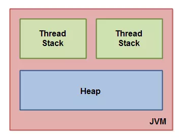
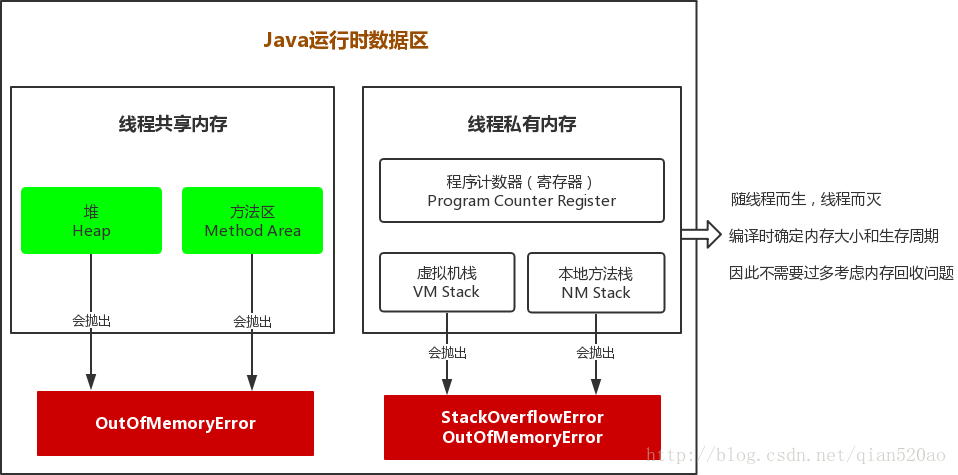
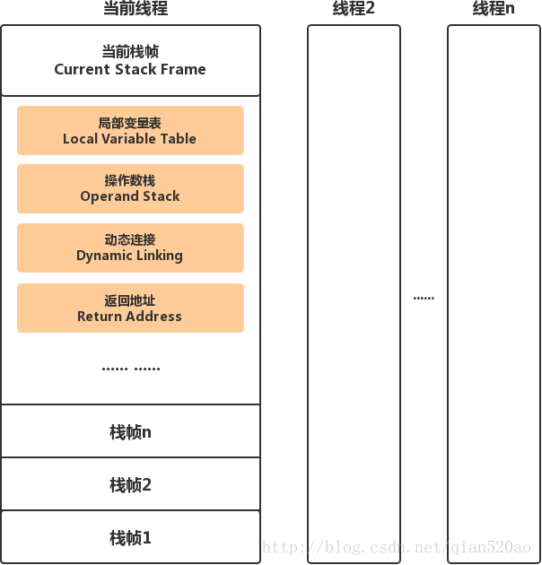

# 类加载机制

# Classloader

## 基本概念

与C/C++编写的程序不同，JAVA程序并不是一个可执行文件，而是由许多独立的类文件组成，每一个文件对应一个JAVA类。此外，这些类文件并非全部装入内存，而是根据程序需要逐渐载入。

ClassLoader是JVM实现的一部分，ClassLoader包括bootstrap classloader（启动类加载器），ExtClassLoader（扩展类加载器）和AppClassLoader(系统类加载器)

- **bootstrap classloader** ：在JVM运行的时候加载**JAVA核心的API**，以满足JAVA程序最基本的需求，其中就包括后两种ClassLoader

  负责加载存放在JDK\jre\lib下，或被-Xbootclasspath参数指定的路径中的，并且能被虚拟机识别的类库（如rt.jar，所有的**java.开头的类均被Bootstrap ClassLoader加载*），包括java.lang.String和java.lang.Object

  启动类加载器是无法被Java程序直接引用的。

- **ExtClassLoader**：该加载器由sun.misc.Launcher$ExtClassLoader实现，它负责加载**JDK\jre\lib\ext**目录中，或者由**java.ext.dirs**系统变量指定的路径中的所有类库（如**javax.开头的类*），开发者可以直接使用扩展类加载器

- **AppClassLoader**：该类加载器由sun.misc.Launcher$AppClassLoader来实现，它负责加载用户类路径（ClassPath）所指定的类，开发者可以直接使用该类加载器，如果应用程序中没有自定义过自己的类加载器，一般情况下这个就是程序中默认的类加载器

除了Java默认提供的三个ClassLoader之外，用户还可以根据需要定义自已的ClassLoader，而这些自定义的ClassLoader都必须继承自java.lang.ClassLoader类，也包括Java提供的另外2个ClassLoader（Extension ClassLoader和App ClassLoader）在内，但是Bootstrap ClassLoader不继承自ClassLoader，因为它不是一个普通的Java类，底层由C++编写，已嵌入到了JVM内核当中，当JVM启动后，Bootstrap ClassLoader也随着启动，负责加载完核心类库后，并构造Extension ClassLoader和App ClassLoader类加载器

## 加载过程

当运行一个程序的时候，JVM启动，运行bootstrap classloader，加载JAVA核心API，同时加载另两个ClassLoader。然后调用ExtClassLoader加载扩展API，最后AppClassLoader加载CLASSPATH目录下定义的Class.这是最基本的加载流程

## 加载原理

### 双亲委托模式

ClassLoader使用的是双亲委托模型来搜索类的，每个ClassLoader实例都有一个父类加载器的引用（不是继承的关系，是一个包含的关系），虚拟机内置的类加载器（Bootstrap ClassLoader）本身没有父类加载器，但可以用作其它ClassLoader实例的父类加载器。

当一个ClassLoader实例需要加载某个类时，它会试图亲自搜索某个类之前，先把这个任务委托给它的父类加载器，这个过程是由上至下依次检查的，首先由最顶层的类加载器Bootstrap ClassLoader试图加载，如果没加载到，则把任务转交给Extension ClassLoader试图加载，如果也没加载到，则转交给App ClassLoader 进行加载，如果它也没有加载得到的话，则返回给委托的发起者，由它到指定的文件系统或网络等URL中加载该类。如果它们都没有加载到这个类时，则抛出ClassNotFoundException异常。否则将这个找到的类生成一个类的定义，并将它加载到内存当中，最后返回这个类在内存中的Class实例对象

```
protected Class<?> loadClass(String name, boolean resolve) throws ClassNotFoundException {
    // First, check if the class has already been loaded
    Class c = findLoadedClass(name);
    if (c == null) {
        long t0 = System.nanoTime();
        try {
            if (parent != null) {
                c = parent.loadClass(name, false);
            } else {
                c = findBootstrapClassOrNull(name);
            }
        } catch (ClassNotFoundException e) {
            // ClassNotFoundException thrown if class not found
            // from the non-null parent class loader
        }

        if (c == null) {
            // If still not found, then invoke findClass in order
            // to find the class.
            long t1 = System.nanoTime();
            c = findClass(name);

            // this is the defining class loader; record the stats
        }
    }
    return c;
}
```

### 使用双亲委托的原因

1. **避免重复加载：**当父亲已经加载了该类的时候，就没有必要子ClassLoader再加载一次。
2. **安全：**如果不使用这种委托模式，那我们就可以随时使用自定义的String来动态替代java核心api中定义的类型，这样会存在非常大的安全隐患，而双亲委托的方式，就可以避免这种情况，因为String已经在启动时就被引导类加载器（Bootstrcp ClassLoader）加载，所以用户自定义的ClassLoader永远也无法加载一个自己写的String，除非你改变JDK中ClassLoader搜索类的默认算法

## class相同的条件

1. 类名是否相同
2. 是否同一个类加载器实例加载的

只有两者同时满足的情况下，JVM才认为这两个class是相同的。就算两个class是同一份class字节码，如果被两个不同的ClassLoader实例所加载，JVM也会认为它们是两个不同class。

比如网络上的一个Java类org.classloader.simple.NetClassLoaderSimple，javac编译之后生成字节码文件NetClassLoaderSimple.class，ClassLoaderA和ClassLoaderB这两个类加载器并读取了NetClassLoaderSimple.class文件，并分别定义出了java.lang.Class实例来表示这个类，对于JVM来说，它们是两个不同的实例对象，但它们确实是同一份字节码文件，如果试图将这个Class实例生成具体的对象进行转换时，就会抛运行时异常java.lang.ClassCaseException，提示这是两个不同的类型

## 常用函数

| 方法                                                   | 说明                                                         |
| ------------------------------------------------------ | ------------------------------------------------------------ |
| `getParent()`                                          | 返回该类加载器的父类加载器。                                 |
| `loadClass(String name)`                               | 加载名称为 `name`的类，返回的结果是 `java.lang.Class`类的实例。 |
| `findClass(String name)`                               | 查找名称为 `name`的类，返回的结果是 `java.lang.Class`类的实例。 |
| `findLoadedClass(String name)`                         | 查找名称为 `name`的已经被加载过的类，返回的结果是 `java.lang.Class`类的实例。 |
| `defineClass(String name, byte[] b, int off, int len)` | 把字节数组 `b`中的内容转换成 Java 类，返回的结果是 `java.lang.Class`类的实例。这个方法被声明为 `final`的。 |
| `resolveClass(Class<?> c)`                             | 链接指定的 Java 类。                                         |

## 自定义Classloader

自定义的classloader

```
public class WebClassLoader extends ClassLoader {

    private byte[] bclazz;

    public WebClassLoader(ClassLoader parent, byte[] bclazz){
        super(parent);
        this.bclazz = bclazz;
    }

    @Override
    protected Class<?> findClass(String name) throws ClassNotFoundException {
        return defineClass(name, bclazz, 0, bclazz.length);
    }
}
```

使用反射或接口调用class中的方法

```
WebClassLoader loader = new WebClassLoader(MyApplication.getContext().getClassLoader(), module);
Class clazz = loader.loadClass("com.example.TestClass");

// 使用接口调用方法
TestInterface ti = clazz.newInstance();
ti.test();

// 或者使用反射调用方法
Object o = clazz.newInstance();
Method m = clazz.getDeclaredMethod("test");
result = (String) m.invoke(o);
```

CLassLoader类中loadClass的具体实现

# 对象

## 创建过程

### 检测类是否被加载

虚拟机遇到一条new指令时，首先将去检查这个指令的参数是否能在常量池中**定位到一个类的符号引用**，并且检查这个符号引用代表的类**是否已被加载、解析和初始化过**。如果没有，那必须先执行相应的类加载过程。

### 为新生对象分配内存

为对象分配空间的任务等同于**把一块确定大小的内存从Java堆中划分出来**。分配的方式有两种：

1. 指针碰撞：假设Java堆中内存是绝对规整的，用过的和空闲的内存各在一边，中间放着一个指针作为分界点的指示器，分配内存就是把那个指针向空闲空间的那边挪动一段与对象大小相等的距离。
2. 空闲列表：如果Java堆中的内存不是规整的，虚拟机就需要维护一个列表，记录哪个内存块是可用的，在分配的时候从列表中找到一块足够大的空间划分给对象实例，并更新列表上的记录。

采用哪种分配方式是由Java堆是否规整决定的，而Java堆是否规整是由所采用的垃圾收集器是否带有压缩整理功能决定的。

另外一个需要考虑的问题就是对象创建时的线程安全问题，有两种解决方案：

1. 对分配内存空间的动作进行同步处理；
2. 把内存分配的动作按照线程划分在不同的空间之中进行，即每个线程在Java堆中预先分配一小块内存(TLAB)，哪个线程要分配内存就在哪个线程的TLAB上分配，只有TLAB用完并分配新的TLAB时才需要同步锁定。

### 初始化为零值

内存分配完成后，虚拟机需要将分配到的内存空间都**初始化为零值（不包括对象头）**，这一步操作保证了对象的实例字段在Java代码中可以不赋初始值就直接使用，程序能访问到这些字段的数据类型所对应的零值。

### 必要设置

接下来，虚拟机要对对象进行必要的设置，例如这个对象是哪个类的实例、如何才能找到类的元数据信息、对象的哈希码、对象的GC分代年龄等信息。这些信息存放在对象的对象头之中。

### 执行构造方法

把对象按照代码进行初始化

## 类构造器

### 执行顺序

静态优先执行，父类优先于子类执行。静态代码块是在JVM加载类的时候执行的，而且静态代码块执行且仅执行一次

> 只有类未提供显式构造函数时，才会由编译器自动生成缺省构造器

### 应用实例

由于子类的静态代码块在父类的构造函数之前执行，所以可以用来进行一些针对子类的初始化操作

```
class A {
    public A() {
        System.out.println("I am A");
    }
}

class B extends A {
    static {
        System.out.println("I am B");
    }
    
    public B() {
    }
}

B mB = new B();
I am B
I am A
```

# JAVA编译

- java分为编译期+运行时。

编译期：javac将java源码生成.class字节码（java操作码被固定为一个字节，所以叫字节码）文件（虚拟机能识别）

运行时：jvm通过类加载器（class-loader）加载字节码，**解释或者编译**执行。

- 运行时包含：

第一种是解释执行，即逐条将字节码翻译成机器码并执行；

第二种是即时编译（Just-In-Time compilation，JIT），即将一个方法中包含的所有字节码编译成机器码后再执行。

## JVM如何运行java字节码

hotspot虚拟机为例:

- 加载class文件，java类放于方法区。实际运行时，虚拟机会执行方法区内的代码。

  

- 在运行过程中，每当调用进入一个 Java 方法，Java 虚拟机会在当前线程的 **Java 方法栈中**生成一个栈帧，用以存放局部变量以及字节码的操作数。这个栈帧的大小是提前计算好的，而且 Java 虚拟机不要求栈帧在内存空间里连续分布。

- HotSpot 默认采用混合模式，综合了**解释执行+即时编译**两者的优点。它会先解释执行字节码，而后将其中反复执行的热点代码，以方法为单位进行即时编译。

# JAVA内存模型

JAVA内存模型简称JMM，定义了多线程之间共享遍历的可见性以及如何在需要的时候对共享变量进行同步。

 

JVM的内部的内存模型分为了两部分，thread stack和heap，也就是线程栈(调用栈)和堆。原始类型的变量存在栈中，对象类型的变量存在堆中由所有线程共享。

  

**运行时数据区域**

 

## 程序计数器

1. 程序计数器`（Program Counter Register）`是一块较小的内存空间，它可以看做是当前线程所执行的字节码的行号指示器。字节码解释器工作时就是通过改变这个计数器的值来选取下一条需要执行的字节码指令。
2. 字节码指令、分支、循环、跳转、异常处理、线程恢复等基础功能都要依赖这个计数器来完成。
3. 每条线程都有一个独立的程序计数器，各条线程之间计数器互不影响，独立存储。如上图所示，我们称这类内存区域为 : 线程私有内存。
4. 如果线程正在执行的是一个Java方法，这个计数器记录的是正在执行的虚拟机字节码指令的地址；如果正在执行的是Native方法，这个计数器值则为空（Undefined）。
5. 此内存区域是唯一一个在Java虚拟机中没有规范任何`OutOfMemoryError`情况的区域。

## Java虚拟机栈

1. Java虚拟机栈也是线程私有的，它的生命周期与线程相同（随线程而生，随线程而灭）
2. 如果线程请求的栈深度大于虚拟机所允许的深度，将抛出`StackOverflowError`异常；如果虚拟机栈可以动态扩展，如果扩展时无法申请到足够的内存，就会抛出`OutOfMemoryError`异常；（当前大部分JVM都可以动态扩展，只不过JVM规范也允许固定长度的虚拟机栈）
3. Java虚拟机栈描述的是Java方法执行的内存模型：每个方法执行的同时会创建一个栈帧。 对于我们来说，主要关注的stack栈内存，就是虚拟机栈中局部变量表部分。

## 栈帧

- 栈帧是用于支持虚拟机进行方法调用和方法执行的数据结构，它是虚拟机运行时数据区中的虚拟机栈的栈元素。栈帧用于存储**局部变量表、操作数栈、动态链接、方法返回**等信息。 每个方法从调用直至执行完成的过程，就对应着一个栈帧在虚拟机栈中入栈到出栈的过程。 
- 在活动线程中，只有位于栈顶的栈帧才是有效的，称为**当前栈帧**，与这个栈帧相关联的方法称为**当前方法**。执行引擎运行的所有字节码指令都只针对当前栈帧进行操作。

 


局部变量表存放了编译期可知的各种基本数据类型(boolean、byte、char、short、int、float、long、double)「String是引用类型」，对象引用(reference类型)和returnAddress类型（它指向了一条字节码指令的地址） 

**「小知识」**网上的很多资料都称 ： 基本数据和对象引用存储在栈中。 

1. 当然这种说法虽然是正确的，但是很不严谨，只能说这种说法针对的是**局部变量**。局部变量存储在局部变量表中，随着线程而生，线程而灭。并且线程间数据不共享。 
2. 但是，如果是成员变量，或者定义在方法外对象的引用，它们存储在堆中。因为在堆中，是线程共享数据的，并且栈帧里的命名就已经清楚的划分了界限 : 局部变量表！

## 本地方法栈

1. 本地方法栈`（Native Method Stack）`与虚拟机栈所发挥的作用是非常相似的，它们之间的区别不过是虚拟机栈为虚拟机执行Java方法服务（也就是字节码）服务，而本地方法栈为虚拟机使用到的Native方法服务。
2. Java虚拟机规范对本地方法栈使用的语言、使用方法与数据结构并没有强制规定，因此可以由虚拟机自由实现。例如：HotSpot虚拟机直接将本地方法栈和虚拟机栈合二为一。
3. 同虚拟机栈相同，Java虚拟机规范对这个区域也规定了两种异常情况`StackOverflowError` 和` OutOfMemoryError`异常。

## 堆

1. Java堆是被**所有线程**共享的一块内存区域，在虚拟机启动时创建，是虚拟机所管理的内存中最大的一块。此内存区域的唯一目的就是**【存放对象实例和数组】**，几乎所有的对象实例和数组都在这里分配内存。
2. **Java堆是垃圾收集器管理的主要区域，也称为GC 垃圾堆**。
   - 从内存回收的角度看，由于现在收集器基本都采用分代收集算法，所以Java堆可以细分为：新生代、老生代； 
   - 从内存分配的角度看，线程共享的Java堆可能划分出多个线程私有的分配缓冲区（TLAB）； 
   - 不论如何划分，都与存放的内容无关，无论哪个区域，存储的仍然是对象实例和数组。
3. 如果在堆中没有内存完成实例分配，并且堆上也无法再扩展时，将会抛出`OutOfMemoryError`异常。
4. 内存泄露和内存溢出 
   **内存泄露 ：** 指程序中动态分配内存给一些临时对象，但是对象不会被GC所回收，它始终占用内存。即被分配的对象可达但已无用，可用内存越来越少。 
   **内存溢出 ：** 指程序运行过程中无法申请到足够的内存而导致的一种错误。内存溢出通常发生于老年代或永久代垃圾回收后，仍然无内存空间容纳新的Java对象的情况。 
   **内存泄露是内存溢出的一种诱因，不是唯一因素。**

## 堆外内存

**1.堆内内存：**Java中的对象都是在JVM堆中分配的，在jvm参数中只要使用-Xms，-Xmx等参数就可以设置堆的大小和最大值，理解jvm的堆还需要知道下面这个公式：

```
堆内内存 = 新生代+老年代+持久代
```

其**好处**在于开发者不用关心对象的回收。但有利必有弊，堆内内存主要有两个**缺点**：1.GC是有成本的，堆中的对象数量越多，GC的开销也会越大。2.使用堆内内存进行文件、网络的IO时，JVM会使用堆外内存做一次额外的中转，也就是会多一次内存拷贝。

**2.堆外内存：**和堆内内存相对应，堆外内存就是把内存对象分配在Java虚拟机堆以外的内存，这些内存直接受操作系统管理（而不是虚拟机），这样做的结果就是能够在一定程度上减少垃圾回收对应用程序造成的影响。用java.nio.DirectByteBuffer对象进行堆外内存的管理和使用，它会在对象创建的时候就分配堆外内存。DirectByteBuffer类是在Java Heap外分配内存，对堆外内存的申请主要是通过成员变量unsafe来操作。

**使用堆外内存的优点**

1、减少了垃圾回收
因为垃圾回收会暂停其他的工作。

2、加快了复制的速度
堆内在flush到远程时，会先复制到直接内存（非堆内存），然后在发送；而堆外内存相当于省略掉了这个工作。

同样任何一个事物使用起来有优点就会有缺点，堆外内存的缺点就是内存难以控制，使用了堆外内存就间接失去了JVM管理内存的可行性，改由自己来管理，当发生内存溢出时排查起来非常困难。

## 方法区

1. 方法区又被称为静态区，是程序中永远唯一的元素存储区域。和堆一样，是各个线程共享的内存区域。它**用于存储已被虚拟机加载的类信息、常量、静态变量、即时编译器编译后的代码等数据。**
2. Java虚拟机规范对方法区的限制非常宽松，除了和Java堆一样 不需要连续的内存和可以选择固定大小或者可扩展之外，还**可以选择不实现垃圾回收。** 
   这区域的内存回收目标主要是针对常量池的回收和类型的卸载，一般而言，这个区域的内存回收比较难以令人满意，尤其是类型的回收，条件相当苛刻，但是这部分区域的内存回收确实是必要的。
3. 很多开发者更愿意把方法区称为“永久代”(Perm Gen)(Permanent Generation)「**总是存放不会轻易改变的内容」**。在目前已经发布的JDK 1.7 的HotSpot中，已经把原本放在永久代的字符串常量池移至堆中。
4. 运行时常量池(Runtime Constant Pool)是方法区的一部分。

> JDK 1.8 中，已经没有方法区(永久代)，而是将方法区直接放在一个与堆不相连的本地内存区域(Native Memory)，这个区域被叫做元空间。

## 运行时常量池

1. Class文件中除了有类的版本、字段、方法、接口等描述信息外，还有一项信息是常量池(Constant Pool Table)，用于存放**编译期生成的字面量和符号引用**，这部分内容（也可以称为 .Class文件中的静态常量池）将在类加载后进入方法区的运行时常量池中存放。

   - 字面量 ： 比较接近Java语言层面的常量概念，如文本字符串、声明为final的常量值等。（final修饰的成员变量和类变量！「类变量即静态(成员)变量)」，也就是除final修饰的局部变量。

   - 符号引用 ： 属于编译原理方面的概念，包括 

     1. 类和接口的全限定名(即路径，包名+类名)。 
     2. 字段的名称和描述符。 
     3. 方法的名称和描述符。 

     当虚拟机运行时，需要从常量池获得对应的符号引号，再在类创建或运行时解析、翻译到具体的内存地址之中（直接引用）。

2. 除了保存Class文件中描述的符号引用外，还会把编译出来的直接引用也存储在运行时常量池中。

3. Java语言并不要求常量一定只有编译期才能生成，也就是并非置入Class文件中常量池的内容才能进入方法区运行时常量池，运行期间也可能将新的常量放入池中，这种特性被开发人员利用得比较多的便是String 类的intern()方法。(后面会分析String类。)

4. 当常量池无法再申请到内存时也会抛出`OutofMemoryError`异常。

## 拓展：成员变量与局部变量

- 成员变量 : 方法外部，类内部定义的变量；
- 局部变量 : 方法或语句块内部定义的变量，必须初始化。

形参是局部变量，实参则可能是方法中的局部变量或全局变量。 
栈内存中的局部变量随方法而生，随方法而灭。 
成员变量存储在堆中的对象里，由垃圾收集器回收。

| 定义     | 成员变量       | 局部变量           | 静态变量                             |
| -------- | -------------- | ------------------ | ------------------------------------ |
| 定义位置 | 在类中，方法外 | 方法中，或形参     | 类中，方法外（java只有静态成员变量） |
| 初始化值 | 有默认初始化值 | 无，先定义，后赋值 | 默认初始化值                         |
| 存储位置 | 堆             | 栈                 | 方法区                               |
| 声明周期 | 与对象共存亡   | 与方法(线程)共存亡 | 与类共存亡                           |
| 别名     | 实例变量       |                    | 类变量                               |

# 注解

Java注解是附加在代码中的一些元信息，用于一些工具在编译、运行时进行解析和使用，起到**说明、配置**的功能
注解不会也不能影响代码的实际逻辑，仅仅起到辅助性的作用。包含在 java.lang.annotation 包中。

## 说明：

jdk5之后提供了一个特性,和类 接口同级

- 格式:

  @interface 注解名{}

- 作用:

1. 编译检查
2. 替代配置文件
3. 定义注解(元注解:注解上的注解，决定注解的位置-放在方法上或者类上)
4. 分析代码(什么时候执行，怎么执行--用到反射)

- 注解属性:

1. 注解本质就是一个接口(可以用javap命令反编译去看),接口中可以有常量和抽象方法(public abstract)
2. 抽象方法在注解中就称之为注解属性

- 注解属性类型有限制:

```
基本类型
String
Class
Annotation
Enum:枚举(构造方法私有了，只能使用其内部的对象)
以上类型对应的一维数组
```

- 注意:

  一旦注解有属性了,使用注解的时候必须赋值,(除非这个注解属性有默认值)	

  赋值的格式:
  ​    @注解名(属性名=属性值)
  ​    若注解类型为数组,且只有一个值的时候,可以有两种写法
  ​        方式1:
  ​            属性名 = { 值 } e.g. @MyAnno(ss = {"que","123"})
  ​        方式2:
  ​            属性名=属性值  e.g. @MyAnno(ss = "que")
  ​    若属性名为value的时候,且只有这一个value属性，只需要为这个value属性赋值的时候,value可以省略

- 元注解:(理解)

  定义在注解上的注解

1. @Retention  规定注解保留到什么阶段(生命周期)  值为RetentionPolicy的三个枚举值

```
SOURCE:只在代码中保留,在字节码文件中就删除了。(默认是源码阶段)
CLASS:在代码和字节码文件中保留。在编译期检查
RUNTIME:所有阶段都保留。当配置文件用		
```

1. @Target 规定注解作用在什么上面 	值为ElementType的枚举值

```
TYPE:作用在类 接口 等上面
METHOD:作用方法上面
FIELD:作用字段上面

e.g.
@Target(ElementType.METHOD)
public @interface MyAnnotation4 {	
}
```

## 分类

### 按运行机制划分

- 源码注解：只在源码中存在，编译成.class文件就不存在了
- 编译时注解：在源码和.class文件中都存在。像前面的`@Override`、`@Deprecated`、`@SuppressWarnings`，他们都属于编译时注解
- 运行时注解：在运行阶段还起作用，甚至会影响运行逻辑的注解。像`@Autowired`自动注入的这样一种注解就属于运行时注解，它会在程序运行的时候把你的成员变量自动的注入进来

### 按来源划分

- JDK注解

  - `@Override`：告诉用户和编译器该方法覆盖了父类中的同一个方法
  - `@Deprecated`：表明这个方法已经过时了，会发出警告
  - `@Suppvisewarnings("xxx")`：表示忽略了xxx的警告

- 第三方注解

  例如Spring的`@Autowired`，`@Service`，Mybatis的`@InsertProvider`，`@Options`等

- 自定义注解

### 元注解

元注解是给注解进行注解，可以理解为注解的注解就是元注解

## 自定义注解

使用`@interface`关键字定义一个注解

```java
// 元注解部分
@Target({ElementType.METHOD,ElementType.TYPE})
@Retention(RetentionPolicy.RUNTIME)
@Inherited
@Documented

// 注解部分
public @interface Description {
    String desc();
    String author();
    int age() default 18;
}
```

其中定义的“方法”在注解里只是一个成员变量，可以用`default`指定默认值

- 成员类型是受限制的，合法的类型包括基本的数据类型以及String，Class，Annotation,Enumeration等。
- 如果注解只有一个成员，则成员名必须取名为`value()`，在使用时可以忽略成员名和赋值号（=）。
- 注解类可以没有成员，没有成员的注解称为标识注解。

元注解部分说明：

- `@Target`：作用域列表，格式为`ElementType.xxx`，中间用逗号分隔
  - `METHOD`：方法声明
    - `CONSTRUCTOR`：构造方法声明
    - `FIELD`：字段声明
    - `LOCAL VARIABLE`：局部变量声明
    - `METHOD`：方法声明
    - `PACKAGE`：包声明
    - `PARAMETER`：参数声明
    - `TYPE`：类接口
- `@Retention`：生命周期
  - `RUNTIME`在运行时存在，可以通过反射读取
    - `SOURCE`：只在源码显示，编译时丢弃
    - `CLASS`：编译时记录到class中，运行时忽略
- `@Inherited`是一个标识性的元注解，它允许子注解继承它。
- `@Documented`，生成javadoc时会包含注解

使用自定义注解：`@<注解名>(<成员名1>=<成员值1>,<成员名1>=<成员值1>,…)`

```java
@Description(desc="i am Color",author="boy",age=18)
public String Color() {
    return "red";
}
```

## 解析注解

通过反射获取类 、函数或成员上的**运行时注解信息**，从而实现动态控制程序运行的逻辑。

```java
@Target({ElementType.METHOD,ElementType.TYPE})
@Retention(RetentionPolicy.RUNTIME)
@Inherited
@Documented
public @interface Description {
    String value();
}

@Description("Class Annotation")
public class Child {
    @Override
    @Description("Method Annotation")
    public String name() {
        return null;
    }
}

public static void main(String[] args) {
    try {
        // 使用类加载器加载类
        Class c = Class.forName("com.test.Child");
        // 找到类上面的注解
        boolean isExist = c.isAnnotationPresent(Description.class);
        // 上面的这个方法是用这个类来判断这个类是否存在Description这样的一个注解
        if (isExist) {
            // 拿到注解实例，解析类上面的注解
            Description d = (Description) c.getAnnotation(Description.class);
            System.out.println(d.value());
        }

        //获取所有的方法
        Method[] ms = c.getMethods();
        for (Method m : ms) {
            //拿到方法上的所有的注解
            Annotation[] as = m.getAnnotations();
            for (Annotation a : as) {
                //用二元操作符判断a是否是Description的实例
                if (a instanceof Description) {
                    Description d = (Description) a;
                    System.out.println(d.value());
                }

            }
        }
    } catch (Exception e) {
        e.printStackTrace();
    }
}
```

输出

```shell
Class Annotation
Method Annotation
```

[框架开发之Java注解的妙用](https://www.jianshu.com/p/b560b30726d4)

# 内存泄漏

**内存泄漏**：对象已经没有被应用程序使用，但是垃圾回收器没办法移除它们，因为还在被引用着。
在Java中，**内存泄漏**就是存在一些被分配的对象，这些对象有下面两个特点，**首先**，这些对象是可达的，即**在有向图中，存在通路可以与其相连**；**其次**，**这些对象是无用的，即程序以后不会再使用这些对象**。如果对象满足这两个条件，这些对象就可以判定为Java中的内存泄漏，这些对象不会被GC所回收，然而它却占用内存。

根本原因：长生命周期的对象持有短生命周期对象的引用就很可能发生内存泄漏，尽管短生命周期对象已经不再需要，但是**因为长生命周期持有它的引用而导致不能被回收，这就是Java中内存泄漏的发生场景**。

判断一个内存空间是否符合垃圾收集的标准有两个：**一个是给对象赋予了空值null，以下再没有调用过另一个是给对象赋予了新值，这样重新分配了内存空间**。


## 原因：

1. 静态集合类引起内存泄漏

给出一个 Java 内存泄漏的典型例子

```
Vector v = new Vector(10);

for (int i = 0; i < 100; i++) {
    Object o = new Object();
    v.add(o);
    o = null;
}
```

在这个例子中，我们循环申请Object对象，并将所申请的对象放入一个 Vector 中，如果我们仅仅释放引用本身，那么 Vector 仍然引用该对象，所以这个对象对 GC 来说是不可回收的。因此，如果对象加入到Vector 后，还必须从 Vector 中删除，最简单的方法就是将 Vector 对象设置为 null。

`v = null`

2. 监听器

在 **java** 编程中，我们都需要和监听器打交道，通常一个应用当中会用到很多监听器，我们会调用一个控件的诸如**addXXXListener()** 等方法来增加监听器，但往往在释放对象的时候却没有记住去删除这些监听器，从而增加了内存泄漏的机会。

3. 各种连接池

比如数据库连接（**dataSourse.getConnection()**），网络连接(**socket**)和**io**连接，除非其显式的调用了其**close()** 方法将其连接关闭，否则是不会自动被**GC** 回收的。对于**Resultset** 和**Statement** 对象可以不进行显式回收，但**Connection** 一定要显式回收，因为**Connection** 在任何时候都无法自动回收，而**Connection**一旦回收，**Resultset** 和**Statement** 对象就会立即为**NULL**。但是如果使用连接池，情况就不一样了，除了要显式地关闭连接，还必须显式地关闭**Resultset Statement** 对象（关闭其中一个，另外一个也会关闭），否则就会造成大量的**Statement** 对象无法释放，从而引起内存泄漏。这种情况下一般都会在**try** 里面去的连接，在**finally**里面释放连接。

4. 内部类和外部模块的引用

内部类的引用是比较容易遗忘的一种，而且一旦没释放可能导致一系列的后继类对象没有释放。此外程序员还要小心外部模块不经意的引用，例如程序员A 负责A 模块，调用了B 模块的一个方法如：

```
public void registerMsg(Object b);
```

这种调用就要非常小心了，传入了一个对象，很可能模块B就保持了对该对象的引用，这时候就需要注意模块B是否提供相应的操作去除引用。

5. 单例模式

不正确使用单例模式是引起内存泄漏的一个常见问题，单例对象在初始化后将在 **JVM** 的整个生命周期中存在（**以静态变量的方式**），如果单例对象持有外部的引用，那么这个对象将不能被 **JVM** 正常回收，导致内存泄漏，考虑下面的例子：

```java
public class A {
    public A() {
        B.getInstance().setA(this);
    }
    ...
}

//B类采用单例模式
class B{
    private A a;
    private static B instance = new B();
    
    public B(){}
    
    public static B getInstance() {
        return instance;
    }
    
    public void setA(A a) {
        this.a = a;
    }

    public A getA() {
        return a;
    }
}
```

