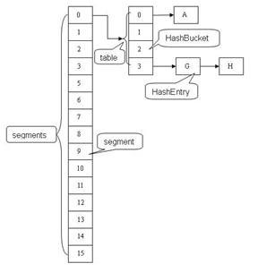

# MAP<K,V>

# 1. 基本知识

## 1. 父类的共有方法

## 1）添加

put(K key, V value)：返回key对应的原来的值，第一次添加就返回null

putAll(Map<? extends K, ? extends V> m)

## 2）删除

clear()

remove(object key) ：返回这个键对应的值，没有返回null	

## 3）判断

containsKey(object key));
containsValue(object value));

isEmpty()

## 4）获取

get(object key)：返回这个键对应的值，没有返回null

size()

Collection<v> coll = values()

entrySet()

keySet()

# 2. Map框架

## 1. hashCode 和 equals 的一些基本约定

- equals 相等，hashCode 一定要相等
- 重写了 hashCode 也要重写 equals。
- hashCode 需要保持一致性，状态改变返回的哈希值仍然要一致。
- equals 的对称、反射、传递等特性。
- compareTo的返回值要和equals一样

## 2. LinkedHashMap

- 是遍历顺序符合插入顺序
- 实现：通过为条目（键值对） 维护一个双向链表。通过特定构造函数，创建反映访问顺序的实例，所谓的put、get、compute 等，都算作“访问”。
- 应用：构建一个空间占用敏感的资源池，自动将最不常被访问的对象释放掉（重写删除方法）。

# 3. 子类种类

- ConcurrentHashMap、HashTable的key，value不可以是null，HashMap的key，value可以是null。

- 因为hashtable,concurrenthashmap它们是用于多线程的，并发的 ，如果map.get(key)得到了null，不能判断到底是映射的value是null,还是因为没有找到对应的key而为空，而用于单线程状态的hashmap却可以用contains（key） 去判断到底是否包含了这个null。  

## 1)HashTable：

- 底层是哈希表数据结构，

- **不可以存入null键null值，**
- **线程同步，jdk1.0的。 效率低**

### Properties：

用来存储键值对型的配置文件的信息，可以和IO技术相结合。 		

## 2)HashMap：

- 底层是哈希表数据结构，
- **可以存入null键null值，**
- **线程不同步，jdk1,2 效率高**

## 3)TreeMap：

- 底层是二叉树数据结构
- 线程不同步，可以用于给map集合中的键进行同步。
- set底层用的就是map集合

# 4. Hashtable、HashMap、TreeMap比较

|              | Hashtable                                                    | HashMap                                                      | TreeMap                                                      |
| ------------ | ------------------------------------------------------------ | ------------------------------------------------------------ | ------------------------------------------------------------ |
| 同步         | 同步                                                         | 不同步                                                       |                                                              |
| 键值类型     | 不支持 null 键和值                                           | 支持 null 键和值                                             | 未实现 Comparator 接口：key 不可以为null；实现 Comparator 接口：若未对null情况进行判断，则key不可以为null。 |
| 底层         | 数组+链表                                                    | 数组+链表                                                    | 红黑树                                                       |
| 操作         |                                                              | put 或者 get: O(n)                                           | get、put、 remove : O(log(n)）                               |
| 初始化与增长 | 默认容量为11；不要求底层数组的容量一 定要为2的整数次幂。将容量变为原来的2倍加1； | 默认容量为16，且要求容量一定为2的整数次幂。将容量变为原来的2倍。 |                                                              |
| 线程安全     | 采用synchronized修饰保证同步。一个线程在访问，其他线程无论做什么都会阻塞（读取） | （1）可以用 Collections的synchronizedMap方法；（2）使用Co ncurrentHashMap类，相较于HashTable锁住的是对象整体， ConcurrentHashMap基于lo ck实现锁分段技术。首先将Map存放的数据分成一段一段的存储方式，然后给每一段数据分 配一把锁，当一个线程占用锁访问其中一个段的数据时，其他段的数据也能被其他线程访 问。ConcurrentHashMap不仅保证了多线程运行环境下的数据访问安全性，而且性能上有 长足的提升。 |                                                              |
| 遍历方式     | Iterator, enumeration                                        | Iterator                                                     |                                                              |
| hash值计算   | 使用对象的hashCode（jdk根据对象的地址或者字符串或者数字算出来的int类型的数值） | 计算hash值                                                   |                                                              |

## 1. HashTable,HashMap对比

1. 继承的父类不同

   Hashtable继承自Dictionary类

   HashMap继承自AbstractMap类，但二者都实现了Map接口

2. 线程安全性不同

   Hashtable是线程安全的，Hashtable 中的方法是Synchronize的。

   HashMap是非线程安全的。一般通过对自然封装该映射的对象进行同步操作来完成。如果不存在这样的对象，则应该使用`Collections.synchronizedMap`方法来“包装”该映射。最好在创建时完成这一操作，以防止对映射进行意外的非同步访问

3. 是否提供contains方法

   Hashtable保留了`contains`，`containsValue`和`containsKey`三个方法，其中`contains`和`containsValue`功能相同

   HashMap把Hashtable的`contains`方法去掉了，改成`containsValue`和`containsKey`，因为`contains`方法容易让人引起误解

4. key和value是否允许null值

   Hashtable中，key和value都不允许出现null值。但是如果在Hashtable中有类似put(null,null)的操作，编译同样可以通过，因为key和value都是Object类型，但运行时会抛出NullPointerException异常，这是JDK的规范规定的

   HashMap中，null可以作为键，这样的键只有一个；可以有一个或多个键所对应的值为null。当get()方法返回null值时，可能是 HashMap中没有该键，也可能使该键所对应的值为null。因此，在HashMap中不能由get()方法来判断HashMap中是否存在某个键， 而应该用containsKey()方法来判断

5. 两个遍历方式的内部实现上不同

6. hash值不同

   HashTable直接使用对象的hashCode（jdk根据对象的地址或者字符串或者数字算出来的int类型的数值）

   HashMap重新计算hash值

7. 内部实现使用的数组初始化和扩容方式不同

## 2. HashMap 的设计和实现细节


- 理解 Map 相关类似整体结构，尤其是有序数据结构的一些要点：HashMap 内部实现基本点分析

  1. 构造函数：设置装载因子、初始容量

  2. put : 调用putVal--创建初始表格（或容量不够时resize）--  对键调用`hashCode()`方法，返回的hashCode用于找到bucket位置来储存Entry对象。

     - resize：容量超过门限值进行调整，最大是2^30.

     - 预先设置的容量：大于“预估元素数量 / 负载因子”，同时它是 2 的幂数。装载因子不要轻易修改，采用JDK自身的。不要超过0.75(显著增加冲突)

     - 如果两个键的hashcode相同如何获取值对象

       找到bucket位置之后，会调用`keys.equals()`方法去找到链表中正确的节点，最终找到要找的值对象

  3. 重新调整HashMap大小存在什么问题

     重新调整HashMap大小的时候存在条件竞争，因为如果两个线程都发现HashMap需要重新调整大小了，它们会同时试着调整大小。在调整大小的过程中，存储在链表中的元素的次序会反过来，因为移动到新的bucket位置的时候，HashMap并不会将元素放在链表的尾部，而是放在头部，这是为了避免尾部遍历(tail traversing)。如果条件竞争发生了，那么就死循环了

  4. 为什么String, Interger这样的wrapper类适合作为键

     因为String是不可变的，也是final的，而且已经重写了`equals()`和`hashCode()`方法了。其他的wrapper类也有这个特点。不可变性是必要的，因为**为了要计算`hashCode()`，就要防止键值改变**，如果键值在放入时和获取时返回不同的hashcode的话，那么就不能从HashMap中找到你想要的对象。不可变性还有其他的优点如线程安全

- 从源码分析 HashMap 的设计和实现要点，理解容量、负载因子等，为什么需要这些参 数，如何影响 Map 的性能，实践中如何取舍等。

- 理解树化改造的相关原理和改进原因。

  1. 对应逻辑在 putVal 和 treeifyBin 中
  2. 如果容量小于 MIN_TREEIFY_CAPACITY，只会进行简单的扩容。
     如果容量大于 MIN_TREEIFY_CAPACITY ，则会进行树化改造。
  3. 为什么 HashMap 要树化呢？
     安全问题：哈希冲突会导致对象被放置到同一个桶里---则会形成一个链表--线性的查询时间影响存取的性能--攻击者会构造哈希冲突的数据--恶意代码利用这些数据大量 与服务器端交互--导致服务器端 CPU 大量占用--哈希碰撞拒绝服务攻击

# 5. 两种取出方式

## 1）keySet：

**取出原理：**返回值类型是Set<K>,，通过keySet方法获取map中所有的键所在的Set集合，再通过Set的迭代器获取到每一个键，再对每一个键通过map集合的get方法获取其对应的值即可。

K,V存的都是对象的引用

```
Map<Integer,String> map = new HashMap<Integer,String>();
map.put(8,"zhaoliu");
map.put(2,"zhaoliu");
Set<Integer> keySet = map.keySet();
Iterator<Integer> it = keySet.iterator();
		
while(it.hasNext()){
	Integer key = it.next();
	String value = map.get(key);
	System.out.println(key+":"+value);
}
```

## 2）EntrySet

原理：通过Map转成set就可以迭代。找到了另一个方法。entrySet。该方法将键和值的映射关系作为对象存储到了Set集合中，而这个映射关系的类型就是Map.Entry类型(结婚证)

Set<Map.Entry>，Map.Entry也是有泛型，要指定实际类型的

```
Set<Map.Entry<Integer, String>> entrySet = map.entrySet();
Iterator<Map.Entry<Integer, String>> it = entrySet.iterator();
		
while(it.hasNext()){
	Map.Entry<Integer, String> me = it.next();
	Integer key = me.getKey();
	String value = me.getValue();
	System.out.println(key+"::::"+value);
}
```

Map.Entry是Map接口中的一个内部接口，实现的时候，map.Entry就是HashMap的内部类。

类似于迭代器，有很多方法。一对k,v就是Map.Entry的一个实例。

```
interface Map
{
	public static interface Entry
	{
		public abstract Object getKey();
		public abstract Object getValues();
	}
}
// 写法1：直接实现内部接口
class ss implements Map.Entry
{
	public  Object getKey();
	public  Object getValues();
}

// 写法2：内部类实现内部接口
class HashMap implements Map
{
	clss hh implements Map.Entry
	{
		public  Object getKey();
		public  Object getValues();
	}
}
```

# 6.JAVA7-hash结构

## HashMap

**整体结构：**数组+单向链表

capacity：当前数组容量，始终保持 2^n，可以扩容，扩容后数组大小为当前的 2 倍。

loadFactor：负载因子，默认为 0.75。

threshold：扩容的阈值，等于 capacity * loadFactor

**数组结构：**每一项都是一个Entry：

```
static class Entry<K,V> implements Map.Entry<K,V> {
        final K key;
        V value;
        Entry<K,V> next;
        int hash;
        
```

**涉及操作：**

get/put/扩容/add/

而Entry应该放在数组的哪一个位置上（这个位置通常称为位桶或者hash桶，即hash值相同的Entry会放在同一位置，用链表相连），是通过key的hashCode来计算的。

```java
final int hash(Object k) {
    int h = hashSeed;
    if (0 != h && k instanceof String) {
        return sun.misc.Hashing.stringHash32((String) k);
    }

    h ^= k.hashCode();
    h ^= (h >>> 20) ^ (h >>> 12);
    return h ^ (h >>> 7) ^ (h >>> 4);
}
```

通过hash计算出来的值将会使用indexFor方法找到它应该所在的table下标：

```
static int indexFor(int h, int length) {
        return h & (length-1);
    }
```

## HashTable

```
private int hash(Object k) {
    // hashSeed will be zero if alternative hashing is disabled.
    return hashSeed ^ k.hashCode();
}

int index = (hash & 0x7FFFFFFF) % tab.length;
```

为啥要把hash值和0x7FFFFFFF做一次按位与操作呢，主要是为了保证得到的index的第一位为0，也就是为了得到一个正数。因为有符号数第一位0代表正数，1代表负数。 

**为什么用取模？**

涉及到HashTable的构造函数和扩容函数了 

HashTable默认的初始大小为11，之后每次扩充为原来的2n+1。

也就是说，HashTable的链表数组的默认大小是一个素数、奇数。之后的每次扩充结果也都是奇数。

由于HashTable会尽量使用素数、奇数作为容量的大小。当哈希表的大小为素数时，简单的取模哈希的结果会更加均匀。（可参考：http://zhaox.github.io/algorithm/2015/06/29/hash）

# 7.JDK1.8ConcurrentHashMap详解

## 1.7的结构

结构：数组+Segment

安全保障：分段锁

分段锁：ConcurrentHashMap中的分段锁称为Segment，它类似于HashMap，内部拥有一个Entry数组，数组中的每个元素又是一个链表,同时又是一个ReentrantLock（Segment继承了ReentrantLock）。

即：ConcurrentHashMap定位一个元素的过程需要进行两次Hash操作。第一次Hash定位到Segment，第二次Hash定位到元素所在的链表的头部

并发度：segment的数量，默认16

## 1.8结构

安全保障：CAS + synchronized
底层结构：数组+链表+红黑树Node

Node：final key, volatile value, volatile next

**与1.7对比的优化：**

1. 加锁粒度小，高并发：原来是对segment枷锁，现在是对每个node加锁
2. 查询复杂度降低：原来是链表遍历O(n)，现在是红黑树O(logN)

## 安全保障

1. 分析ConcurrentHashMap的源码的意义在于可以明白为什么ConcurrentHashMap是线程安全的，以及为实现线程安全，ConcurrentHashMap相比于HashMap增加了哪些内容，

2. HashMap更多的是数据结构上的玩弄，而ConcurrentHashMap则更多的需要考虑如何高效的实现并发环境下的线程安全，ConcurrentHashMap不仅实现了HashMap支持的所有功能，并且保持了和HashMap一样的高效的前提下，还实现了线程安全，

3. ConcurrentHashMap是基于CAS来实现线程安全的，CAS是一种轻量级的锁，它不会阻塞线程，而是会等待直到获得变量，然后进行业务操作。
4. 之前是需要阻塞线程来实现线程安全，需要线程在获得锁之前是阻塞等待的，需要另外的线程来唤醒它让他再次去竞争锁，不够高效。
5. 关于这部分的内容可以参考文章 [Java同步框架AbstractQueuedSynchronizer](https://link.juejin.im/?target=http%3A%2F%2Fwww.jianshu.com%2Fp%2F853b203a8d93)，AQS是java中实现锁的底层支持，也是为程序员实现线程同步的基础框架，基于AQS实现自己的线程同步器十分简便

## Table初始化

时间：在put时，如果table还没有被初始化，就会调用方法initTable来进行table的初始化：

```java
private final Node<K,V>[] initTable() {
    Node<K,V>[] tab; int sc;
    while ((tab = table) == null || tab.length == 0) {
        //小于0说明被其他线程改了
        if ((sc = sizeCtl) < 0)
            //自旋等待
            Thread.yield(); // lost initialization race; just spin
        //CAS修改sizeCtl值为-1
        else if (U.compareAndSwapInt(this, SIZECTL, sc, -1)) {
            try {
                if ((tab = table) == null || tab.length == 0) {
                    int n = (sc > 0) ? sc : DEFAULT_CAPACITY;
                    @SuppressWarnings("unchecked")
                    Node<K,V>[] nt = (Node<K,V>[])new Node<?,?>[n];
                    table = tab = nt;
                    sc = n - (n >>> 2);
                }
            } finally {
                sizeCtl = sc;
            }
            break;
        }
    }
    return tab;
}
```

关键：sizeCtl变量`private transient volatile int sizeCtl;`

1. sizeCtl是一个用于同步多个线程的共享变量，默认0，修改为-1时可以初始化或扩容
2. 如果当前值为负数：table正在被某个线程初始化或者扩容，所以其他线程初始化或扩容需要竞争sizeCtl这个共享变量，获得变量的线程才能进行接下来的操作，否则一直自旋来尝试获得这个共享变量，所以获得sizeCtl这个变量的线程在完成工作之后需要设置回来，使得其他的线程可以走出自旋进行接下来的操作。
3. **注意两次check：**在某个线程通过U.compareAndSwapInt方法设置sizeCtl之前和之后进行了两次check，来检测table是否被初始化过了，这种检测是必须的，因为在并发环境下，可能前一个线程正在初始化table但是还没有成功初始化，也就是table依然还为null，而有一个线程发现table为null他就会进行竞争sizeCtl以进行table初始化，但是当前线程在完成初始化之后，那个试图初始化table的线程获得了sizeCtl，但是此时table已经被初始化了，所以，如果没有再次判断的话，可能会将之后进行put操作的线程的更新覆盖掉，这是极为不安全的行为。

## 查询记录

1. 首先要知道这条记录存储的table的位置，如果该位置为null，说明要查询的记录不存在，否则，就在该位置上的链表或者红黑树中查找记录

```java
public V get(Object key) {
    Node<K,V>[] tab; Node<K,V> e, p; int n, eh; K ek;
    int h = spread(key.hashCode());
    if ((tab = table) != null && (n = tab.length) > 0 &&
        (e = tabAt(tab, (n - 1) & h)) != null) {
        if ((eh = e.hash) == h) {
            if ((ek = e.key) == key || (ek != null && key.equals(ek)))
                return e.val;
        }
        else if (eh < 0)
            return (p = e.find(h, key)) != null ? p.val : null;
        while ((e = e.next) != null) {
            if (e.hash == h &&
                ((ek = e.key) == key || (ek != null && key.equals(ek))))
                return e.val;
        }
    }
    return null;
}
```

2. 首先，计算出记录的key的hashCode，然后通过使用(hashCode & (length - 1))的计算方法来获得该记录在table中的index，然后判断该位置上是否为null，如果为null，则返回null；否则，如果该位置上的第一个元素（链表头节点或者红黑树的根节点）与我们先要查找的记录匹配，则直接返回这个节点的值；否则，如果该节点的hashCode小于0，则说明该位置上是一颗红黑树

```
    static final int TREEBIN   = -2; // hash for roots of trees
        TreeBin(TreeNode<K,V> b) {
            super(TREEBIN, null, null, null);    
             ......   
        }    
```

​	TREEBIN的值为-2，即小于0成立，TREEBIN想要代表的是一颗红黑树的根节点，所以table的某个位置上的第一个节点的hashCode值小于0的时候，就可以判断为该位置上是一棵红黑树，此时通过调用Node的find方法来查找到节点，而这个Node的find方法在子类中被重写，所以会直接调用子类的find方法来进行查找。

3. table的index位置上为一条链表，通过链表的查找方法来查找。允许多个线程一起读，所以没加锁，在Node的实现上，ConcurrentHashMap有所不同：

```
    static class Node<K,V> implements Map.Entry<K,V> {
        final int hash;
        final K key;
        volatile V val;
        volatile Node<K,V> next;
        ....
   }


    /**
     * The array of bins. Lazily initialized upon first insertion.
     * Size is always a power of two. Accessed directly by iterators.
     */
    transient volatile Node<K,V>[] table;
    
```

我们发现table数组是被volatile关键字修饰的，这就代表我们不需要担心table数组的线程可见性问题，也就没有必要再加锁来实现并发了。

## 插入记录

put一个记录的过程：

1. 检查key/value是否为空，如果为空，则抛异常，否则进行2
2. 进入for死循环，进行3
3. 检查table是否初始化了，如果没有，则调用initTable()进行初始化然后进行 2，否则进行4
4. 根据key的hash值计算出其应该在table中储存的位置i，取出table[i]的节点用f表示。根据f的不同有如下三种情况：
   1) 如果table[i]==null(即该位置的节点为空，没有发生碰撞)，
   则利用CAS操作直接存储在该位置，如果CAS操作成功则退出死循环。
   2) 如果table[i]!=null(即该位置已经有其它节点，发生碰撞)，碰撞处理也有两种情况
      2.1）检查table[i]的节点的hash是否等于MOVED，如果等于，则检测到正在扩容，则帮助其扩容
      2.2）说明table[i]的节点的hash值不等于MOVED，如果table[i]为链表节点，则将此节点插入链表中即可
   3) 如果table[i]为树节点，则将此节点插入树中即可。插入成功后，进行5
5. 如果table[i]的节点是链表节点，则检查table的第i个位置的链表是否需要转化为树，如果需要则调用treeifyBin函数进行转化
   1. 第一步根据给定的key的hash值找到其在table中的位置index
   2. 找到位置index后，存储进行就好了。

```java
public V put(K key, V value) {  
        return putVal(key, value, false);  
    }  
  
    /** Implementation for put and putIfAbsent */  
    final V putVal(K key, V value, boolean onlyIfAbsent) {  
            //不允许 key或value为null  
        if (key == null || value == null) throw new NullPointerException();  
        //计算hash值  
        int hash = spread(key.hashCode());  
        int binCount = 0;  
        //死循环 何时插入成功 何时跳出  
        for (Node<K,V>[] tab = table;;) {  
            Node<K,V> f; int n, i, fh;  
            //如果table为空的话，初始化table  
            if (tab == null || (n = tab.length) == 0)  
                tab = initTable();  
            //根据hash值计算出在table里面的位置   
            else if ((f = tabAt(tab, i = (n - 1) & hash)) == null) {  
                //如果这个位置没有值 ，直接放进去，不需要加锁  
                if (casTabAt(tab, i, null,  
                             new Node<K,V>(hash, key, value, null)))  
                    break;                   // no lock when adding to empty bin  
            }  
            //当遇到表连接点时，需要进行整合表的操作  
            else if ((fh = f.hash) == MOVED)  
                tab = helpTransfer(tab, f);  
            else {  
                V oldVal = null;  
                //结点上锁  这里的结点可以理解为hash值相同组成的链表的头结点  
                synchronized (f) {  
                    if (tabAt(tab, i) == f) {  
                        //fh〉0 说明这个节点是一个链表的节点 不是树的节点  
                        if (fh >= 0) {  
                            binCount = 1;  
                            //在这里遍历链表所有的结点  
                            for (Node<K,V> e = f;; ++binCount) {  
                                K ek;  
                                //如果hash值和key值相同  则修改对应结点的value值  
                                if (e.hash == hash &&  
                                    ((ek = e.key) == key ||  
                                     (ek != null && key.equals(ek)))) {  
                                    oldVal = e.val;  
                                    if (!onlyIfAbsent)  
                                        e.val = value;  
                                    break;  
                                }  
                                Node<K,V> pred = e;  
                                //如果遍历到了最后一个结点，那么就证明新的节点需要插入 就把它插入在链表尾部  
                                if ((e = e.next) == null) {  
                                    pred.next = new Node<K,V>(hash, key,  
                                                              value, null);  
                                    break;  
                                }  
                            }  
                        }  
                        //如果这个节点是树节点，就按照树的方式插入值  
                        else if (f instanceof TreeBin) {  
                            Node<K,V> p;  
                            binCount = 2;  
                            if ((p = ((TreeBin<K,V>)f).putTreeVal(hash, key,  
                                                           value)) != null) {  
                                oldVal = p.val;  
                                if (!onlyIfAbsent)  
                                    p.val = value;  
                            }  
                        }  
                    }  
                }  
                if (binCount != 0) {  
                    //如果链表长度已经达到临界值8 就需要把链表转换为树结构  
                    if (binCount >= TREEIFY_THRESHOLD)  
                        treeifyBin(tab, i);  
                    if (oldVal != null)  
                        return oldVal;  
                    break;  
                }  
            }  
        }  
        //将当前ConcurrentHashMap的元素数量+1  
        addCount(1L, binCount);  
        return null;  
    }   
```

## 记录数量更新

1. 在完成一次put操作之后，需要更新table中的记录数量，并且在更新之后如果发现超出了阈值，那么就需要进行table扩容操作。

2. 更新记录数量的操作通过调用方法addCount来完成
3. ConcurrentHashMap维护baseCount来表示当前的记录数量，在size方法中会用到，在put操作和remove操作的时候会通过调用方法addCount来更新它。
4. 如果CounterCell数组为空，则通过调用方法fullAddCount来初始化数组counterCells。当记录的数量达到了阈值，需要进行扩容操作，扩容需要使用transfer方法来将久的记录迁移到新的table中去。

```java
private final void addCount(long x, int check) {
    CounterCell[] as; long b, s;
    if ((as = counterCells) != null ||
        !U.compareAndSwapLong(this, BASECOUNT, b = baseCount, s = b + x)) {
        CounterCell a; long v; int m;
        boolean uncontended = true;
        if (as == null || (m = as.length - 1) < 0 ||
            (a = as[ThreadLocalRandom.getProbe() & m]) == null ||
            !(uncontended =
              U.compareAndSwapLong(a, CELLVALUE, v = a.value, v + x))) {
            fullAddCount(x, uncontended);
            return;
        }
        if (check <= 1)
            return;
        s = sumCount();
    }
    if (check >= 0) {
        Node<K,V>[] tab, nt; int n, sc;
        while (s >= (long)(sc = sizeCtl) && (tab = table) != null &&
               (n = tab.length) < MAXIMUM_CAPACITY) {
            int rs = resizeStamp(n);
            if (sc < 0) {
                if ((sc >>> RESIZE_STAMP_SHIFT) != rs || sc == rs + 1 ||
                    sc == rs + MAX_RESIZERS || (nt = nextTable) == null ||
                    transferIndex <= 0)
                    break;
                if (U.compareAndSwapInt(this, SIZECTL, sc, sc + 1))
                    transfer(tab, nt);
            }
            else if (U.compareAndSwapInt(this, SIZECTL, sc,
                                         (rs << RESIZE_STAMP_SHIFT) + 2))
                transfer(tab, null);
            s = sumCount();
        }
    }
}
```

## 移除记录

1. 删除操作属于写类型的操作，此时要对table中的index位置加锁，ConcurrentHashMap使用synchronized关键字将table中的index位置锁住，然后进行删除，
2. remove方法调用了replaceNode方法来进行实际的操作，而删除操作的步骤首先依然是计算记录的hashCode，然后根据hashCode来计算table中的index值，然后根据table中的index位置上是一条链表还是一棵红黑树来使用不同的方法来删除这个记录
3. 删除记录的操作需要进行记录数量的更新（调用addCount方法进行）。

```java
public V remove(Object key) {
    return replaceNode(key, null, null);
}

final V replaceNode(Object key, V value, Object cv) {
    int hash = spread(key.hashCode());
    for (Node<K,V>[] tab = table;;) {
        Node<K,V> f; int n, i, fh;
        if (tab == null || (n = tab.length) == 0 ||
            (f = tabAt(tab, i = (n - 1) & hash)) == null)
            break;
        else if ((fh = f.hash) == MOVED)
            tab = helpTransfer(tab, f);
        else {
            V oldVal = null;
            boolean validated = false;
            synchronized (f) {
                if (tabAt(tab, i) == f) {
                    if (fh >= 0) {
                        validated = true;
                        for (Node<K,V> e = f, pred = null;;) {
                            K ek;
                            if (e.hash == hash &&
                                ((ek = e.key) == key ||
                                 (ek != null && key.equals(ek)))) {
                                V ev = e.val;
                                if (cv == null || cv == ev ||
                                    (ev != null && cv.equals(ev))) {
                                    oldVal = ev;
                                    if (value != null)
                                        e.val = value;
                                    else if (pred != null)
                                        pred.next = e.next;
                                    else
                                        setTabAt(tab, i, e.next);
                                }
                                break;
                            }
                            pred = e;
                            if ((e = e.next) == null)
                                break;
                        }
                    }
                    else if (f instanceof TreeBin) {
                        validated = true;
                        TreeBin<K,V> t = (TreeBin<K,V>)f;
                        TreeNode<K,V> r, p;
                        if ((r = t.root) != null &&
                            (p = r.findTreeNode(hash, key, null)) != null) {
                            V pv = p.val;
                            if (cv == null || cv == pv ||
                                (pv != null && cv.equals(pv))) {
                                oldVal = pv;
                                if (value != null)
                                    p.val = value;
                                else if (t.removeTreeNode(p))
                                    setTabAt(tab, i, untreeify(t.first));
                            }
                        }
                    }
                }
            }
            if (validated) {
                if (oldVal != null) {
                    if (value == null)
                        addCount(-1L, -1);
                    return oldVal;
                }
                break;
            }
        }
    }
    return null;
}
```

## size方法详解

ConcurrentHashMap通过size方法来获得table中的记录数量

```java
public int size() {
    long n = sumCount();
    return ((n < 0L) ? 0 :
            (n > (long)Integer.MAX_VALUE) ? Integer.MAX_VALUE :
            (int)n);
}


final long sumCount() {
    // 部分元素变化的个数保存在此数组中
    CounterCell[] as = counterCells; CounterCell a;
    //记录的元素个数
    long sum = baseCount;
    if (as != null) {
        for (int i = 0; i < as.length; ++i) {
            if ((a = as[i]) != null)
                sum += a.value;
        }
    }
    return sum;
}
```

ConcurrentHashMap的记录数量需要结合baseCount和counterCells数组来得到，通过累计两者的数量即可获得当前ConcurrentHashMap中的记录总量。

在put方法结尾调用了addCount方法，使用unsafe的CAS操作给当前ConcurrentHashMap的元素个数baseCount+1。如果check>=0，检测是否需要扩容。

counterCell这个类需要防止“伪共享”：缓存系统中是以缓存行（cache line）为单位存储的。缓存行是2的整数幂个连续字节，一般为32-256个字节。最常见的缓存行大小是64个字节。当多线程修改互相独立的变量时，如果这些变量共享同一个缓存行，就会无意中影响彼此的性能，这就是伪共享。

# 8. JAVA8-HashMap

 

## 概述

- HashMap是一个数组+哈希表的结构。线程不安全，key,value可以为null。遍历无序

- 链表长度为8就会转换为红黑树，最坏情况下的性能从`O(n)`提高到`O(logn)` 。提高查询，插入效率。实现了`Map<K,V>, Cloneable, Serializable`接口 

   

- 扩容前后，哈希桶的**长度一定会是2的次方**。  这样在根据key的hash值寻找对应的哈希桶时，可以**用位运算替代取余操作**，**更加高效**。 

- HashMap的源码中，充斥个各种位运算代替常规运算的地方，以提升效率： 

  * 与运算替代模运算。用 hash & (table.length-1) 替代 hash % (table.length) 
  * 用if ((e.hash & oldCap) == 0)判断扩容后，节点e处于低区还是高区。

## **节点结构**

Entry的名字变成了Node，原因是和红黑树的实现TreeNode相关联。 

```
transient Node<K,V>[] table;
当冲突节点数不小于8-1时，转换成红黑树。
static final int TREEIFY_THRESHOLD = 8;
```

- 链表的结构

```java
static class Node<K,V> implements Map.Entry<K,V> {
    final int hash;//哈希值
    final K key;//key
    V value;//value
    Node<K,V> next;//链表后置节点

    Node(int hash, K key, V value, Node<K,V> next) {
        this.hash = hash;
        this.key = key;
        this.value = value;
        this.next = next;
    }

    public final K getKey()        { return key; }
    public final V getValue()      { return value; }
    public final String toString() { return key + "=" + value; }

    //每一个节点的hashcode值，是将key的hashCode 和 value的hashCode 亦或得到的。
    public final int hashCode() {
        return Objects.hashCode(key) ^ Objects.hashCode(value);
    }
    
    //设置新的value 同时返回旧value
    public final V setValue(V newValue) {
        V oldValue = value;
        value = newValue;
        return oldValue;
    }

    public final boolean equals(Object o) {
        if (o == this)
            return true;
        if (o instanceof Map.Entry) {
            Map.Entry<?,?> e = (Map.Entry<?,?>)o;
            if (Objects.equals(key, e.getKey()) &&
                Objects.equals(value, e.getValue()))
                return true;
        }
        return false;
    }
}
```

1. 每一个节点的hash值，是将key的hashCode 和 value的hashCode 亦或得到的。

## 构造方法

```java
//最大容量 2的30次方
static final int MAXIMUM_CAPACITY = 1 << 30;
//默认的加载因子
static final float DEFAULT_LOAD_FACTOR = 0.75f;
// 默认容量
static final int DEFAULT_INITIAL_CAPACITY = 1 << 4; // aka 16
//哈希桶，存放链表。 长度是2的N次方，或者初始化时为0.
transient Node<K,V>[] table;

//加载因子，用于计算哈希表元素数量的阈值。threshold = 哈希桶.length * loadFactor;
final float loadFactor;
//哈希表内元素数量的阈值，当哈希表内元素数量超过阈值时，会发生扩容resize()。
int threshold;

public HashMap() {
    //默认构造函数，赋值加载因子为默认的0.75f
    this.loadFactor = DEFAULT_LOAD_FACTOR; // all other fields defaulted
}
public HashMap(int initialCapacity) {
    //指定初始化容量的构造函数
    this(initialCapacity, DEFAULT_LOAD_FACTOR);
}
//同时指定初始化容量 以及 加载因子， 用的很少，一般不会修改loadFactor
public HashMap(int initialCapacity, float loadFactor) {
    //边界处理
    if (initialCapacity < 0)
        throw new IllegalArgumentException("Illegal initial capacity: " +
                                           initialCapacity);
    //初始容量最大不能超过2的30次方
    if (initialCapacity > MAXIMUM_CAPACITY)
        initialCapacity = MAXIMUM_CAPACITY;
    //显然加载因子不能为负数
    if (loadFactor <= 0 || Float.isNaN(loadFactor))
        throw new IllegalArgumentException("Illegal load factor: " +
                                           loadFactor);
    this.loadFactor = loadFactor;
    //设置阈值为  》=初始化容量的 2的n次方的值
    this.threshold = tableSizeFor(initialCapacity);
}
//新建一个哈希表，同时将另一个map m 里的所有元素加入表中
public HashMap(Map<? extends K, ? extends V> m) {
    this.loadFactor = DEFAULT_LOAD_FACTOR;
    putMapEntries(m, false);
}
//根据期望容量cap，返回2的n次方形式的 哈希桶的实际容量 length。 返回值一般会>=cap 
static final int tableSizeFor(int cap) {
    //经过下面的 或 和位移 运算， n最终各位都是1。
    int n = cap - 1;
    n |= n >>> 1;
    n |= n >>> 2;
    n |= n >>> 4;
    n |= n >>> 8;
    n |= n >>> 16;
    //判断n是否越界，返回 2的n次方作为 table（哈希桶）的阈值
    return (n < 0) ? 1 : (n >= MAXIMUM_CAPACITY) ? MAXIMUM_CAPACITY : n + 1;
}
//将另一个Map的所有元素加入表中，参数evict初始化时为false，其他情况为true
final void putMapEntries(Map<? extends K, ? extends V> m, boolean evict) {
    //拿到m的元素数量
    int s = m.size();
    //如果数量大于0
    if (s > 0) {
        //如果当前表是空的
        if (table == null) { // pre-size
            //根据m的元素数量和当前表的加载因子，计算出阈值
            float ft = ((float)s / loadFactor) + 1.0F;
            //修正阈值的边界 不能超过MAXIMUM_CAPACITY
            int t = ((ft < (float)MAXIMUM_CAPACITY) ?
                     (int)ft : MAXIMUM_CAPACITY);
            //如果新的阈值大于当前阈值
            if (t > threshold)
                //返回一个 》=新的阈值的 满足2的n次方的阈值
                threshold = tableSizeFor(t);
        }
        //如果当前元素表不是空的，但是 m的元素数量大于阈值，说明一定要扩容。
        else if (s > threshold)
            resize();
        //遍历 m 依次将元素加入当前表中。
        for (Map.Entry<? extends K, ? extends V> e : m.entrySet()) {
            K key = e.getKey();
            V value = e.getValue();
            putVal(hash(key), key, value, false, evict);
        }
    }
}
```

**扩容：**

1. 当`HashMap`的容量达到`threshold`域值时，就会触发扩容。扩容前后，哈希桶的**长度一定会是2的次方**。  
2. 扩容操作时，会new一个新的`Node`数组作为哈希桶，然后将原哈希表中的所有数据(`Node`节点)移动到新的哈希桶中，相当于对原哈希表中所有的数据重新做了一个put操作。所以性能消耗很大，**可想而知，在哈希表的容量越大时，性能消耗越明显。** 
3. 初始化或加倍桶大小：如果当前哈希桶是null，分配符合当前阈值的初始容量目标，否则，扩容为现在的2倍。
4. 扩容时：**要注意区分以前在哈希桶相同index的节点，现在是在以前的index里，还是index+oldlength 里** 

```java
final Node<K,V>[] resize() {
    //oldTab 为当前表的哈希桶
    Node<K,V>[] oldTab = table;
    //当前哈希桶的容量 length
    int oldCap = (oldTab == null) ? 0 : oldTab.length;
    //当前的阈值
    int oldThr = threshold;
    //初始化新的容量和阈值为0
    int newCap, newThr = 0;
    //如果当前容量大于0
    if (oldCap > 0) {
        //如果当前容量已经到达上限
        if (oldCap >= MAXIMUM_CAPACITY) {
            //则设置阈值是2的31次方-1
            threshold = Integer.MAX_VALUE;
            //同时返回当前的哈希桶，不再扩容
            return oldTab;
        }//否则新的容量为旧的容量的两倍。 
        else if ((newCap = oldCap << 1) < MAXIMUM_CAPACITY &&
                 oldCap >= DEFAULT_INITIAL_CAPACITY)//如果旧的容量大于等于默认初始容量16
            //那么新的阈值也等于旧的阈值的两倍
            newThr = oldThr << 1; // double threshold
    }//如果当前表是空的，但是有阈值。代表是初始化时指定了容量、阈值的情况
    else if (oldThr > 0) // initial capacity was placed in threshold
        newCap = oldThr;//那么新表的容量就等于旧的阈值
    else {}//如果当前表是空的，而且也没有阈值。代表是初始化时没有任何容量/阈值参数的情况               // zero initial threshold signifies using defaults
    newCap = DEFAULT_INITIAL_CAPACITY;//此时新表的容量为默认的容量 16
    newThr = (int)(DEFAULT_LOAD_FACTOR * DEFAULT_INITIAL_CAPACITY);//新的阈值为默认容量16 * 默认加载因子0.75f = 12
}
if (newThr == 0) {//如果新的阈值是0，对应的是  当前表是空的，但是有阈值的情况
    float ft = (float)newCap * loadFactor;//根据新表容量 和 加载因子 求出新的阈值
    //进行越界修复
    newThr = (newCap < MAXIMUM_CAPACITY && ft < (float)MAXIMUM_CAPACITY ?
              (int)ft : Integer.MAX_VALUE);
}
//更新阈值 
threshold = newThr;
@SuppressWarnings({"rawtypes","unchecked"})
//根据新的容量 构建新的哈希桶
Node<K,V>[] newTab = (Node<K,V>[])new Node[newCap];
//更新哈希桶引用
table = newTab;
//如果以前的哈希桶中有元素
//下面开始将当前哈希桶中的所有节点转移到新的哈希桶中
if (oldTab != null) {
    //遍历老的哈希桶
    for (int j = 0; j < oldCap; ++j) {
        //取出当前的节点 e
        Node<K,V> e;
        //如果当前桶中有元素,则将链表赋值给e
        if ((e = oldTab[j]) != null) {
            //将原哈希桶置空以便GC
            oldTab[j] = null;
            //如果当前链表中就一个元素，（没有发生哈希碰撞）
            if (e.next == null)
                //直接将这个元素放置在新的哈希桶里。
                //注意这里取下标 是用 哈希值 与 桶的长度-1 。 由于桶的长度是2的n次方，这么做其实是等于 一个模运算。但是效率更高
                newTab[e.hash & (newCap - 1)] = e;
            //如果发生过哈希碰撞 ,而且是节点数超过8个，转化成了红黑树（暂且不谈 避免过于复杂， 后续专门研究一下红黑树）
            else if (e instanceof TreeNode)
                ((TreeNode<K,V>)e).split(this, newTab, j, oldCap);
            //如果发生过哈希碰撞，节点数小于8个。则要根据链表上每个节点的哈希值，依次放入新哈希桶对应下标位置。
            else { // preserve order
                //因为扩容是容量翻倍，所以原链表上的每个节点，现在可能存放在原来的下标，即low位， 或者扩容后的下标，即high位。 high位=  low位+原哈希桶容量
                //低位链表的头结点、尾节点
                Node<K,V> loHead = null, loTail = null;
                //高位链表的头节点、尾节点
                Node<K,V> hiHead = null, hiTail = null;
                Node<K,V> next;//临时节点 存放e的下一个节点
                do {
                    next = e.next;
                    //这里又是一个利用位运算 代替常规运算的高效点： 利用哈希值 与 旧的容量，可以得到哈希值去模后，是大于等于oldCap还是小于oldCap，等于0代表小于oldCap，应该存放在低位，否则存放在高位
                    if ((e.hash & oldCap) == 0) {
                        //给头尾节点指针赋值
                        if (loTail == null)
                            loHead = e;
                        else
                            loTail.next = e;
                        loTail = e;
                    }//高位也是相同的逻辑
                    else {
                        if (hiTail == null)
                            hiHead = e;
                        else
                            hiTail.next = e;
                        hiTail = e;
                    }//循环直到链表结束
                } while ((e = next) != null);
                //将低位链表存放在原index处，
                if (loTail != null) {
                    loTail.next = null;
                    newTab[j] = loHead;
                }
                //将高位链表存放在新index处
                if (hiTail != null) {
                    hiTail.next = null;
                    newTab[j + oldCap] = hiHead;
                }
            }
        }
    }
}
return newTab;
}
```

- 扩容说明

假设两个节点Hash 值分别为：5，21 二进制形式分别为（0101，10101）。初始容量为 16，进行扩容之后的容量为 32。坐标点的计算（计算规则 ：e.hash & (newCap - 1)）：

1. 没有进行扩容时：

 

可以看到两个Hash值所计算的坐标是相同的。

2. 进行扩容之后：

   扩容后应该的坐标为：第二个坐标点增加了 oldCap 个长度。

 

​	源码中为e.hash & oldCap 所计算出的结果：

 

​		即 e.hash & oldCap == 0 是，原来的坐标没有发生变化，e.hash & oldCap != 0 在原来坐标的前提下增加 oldCap 。

## 常用API

**增、改**

往表中插入或覆盖一个key-value. put 调用putVal, putVal中：若当前table不存在，先调用resize()方法创建一个table，然后调用newNode将节点加入。

resize()方法中：若当前表中没有元素，根据定义一个table，大小为初始capacity,默认16.

```java
public V put(K key, V value) {
    //先根据key，取得hash值。 再调用上一节的方法插入节点
    return putVal(hash(key), key, value, false, true);
}
```

- 往哈希表里插入一个节点的`putVal`函数,如果参数`onlyIfAbsent`是true，那么不会覆盖相同key的值value。如果`evict`是false。那么表示是在初始化时调用的 

```java
final V putVal(int hash, K key, V value, boolean onlyIfAbsent,
               boolean evict) {
    //tab存放 当前的哈希桶， p用作临时链表节点  
    Node<K,V>[] tab; Node<K,V> p; int n, i;
    //如果当前哈希表是空的，代表是初始化
    if ((tab = table) == null || (n = tab.length) == 0)
        //那么直接去扩容哈希表，并且将扩容后的哈希桶长度赋值给n
        n = (tab = resize()).length;
    //如果当前index的节点是空的，表示没有发生哈希碰撞。 直接构建一个新节点Node，挂载在index处即可。
    //这里再啰嗦一下，index 是利用 哈希值 & 哈希桶的长度-1，替代模运算
    if ((p = tab[i = (n - 1) & hash]) == null)
        tab[i] = newNode(hash, key, value, null);
    else {//否则 发生了哈希冲突。
        //e
        Node<K,V> e; K k;
        //如果哈希值相等，key也相等，则是覆盖value操作
        if (p.hash == hash &&
            ((k = p.key) == key || (key != null && key.equals(k))))
            e = p;//将当前节点引用赋值给e
        else if (p instanceof TreeNode)//红黑树暂且不谈
            e = ((TreeNode<K,V>)p).putTreeVal(this, tab, hash, key, value);
        else {//不是覆盖操作，则插入一个普通链表节点
            //遍历链表
            for (int binCount = 0; ; ++binCount) {
                if ((e = p.next) == null) {//遍历到尾部，追加新节点到尾部
                    p.next = newNode(hash, key, value, null);
                    //如果追加节点后，链表数量》=8，则转化为红黑树
                    if (binCount >= TREEIFY_THRESHOLD - 1) // -1 for 1st
                        treeifyBin(tab, hash);
                    break;
                }
                //如果找到了要覆盖的节点
                if (e.hash == hash &&
                    ((k = e.key) == key || (key != null && key.equals(k))))
                    break;
                p = e;
            }
        }
        //如果e不是null，说明有需要覆盖的节点，
        if (e != null) { // existing mapping for key
            //则覆盖节点值，并返回原oldValue
            V oldValue = e.value;
            if (!onlyIfAbsent || oldValue == null)
                e.value = value;
            //这是一个空实现的函数，用作LinkedHashMap重写使用。
            afterNodeAccess(e);
            return oldValue;
        }
    }
    //如果执行到了这里，说明插入了一个新的节点，所以会修改modCount，以及返回null。

    //修改modCount
    ++modCount;
    //更新size，并判断是否需要扩容。
    if (++size > threshold)
        resize();
    //这是一个空实现的函数，用作LinkedHashMap重写使用。
    afterNodeInsertion(evict);
    return null;
}
```

- `newNode`如下：构建一个链表节点

  ```java
  // Create a regular (non-tree) node
  Node<K,V> newNode(int hash, K key, V value, Node<K,V> next) {
      return new Node<>(hash, key, value, next);
  }
  ```

```java
// Callbacks to allow LinkedHashMap post-actions
void afterNodeAccess(Node<K,V> p) { }
void afterNodeInsertion(boolean evict) { }
```

这个根据key取hash值的函数也要关注一下，它称之为“扰动函数”

    static final int hash(Object key) {
        int h;
        return (key == null) ? 0 : (h = key.hashCode()) ^ (h >>> 16);
    }
往表中插入 key-value, 若key对应的value之前存在，不会覆盖。（jdk8增加的方法）

```
 @Override
    public V putIfAbsent(K key, V value) {
        return putVal(hash(key), key, value, true, true);
    }
```

**删**

- 如果key对应的value存在，则删除这个键值对。 并返回value。如果不存在返回null。

  ```java
  public V remove(Object key) {
      Node<K,V> e;
      return (e = removeNode(hash(key), key, null, false, true)) == null ?
          null : e.value;
  }
  ```

- 如果参数`matchValue`是true，则必须key 、value都相等才删除。  

- 如果`movable`参数是false，在删除节点时，不移动其他节点 

**查**

```
public V get(Object key) {
        Node<K,V> e;
        //传入扰动后的哈希值 和 key 找到目标节点Node
        return (e = getNode(hash(key), key)) == null ? null : e.value;
    }
```

**遍历：**

顺序是按照哈希桶从低到高，链表从前往后，依次遍历的。属于**无序**集合。 

```java
//缓存 entrySet
transient Set<Map.Entry<K,V>> entrySet;
*/
    public Set<Map.Entry<K,V>> entrySet() {
    Set<Map.Entry<K,V>> es;
    return (es = entrySet) == null ? (entrySet = new EntrySet()) : es;
}
final class EntrySet extends AbstractSet<Map.Entry<K,V>> {
    public final int size()                 { return size; }
    public final void clear()               { HashMap.this.clear(); }
    //一般我们用到EntrySet，都是为了获取iterator
    public final Iterator<Map.Entry<K,V>> iterator() {
        return new EntryIterator();
    }
    //最终还是调用getNode方法
    public final boolean contains(Object o) {
        if (!(o instanceof Map.Entry))
            return false;
        Map.Entry<?,?> e = (Map.Entry<?,?>) o;
        Object key = e.getKey();
        Node<K,V> candidate = getNode(hash(key), key);
        return candidate != null && candidate.equals(e);
    }
    //最终还是调用removeNode方法
    public final boolean remove(Object o) {
        if (o instanceof Map.Entry) {
            Map.Entry<?,?> e = (Map.Entry<?,?>) o;
            Object key = e.getKey();
            Object value = e.getValue();
            return removeNode(hash(key), key, value, true, true) != null;
        }
        return false;
    }

}
```

## Hash值

key的hash值，是key对象的`hashCode()`经过**扰动函数**的结果，以使hash值更加均衡。  `hashCode()`是`int`类型，取值范围是40多亿，只要哈希函数映射的比较均匀松散，碰撞几率是很小的。  

## 扰动函数

计算下标方法：

```java
static final int hash(Object key) {
    int h;
    return (key == null) ? 0 : (h = key.hashCode()) ^ (h >>> 16);
}
// 找到数组中的下标 = h % length
static int indexFor(int h, int length) {
    return h & (length-1);
}
```

**这个方法其实相当于对table.length取模。这样揭示了为什么HashMap的数组长度要取2的整数次幂，**这样（数组长度-1）就相当于一个低位掩码，与操作的结果就是散列值高位归零，只保留低位值来做数组下标。

但还会有散列冲突，以下就是**“扰动函数”**

 

右移16位，正好是32bit的一般，自己的高半区与低半区异或，就是为了混合哈希值的高位和地位，增加低位的随机性。并且混合后的值也变相保持了高位的特征。

 Peter Lawley在文章《An introduction to optimising a hashing strategy》中做实验 

## 与HashTable的区别

- 与之相比HashTable是线程安全的，且不允许key、value是null。
- HashTable默认容量是11。
- HashTable是直接使用key的hashCode(key.hashCode())作为hash值，不像HashMap内部使用static final int hash(Object key)扰动函数对key的hashCode进行扰动后作为hash值。
- HashTable取哈希桶下标是直接用模运算%.（因为其默认容量也不是2的n次方。所以也无法用位运算替代模运算）
- 扩容时，新容量是原来的2倍+1。int newCapacity = (oldCapacity << 1) + 1;
- Hashtable是Dictionary的子类同时也实现了Map接口，HashMap是Map接口的一个实现类

# 9.JAVA1.7-ConcurrentHashMap

## 1. 实现原理

ConcurrentHashMap使用分段锁技术，将数据分成一段一段的存储，然后给每一段数据配一把锁，当一个线程占用锁访问其中一个段数据的时候，其他段的数据也能被其他线程访问，能够实现真正的并发访问。：

 



从图中可以看到，ConcurrentHashMap内部分为很多个Segment，每一个Segment拥有一把锁，然后每个Segment（继承ReentrantLock）

```
static final class Segment<K,V> extends ReentrantLock implements Serializable
```

Segment继承了ReentrantLock，表明每个segment都可以当做一个锁。这样对每个segment中的数据需要同步操作的话都是使用每个segment容器对象自身的锁来实现。

Segment下面包含很多个HashEntry列表数组。对于一个key，需要经过三次hash操作，才能最终定位这个元素的位置，这三次hash分别为：

1. 对于一个key，先进行一次hash操作，得到hash值h1，也即h1 = hash1(key)；
2. 将得到的h1的高几位进行第二次hash，得到hash值h2，也即h2 = hash2(h1高几位)，通过h2能够确定该元素的放在哪个Segment；
3. 将得到的h1进行第三次hash，得到hash值h3，也即h3 = hash3(h1)，通过h3能够确定该元素放置在哪个HashEntry。

ConcurrentHashMap中主要实体类就是三个：ConcurrentHashMap（整个Hash表）,Segment（桶），HashEntry（节点），对应上面的图可以看出之间的关系

```
/** 
* The segments, each of which is a specialized hash table 
*/  
final Segment<K,V>[] segments;
```

ConcurrentHashMap保证HashEntry不可变。HashEntry代表每个hash链中的一个节点，其结构如下所示：

```
static final class HashEntry<K,V> {  
     final K key;  
     final int hash;  
     volatile V value;  
     volatile HashEntry<K,V> next;  
 }
```

**JDK 1.6中**，HashEntry中的next指针也定义为final，并且每次插入将新添加节点作为链的头节点（同HashMap实现）

而HashMap中的Entry只有key是final的

```java
static class Entry<K,V> implements Map.Entry<K,V> {
    final K key;
    V value;
    Entry<K,V> next;
    int hash;
}
```

**不变模式（immutable）**是多线程安全里最简单的一种保障方式。因为你拿他没有办法，想改变它也没有机会。
不变模式主要通过final关键字来限定的。在JMM中final关键字还有特殊的语义。Final域使得确保初始化安全性（initialization safety）成为可能，初始化安全性让不可变形对象不需要同步就能自由地被访问和共享。

### 1.1 初始化

先看看ConcurrentHashMap的初始化做了哪些事情，构造函数的源码如下：

```java
    public ConcurrentHashMap(int initialCapacity,
                                 float loadFactor, int concurrencyLevel) {
            if (!(loadFactor > 0) || initialCapacity < 0 || concurrencyLevel <= 0)
                throw new IllegalArgumentException();
            if (concurrencyLevel > MAX_SEGMENTS)
                concurrencyLevel = MAX_SEGMENTS;
            // Find power-of-two sizes best matching arguments
            int sshift = 0;
            int ssize = 1;
            while (ssize < concurrencyLevel) {
                ++sshift;
                ssize <<= 1;
            }
            this.segmentShift = 32 - sshift;
            this.segmentMask = ssize - 1;
            if (initialCapacity > MAXIMUM_CAPACITY)
                initialCapacity = MAXIMUM_CAPACITY;
            int c = initialCapacity / ssize;
            if (c * ssize < initialCapacity)
                ++c;
            int cap = MIN_SEGMENT_TABLE_CAPACITY;
            while (cap < c)
                cap <<= 1;
            // create segments and segments[0]
            Segment<K,V> s0 =
                new Segment<K,V>(loadFactor, (int)(cap * loadFactor),
                                 (HashEntry<K,V>[])new HashEntry[cap]);
            Segment<K,V>[] ss = (Segment<K,V>[])new Segment[ssize];
            UNSAFE.putOrderedObject(ss, SBASE, s0); // ordered write of segments[0]
            this.segments = ss;
        }
```

传入的参数有initialCapacity，loadFactor，concurrencyLevel这三个。

- initialCapacity表示新创建的这个ConcurrentHashMap的初始容量，也就是上面的结构图中的Entry数量。默认值为static final int DEFAULT_INITIAL_CAPACITY = 16;
- loadFactor表示负载因子，就是当ConcurrentHashMap中的元素个数大于loadFactor * 最大容量时就需要rehash，扩容。默认值为static final float DEFAULT_LOAD_FACTOR = 0.75f;
- concurrencyLevel表示并发级别，这个值用来确定Segment的个数，Segment的个数是大于等于concurrencyLevel的第一个2的n次方的数。比如，如果concurrencyLevel为12，13，14，15，16这些数，则Segment的数目为16(2的4次方)。默认值为static final int DEFAULT_CONCURRENCY_LEVEL = 16;。理想情况下ConcurrentHashMap的真正的并发访问量能够达到concurrencyLevel，因为有concurrencyLevel个Segment，假如有concurrencyLevel个线程需要访问Map，并且需要访问的数据都恰好分别落在不同的Segment中，则这些线程能够无竞争地自由访问（因为他们不需要竞争同一把锁），达到同时访问的效果。这也是为什么这个参数起名为“并发级别”的原因。

初始化的一些动作：

1. 验证参数的合法性，如果不合法，直接抛出异常。
2. concurrencyLevel也就是Segment的个数不能超过规定的最大Segment的个数，默认值为static final int MAX_SEGMENTS = 1 << 16;，如果超过这个值，设置为这个值。
3. 然后使用循环找到大于等于concurrencyLevel的第一个2的n次方的数ssize，这个数就是Segment数组的大小，并记录一共向左按位移动的次数sshift，并令segmentShift = 32 - sshift，并且segmentMask的值等于ssize - 1，segmentMask的各个二进制位都为1，目的是之后可以通过key的hash值与这个值做&运算确定Segment的索引。
4. 检查给的容量值是否大于允许的最大容量值，如果大于该值，设置为该值。最大容量值为static final int MAXIMUM_CAPACITY = 1 << 30;。
5. 然后计算每个Segment平均应该放置多少个元素，这个值c是向上取整的值。比如初始容量为15，Segment个数为4，则每个Segment平均需要放置4个元素。
6. 最后创建一个Segment实例，将其当做Segment数组的第一个元素。

### 1.2 put操作

put操作的源码如下：

```
public V put(K key, V value) {
      Segment<K,V> s;
      if (value == null)
          throw new NullPointerException();
      int hash = hash(key);
      int j = (hash >>> segmentShift) & segmentMask;
      if ((s = (Segment<K,V>)UNSAFE.getObject          // nonvolatile; recheck
           (segments, (j << SSHIFT) + SBASE)) == null) //  in ensureSegment
          s = ensureSegment(j);
      return s.put(key, hash, value, false);
  }
```

操作步骤如下：

1. 判断value是否为null，如果为null，直接抛出异常。
2. key通过一次hash运算得到一个hash值。(这个hash运算下文详说)
3. 将得到hash值向右按位移动segmentShift位，然后再与segmentMask做&运算得到segment的索引j。
   在初始化的时候我们说过segmentShift的值等于32-sshift，例如concurrencyLevel等于16，则sshift等于4，则segmentShift为28。hash值是一个32位的整数，将其向右移动28位就变成这个样子：
   0000 0000 0000 0000 0000 0000 0000 xxxx，然后再用这个值与segmentMask做&运算，也就是取最后四位的值。这个值确定Segment的索引。
4. 使用Unsafe的方式从Segment数组中获取该索引对应的Segment对象。
5. 向这个Segment对象中put值，这个put操作也基本是一样的步骤（通过&运算获取HashEntry的索引，然后set）。

```
final V put(K key, int hash, V value, boolean onlyIfAbsent) {
            HashEntry<K,V> node = tryLock() ? null :
                scanAndLockForPut(key, hash, value);
            V oldValue;
            try {
                HashEntry<K,V>[] tab = table;
                int index = (tab.length - 1) & hash;
                HashEntry<K,V> first = entryAt(tab, index);
                for (HashEntry<K,V> e = first;;) {
                    if (e != null) {
                        K k;
                        if ((k = e.key) == key ||
                            (e.hash == hash && key.equals(k))) {
                            oldValue = e.value;
                            if (!onlyIfAbsent) {
                                e.value = value;
                                ++modCount;
                            }
                            break;
                        }
                        e = e.next;
                    }
                    else {
                        if (node != null)
                            node.setNext(first);
                        else
                            node = new HashEntry<K,V>(hash, key, value, first);
                        int c = count + 1;
                        if (c > threshold && tab.length < MAXIMUM_CAPACITY)
                            rehash(node);
                        else
                            setEntryAt(tab, index, node);
                        ++modCount;
                        count = c;
                        oldValue = null;
                        break;
                    }
                }
            } finally {
                unlock();
            }
            return oldValue;
        }
```

put操作是要加锁的。

### 1.3 get操作

get操作的源码如下：

```
public V get(Object key) {
        Segment<K,V> s; // manually integrate access methods to reduce overhead
        HashEntry<K,V>[] tab;
        int h = hash(key);
        long u = (((h >>> segmentShift) & segmentMask) << SSHIFT) + SBASE;
        if ((s = (Segment<K,V>)UNSAFE.getObjectVolatile(segments, u)) != null &&
            (tab = s.table) != null) {
            for (HashEntry<K,V> e = (HashEntry<K,V>) UNSAFE.getObjectVolatile
                     (tab, ((long)(((tab.length - 1) & h)) << TSHIFT) + TBASE);
                 e != null; e = e.next) {
                K k;
                if ((k = e.key) == key || (e.hash == h && key.equals(k)))
                    return e.value;
            }
        }
        return null;
    }
```

操作步骤为：

1. 和put操作一样，先通过key进行两次hash确定应该去哪个Segment中取数据。
2. 使用Unsafe获取对应的Segment，然后再进行一次&运算得到HashEntry链表的位置，然后从链表头开始遍历整个链表（因为Hash可能会有碰撞，所以用一个链表保存），如果找到对应的key，则返回对应的value值，如果链表遍历完都没有找到对应的key，则说明Map中不包含该key，返回null。

值得注意的是，**get操作是不需要加锁的（如果value为null，会调用readValueUnderLock，只有这个步骤会加锁）**，通过前面提到的volatile和final来确保数据安全。

### 1.4 size操作

ConcurrentHashMap的Size方法是一个嵌套循环，大体逻辑如下：

1.遍历所有的Segment。

2.把Segment的元素数量累加起来。

3.把Segment的修改次数累加起来。

4.判断所有Segment的总修改次数是否大于上一次的总修改次数。如果大于，说明统计过程中有修改，重新统计，尝试次数+1；如果不是。说明没有修改，统计结束。

5.如果尝试次数超过阈值，则对每一个Segment加锁，再重新统计。

6.再次判断所有Segment的总修改次数是否大于上一次的总修改次数。由于已经加锁，次数一定和上次相等。

7.释放锁，统计结束。

可以看出JDK1.7的size计算方式有点像乐观锁和悲观锁的方式，为了尽量不锁住所有Segment，首先乐观地假设Size过程中不会有修改。当尝试一定次数，才无奈转为悲观锁，锁住所有Segment保证强一致性。

```
public int size() {
        // Try a few times to get accurate count. On failure due to
        // continuous async changes in table, resort to locking.
        final Segment<K,V>[] segments = this.segments;
        int size;
        boolean overflow; // true if size overflows 32 bits
        long sum;         // sum of modCounts
        long last = 0L;   // previous sum
        int retries = -1; // first iteration isn't retry
        try {
            for (;;) {
                if (retries++ == RETRIES_BEFORE_LOCK) {
                    for (int j = 0; j < segments.length; ++j)
                        ensureSegment(j).lock(); // force creation
                }
                sum = 0L;
                size = 0;
                overflow = false;
                for (int j = 0; j < segments.length; ++j) {
                    Segment<K,V> seg = segmentAt(segments, j);
                    if (seg != null) {
                        sum += seg.modCount;
                        int c = seg.count;
                        if (c < 0 || (size += c) < 0)
                            overflow = true;
                    }
                }
                if (sum == last)
                    break;
                last = sum;
            }
        } finally {
            if (retries > RETRIES_BEFORE_LOCK) {
                for (int j = 0; j < segments.length; ++j)
                    segmentAt(segments, j).unlock();
            }
        }
        return overflow ? Integer.MAX_VALUE : size;
    }
```

举个例子：

> 一个Map有4个Segment，标记为S1，S2，S3，S4，现在我们要获取Map的size。计算过程是这样的：第一次计算，不对S1，S2，S3，S4加锁，遍历所有的Segment，假设每个Segment的大小分别为1，2，3，4，更新操作次数分别为：2，2，3，1，则这次计算可以得到Map的总大小为1+2+3+4=10，总共更新操作次数为2+2+3+1=8；第二次计算，不对S1,S2,S3,S4加锁，遍历所有Segment，假设这次每个Segment的大小变成了2，2，3，4，更新次数分别为3，2，3，1，因为两次计算得到的Map更新次数不一致(第一次是8，第二次是9)则可以断定这段时间Map数据被更新，则此时应该再试一次；第三次计算，不对S1，S2，S3，S4加锁，遍历所有Segment，假设每个Segment的更新操作次数还是为3，2，3，1，则因为第二次计算和第三次计算得到的Map的更新操作的次数是一致的，就能说明第二次计算和第三次计算这段时间内Map数据没有被更新，此时可以直接返回第三次计算得到的Map的大小。最坏的情况：第三次计算得到的数据更新次数和第二次也不一样，则只能先对所有Segment加锁再计算最后解锁。

### 1.5 containsValue操作

containsValue操作采用了和size操作一样的想法:

```
public boolean containsValue(Object value) {
        // Same idea as size()
        if (value == null)
            throw new NullPointerException();
        final Segment<K,V>[] segments = this.segments;
        boolean found = false;
        long last = 0;
        int retries = -1;
        try {
            outer: for (;;) {
                if (retries++ == RETRIES_BEFORE_LOCK) {
                    for (int j = 0; j < segments.length; ++j)
                        ensureSegment(j).lock(); // force creation
                }
                long hashSum = 0L;
                int sum = 0;
                for (int j = 0; j < segments.length; ++j) {
                    HashEntry<K,V>[] tab;
                    Segment<K,V> seg = segmentAt(segments, j);
                    if (seg != null && (tab = seg.table) != null) {
                        for (int i = 0 ; i < tab.length; i++) {
                            HashEntry<K,V> e;
                            for (e = entryAt(tab, i); e != null; e = e.next) {
                                V v = e.value;
                                if (v != null && value.equals(v)) {
                                    found = true;
                                    break outer;
                                }
                            }
                        }
                        sum += seg.modCount;
                    }
                }
                if (retries > 0 && sum == last)
                    break;
                last = sum;
            }
        } finally {
            if (retries > RETRIES_BEFORE_LOCK) {
                for (int j = 0; j < segments.length; ++j)
                    segmentAt(segments, j).unlock();
            }
        }
        return found;
    }
```

### 1.6删除操作

删除一个节点时：

1. 将删除节点之前的所有节点拷贝一份组成一个新的链
2. 将当前节点的上一个节点的next指向当前节点的下一个节点
3. 在删除以后有两条链存在，可以保证即使在同一条链中，有一个线程在删除，而另一个线程在遍历，此时遍历的线程能继续使用原有的链。
4. 这种实现是一种更加细粒度的happens-before关系，即如果遍历线程在删除线程结束后开始，则它能看到删除后的变化，如果它发生在删除线程正在执行中间，则它会使用原有的链，而不会等到删除线程结束后再执行，即看不到删除线程的影响。

## 2. 关于hash

看看hash的源代码：

```
private int hash(Object k) {
        int h = hashSeed;

        if ((0 != h) && (k instanceof String)) {
            return sun.misc.Hashing.stringHash32((String) k);
        }

        h ^= k.hashCode();

        // Spread bits to regularize both segment and index locations,
        // using variant of single-word Wang/Jenkins hash.
        h += (h <<  15) ^ 0xffffcd7d;
        h ^= (h >>> 10);
        h += (h <<   3);
        h ^= (h >>>  6);
        h += (h <<   2) + (h << 14);
        return h ^ (h >>> 16);
    }
```

源码中的注释是这样的：

> Applies a supplemental hash function to a given hashCode, which defends against poor quality hash functions. This is critical because ConcurrentHashMap uses power-of-two length hash tables, that otherwise encounter collisions for hashCodes that do not differ in lower or upper bits.

这里用到了Wang/Jenkins hash算法的变种，主要的目的是为了减少哈希冲突，使元素能够均匀的分布在不同的Segment上，从而提高容器的存取效率。假如哈希的质量差到极点，那么所有的元素都在一个Segment中，不仅存取元素缓慢，分段锁也会失去意义。

举个简单的例子：

```
System.out.println(Integer.parseInt("0001111", 2) & 15);
System.out.println(Integer.parseInt("0011111", 2) & 15);
System.out.println(Integer.parseInt("0111111", 2) & 15);
System.out.println(Integer.parseInt("1111111", 2) & 15);
```

这些数字得到的hash值都是一样的，全是15，所以如果不进行第一次预hash，发生冲突的几率还是很大的，但是如果我们先把上例中的二进制数字使用hash()函数先进行一次预hash，得到的结果是这样的：

> 0100｜0111｜0110｜0111｜1101｜1010｜0100｜1110 1111｜0111｜0100｜0011｜0000｜0001｜1011｜1000 0111｜0111｜0110｜1001｜0100｜0110｜0011｜1110 1000｜0011｜0000｜0000｜1100｜1000｜0001｜1010

上面这个例子引用自:  [InfoQ](http://www.infoq.com/cn/articles/ConcurrentHashMap/)

可以看到每一位的数据都散开了，并且ConcurrentHashMap中是使用预hash值的高位参与运算的。比如之前说的先将hash值向右按位移动28位，再与15做&运算，得到的结果都别为：4，15，7，8，没有冲突！

## 3. 注意事项

- ConcurrentHashMap中的key和value值都不能为null，HashMap中key可以为null，HashTable中key不能为null。
- ConcurrentHashMap是线程安全的类并不能保证使用了ConcurrentHashMap的操作都是线程安全的！
- ConcurrentHashMap的get操作不需要加锁，put操作需要加锁

# 10. LinkedHashMap

## 概述

LinkedHashMap，将所有Entry节点链入一个双向链表的HashMap。 允许key,value为null，不同步。继承自HashMap,实现了Map<K,V>接口。每次增、删、改、查都会调整链表的节点顺序。

- **整体结构如下：**散列表+双向链表。类似LRU的实现结构

 

## **节点结构**

`LinkedHashMap`的节点`Entry<K,V>`继承自`HashMap.Node<K,V>`，在其基础上扩展了一下。改成了一个**双向链表**。 

每个Entry都有三个指针：before, after, next。 before 和 after 用来维护双向链表中的顺序，next维护hash表中的链式关系。

同时，维护一个head, tail 表示双向链表中的首尾。一开始都是null。header指向最老（很久没访问）的节点，tail指向最新的节点


```java
static class Entry<K,V> extends HashMap.Node<K,V> {
    Entry<K,V> before, after;
    Entry(int hash, K key, V value, Node<K,V> next) {
        super(hash, key, value, next);
    }
}
//双向链表的头结点
transient LinkedHashMap.Entry<K,V> head;

//双向链表的尾节点
transient LinkedHashMap.Entry<K,V> tail;
```

## **构造函数：**

4种，其中能指定访问顺序的只有一种。

```java
//默认是false，则迭代时输出的顺序是插入节点的顺序。若为true，则输出的顺序是按照访问节点的顺序。
//为true时，可以在这基础之上构建一个LruCach
final boolean accessOrder;

public LinkedHashMap() {
    super();
    accessOrder = false;
}
//指定初始化时的容量，
public LinkedHashMap(int initialCapacity) {
    super(initialCapacity);
    accessOrder = false;
}
//指定初始化时的容量，和扩容的加载因子
public LinkedHashMap(int initialCapacity, float loadFactor) {
    super(initialCapacity, loadFactor);
    accessOrder = false;
}
//指定初始化时的容量，和扩容的加载因子，以及迭代输出节点的顺序
public LinkedHashMap(int initialCapacity,
                     float loadFactor,
                     boolean accessOrder) {
    super(initialCapacity, loadFactor);
    this.accessOrder = accessOrder;
}
//利用另一个Map 来构建，
public LinkedHashMap(Map<? extends K, ? extends V> m) {
    super();
    accessOrder = false;
    //该方法上文分析过，批量插入一个map中的所有数据到 本集合中。
    putMapEntries(m, false);
}
```

## 常用方法

- 增：put

  1. `LinkedHashMap`没有重写put方法。但是其重写了构建新节点的`newNode()`方法. 
  2. newNode()会在HashMap的putVal()方法里被调用，putVal()方法会在批量插入数据`putMapEntries(Map<? extends K, ? extends V> m, boolean evict)`或者插入单个数据`public V put(K key, V value)`时被调用。
  3. `LinkedHashMap`重写了`newNode()`,在每次**构建新节点**时，通过`linkNodeLast(p);`将**新节点链接在内部双向链表的尾部**。 

  ```java
  //在构建新节点时，构建的是`LinkedHashMap.Entry` 不再是`Node`.
  Node<K,V> newNode(int hash, K key, V value, Node<K,V> e) {
      LinkedHashMap.Entry<K,V> p =
          new LinkedHashMap.Entry<K,V>(hash, key, value, e);
      linkNodeLast(p);
      return p;
  }
  //将新增的节点，连接在链表的尾部
  private void linkNodeLast(LinkedHashMap.Entry<K,V> p) {
      LinkedHashMap.Entry<K,V> last = tail;
      tail = p;
      //集合之前是空的
      if (last == null)
          head = p;
      else {//将新节点连接在链表的尾部
          p.before = last;
          last.after = p;
      }
  }
  ```

  以及`HashMap`专门预留给`LinkedHashMap`的`afterNodeAccess() afterNodeInsertion() afterNodeRemoval()` 方法。 

  ```
   // Callbacks to allow LinkedHashMap post-actions
      void afterNodeAccess(Node<K,V> p) { }
      void afterNodeInsertion(boolean evict) { }
      void afterNodeRemoval(Node<K,V> p) { }
  ```

  ```java
  //回调函数，新节点插入之后回调 ， 根据evict 和   判断是否需要删除最老插入的节点。如果实现LruCache会用到这个方法。
  void afterNodeInsertion(boolean evict) { // possibly remove eldest
      LinkedHashMap.Entry<K,V> first;
      //LinkedHashMap 默认返回false 则不删除节点
      if (evict && (first = head) != null && removeEldestEntry(first)) {
          K key = first.key;
          removeNode(hash(key), key, null, false, true);
      }
  }
  //LinkedHashMap 默认返回false 则不删除节点。 返回true 代表要删除最早的节点。通常构建一个LruCache会在达到Cache的上限是返回true
  protected boolean removeEldestEntry(Map.Entry<K,V> eldest) {
      return false;
  }
  ```

- 删：

  `LinkedHashMap`没有重写remove()方法，但重写了`afterNodeRemoval()`回调方法。该方法会在`Node<K,V>  removeNode(int hash, Object key, Object value, boolean matchValue, boolean movable)`方法中回调，`removeNode()`会在所有涉及到删除节点的方法中被调用.

  ```java
  //在删除节点e时，同步将e从双向链表上删除
  void afterNodeRemoval(Node<K,V> e) { // unlink
      LinkedHashMap.Entry<K,V> p =
          (LinkedHashMap.Entry<K,V>)e, b = p.before, a = p.after;
      //待删除节点 p 的前置后置节点都置空
      p.before = p.after = null;
      //如果前置节点是null，则现在的头结点应该是后置节点a
      if (b == null)
          head = a;
      else//否则将前置节点b的后置节点指向a
          b.after = a;
      //同理如果后置节点时null ，则尾节点应是b
      if (a == null)
          tail = b;
      else//否则更新后置节点a的前置节点为b
          a.before = b;
  }
  ```

- 查:

  `LinkedHashMap`重写了`get()和getOrDefault()`方法： 

  ```java
  public V get(Object key) {
      Node<K,V> e;
      if ((e = getNode(hash(key), key)) == null)
          return null;
      if (accessOrder)
          afterNodeAccess(e);
      return e.value;
  }
  public V getOrDefault(Object key, V defaultValue) {
      Node<K,V> e;
      if ((e = getNode(hash(key), key)) == null)
          return defaultValue;
      if (accessOrder)
          afterNodeAccess(e);
      return e.value;
  }
  ```

  1. `LinkedHashMap`只是增加了在成员变量(构造函数时赋值)`accessOrder`为true的情况下，要去回调`void afterNodeAccess(Node<K,V> e)`函数。 
  2. 在`afterNodeAccess()`函数中，**会将当前被访问到的节点e，移动至内部的双向链表的尾部。** 
  3. `afterNodeAccess()`函数中，会修改`modCount`,因此当你正在`accessOrder=true`的模式下,迭代`LinkedHashMap`时，如果同时查询访问数据，也会导致`fail-fast`，因为迭代的顺序已经改变。 所以不能一边遍历，一边get.

  ```java
  void afterNodeAccess(Node<K,V> e) { // move node to last
      LinkedHashMap.Entry<K,V> last;
      if (accessOrder && (last = tail) != e) {
          LinkedHashMap.Entry<K,V> p =
              (LinkedHashMap.Entry<K,V>)e, b = p.before, a = p.after;
          p.after = null;
          if (b == null)
              head = a;
          else
              b.after = a;
          if (a != null)
              a.before = b;
          else
              last = b;
          if (last == null)
              head = p;
          else {
              p.before = last;
              last.after = p;
          }
          tail = p;
          ++modCount;
      }
  }
  ```

  

- containsValue

  它重写了该方法，相比`HashMap`的实现，**更为高效**。 

  ```java
  public boolean containsValue(Object value) {
      //遍历一遍链表，去比较有没有value相等的节点，并返回
      for (LinkedHashMap.Entry<K,V> e = head; e != null; e = e.after) {
          V v = e.value;
          if (v == value || (value != null && value.equals(v)))
              return true;
      }
      return false;
  }
  ```

  对比`HashMap`，是用两个for循环遍历，相对低效。 

  ```java
  public boolean containsValue(Object value) {
      Node<K,V>[] tab; V v;
      if ((tab = table) != null && size > 0) {
          for (int i = 0; i < tab.length; ++i) {
              for (Node<K,V> e = tab[i]; e != null; e = e.next) {
                  if ((v = e.value) == value ||
                      (value != null && value.equals(v)))
                      return true;
              }
          }
      }
      return false;
  }
  ```

## 遍历方法：

1. 插入顺序

   按照插入时的先后顺序打印 

   ```java
   HashMap<Integer, Integer> m = new LinkedHashMap<>();
   m.put(3, 11);
   m.put(1, 12);
   m.put(5, 23);
   m.put(2, 22);
   
   for (Map.Entry e : m.entrySet()) {
       System.out.println(e.getKey());
   }
   ```

   结果是：3,1,5,2

2. 遍历顺序

```java
// 10 是初始大小，0.75 是装载因子，true 是表示按照访问时间排序
HashMap<Integer, Integer> m = new LinkedHashMap<>(10, 0.75f, true);
m.put(3, 11);
m.put(1, 12);
m.put(5, 23);
m.put(2, 22);

m.put(3, 26);
m.get(5);

for (Map.Entry e : m.entrySet()) {
    System.out.println(e.getKey());
}
```

结果是：1，2，3，5

1. 再次将键值为 3 的数据放入到 LinkedHashMap 的时候，会先查找这个键值 是否已经有了，然后，再将已经存在的 (3,11) 删除，并且将新的 (3,26) 放到链表的尾部。
2. 访问到 key 为 5 的数据的时候，我们将被访问到的数据移动到链表的尾部
3. 迭代`LinkedHashMap`，就是从**内部维护的双链表的表头开始循环输出**。  而双链表节点的顺序在`LinkedHashMap`的**增、删、改、查时都会更新。以满足按照插入顺序输出，还是访问顺序输出。** 