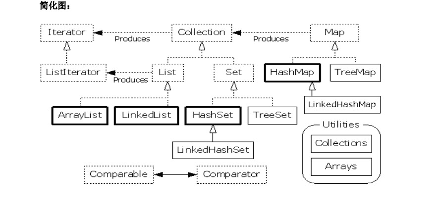
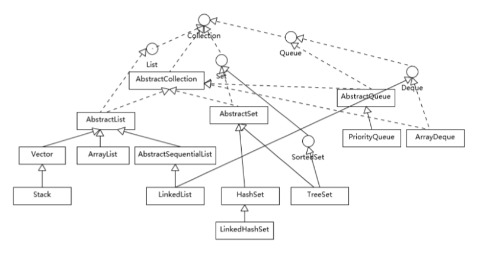
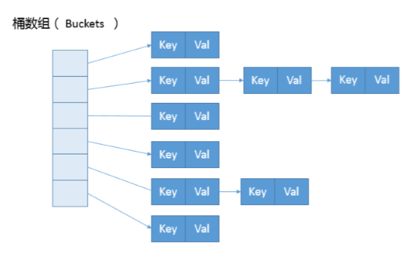
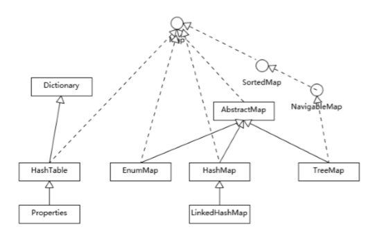

# 集合类（存对象）


## 基础概念

### 数组和集合类都是容器，有何不同

- 数组长度是固定的，集合是可变长度的
- 数组只能存同一种类型的对象，集合可以存储不同类型的对象

### 集合的特点

- 集合中存储的都是对象的引用，即地址
- add方法的参数类型是object，**以便于接收任意类型对象**
- 用于存储对象的容器。
- 集合的长度是可变的。
- 集合中不可以存储基本数据类型值。

### 集合类的由来：

对象用于封装特有数据，对象多了需要存储，如果对象的个数不确定。就使用集合容器进行存储。

### 为什么会出现这么多的容器？

因为每一个容器对数据的存储方式都有不同。这个存储方式称之为：数据结构。集合容器因为内部的数据结构不同，有多种具体容器。不断的向上抽取，就形成了集合框架。

-------------------------------
# 集合的技巧

## 1.需要唯一吗？

```
需要：Set
	需要制定顺序： 
			需要： TreeSet
			不需要：HashSet
			但是想要一个和存储一致的顺序(有序):LinkedHashSet
不需要：List
	需要频繁增删吗？
		需要：LinkedList
		不需要：ArrayList
```

## 2.如何记录每一个容器的结构和所属体系呢？

```
看名字！

List
	|--ArrayList
	|--LinkedList

Set
	|--HashSet
	|--TreeSet

后缀名就是该集合所属的体系。
前缀名就是该集合的数据结构。
```

看到array：就要想到数组，就要想到查询快，有角标.	
看到link：就要想到链表，就要想到增删快，就要想要 add get remove+frist last的方法 
看到hash:就要想到哈希表，就要想到唯一性，就要想到元素需要覆盖hashcode方法和equals方法。 
看到tree：就要想到二叉树，就要想要排序，就要想到两个接口Comparable，Comparator 。

而且通常这些常用的集合容器都是不同步的。 

# 集合框架的构成和分类

- 框架的顶层有Collection接口和Map接口






# JAVA集合框架

## Vector、ArrayList、LinkedList

相同：集合框架中的有序集合List；按位置查找、添加、删除；提供迭代器遍历

|          | ArrayList                                               | LinkedList                                       | Vector                                                       |
| -------- | ------------------------------------------------------- | ------------------------------------------------ | ------------------------------------------------------------ |
| 实现     | 动态数组                                                | 链表                                             | 动态数组                                                     |
| 随机访问 | 支持                                                    | 慢                                               | 支持                                                         |
| 随机增删 | 需要移动数据                                            | 不需要移动数据                                   | 需要移动数据                                                 |
| 线程安全 | 不支持                                                  | 不支持                                           | 支持                                                         |
| 扩容     | 1.5(调用底层System.arraycopy()方法)                     | 无                                               | 2（默认创建一个大小为 10的Object数组，并将capacityIncrement设置为0；当插入元素数组大小不够时，如果cap acityIncrement大于0，则将Object数组的大小扩大为现有size+capacityIncrement；如果c apacityIncrement<=0,则将Object数组的大小扩大为现有大小的2倍） |
| 实现接口 | List，<br>RandomAccess，<br>Cloneable，<br>Serializable | List，<br>Deque，<br>Cloneable，<br>Serializable | List，<br>RandomAccess，<br>Cloneable，<br>Serializable      |
| 插入元素 |                                                         | 新建Entry对象，并更新相应元素的前后元素的引用    |                                                              |

[比较ArrayList、LinkedList、Vector](http://blog.csdn.net/renfufei/article/details/17077425)

**Java 集合框架的考察：**:

- Java 集合框架的设计结构，至少要有一个整体印象。
- Java 提供的主要容器（集合和 Map）类型，了解或掌握对应的数据结构、算法，思考具体 技术选择。
- 将问题扩展到性能、并发等领域。
- 集合框架的演进与发展。

## Collection集合框架


- Collections 工具类中，提供了一系列的 synchronized 方法。实现基本的线程安全集合：
  List list = Collections.synchronizedList(new ArrayList()); 
- TreeSet利用TreeMap，HashSet利用HashMap实现
- 静态工厂方法：List.of(), Set.of().（不可变-线程安全；不用扩容-紧凑空间）

**使用的排序**:

- 原始数据：双轴快速排序（Dual-Pivot QuickSort），改进的快速排序
- 对象数据：TimSort，一种归并和二分插入排序 （binarySort）结合的优化排序算法。
- java8引入并行排序。

## Hashtable、HashMap、TreeMap

|              | Hashtable                                                    | HashMap                                                      | TreeMap                                                      |
| ------------ | ------------------------------------------------------------ | ------------------------------------------------------------ | ------------------------------------------------------------ |
| 同步         | 同步                                                         | 不同步                                                       |                                                              |
| 键值类型     | 不支持 null 键和值                                           | 支持 null 键和值                                             | 未实现 Comparator 接口：key 不可以为null；实现 Comparator 接口：若未对null情况进行判断，则key不可以为null。 |
| 底层         | 数组+链表                                                    | 数组+链表                                                    | 红黑树                                                       |
| 操作         |                                                              | put 或者 get: O(n)                                           | get、put、 remove : O(log(n)）                               |
| 初始化与增长 | 默认容量为11；不要求底层数组的容量一 定要为2的整数次幂。将容量变为原来的2倍加1； | 默认容量为16，且要求容量一定为2的整数次幂。将容量变为原来的2倍。 |                                                              |
| 线程安全     | 采用synchronized修饰保证同步。一个线程在访问，其他线程无论做什么都会阻塞（读取） | （1）可以用 Collections的synchronizedMap方法；（2）使用Co ncurrentHashMap类，相较于HashTable锁住的是对象整体， ConcurrentHashMap基于lo ck实现锁分段技术。首先将Map存放的数据分成一段一段的存储方式，然后给每一段数据分 配一把锁，当一个线程占用锁访问其中一个段的数据时，其他段的数据也能被其他线程访 问。ConcurrentHashMap不仅保证了多线程运行环境下的数据访问安全性，而且性能上有 长足的提升。 |                                                              |
| 遍历方式     | Iterator, enumeration                                        | Iterator                                                     |                                                              |
| hash值计算   | 使用对象的hashCode（jdk根据对象的地址或者字符串或者数字算出来的int类型的数值） | 计算hash值                                                   |                                                              |

## HashTable,HashMap对比

1. 继承的父类不同

   Hashtable继承自Dictionary类

   HashMap继承自AbstractMap类，但二者都实现了Map接口

2. 线程安全性不同

   Hashtable是线程安全的，Hashtable 中的方法是Synchronize的。

   HashMap是非线程安全的。一般通过对自然封装该映射的对象进行同步操作来完成。如果不存在这样的对象，则应该使用`Collections.synchronizedMap`方法来“包装”该映射。最好在创建时完成这一操作，以防止对映射进行意外的非同步访问

3. 是否提供contains方法

   Hashtable保留了`contains`，`containsValue`和`containsKey`三个方法，其中`contains`和`containsValue`功能相同

   HashMap把Hashtable的`contains`方法去掉了，改成`containsValue`和`containsKey`，因为`contains`方法容易让人引起误解

4. key和value是否允许null值

   Hashtable中，key和value都不允许出现null值。但是如果在Hashtable中有类似put(null,null)的操作，编译同样可以通过，因为key和value都是Object类型，但运行时会抛出NullPointerException异常，这是JDK的规范规定的

   HashMap中，null可以作为键，这样的键只有一个；可以有一个或多个键所对应的值为null。当get()方法返回null值时，可能是 HashMap中没有该键，也可能使该键所对应的值为null。因此，在HashMap中不能由get()方法来判断HashMap中是否存在某个键， 而应该用containsKey()方法来判断

5. 两个遍历方式的内部实现上不同

6. hash值不同

   HashTable直接使用对象的hashCode（jdk根据对象的地址或者字符串或者数字算出来的int类型的数值）

   HashMap重新计算hash值

7. 内部实现使用的数组初始化和扩容方式不同

## HashMap 的设计和实现细节



- 理解 Map 相关类似整体结构，尤其是有序数据结构的一些要点：HashMap 内部实现基本点分析

  1. 构造函数：设置装载因子、初始容量

  2. put : 调用putVal--创建初始表格（或容量不够时resize）--  对键调用`hashCode()`方法，返回的hashCode用于找到bucket位置来储存Entry对象。

     - resize：容量超过门限值进行调整，最大是2^30.

     - 预先设置的容量：大于“预估元素数量 / 负载因子”，同时它是 2 的幂数。装载因子不要轻易修改，采用JDK自身的。不要超过0.75(显著增加冲突)

     - 如果两个键的hashcode相同如何获取值对象

       找到bucket位置之后，会调用`keys.equals()`方法去找到链表中正确的节点，最终找到要找的值对象

  3. 重新调整HashMap大小存在什么问题

     重新调整HashMap大小的时候存在条件竞争，因为如果两个线程都发现HashMap需要重新调整大小了，它们会同时试着调整大小。在调整大小的过程中，存储在链表中的元素的次序会反过来，因为移动到新的bucket位置的时候，HashMap并不会将元素放在链表的尾部，而是放在头部，这是为了避免尾部遍历(tail traversing)。如果条件竞争发生了，那么就死循环了

  4. 为什么String, Interger这样的wrapper类适合作为键

     因为String是不可变的，也是final的，而且已经重写了`equals()`和`hashCode()`方法了。其他的wrapper类也有这个特点。不可变性是必要的，因为**为了要计算`hashCode()`，就要防止键值改变**，如果键值在放入时和获取时返回不同的hashcode的话，那么就不能从HashMap中找到你想要的对象。不可变性还有其他的优点如线程安全

- 从源码分析 HashMap 的设计和实现要点，理解容量、负载因子等，为什么需要这些参 数，如何影响 Map 的性能，实践中如何取舍等。

- 理解树化改造的相关原理和改进原因。

  1. 对应逻辑在 putVal 和 treeifyBin 中

  2. 如果容量小于 MIN_TREEIFY_CAPACITY，只会进行简单的扩容。
     如果容量大于 MIN_TREEIFY_CAPACITY ，则会进行树化改造。

  3. 为什么 HashMap 要树化呢？
     安全问题：哈希冲突会导致对象被放置到同一个桶里---则会形成一个链表--线性的查询时间影响存取的性能--攻击者会构造哈希冲突的数据--恶意代码利用这些数据大量 与服务器端交互--导致服务器端 CPU 大量占用--哈希碰撞拒绝服务攻击

## ConcurrentHashMap分析

ConcurrentHashMap的成员变量中

1. 包含了一个Segment的数组（`final Segment<K,V>[] segments;`），而Segment是ConcurrentHashMap的内部类
2. 在Segment这个类中，包含了一个HashEntry的数组（`transient volatile HashEntry<K,V>[] table;`）。而HashEntry也是ConcurrentHashMap的内部类。HashEntry中，包含了key和value以及next指针（类似于HashMap中Entry），所以HashEntry可以构成一个链表。

所以通俗的讲，ConcurrentHashMap数据结构为一个Segment数组，Segment的数据结构为HashEntry的数组，而HashEntry存的是我们的键值对，可以构成链表。

### HashEntry

HashEntry用来封装散列映射表中的键值对。在 HashEntry 类中，key，hash 和 next 域都被声明为 final 型，value 域被声明为 volatile 型。其类的定义为：

```java
static final class HashEntry<K,V> {
        final int hash;
        final K key;
        volatile V value;
        volatile HashEntry<K,V> next;

        HashEntry(int hash, K key, V value, HashEntry<K,V> next) {
            this.hash = hash;
            this.key = key;
            this.value = value;
            this.next = next;
        }
        ...
        ...
}
```

# Map框架



## hashCode 和 equals 的一些基本约定

- equals 相等，hashCode 一定要相等
- 重写了 hashCode 也要重写 equals。
- hashCode 需要保持一致性，状态改变返回的哈希值仍然要一致。
- equals 的对称、反射、传递等特性。
- compareTo的返回值要和equals一样

## LinkedHashMap

- 是遍历顺序符合插入顺序
- 实现：通过为条目（键值对） 维护一个双向链表。通过特定构造函数，创建反映访问顺序的实例，所谓的put、get、compute 等，都算作“访问”。
- 应用：构建一个空间占用敏感的资源池，自动将最不常被访问的对象释放掉（重写删除方法）。

# fail-fast 和 fail-safe的区别

## 定义说明

1. 什么是同步修改？

当一个或多个线程正在遍历一个集合Collection，此时另一个线程修改了这个集合的内容（添加，删除或者修改）。这就是并发修改

2. 什么是 fail-fast 机制?

fail-fast机制在遍历一个集合时，当集合结构被修改，会抛出Concurrent Modification Exception。

fail-fast会在以下两种情况下抛出ConcurrentModificationException

（1）单线程环境

集合被创建后，在遍历它的过程中修改了结构。

注意 remove()方法会让expectModcount和modcount 相等，所以是不会抛出这个异常。

（2）多线程环境

当一个线程在遍历这个集合，而另一个线程对这个集合的结构进行了修改。

**注意，**迭代器的快速失败行为无法得到保证，因为一般来说，不可能对是否出现不同步并发修改做出任何硬性保证。快速失败迭代器会尽最大努力抛出 ConcurrentModificationException。因此，为提高这类迭代器的正确性而编写一个依赖于此异常的程序是错误的做法：迭代器的快速失败行为应该仅用于检测 bug。

3. fail-fast机制是如何检测的

迭代器在遍历过程中是直接访问内部数据的，因此内部的数据在遍历的过程中无法被修改。为了保证不被修改，迭代器内部维护了一个标记 “mode” ，当集合结构改变（添加删除或者修改），标记"mode"会被修改，而迭代器每次的hasNext()和next()方法都会检查该"mode"是否被改变，当检测到被修改时，抛出Concurrent Modification Exception.

ArrayList迭代器部分的源码

```java
private class Itr implements Iterator<E> {
        int cursor;
        int lastRet = -1;
        int expectedModCount = ArrayList.this.modCount;
 
        public boolean hasNext() {
            return (this.cursor != ArrayList.this.size);
        }
 
        public E next() {
            checkForComodification();
            /** 省略此处代码 */
        }
 
        public void remove() {
            if (this.lastRet < 0)
                throw new IllegalStateException();
            checkForComodification();
            /** 省略此处代码 */
        }
 
        final void checkForComodification() {
            if (ArrayList.this.modCount == this.expectedModCount)
                return;
            throw new ConcurrentModificationException();
        }
    }
```

4. fail-safe机制

fail-safe任何对集合结构的修改都会在一个复制的集合上进行修改，因此不会抛出ConcurrentModificationException

fail-safe机制有两个问题

（1）需要复制集合，产生大量的无效对象，开销大

（2）无法保证读取的数据是目前原始数据结构中的数据。