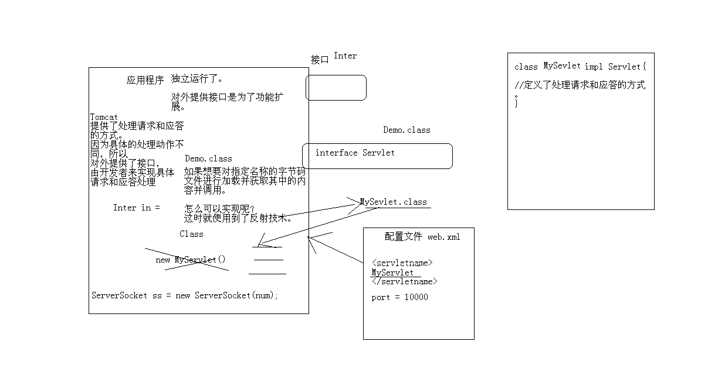
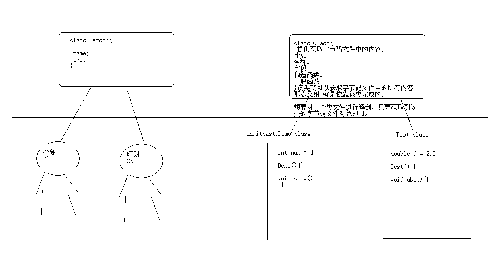
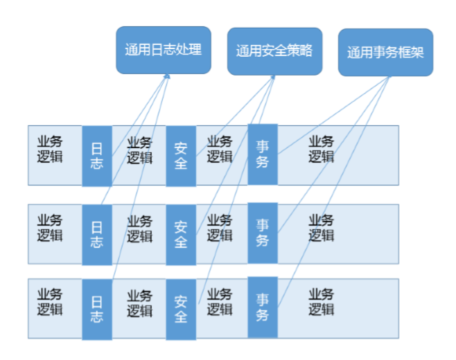

# 反射机制

1：JAVA反射机制是在运行状态中，对于任意一个类 (class文件)，都能够知道这个类的所有属性和方法；

2：对于任意一个对象，都能够调用它的任意一个方法和属性；

3：这种动态获取的信息以及动态调用对象的方法的功能称为java语言的反射机制。 

4：为什么不直接new？很多时候我们并不能事先知道要New什么对象，我们可能只知道一个类的名称和方法名， 很多时候这些名称都是写在XML配置当中的。 

## 总结：动态获取类中信息，就是java反射 。可以理解为对类的解剖。

1：反射技术：一定会提供接口、配置文件

2：学习框架：框架干什么，配置文件怎么用，常用对象的使用方法



主程序向外提供接口，外部程序实现这个接口，并将外部程序的信息写在配置文件中，主程序要运行外部程序的时候会：根据配置文件找到程序名称，根据名称找到程序的class类文件。

 * 要想要对字节码文件进行解剖，必须要有字节码文件对象.



## 如何获取字节码文件对象

举例：对Person类获取对象，Person类中有各种方法

```java
public class Person {
    private int age;
    private String name;

    public Person(String name,int age) {
        super();
        this.age = age;
        this.name = name;

        System.out.println("Person param run..."+this.name+":"+this.age);
    }
    
    public Person() {
        super();
        System.out.println("person run");
    }

    public void show(){
        System.out.println(name+"...show run..."+age);
    }

    private void privateMethod(){
        System.out.println(" method run ");
    }

    public void paramMethod(String str,int num){
        System.out.println("paramMethod run....."+str+":"+num);
    }
    
    public static void staticMethod(){
        System.out.println(" static method run......");
    }
}
```

三种获取class对象的方法：推荐方法三

- 类名的字符串形式要写全，cn.itcast.bean.Person。
- 程序找class的时候去classpath目录下找,可以在.classpath文件中看到classpath目录。
- 写类名的时候要带着包名。

```java
public class ReflectDemo {
    /**
	 * @param args
	 * @throws ClassNotFoundException 
	 */
    public static void main(String[] args) throws ClassNotFoundException {
        getClassObject_3();
    }
    
  	 /* 方式三：
	 * 只要通过给定的类的 字符串名称就可以获取该类，更为扩展。
	 * 可是用Class类中的方法完成。
	 * 该方法就是forName.
	 * 这种方式只要有名称即可，更为方便，扩展性更强。 
	 * 找类的时候去class目录下找：要带着包名
	 */
    public static void getClassObject_3() throws ClassNotFoundException {
        String className = "cn.itcast.bean.Person";
        Class clazz = Class.forName(className);
        System.out.println(clazz);
    }

    /*方式二：
	 * 2，任何数据类型都具备一个静态的属性.class来获取其对应的Class对象。
	 * 相对简单，但是还是要明确用到类中的静态成员。
	 * 还是不够扩展。 
	 */
    public static void getClassObject_2() {
        Class clazz = Person.class;
        Class clazz1 = Person.class;
        System.out.println(clazz==clazz1);
    }

    /*方法一：Object类中的getClass()方法
	 * 想要用这种方式，必须要明确具体的类，并创建对象。
	 * 麻烦
	 */
    public static void getClassObject_1(){
        Person p = new Person();
        Class clazz = p.getClass();

        Person p1 = new Person();
        Class clazz1 = p1.getClass();
        
        System.out.println(clazz==clazz1);
    }
}
```

## 获取类的实例对象

- 指定构造函数，去创造实例对象
- 私有函数也可以访问：getDeclaredConstructor

```java
public static void createNewObject_2() throws Exception {
    //		cn.itcast.bean.Person p = new cn.itcast.bean.Person("小强",39);
        /* 当获取指定名称对应类中的所体现的对象时，
		 * 而该对象初始化不使用空参数构造该怎么办呢？
		 * 既然是通过指定的构造 函数进行对象的初始化，
		 * 所以应该先获取到该构造函数。 通过字节码文件对象即可完成。
		 * 该方法是：getConstructor(paramterTypes);
		 */
    String name = "cn.itcast.bean.Person";
    //找寻该名称类文件，并加载进内存，并产生Class对象。
    Class clazz = Class.forName(name);
    //获取到了指定的构造函数对  象。
    Constructor constructor = clazz.getConstructor(String.class,int.class);

    //通过该构造器对象的newInstance方法进行对象的初始化。
    Object obj = constructor.newInstance("小明",38);
}
```

- 空参数构造对象

```java
public static void createNewObject() throws ClassNotFoundException, InstantiationException, IllegalAccessException{
    //早期：new时候，先根据被new的类的名称找寻该类的字节码文件，并加载进内存，
    //		并创建该字节码文件对象，并接着创建该字节文件的对应的Person对象.
    //		cn.itcast.bean.Person p = new cn.itcast.bean.Person();

    //现在：
    String name = "cn.itcast.bean.Person";
    //找寻该名称类文件，并加载进内存，并产生Class对象。
    Class clazz = Class.forName(name);
    //如何产生该类的对象呢？
    // 用空参数构造函数去构造，如果person类没有空参数构造函数会报错
    // 一般被反射的类都带空参数构造函数，这样获取实例方便
    Object obj  = clazz.newInstance();
}
```

## 获取字节码文件中的字段

- 只获取本类，但包含私有：getDeclaredField
- 获取公有成员变量：getField
- 成员变量要被对象使用

```java
public static void getFieldDemo() throws Exception {
    Class clazz = Class.forName("cn.itcast.bean.Person");
    Field field = null;//clazz.getField("age");//只能获取公有的，
    field = clazz.getDeclaredField("age");//只获取本类，但包含私有。 

    //对私有字段的访问取消权限检查。暴力访问。
    field.setAccessible(true);
    // 正常情况下没法访问私有变量
    Object obj = clazz.newInstance();
    field.set(obj, 89);

    Object o = field.get(obj);
    System.out.println(o);
    //		cn.itcast.bean.Person p = new cn.itcast.bean.Person();
    //		p.age = 30;

}
```

## 获取方法（应用最多）

- clazz.getMethods();//获取的都是公有的方法。包括父类的
- clazz.getDeclaredMethods();//只获取本类中所有方法，包含私有。 

```java
public static void getMethodDemo() throws Exception {
    Class clazz = Class.forName("cn.itcast.bean.Person");
    Method[] methods  = clazz.getMethods();//获取的都是公有的方法。包括父类的 
    methods = clazz.getDeclaredMethods();//只获取本类中所有方法，包含私有。 
    for(Method method : methods){
        System.out.println(method);
    }
}
```

- clazz.getMethod("show", null);//指定方法名，参数列表。空参数写null
- method.invoke(obj, null);

```java
public static void getMethodDemo_2() throws Exception {
    Class clazz = Class.forName("cn.itcast.bean.Person");
    Method method = clazz.getMethod("show", null);//指定方法名，参数列表。空参数写null
    //		Object obj = clazz.newInstance();
    Constructor constructor = clazz.getConstructor(String.class,int.class);
    Object obj = constructor.newInstance("小明",37);
    method.invoke(obj, null); //对象和参数
}
```

## 应用：主板+声卡

主函数：

```java
public static void main(String[] args) throws Exception {
    Mainboard mb = new Mainboard();
    mb.run();
    //每次添加一个设备都需要修改代码传递一个新创建的对象
    //		mb.usePCI(new SoundCard());
    //能不能不修改代码就可以完成这个动作。 
    //		不用new来完成，而是只获取其class文件。在内部实现创建对象的动作。 

    File configFile = new File("pci.properties");
    Properties prop = new Properties();
    FileInputStream fis = new FileInputStream(configFile);
    prop.load(fis);

    for(int x=0; x<prop.size(); x++){
        String pciName = prop.getProperty("pci"+(x+1));
        Class clazz = Class.forName(pciName);//用Class去加载这个pci子类。 
        PCI p = (PCI)clazz.newInstance();
        mb.usePCI(p);
    }

    fis.close();
}
```

主板类：

```java
public class Mainboard {
    public void run() {
        System.out.println("main board run....");
    }

    public void usePCI(PCI p) {//PCI p = new SouncCard();
        if (p != null) {
            p.open();
            p.close();
        }
    }
}
```

# 动态代理

- 动态类型和静态类型：就是其中一种分类角度，简单区分就是语言类型信息是在运行时检查，还是编译期检查。
- 强类型和弱类型：就是不同类型变量赋值时，是否需要显式 地（强制）进行类型转换。

Java 是静态的强类型语言，但是因为提供了类似反射等机制，也具备了部分动态类型语言的能力。

## 谈谈 Java 反射机制，动态代理是基于什么原理？

- 反射机制：通过反射我们可以直接操作类或者对象，比如获取某个对象的属性，甚至可以运行时修改类定义。
- 动态代理：一种方便运行时动态构建代理、动态处理代理方法调用的机制，很多场景都是利用类似机制做到的，比如用来包装 RPC 调用、面向切面的编程（AOP）。
- 实现动态代理的方式很多：JDK 自身提供的动态代理(主要利用反射机制）。还有其他的实现方式，比如利用更高性能的字节码操作机制，类似 ASM、cglib（基 于 ASM）、Javassist 等。

## 反射的应用：

1. setAccessible应用场景：非常普遍，遍布我们的日常开发、测试、依赖注入等各种框架中。比如，在 O/R Mapping 框架中，我们为一个 Java 实体对象，运行时自动生成 setter、getter 的逻辑，这是加载或者持久化数据非常必要的，框架通常可以利用反射做这个事情，而不需要开发者手动写类似的重复代码。
2. 另一个典型场景就是绕过 API 访问控制。我们日常开发时可能被迫要调用内部 API 去做些事 情，比如，自定义的高性能 NIO 框架需要显式地释放 DirectBuffer，使用反射绕开限制是一种 常见办法

## 动态代理

1. 是一个代理机制。代理可以看作是对调用目标的一个包装，这样我们对目标代码的调用不是直接发生的，而是通过代理完成。
2. 其实很多动态代理场景，我认为也可以看作是装饰器（Decorator）模式的应用
3. 通过代理可以让调用者与实现者之间解耦。比如进行 RPC 调用，框架内部的寻址、序列化、反序列化等

- 即：通过调用代理实现对目标的操作。装饰器模式的应用

4. 实现方式：

   JDK proxy：需要接口

   cglib：创建目标类的子类

   **JDK Proxy 的优势：**

   1. 小化依赖关系，减少依赖意味着简化开发和维护，JDK 本身的支持，可能比 cglib 更加可 靠。
   2. 平滑进行 JDK 版本升级，而字节码类库通常需要进行更新以保证在新版 Java 上能够使用。
   3. 代码实现简单。

   **基于类似 cglib 框架的优势：**

   1. 有的时候调用目标可能不便实现额外接口，从某种角度看，限定调用者实现接口是有些侵入性的实践，类似 cglib 动态代理就没有这种限制。
   2. 只操作我们关心的类，而不必为其他相关类增加工作量。
   3. 高性能。

