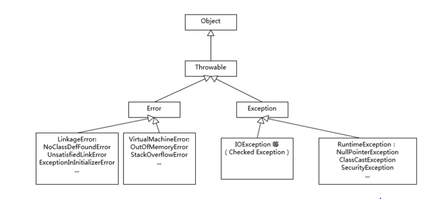

# 异常机制



异常：程序**运行时**出现不正常情况

严重问题：java用Error类描述. 。**一般不编写**针对性的方法进行处理

非严重问题：java用Exception类描述。可以使用针对性的方法进行处理

## 异常种类

异常分两种

1：编译时异常：编译时被检查，即该异常没有throw也没有try处理（即方法体throw抛出异常，方法名却没标明throws异常 或者  调用者没有处理（throws, 或者try））

2：运行时异常：编译时不检查，该异常发生建议不处理，让程序员对代码进行修正

## 分层思想

每一层处理自己的异常，例如：

数据库类处理数据库的异常，把当前异常处理的结果包装一下，让上层能识别，返回给上一层

## 异常的覆盖

1. 子类在**覆盖父类方法**时，如果父类的方法抛出异常，那么子类的覆盖方法，只能抛出父类的依次或者该异常的子类。如果子类有别的异常，就自己在类中进行try处理

```
class A extends Exception 
{
}

class B extends A
{
}
class C extends Exception 
{
}

class Fu
{
	void show()throws A
	{}
}

class Zi extends Fu
{
	void show()throws B/A
	{
	
	}
}
```

1. 如果父类方法抛出多个异常，那么子类只能抛出父类异常的子集
2. 如果父类的方法没有抛出异常，那么子类覆盖时绝对不能抛，就只能try .

# Throwable类:error 和 exception 类的超类

## exception 类的处理：

- 就是要给出预先的处理方式，不然编译失败

### try catch finally

jvm 默认的异常处理机制是调用printStackTrace()方法

```
try 
{
    需要被检查的代码
}
catch(Except e) // 相当于上面执行遇到异常，返回Except e = new ArithExcep();（一个多态）
{
	处理异常的代码（处理方式）
	// 这里可以调用throwable的方法,获取异常信息
	// 执行完这里的函数后，会继续执行main函数剩下的
	print(e.getMessage());
}
finally
{
	一定会执行的语句
}
```

### throws：

```
class Demo
{
    int div(int a,int b) throws Exception // 通过throws声明了该功能可能会出现问题
    {
        return a/b;
    }
}

class Test
{
	// 如果这里没有写throws Exce，编译会报错，因为虚拟机认为你没有处理他
	// 写了之后，这里抛出异常就是给虚拟机，给虚拟机就是终极处理了。
	// 所以当被除数是0时,这里给虚拟机处理就打印异常，程序退出。
    public static void main() throws Exception 
    {
 		Demo d = new Demo();
        int x = d.div(4,1);
    }
}
```

### finally:

- 定义一定执行的代码，通常用于关闭资源

即使捕获到了ArithmeticException，并在函数中退出，但finally也会执行，外面的“over”不会执行。应用场景：数据库连接出问题，在这里关闭连接。

```
class Test
{
    public static void main()
    {
 		Demo d = new Demo();
 		try
        {
        	int x = d.div(4,1);
        }
        catch(ArithmeticException e)
        {
        	return;
		}
		finally
		{
			print("finally");
		}
		
		print("over");
    }
}
```

- 有一种情况finally无法执行：上面catch中写了 `System.exit(0);`

## 多异常的处理

```java
class Demo{
    // 不会同时发生两个异常，因为有一个问题就退出了
    int div(int a,int b) throws ArithmeticException,ArrayOutException{
        int[] aa = new int[4];
        return a/b;
    }
}

class Test{
    public static void main(){
        Demo d = new Demo();
        try{
            int x = d.div(4,1);
        }
        catch(ArithmeticException e){
        }
        catch(ArrayOutExce e){
        }
    }
}
```

## 自定义异常

- 让该类具备操作异常的共性方法

### 举例：当除数是负数，也认为是错的

当在函数内部出现了throw抛出异常对象，那么就必须要给对应的处理动作。

- 在内部try catch处理

- 在函数上声明，让调用者处理（一般这么用，throws是java帮我们自动抛出）。如下所示。此时main函数调用的这个方法，main函数中就必须有处理这个异常的代码

  ```
  int div(int a,int b) throws FuShuException{
      	if(b < 0)
      		// 原来是java自动帮我们抛出异常
      		// 手动通过throw 关键字抛出一个自定义异常对象
  	   		throw new FuShuException（）;
          return a/b;
      }
  ```

- e.toString 会自动调用getMsg方法。打印异常名称+异常信息，自定义的异常内容是空，就只打印名称

```
// 只能手动抛出异常，继承Exp
class FuShuException extends Exception{
	private String msg;
    FuShuException(String msg){
    	this.msg = msg;
	}
	// 覆写getMsg方法
	public String getMsg(){
        return msg;
	}
}

class Demo{
    int div(int a,int b) throws FuShuException {
    	if(b < 0)
    		// 原来是java自动帮我们抛出异常
    		// 手动通过throw 关键字抛出一个自定义异常对象
	   		throw new FuShuException（"出现除数是负数"）;
        return a/b;
    }
}

class Test{
    public static void main() {
 		Demo d = new Demo();
 		try {
        	int x = d.div(4,1);
        }
        // 捕获自定义的依次
        catch(FuShuException e){
        	print(e.toSting);
		}
    }
}
```

- Exception 类继承 Throwable, Throwable已经实现了toString 方法，该方法会调用 getMsg方法，即父类中已经把异常信息的操作都完成了，所以直接传入异常信息即可。

```
class FuShuException extends Exception{
    FuShuException(String msg){
    	super(msg);
	}
}
```

- 自定义异常中可以获取别的信息

```
class FuShuException extends Exception{
	private int value;
    FuShuException(String msg， int value){
    	super(msg);
    	this.value = value;
	}
}
```

继承Exception的原因：

- 异常类和异常对象都会被抛出，具有可抛性，是Throwable体系的独有特点，只有该体系中的成员才能被throw , throws 操作

## throw和throws的区别

1. 位置

throws：使用在函数上

throw：使用在函数内

2. 跟的内容

throws：后面跟异常类，可以跟多个，逗号隔开

throw：后面跟异常对象

## Runtime Exception

Exception中有一个特殊的子类异常RuntimeException，ArithmrticException是RuntimeException的子类。该异常是由于程序逻辑问题。需要让程序员知道发生了什么，不能隐藏

- 在函数内容抛出该异常，函数上不用声明
- 函数上声明了该异常，调用者可以不用处理

```
int div(int a,int b) // 不用写throws A...
    {
    	if(b < 0)
	   		throw new ArithmrticException（）;
        return a/b;
    }
```

- 自定义异常时，如果该异常的发生，无法再继续进行运算，就让自定义异常基础RuntimeException

# 练习

```
Interface Shape
{
	public void getArea();
}

class Rec implements Shape
{
    int len,wid;
    Rec(int len, int wid)
    {
        if(len <= 0 || wid <= 0)
        	print("error");
        else
        {
            this.len = len;
            this.wid = wid;
        }
    }
}
```

1. 以下代码对问题数据的处理和正常处理放在一起，结合太紧密不好。

```
	if(len <= 0 || wid <= 0)
        	print("error");
        else
        {
            this.len = len;
            this.wid = wid;
        }
```

应该在有异常时抛出异常

```
	class NoValueException extends RuntimeException //出异常就不允许程序，直接结束报错	{
	}
	Rec(int len, int wid) throws NoValueException
    {
    	// 传入的值是用户的错误输入
        if(len <= 0 || wid <= 0)
        	throw new NoValueException("出现非法值");
        else
        {
            this.len = len;
            this.wid = wid;
        }
    }
```

# 总结

异常是什么？

是对问题的描述，将问题进行对象的封装

异常体系：

​	Throwable

​		|-- Error

​		|-- Exception

​			|-- RuntimeException

异常体系的特点：异常体系中的所有类以及建立的对象都具备可抛性，即可被throw,throws操作

## 1.异常的好处

1：将问题进行封装

2：将正常流程代码和问题处理代码相分离，方便阅读

## 2.异常的处理原则

1：处理方式有两种：try  或者 throws

2：调用到抛出异常的功能时，抛出几个，处理几个，一个try对应多个catch

3：多个catch，父类的catch放到最下面

4：catch内，需要定义针对性的处理方式，不要简单地定义printStackTrace输出，也不要不写。当捕获到的异常本功能处理不了时，可以继续在catch中抛出。

```
try{
	throw new Aexp();
}
catch(Aexp e){
    throw e;
}
```

如果该异常处理不了，但并不属于该功能出现的异常，可以将异常转换后，再抛出和该功能有关的异常

或者异常可以处理，但需要将异常产生的和本功能相关的问题提供出去，当调用者知道并处理，也可以将捕获异常处理后，转换新的异常

```
try{
	throw new Aexp();
}
catch(Aexp e){
	// 对Aexp处理
    throw new Bexp();
}
```

## 3.封装的好处

- 以下代码会编译不通过，因为一进来直接抛出异常，是不可能执行到print的. **所以throw单独存在时，后面不要定义语句，因为执行不到**

```
try{
    throw new Exception();
    print ("a");
}
```

可以将抛出异常封装在函数内，这样会认为是有可能抛出异常，编译器认为代码有可能执行下去，编译能过

```
try{
	showExce();
	print ("a");
}
public static void showExce() throws Exceptions{
    throw new Exception();
}
```

