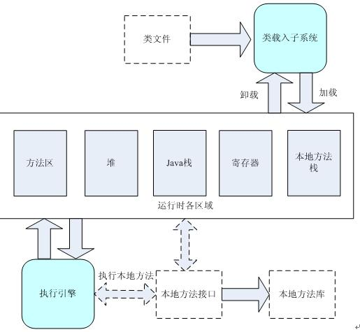
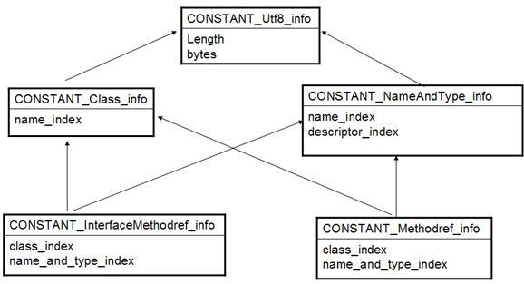
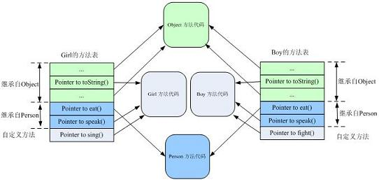
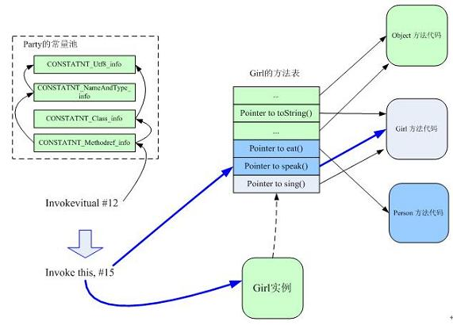
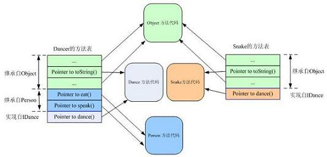

# 多态

## 定义

可以理解为事物存在的多种体现形态。人--男人，女人。

一个实体可以具备其他类型，x既是猫类型，也是动物类型。

猫 x = new 猫（）；

动物 x = new 猫（）；

## 概念：

允许基类的指针或引用指向派生类的对象，而在具体访问时实现方法的动态绑定 。

多态自始至终都是子类对象（实体）在做着变化

## 实现方式：动态绑定

Java 对于方法调用动态绑定的实现主要依赖于方法表，但通过类引用调用和接口引用调用的实现则有所不同。总体而言，当某个方法被调用时，JVM 首先要查找相应的常量池，得到方法的符号引用，并查找调用类的方法表以确定该方法的直接引用，最后才真正调用该方法。

### JVM结构

 

当程序运行需要某个类的定义时，载入子系统 (class loader subsystem) 装入所需的 class 文件，并在内部建立该类的类型信息，这个类型信息就存贮在方法区。类型信息一般包括该类的方法代码、类变量、成员变量的定义等等。可以说，类型信息就是类的 Java 文件在运行时的内部结构，包含了改类的所有在 Java 文件中定义的信息。

> 该类型信息和 class 对象是不同的。class 对象是 JVM 在载入某个类后于堆 (heap) 中创建的代表该类的对象，可以通过该 class 对象访问到该类型信息。比如最典型的应用，在 Java 反射中应用 class 对象访问到该类支持的所有方法，定义的成员变量等等。可以想象，JVM 在类型信息和 class 对象中维护着它们彼此的引用以便互相访问。两者的关系可以类比于进程对象与真正的进程之间的关系

### Java 的方法调用方式

Java 的方法调用有两类，动态方法调用与静态方法调用。静态方法调用是指对于类的静态方法的调用方式，是静态绑定的；而动态方法调用需要有方法调用所作用的对象，是动态绑定的。类调用 (invokestatic) 是在编译时刻就已经确定好具体调用方法的情况，而实例调用 (invokevirtual) 则是在调用的时候才确定具体的调用方法，这就是动态绑定，也是多态要解决的核心问题。

JVM 的方法调用指令有四个，分别是 invokestatic，invokespecial，invokesvirtual 和 invokeinterface。前两个是静态绑定，后两个是动态绑定的。本文也可以说是对于 JVM 后两种调用实现的考察。

### 常量池（constant pool）

常量池中保存的是一个 Java 类引用的一些常量信息，包含一些字符串常量及对于类的符号引用信息等。Java 代码编译生成的类文件中的常量池是静态常量池，当类被载入到虚拟机内部的时候，在内存中产生类的常量池叫运行时常量池。

常量池在逻辑上可以分成多个表，每个表包含一类的常量信息：

- CONSTANT_Utf8_info：字符串常量表
- CONSTANT_Class_info：类信息表
- CONSTANT_NameAndType_info：名字类型表
- CONSTANT_InterfaceMethodref_info：接口方法引用表
- CONSTANT_Methodref_info：类方法引用表

 

可以看到，给定任意一个方法的索引，在常量池中找到对应的条目后，可以得到该方法的类索引（class_index）和名字类型索引 (name_and_type_index), 进而得到该方法所属的类型信息和名称及描述符信息（参数，返回值等）。注意到所有的常量字符串都是存储在 CONSTANT_Utf8_info 中供其他表索引的。 

### 方法表与方法调用

方法表是动态调用的核心，也是 Java 实现动态调用的主要方式。它被存储于方法区中的类型信息，包含有该类型所定义的所有方法及指向这些方法代码的指针，注意这些具体的方法代码可能是被覆写的方法，也可能是继承自基类的方法。

```java

```

当这三个类被载入到 Java 虚拟机之后，方法区中就包含了各自的类的信息。Girl 和 Boy 在方法区中的方法表可表示如下： 

 

Girl 和 Boy 的方法表包含继承自 Object 的方法，继承自直接父类 Person 的方法及各自新定义的方法。注意方法表条目指向的具体的方法地址，如 Girl 的继承自 Object 的方法中，只有 toString() 指向自己的实现（Girl 的方法代码），其余皆指向 Object 的方法代码；其继承自于 Person 的方法 eat() 和 speak() 分别指向 Person 的方法实现和本身的实现。 

Person 或 Object 的任意一个方法，在它们的方法表和其子类 Girl 和 Boy 的方法表中的位置 (index) 是一样的。这样 JVM 在调用实例方法其实只需要指定调用方法表中的第几个方法即可。 

```java

```

当编译 Party 类的时候，生成 `girl.speak()`的方法调用假设为：

Invokevirtual #12

设该调用代码对应着 girl.speak(); #12 是 Party 类的常量池的索引。JVM 执行该调用指令的过程如下所示：

**解析调用过程**

 

JVM 首先查看 Party 的常量池索引为 12 的条目（应为 CONSTANT_Methodref_info 类型，可视为方法调用的符号引用），进一步查看常量池（CONSTANT_Class_info，CONSTANT_NameAndType_info ，CONSTANT_Utf8_info）可得出要调用的方法是 Person 的 speak 方法（注意引用 girl 是其基类 Person 类型），查看 Person 的方法表，得出 speak 方法在该方法表中的偏移量 15（offset），这就是该方法调用的直接引用。

当解析出方法调用的直接引用后（方法表偏移量 15），JVM 执行真正的方法调用：根据实例方法调用的参数 this 得到具体的对象（即 girl 所指向的位于堆中的对象），据此得到该对象对应的方法表 (Girl 的方法表 )，进而调用方法表中的某个偏移量所指向的方法（Girl 的 speak() 方法的实现）。

### 接口调用

 因为 Java 类是可以同时实现多个接口的，而当用接口引用调用某个方法的时候，情况就有所不同了。Java 允许一个类实现多个接口，从某种意义上来说相当于多继承，这样同样的方法在基类和派生类的方法表的位置就可能不一样了。 

```java
interface IDance{ 
    void dance(); 
} 

class Person { 
    public String toString(){ 
        return "I'm a person."; 
    } 
    public void eat(){} 
    public void speak(){} 

} 

class Dancer extends Person 
 implements IDance { 
 public String toString(){ 
   return "I'm a dancer."; 
	 } 
 public void dance(){} 
 } 

class Snake implements IDance{ 
    public String toString(){ 
        return "A snake."; 
    } 
    public void dance(){ 
        //snake dance 
    } 
}
```

 

由于接口的介入，继承自于接口 IDance 的方法 dance（）在类 Dancer 和 Snake 的方法表中的位置已经不一样了，显然我们无法通过给出方法表的偏移量来正确调用 Dancer 和 Snake 的这个方法。这也是 Java 中调用接口方法有其专有的调用指令（invokeinterface）的原因。

Java 对于接口方法的调用是采用搜索方法表的方式，对如下的方法调用

invokeinterface #13

JVM 首先查看常量池，确定方法调用的符号引用（名称、返回值等等），然后利用 this 指向的实例得到该实例的方法表，进而搜索方法表来找到合适的方法地址。

因为每次接口调用都要搜索方法表，所以从效率上来说，接口方法的调用总是慢于类方法的调用的。

[参考](https://blog.csdn.net/huangrunqing/article/details/51996424)

# 多态的细节

## 1多态的体现

父类的引用指向了自己的子类对象 、 父类的引用也可以接收自己的子类对象。但只能使用父类的方法。

```
function（new Cat（））；

public static void function(Anaimal a){ // 相当于Anaimal a = new Cat()
    a.eat();
}
```

## 2多态的前提

1：必须是类与类之间有关系：继承 或 实现

2：存在覆盖

## 3多态的好处

提高了程序的扩展性

## 4多态的弊端

只能使用父类的引用访问父类中的成员。

## 5多态的应用

### 1. 接口型引用指向自己的子类对象

下面的主板类型中方法不用变，其他插件网卡、声卡 实现接口，在主板方法调用中传入新建的网卡对象即可

```java
Interface PCI{
    public abstract void run();
    public abstract void close();
}

class MainCard{
    public void run{
        print("MainCard run");
    }
    public void usePCI(PCI p) // 接口型引用指向自己的子类对象
    {
        p.run();
        p.close();
    }
}

class NetCard implements PCI //实现接口
{
    public void run{
        print("netcard run");
    }
    public void close{
        print("netcard close");
    }
}

class Main()
{
    MainCard m = new MainCard();
    m.usePci(new NetCard());
    m.usePci(new SoundCard()); //这里也可以继续新建
}
```

### 2. 多态的扩展示例

```
PCI p = new NetCard();
p.run();
p.close();
```

## 6多态的代码特点

### 1. 非静态成员函数的特点（动态绑定）

在多态（父类引用指向子类对象）中非静态成员函数（非静态函数能重写）的特点：

1、在编译时期，参阅引用型变量所属的类中是否有调用的方法，如果有，编译通过，否则失败；

2、在运行时期，参阅对象所属的类中是否有调用的方法。

简单总结：成员函数在多态调用时，编译看左边，运行看右边。

- 如下面例子所示：main函数如果是这样，在编译的时候看f所属的类Fu中是否有对应方法，发现Fu没有fun3方法，所以编译报错

  ```
  class Main{
  	Fu f = new Zi();
  	
  	f.fun1();
  	f.fun2();
  	f.fun3();
  }
  ```

- 如下的main函数在运行的时候会根据f所属的Zi类去找方法，执行子类的fun1函数，父类的fun2函数

  ```
  class Main{
  	Fu f = new Zi();
  	
  	f.fun1();
  	f.fun2();
  	//f.fun3();
  }
  ```

```
class Fu
{
    public void fun1
    {
    	print("fu fun1");
	}
	public void fun2
    {
    	print("fu fun2");
	}
}

class Zi extends Fu
{
    public void fun1
    {
    	print("Zi fun1");
	}
	public void fun3
    {
    	print("Zi fun3");
	}
}
```

### 2.非静态成员变量的特点

在多态中，非静态成员变量的特点：

无论编译和运行，都参考左边（引用型变量所属的类）

- 若遇到父类和子类有相同名字的变量：

```java
class Fu{
    int num = 5;
    public void fun1{
        print("fu fun1");
    }
    public void fun2{
        print("fu fun2");
    }
}

class Zi extends Fu{
	int num = 8;
    public void fun1{
    	print("Zi fun1");
	}
	public void fun3{
    	print("Zi fun3");
	}
}

class Main{
	Fu f = new Zi();
	Zi z = new Zi();
	print(f.num);  // 5
	print(z.num);  // 8
}
```

### 3.静态成员函数，成员变量 的特点（静态绑定）

- 无论编译或运行，都参考左边。

  静态方法访问的是静态区中的方法，而对象.方法调用的时候要找对象.

  - 即静态方法一进静态方法区，就绑定在所属类，用类名调用参考的是引用所属的类。
  - f.fun 是被f运行，访问对象的方法。this是动态的，指向哪个对象就是哪个，所以在运行时找，此时 父类和子类都加载在内存中，静态方法已经存在在内存中，静态方法不需要对象，看的是引用型变量

```java
class Fu
{
    static  void fun1
    {
        print("fu fun1");
    }
}

class Zi extends Fu
{
    static void fun1
    {
    	print("Zi fun1");
	}
}

class Main{
	Fu f = new Zi();
	f.fun1(); //打印结果是  fu  fun1
}
```

## 类型提升

```
// 要动物，给猫，狗都行
Animal a = new Cat()  // 类型提升，向上转型（e.g. byte = 3）,方法就少了

a.eat();
```

// 如果想要调用猫的特有方法时：强制将父类的引用转成子类类型

// 父类的引用指向了子类对象时，该引用可以被提升，也可以被强制转换

// **多态自始至终都是子类对象（实体）在做着变化**。猫 -- 变成动物，猫

```
Cat c = (Cat)a;   //向下转型，
c.catchMouse();
```

// 将父类对象转换成子类类型。这样是不行的。

```
Animal a = new Animal() ;
Cat c = (Cat)a;
```

### instanceof使用场景：

1：类型较少

2：对传入数据进行类型判断处理

#  Object类

所有对象的直接或者间接父类。该类中定义的是所有类都具备的功能

## equals(Object obj)方法：内部使用”==“比较地址

- java认为所有对象都具有比较性，都能比较是否相同
- 参数是object，所以任何两个类型的对象都能比较，是多态的实现
- 自定义类中要实现：比较功能，覆写**equals(Object obj)**方法实现自己特有功能即可. 注意是覆写，所以参数类型也要一样。此时要进行**向下转型**

```
class Demo{
	int num = 5;
	public boolean equals(Object obj) // Object obj = new Demo();
	{	
    	// 但是可能会传入别的东西，有类型转换异常,不能只写下面一句话
		// Demo d = (Demp)obj;
		// 所以应该先判断类型
		if (!obj instanceof Demo)
			return false;
		Demo d = (Demp)obj;
		return this.num == d.num;
	}
}
```

## toString()

- java任务任意对象都能变成字符串被打印：类名@对象的hash值（10进制表现）

  - 新建一个对象要根据其类的class文件去创建，java中有一个Class类，用于处理class文件,可以返回对象类名

  ```
  Demo d1 = new Demo(4);
  // 返回对象的类名
  Class c = d1.getClass();
  String name = c.getName();
  // 返回对象哈希码
  d1.hashCode(); //返回的是16进制
  ```

  