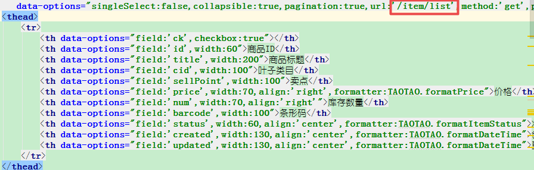

# EasyUI

JQuery EasyUI是一组基于jQuery的UI插件集合体,而jQuery EasyUI的。目标就是帮助web开发者更轻松的打造出功能丰富并且美观的UI界面.开发者不需要编写复杂的javascript,也不需要对css样式有深入的了解,开发者需要了解的只有一些简单的html标签.

```html
<head>
    <meta http-equiv="Content-Type" content="text/html; charset=UTF-8">
    <title>Insert title here</title>
    // 前面引入easyUI的样式
    <link rel="stylesheet" type="text/css" href="../easyui/themes/default/easyui.css">
    <link rel="stylesheet" type="text/css" href="../easyui/themes/icon.css">
    <script type="text/javascript" src="../easyui/jquery.min.js"></script>
    <script type="text/javascript" src="../easyui/jquery.easyui.min.js"></script>
</head>
<body>
    <div class="easyui-resizable" style="width:300px;height:300px;border:1px solid red"></div>
    <h3 style="background:red" class="easyui-resizable">AAAAAAA</h3>

    <div class="easyui-progressbar" style="width:300px;height:100px"></div>

    <pre>
  原理:页面加载完毕之后,EasyUI主文件会扫描页面上的每个标签,判断这些标签的class值是否以Easyui-开头,如果是,拿到之后的部分"resizable",EasyUI的主文件会将当前的标签处理为resizable这种效果
</pre>
</body>
```

- js写的前端框架。所有的请求都是ajax写的，没有页面刷新，都返回json数据。全部都是局部刷新，基本上做后台的管理系统。

# 淘淘商城使用

## 分析

根据index.jsp，查询商品需要开发item-list对应的item-list.jsp。

 

easyui的datagrid控件特点： 

- 请求带有分页信息 ?page=xxx&rows=yyy 。
- 只接受含有total和rows属性的json数据。 {total:”2”,rows:[{“id”:”1”,”name”,”张三”},{“id”:”2”,”name”,”李四”}]}。
- rows中每个对象的域对应 data-options的field 属性
- 具体说明可查询官网：http://www.jeasyui.net/plugins/183.html

## 需求

- 请求url：/item/list?page=xxx&rows=yyy
- 请求参数：url中的两个分页参数。
- 响应参数：含有total和rows属性的json。