# Maven

## 一：基础

- 坐标

  公司名+项目名+版本编号。

  坐标=groupId+artifactId+version

  ​            组织名   项目名       版本

  maven项目是没有Jar包的

- 項目的构建过程：

编译--------测试--------运行-------打包-------安装 。使用命令执行任何一步的时候都会把前面的过程都执行完。

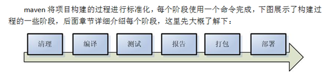

- 仓库

  本地仓库：放在自己电脑上的。

  远程仓库：公司局域网内一台机器上（私服）

  中心仓库：所有公司的jar包全在一起。apache维护。

  代码根据maven中Jar包的坐标去寻找该包，先本地找---不行就远程---最后再中心下

- Maven目录结构的规范 (必须要符合这个目录结构，才能执行相关命令)。pom.xml是maven工程的配置文件。

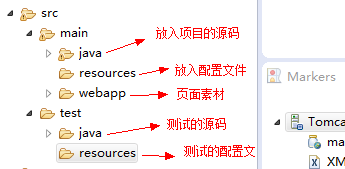

- 项目对象模型

  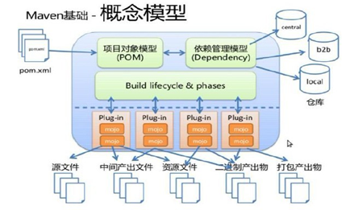

  1. pom.xml (project  object   model)项目对象模型,本项目所使用的对象
  2. 依赖管理模型。从pom中拿到坐标，再去仓库里搜索。
  3. 编译的过程都是由插件plug-in进行处理.

  整体过程：pom从xml中找到坐标，给依赖管理模型去各个仓库中找jar包，然后使用一系列插件去进行编译等过程。

## 二：Maven命令

进入到pom.xml文件所在位置执行

1. **compile**

   compile是maven工程的编译命令，作用是将src/main/java下的文件编译为class文件输出到target目录下。

   cmd进入命令状态，执行mvn compile 

2. **test**

   test是maven工程的测试命令，会执行src/test/java下的单元测试类。cmd执行mvn test执行src/test/java下单元测试类 

3. **clean**

   clean是maven工程的清理命令，执行 clean会删除target目录的内容。

4. **package**

   package是maven工程的打包命令，对于java工程执行package打成jar包，对于web工程打成war包。

5. **install**

   install是maven工程的安装命令，执行install将maven打成jar包或war包发布到本地仓库。

   

   从运行结果中，可以看出：当后面的命令执行时，前面的操作过程也都会自动执行.这个过程叫做maven的默认生命周期。clean部分属于另外一个生命周期

   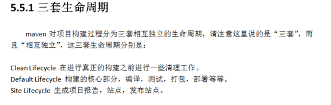

## 三：使用IDE创建maven

- 要勾选（skip archetype selection），要是选了这个是创建出和Maven工程不一样的目录结构，可能会少一些目录文件。

- 打包分为：jar(java项目),war（web项目）,pom(工程聚合时，父工程一般选择这个)

- 添加jar包的坐标时，还可以指定这个jar包将来的作用范围 

  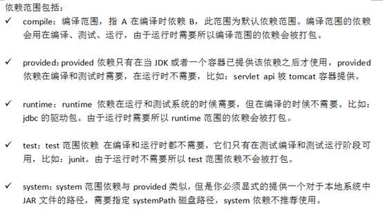

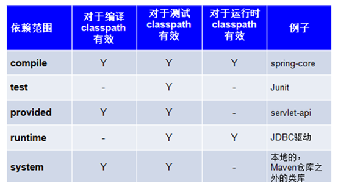

## 四：工程的拆分与聚合

- 一个完整的早期开发好的crm项目，现在要使用maven工程对它进行拆分，这时候就可以将dao拆解出来形成表现独立的工程，同样service,action也都这样拆分

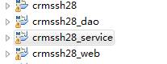

- 工程拆分之后（就变成了独立的工程，不能互相调用了），将来还要聚合（聚合就是将拆分的工程进一步组合在一起，又形成一个完整的项目）

- 为了达到聚合的目标，所以今天会引入

  父工程（maven project）

  子模块(maven module)  dao  ,service, web

- **父工程：**从它的目录结构可以看出，父工程本身不写代码，它里面有一个pom.xml文件，这个文件可以将多个子模块中通用的jar所对应的坐标，集中在父工程中配置，将来的子模块就可以不需要在pom.xml中配置通用jar的坐标了。

- **子模块：** 在创建的时候选择父工程的工程名。

- 此时，父工程的pom.xml文件就包含一个<modules>标签，标记子工程；子工程的pom文件中就包含一个<parent>标签，表示父工程。这样只需要在父工程中配置jar包即可。所以子工程就选择为jar包类型。

## 五：版本冲突的解决

1. 通过添加<exclusion>标签来解决冲突

   在父工程中引入了struts-core,hibernate-core，发现Javassist包存在版本上冲突问题。手动移除一个版本低的，发现在父工程的pom.xml文件中会添加以下内容

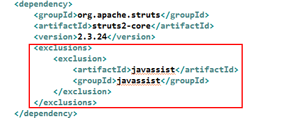

### 依赖版本冲突

1. 当一个项目依赖的构件比较多时，它们相互之前存在依赖，当你需要对依赖版本统一管理时如果让maven自动来处理可能并不能如你所愿，如下例子：

   同时加入以下依赖，观察依赖：

   ```
   <!-- struts2-spring-plugin依赖spirng-beans-3.0.5 -->
   <dependency>
          <groupId>org.apache.struts</groupId>
         <artifactId>struts2-spring-plugin</artifactId>
          <version>2.3.24</version>
   </dependency>
   
   <!-- spring-context依赖spring-beans-4.2.4 -->
   <dependency>
        <groupId>org.springframework</groupId>
        <artifactId>spring-context</artifactId>
        <version>4.2.4.RELEASE</version>
   </dependency>
   ```

   org.apache.struts依赖spirng-beans-3.0.5，spring-context依赖spring-beans-4.2.4，但是发现spirng-beans-3.0.5加入到工程中，而我们希望spring-beans-4.2.4加入工程。

### 依赖调解原则

​         maven自动按照下边的原则调解：

**1**、第一声明者优先原则

​         在pom文件定义依赖，先声明的依赖为准。

测试：

如果将上边struts-spring-plugins和spring-context顺序颠倒，系统将导入spring-beans-4.2.4。

分析：

由于spring-context在前边以spring-context依赖的spring-beans-4.2.4为准，所以最终spring-beans-4.2.4添加到了工程中。


 **2**、路径近者优先原则

​         例如：A依赖 spirng-beans-4.2.4，A依赖B依赖 spirng-beans-3.0.5，则spring-beans-4.2.4优先被依赖在A中，因为spring-beans-4.2.4相对spirng-beans-3.0.5被A依赖的路径最近。

​	测试：在本工程中的pom中加入spirng-beans-4.2.4的依赖，根据路径近者优先原则，系统将导入spirng-beans-4.2.4：

```
<dependency>
        <groupId>org.springframework</groupId>
        <artifactId>spring-beans</artifactId>
        <version>4.2.4.RELEASE</version>
</dependency>
```

### 排除依赖

上边的问题也可以通过排除依赖方法辅助依赖调解，如下：比如在依赖struts2-spring-plugin的设置中添加排除依赖，排除spring-beans，

下边的配置表示：依赖struts2-spring-plugin，但排除struts2-spring-plugin所依赖的spring-beans。

```xml
<!-- struts2-spring-plugin依赖spirng-beans-3.0.5 -->
    <dependency>
        <groupId>org.apache.struts</groupId>
        <artifactId>struts2-spring-plugin</artifactId>
        <version>2.3.24</version>
        <!-- 排除 spring-beans-->
        <exclusions>
            <exclusion>
                <groupId>org.springframework</groupId>
                <artifactId>spring-beans</artifactId>
            </exclusion>
            <exclusion>
                <groupId>org.springframework</groupId>
                <artifactId>spring-context</artifactId>
            </exclusion>
        </exclusions>
    </dependency>
```

### 锁定版本

​         面对众多的依赖，有一种方法不用考虑依赖路径、声明优化等因素可以采用直接锁定版本的方法确定依赖构件的版本，版本锁定后则不考虑依赖的声明顺序或依赖的路径，以锁定的版本的为准添加到工程中，此方法在企业开发中常用。

​       如下的配置是锁定了spring-beans和spring-context的版本(在父工程中的pom.xml中写上)：

```
<dependencyManagement>
    <dependencies>
        <!--这里锁定版本为4.2.4 -->
        <dependency>
            <groupId>org.springframework</groupId>
            <artifactId>spring-beans</artifactId>
            <version>4.2.4.RELEASE</version>
        </dependency>
        <dependency>
            <groupId>org.springframework</groupId>
            <artifactId>spring-context</artifactId>
            <version>4.2.4.RELEASE</version>
        </dependency>
    </dependencies>
</dependencyManagement>
```

注意：在工程中锁定依赖的版本并不代表在工程中添加了依赖，如果工程需要添加锁定版本的依赖则需要单独添加<dependencies></dependencies>标签，如下：

```
<dependencies>
        <!--这里是添加依赖 -->
        <dependency>
            <groupId>org.springframework</groupId>
            <artifactId>spring-beans</artifactId>
        </dependency>
        <dependency>
            <groupId>org.springframework</groupId>
            <artifactId>spring-context</artifactId>
        </dependency>
</dependencies>
```

上边添加的依赖并没有指定版本，原因是已在<dependencyManagement>中锁定了版本，所以在<dependency>下不需要再指定版本。

- 也可以这么写

在使用坐标时，对于同一个框架，引入多次时，它的版本信息就会多次出现，所以可以借用常量的思想，将这些版本号提取出来，在需要用到的时候，直接写版本的常量名称就可以了。 

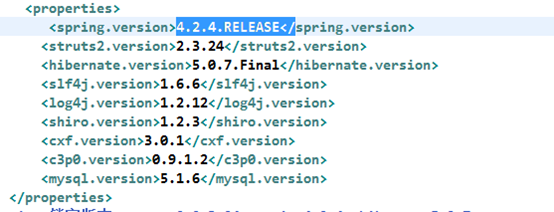

引用上面的常量名

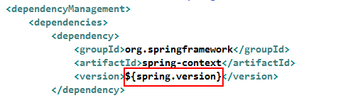


## 六：依赖关系的传递

- domain包中一般存储对象类。也就是持久化对象。其中po的规范  （Persistent Object 持久化对象）

  1.公有类
  2.私有属性
  3.公有的getter与setter
  4.不能使用final修饰
  5.提供默认无参构造
  6.如果是基本类型，就写它对应的包装类
  7.一般都要实现java.io.Serializable

- hibernate6种组件生成策略： 

  ```
   identity：组件自动增长
   native：
   sequence：oracle序列
   uuid：
   increment：数据库中查找最大值加一
   assigned：程序员自己手工赋值
  ```

### 什么是传递依赖

​         当A 依赖B、B依赖C，在A中导入B后会自动导入C，C是A的传递依赖，如果C依赖D则D也可能是A的传递依赖。

​	演示：

​	web中添加struts-spring的jar，传递依赖了spring

### 依赖范围对传递依赖的影响（了解）

​         依赖会有依赖范围，依赖范围对传递依赖也有影响，有A、B、C，A依赖B、B依赖C，C可能是A的传递依赖，如下图：

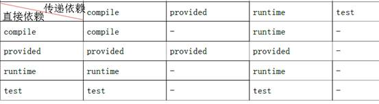

​         最左边一列为直接依赖，理解为A依赖B的范围，最顶层一行为传递依赖，理解为B依赖C的范围，行与列的交叉即为A传递依赖C的范围。

**举例：**

​	比如 A对 B 有 compile 依赖，B 对C有 runtime 依赖，那么根据表格所示A对C 有 runtime 依赖。

**测试**

dao依赖junit，scop为test

service依赖dao.

查看下图红色框内所示传递依赖范围：

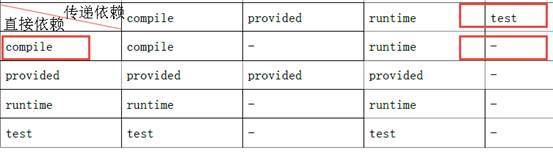

所以maven-first所依赖的junit的jar没有加入到maven-web工程。

如果修改maven-first依赖junit的scop为compile，maven-first所依赖的junit的jar包会加入到maven-web工程中，符合上边表格所示，查看下图红色框内所示：

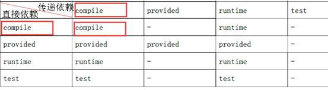

###  解决方法：

如果在依赖传递过程中，导致jar包丢失，我们的做法很简单，就是再导入一次坐标要是没添加进来，就自己加一下

##  七：业务逻辑子工程的抽取

子模块最后都会生成为jar包：已经新建了一个dao模块，现在再写一个service，sercie中需要调用dao中的内容。因为dao模块最后是会生成一个jar包，所以直接在service的pom.xml中导入。

web模块是最后打包好放在tomcat里去运行的，所以选择打包为war包。

service中引入了Dao后，web模块就可以直接使用Dao中的东西了。因为service中已经引入了dao。