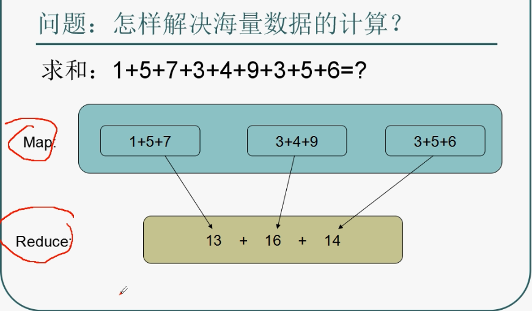
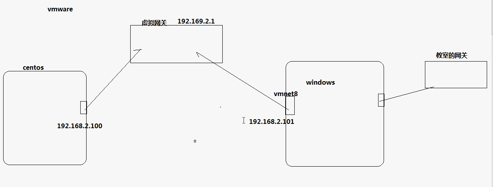
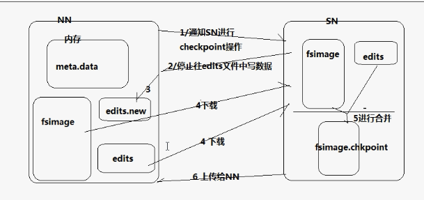
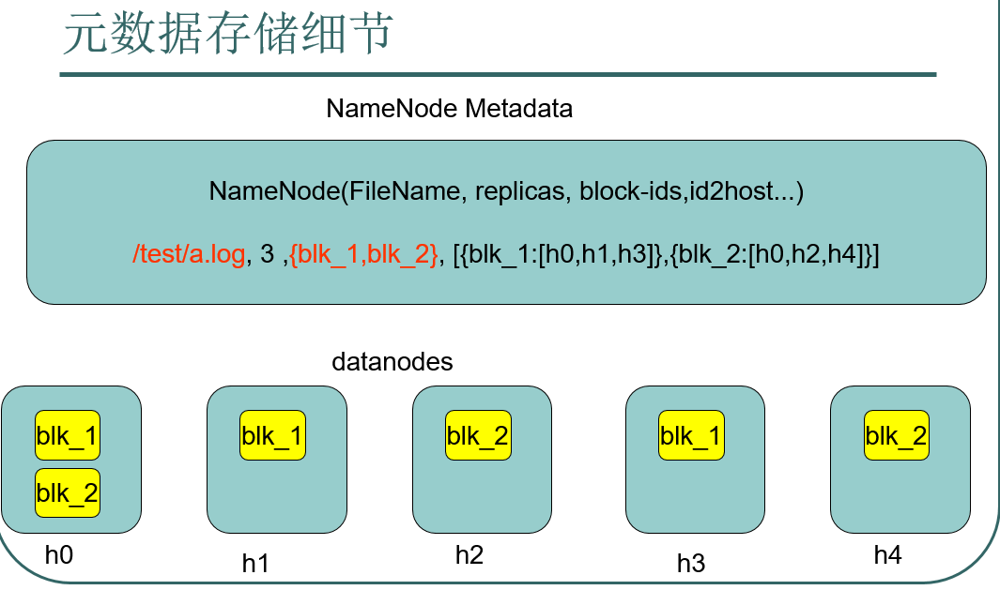

# 初步介绍

**来源**

l解决问题：

•海量数据的存储（HDFS）

•海量数据的分析（MapReduce），storm, spark -- 都是分析处理框架，跟资源调度无关，所以YARN可以用来对

•资源管理调度（YARN）

所以一个hadoop集群就包含了多种模型：流运算，实时运算

分布式系统中：多线程处理、网络传输的可靠性、

**介绍**

datanode上进行数据存储，每个数据分成多个块，每个块在整个集群上都有副本。namenode上

map：集群里每个节点对本地局部的数据进行并发处理

reduce：集群中的一台机器选择多个节点上的数据运行。通过网络将其他的机器上的结果取过来进行处理。因为是取一个数所以不会是很大的瓶颈。

reduce程序也可以分组，多个并行。



CDH：商业化的hadoop，自动化安装部署-- cloudera



# 伪分布式搭建

## 配置步骤

**1. 准备Linux环境**
1.0 点击VMware快捷方式，右键打开文件所在位置 -> 双击vmnetcfg.exe -> VMnet1 host-only ->修改subnet ip 设置网段：192.168.1.0 子网掩码：255.255.255.0 -> apply -> ok
	回到windows --> 打开网络和共享中心 -> 更改适配器设置 -> 右键VMnet1 -> 属性 -> 双击IPv4 -> 设置windows的IP：192.168.1.100 子网掩码：255.255.255.0 -> 点击确定
	在虚拟软件上 --My Computer -> 选中虚拟机 -> 右键 -> settings -> network adapter -> host only -> ok	

1.1 修改主机名

```
vim /etc/sysconfig/network
NETWORKING=yes
HOSTNAME=itcast    ###
```

使用 `sudo hostname  主机名 `就会立即生效，但需要重新登录(exit)。不能通过主机名得知ip地址，所以配置 1.3 

1.2 修改IP：两种方式

```shell
第一种：通过Linux图形界面进行修改（强烈推荐）
进入Linux图形界面 -> 右键点击右上方的两个小电脑 -> 点击Edit connections -> 选中当前网络System eth0 -> 点击edit按钮 -> 选择IPv4 -> method选择为manual -> 点击add按钮 -> 添加IP：192.168.1.101 子网掩码：255.255.255.0 网关：192.168.1.1 -> apply

第二种：修改配置文件方式（屌丝程序猿专用）
vim /etc/sysconfig/network-scripts/ifcfg-eth0

DEVICE="eth0"
BOOTPROTO="static"               ###
HWADDR="00:0C:29:3C:BF:E7"
IPV6INIT="yes"
NM_CONTROLLED="yes"
ONBOOT="yes"
TYPE="Ethernet"
UUID="ce22eeca-ecde-4536-8cc2-ef0dc36d4a8c"
IPADDR="192.168.1.101"           ###
NETMASK="255.255.255.0"          ###
GATEWAY="192.168.1.1"            ###
```

改完配置文件后不会自动生效，必须重启linux服务器(reboot) 或者 重启network服务(sudo service network restart)

1.3修改主机名和IP的映射关系

	vim /etc/hosts
	192.168.1.101	itcast

1.4关闭防火墙

```
#查看防火墙状态
service iptables status
#关闭防火墙
service iptables stop

#查看防火墙开机启动状态
chkconfig iptables --list
#关闭防火墙开机启动
chkconfig iptables off
```

1.5重启Linux
	reboot

**2.安装JDK**

	2.1上传alt+p 后出现sftp窗口，然后put d:\xxx\yy\ll\jdk-7u_65-i585.tar.gz
	2.2解压jdk
		#创建文件夹
		mkdir /home/hadoop/app
		#解压
		tar -zxvf jdk-7u55-linux-i586.tar.gz -C /home/hadoop/app
		
	2.3将java添加到环境变量中
		vim /etc/profile
		#在文件最后添加
		export JAVA_HOME=/home/hadoop/app/jdk-7u_65-i585
		export PATH=$PATH:$JAVA_HOME/bin
	
		#刷新配置
		source /etc/profile

**3.安装hadoop2.4.1**
	先上传hadoop的安装包到服务器上去/home/hadoop/
	注意：hadoop2.x的配置文件$HADOOP_HOME/etc/hadoop
	伪分布式需要修改5个配置文件
3.1配置hadoop	
	第一个：hadoop-env.sh
			vim hadoop-env.sh
			#第27行
			export JAVA_HOME=/usr/java/jdk1.7.0_65
	
	第二个：core-site.xml
		<!-- 指定HADOOP所使用的文件系统schema（URI），HDFS的老大（NameNode）的地址 -->
		<property>
			<name>fs.defaultFS</name>
			//用uri表示，协议：自己需要的参数
			<value>hdfs://weekend-1206-01:9000</value>
		</property>
		<!-- 指定hadoop运行时产生文件的存储目录 -->
		<property>
			<name>hadoop.tmp.dir</name>
			<value>/home/hadoop/hadoop-2.4.1/tmp</value>
	</property>
	
	// 运行时的关键细节 
	第三个：hdfs-site.xml   hdfs-default.xml  (3)
		<!-- 指定HDFS副本的数量 -->
		<property>
			<name>dfs.replication</name>
			<value>1</value>
	</property>
		
	第四个：mapred-site.xml (mv mapred-site.xml.template mapred-site.xml)
		mv mapred-site.xml.template mapred-site.xml
		vim mapred-site.xml
		<!-- 指定mr运行在yarn上 -->
		<property>
			<name>mapreduce.framework.name</name>
			<value>yarn</value>
	</property>
		
	第五个：yarn-site.xml
		<!-- 指定YARN的老大（ResourceManager）的地址 -->
		<property>
			<name>yarn.resourcemanager.hostname</name>
			<value>weekend-1206-01</value>
	</property>
		<!-- reducer获取数据的方式 -->
	<property>
			<name>yarn.nodemanager.aux-services</name>
			<value>mapreduce_shuffle</value>
	 </property>

3.2将hadoop添加到环境变量

```
vim /etc/proflie
	export JAVA_HOME=/usr/java/jdk1.7.0_65
	export HADOOP_HOME=/itcast/hadoop-2.4.1
	export PATH=$PATH:$JAVA_HOME/bin:$HADOOP_HOME/bin:$HADOOP_HOME/sbin

source /etc/profile
```

3.3格式化namenode（是对namenode进行初始化）
`hdfs namenode -format (hadoop namenode -format)`
就是在相应目录下创建了一些文件，初始化写了些东西。fsimage就是用来存储相应数据的

3.4启动hadoop

相关命令可以在sbin目录中找到

	先启动HDFS
	sbin/start-dfs.sh
	再启动YARN
	sbin/start-yarn.sh

slaves设置哪些机器上要启动datanode，nodemanager

对于hdfs：NameNode是老大，dataNode是从节点

对于yarn：resourceManager是老大，nodemanager是从节点。

3.5验证是否启动成功

	使用jps命令验证。查看相关进程
		27408 NameNode
		28218 Jps
		27643 SecondaryNameNode
		28066 NodeManager
		27803 ResourceManager
		27512 DataNode
	
	修改hosts就能从本地主机去访问该页面
	http://192.168.1.101:50070 （HDFS管理界面）
	http://192.168.1.101:8088 （MR管理界面）
**4.配置ssh免登陆**

	#生成ssh免登陆密钥
	#进入到我的home目录
	cd ~/.ssh
	ssh-keygen -t rsa （四个回车）
	执行完这个命令后，会生成两个文件id_rsa（私钥）、id_rsa.pub（公钥）
	将公钥拷贝到要免登陆的机器上
	ssh-copy-id localhost

# Hadoop Core介绍 ：

hadoop核心框架包括：yarn管理集群，hdfs存储集群，mapreduce计算模型

## HDFS：Hadoop分布式文件系统(HDFS)

**特点：**高度容错，适合部署在廉价的机器上 ； 能提供高吞吐量的数据访问，非常适合大规模数据集上的应用 ； 放宽了一部分POSIX约束，来实现**流式读取文件系统数据，提高吞吐量。** ；“一次写入多次读取”的文件访问模型。 

**组成：**一个HDFS集群主要由一个**NameNode和很多个Datanode**组成：Namenode负责管理文件系统的名字空间(namespace)以及客户端对文件的访问 ，而Datanode存储了实际的数据。 一个文件被分成一个或多个数据块存储在一组Datanode上 


**写：** 

1. 客户端访问namenode想要存数据，nn查询是否存在，不存在则可以写，将数据切分信息以及存储路径，分配好的dn返回给client，同时nn记录元数据到edits log中。

   **注意：** 切分的块是小文件占用nn元数据空间，一个元数据150Byte。

2. 源文件被分为多个block存储在多态datanode上。文件名与对应的block存储地址存储在namenode上。每块block都会在集群中存储多个副本。副本的存储：优先存储在离client最近的机架上，下一个放在别的机架上，第三在本机架随机找一个。

3. 客户端通过网络写入一个block，该block的其他副本由nn负责管理。（通过网络复制失败的概率较大）。client写入成功后告诉nn。

   **e.g.** client通过网络写给dn1，dn1赋值给dn2，dn2复制给dn3失败，dn3会返回失败消息给dn2，dn2再返回消息给dn1，dn1向nn汇报，nn就指定一个新的dn3，让dn1/2中的某一个将block复制给dn3。

   存储命令中写入路径：`hdfs://weekend110:9000/wordcount/input/test.txt` 是hdfs的虚拟路径，实际存储在datanode的linux文件系统ext3的`/home/hadoop/app/hadoop-2.4.2/data/dfs/data/`目录下

4. 此时nn将元数据更新到内存中(最新的，便于查询)

**读：**namenode将block位置发送给客户端，客户端根据地址自己去通过网络下载

## namenode原理

**问题：**有大量的用户并发访问系统，进行大量的修改。nn上元数据的管理方式：

- 若内存+磁盘：若断电，则gg  /  磁盘：太慢

**解决：edits日志文件 + Secondary NameNode**

nn将对文件系统的改动追加保存到本地文件系统上的一个日志文件（edits），内存和edit保持一致。**Secondary NameNode定期在checkpoints点合并fsimage和edits日志**

**步骤：**



1. snn通知nn切换edits文件
2. snn通知nn停止向edits中写入，nn使用新的edits文件开始工作
3. snn通过http方式下载nn中的fsimage和edits，合并为新的fsimage.chkpoint
4. 将fsimage.chkpoint上传给nn，nn将fsimage.chkpoint重命名为fsimage，将原来的edits.new重命名为edits
5. 查询都是通过内存进行，所以都是最新的。

**checkpoint：**

- lfs.checkpoint.period 指定两次checkpoint的最大时间间隔，默认3600秒。 
- lfs.checkpoint.size    规定edits文件的最大值，一旦超过这个值则强制checkpoint，不管是否到达最大时间间隔。默认大小是64M。


**问题：**只有一个nn，如果nn宕机无法提供服务怎么解决？

两个nn，需要保持两个nn的数据完全一致。通过hadoop的 ha 机制实现。

**元数据格式：**



## datanode原理

- 提供真实文件数据的存储服务。
- 文件块（block）：最基本的存储单位。对于文件内容而言，一个文件的长度大小是size，那么从文件的０偏移开始，按照固定的大小，顺序对文件进行划分并编号，划分好的每一个块称一个Block。HDFS默认Block大小是128MB，以一个256MB文件，共有256/128=2个Block. `dfs.block.size属性`
- 不同于普通文件系统的是，HDFS中，如果一个文件小于一个数据块的大小，并不占用整个数据块存储空间(128M)，meta是校验信息。**文本文件就可以直接读取。压缩文件也可以直接获取多个块进行追加，追加后的结果就是上传的大文件**
- Replication。多复本。默认是三个。`hdfs-site.xml的dfs.replication属性 `

Yarn

resourceManager

nodeManager

mapreduce_shuffle：指定了map的结果采用该机制传给reduce