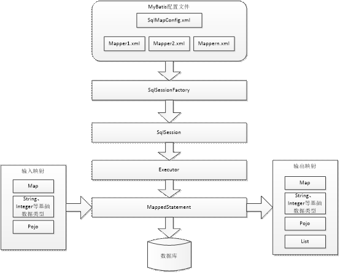
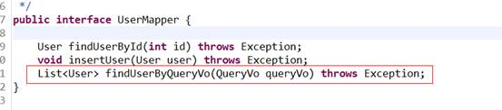
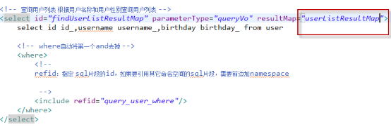
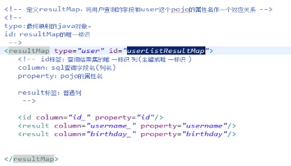
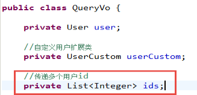
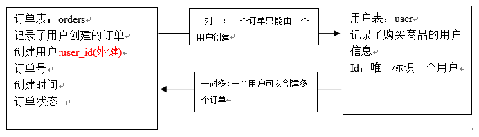
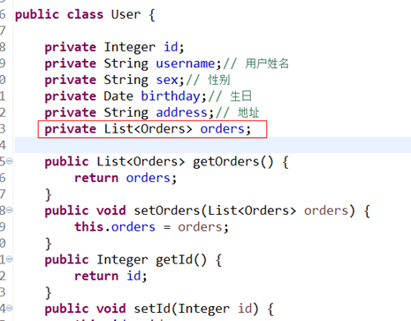

# MyBatis

# 名词

- pojo : 不按mvc分层,只是java bean有一些属性,还有get set方法
- domain : 不按mvc分层,只是java bean有一些属性,还有get set方法
- po : persistent object用在持久层,还可以在增加或者修改的时候,从页面直接传入action中,它里面的java bean 类名等于表名,属性名等于表的字段名,还有对应的get set方法
- vo : view object表现层对象,主要用于在高级查询中从页面接收传过来的各种参数.好处是扩展性强
- bo :  用在service层,现在企业基本不用.

**这些po,vo, bo,pojo可以用在各种层面吗？**

- 可以,也就是po用在表现层,vo用在持久层不报错,因为都是普通的java bean没有语法错误.
- 但是在企业最好不要混着用,因为这些都是设计的原则,混着用比较乱.不利于代码维护.

# 第一天

# mybatis的介绍

- MyBatis是一个优秀的持久层框架，它对jdbc的操作数据库的过程进行封装，使开发者只需要关注 SQL 本身，而不需要花费精力去处理例如注册驱动、创建connection、创建statement、手动设置参数、结果集检索等jdbc繁杂的过程代码。
- Mybatis通过xml或注解的方式将要执行的各种statement（statement、preparedStatement、CallableStatement）配置起来，并通过java对象和statement中的sql进行映射生成最终执行的sql语句，最后由mybatis框架执行sql并将结果映射成java对象并返回。

# Mybatis的入门

## a)使用jdbc操作数据库存在的问题

1. 数据库链接创建、释放频繁造成系统资源浪费从而影响系统性能，如果使用数据库链接池可解决此问题。
2. Sql语句在代码中硬编码，造成代码不易维护，实际应用sql变化的可能较大，sql变动需要改变java代码。
3. 使用preparedStatement向占有位符号传参数存在硬编码，因为sql语句的where条件不一定，可能多也可能少，修改sql还要修改代码，系统不易维护。
4. 对结果集解析存在硬编码（查询列名），sql变化导致解析代码变化，系统不易维护，如果能将数据库记录封装成pojo对象解析比较方便。

## b)Mybatis的架构

 

1. mybatis配置

- SqlMapConfig.xml，此文件作为mybatis的全局配置文件，配置了mybatis的运行环境等信息。
- mapper.xml文件即sql映射文件，文件中配置了操作数据库的sql语句。此文件需要在SqlMapConfig.xml中加载。

2. 通过mybatis环境等配置信息构造SqlSessionFactory即会话工厂
3. 由会话工厂创建sqlSession即会话，操作数据库需要通过sqlSession进行。
4. mybatis底层自定义了Executor执行器接口操作数据库，Executor接口有两个实现，一个是基本执行器、一个是缓存执行器。
5. Mapped Statement也是mybatis一个底层封装对象，它包装了mybatis配置信息及sql映射信息等。mapper.xml文件中一个sql对应一个Mapped Statement对象，sql的id即是Mapped statement的id。
6. Mapped Statement对sql执行输入参数进行定义，包括HashMap、基本类型、pojo，Executor通过Mapped Statement在执行sql前将输入的java对象映射至sql中，输入参数映射就是jdbc编程中对preparedStatement设置参数。
7. Mapped Statement对sql执行输出结果进行定义，包括HashMap、基本类型、pojo，Executor通过Mapped Statement在执行sql后将输出结果映射至java对象中，输出结果映射过程相当于jdbc编程中对结果的解析处理过程。

## Mybatis的入门程序

映射文件：User.xml,主要是写sql语句。包含：查询（返回值为一个对象，集合）、增加

5. #{}占位符:占位
    如果传入的是基本类型,那么#{}中的变量名称可以随意写
    如果传入的参数是pojo类型,那么#{}中的变量名称必须是pojo中的属性.属性.属性...

6. ${}拼接符:字符串原样拼接
    如果传入的是基本类型,那么${}中的变量名必须是value
    如果传入的参数是pojo类型,那么${}中的变量名称必须是pojo中的属性.属性.属性...
    注意:使用拼接符有可能造成sql注入,在页面输入的时候可以加入校验,不可输入sql关键字,不可输入空格


```xml-dtd
<?xml version="1.0" encoding="UTF-8" ?>
<!DOCTYPE mapper
PUBLIC "-//mybatis.org//DTD Mapper 3.0//EN"
"http://mybatis.org/dtd/mybatis-3-mapper.dtd">
<!-- namespace:命名空间,做sql隔离 -->
<mapper namespace="test">

	<!-- 
	查询-返回值为一个对象。

	id:sql语句唯一标识
	parameterType:指定传入参数类型
	resultType:返回结果集类型
	#{}占位符:起到占位作用,如果传入的是基本类型(string,long,double,int,boolean,float等),那么#{}中的变量名称可以随意写.
	 -->
	<select id="findUserById" parameterType="java.lang.Integer" resultType="cn.itheima.pojo.User">
		select * from user where id=#{id}
	</select>

	<delete id="delUserById" parameterType="int">
		delete from user where id=#{id}
	</delete>
	
	<update id="updateUserById" parameterType="cn.itheima.pojo.User">
		update user set username=#{username} where id=#{id}
	</update>
</mapper>
```

- 查询-返回值为一个集合

```xml-dtd
	<!-- 
	如果返回结果为集合,可以调用selectList方法,这个方法返回的结果就是一个集合,所以映射文件中应该配置成集合泛型的类型。（注意这里resultType还是集合中的元素类型，而不是集合类型）
	占位符的写法：like #{}, 这样在java程序中就应该写成 "%王%"
	${}拼接符:字符串原样拼接,如果传入的参数是基本类型(string,long,double,int,boolean,float等),那么${}中的变量名称必须是value
	注意:拼接符有sql注入的风险,所以慎重使用
	 -->
	<select id="findUserByUserName" parameterType="java.lang.String" resultType="cn.itheima.pojo.User">
		select * from user where username like '%${value}%'
	</select>
```

```java
@Test
public void testFindUserbyUserName() throws Exception{
    String resource = "SqlMapConfig.xml";
    InputStream inputStream = Resources.getResourceAsStream(resource);
    SqlSessionFactory factory = new SqlSessionFactoryBuilder().build(inputStream);
    SqlSession openSession = factory.openSession();

    List<User> list = openSession.selectList("test.findUserByUserName", "王");
    System.out.println(list);
}
```

- 增加-返回值为一个对象。

```xml-dtd
<!-- 
	#{}:如果传入的是pojo类型,那么#{}中的变量名称必须是pojo中对应的属性.属性.属性.....
	如果要返回数据库自增主键:可以使用select LAST_INSERT_ID()
	 -->
	<insert id="insertUser" parameterType="cn.itheima.pojo.User" >
		<!-- 执行 select LAST_INSERT_ID()数据库函数,返回自增的主键
		keyProperty:将返回的主键放入传入参数的Id中保存.(user的ID属性)
		order:当前函数相对于insert语句的执行顺序,在insert前执行是before,在insert后执行是AFTER
		resultType:id的类型,也就是keyProperty中属性的类型
		-->
		<selectKey keyProperty="id" order="AFTER" resultType="java.lang.Integer">
			select LAST_INSERT_ID()
		</selectKey>
		insert into user (username,birthday,sex,address) values(#{username},#{birthday},#{sex},#{address})
	</insert>
```

```java
@Test
	public void testInsertUser() throws Exception{
		String resource = "SqlMapConfig.xml";
		//通过流将核心配置文件读取进来
		InputStream inputStream = Resources.getResourceAsStream(resource);
		//通过核心配置文件输入流来创建会话工厂
		SqlSessionFactory factory = new SqlSessionFactoryBuilder().build(inputStream);
		//通过工厂创建会话
		SqlSession openSession = factory.openSession();
		
		User user = new User();
		user.setUsername("赵四");
		user.setBirthday(new Date());
		user.setSex("1");
		user.setAddress("北京昌平");
		System.out.println("====" + user.getId());
		
		openSession.insert("test.insertUser", user);
		//提交事务(mybatis会自动开启事务,但是它不知道何时提交,所以需要手动提交事务)
		openSession.commit();
		//user的id属性存储自增主键的值
		System.out.println("====" + user.getId());
	}
```

- Mysql使用 uuid实现主键

```xml-dtd
需要增加通过select uuid()得到uuid值

<insert  id="insertUser" parameterType="cn.itcast.mybatis.po.User">
<selectKey resultType="java.lang.String" order="BEFORE" 
keyProperty="id">
	select uuid()
</selectKey>
	insert into user(id,username,birthday,sex,address) values(#{id},#{username},#{birthday},#{sex},#{address})
</insert>
注意这里使用的order是“BEFORE”,先得到id的值，然后把它放到user的id属性中
```

# Dao的开发方法

## a)原始dao的开发方法

原始Dao开发方法需要程序员编写Dao接口和Dao实现类。

- 映射文件

```java
<?xml version="1.0" encoding="UTF-8" ?>
<!DOCTYPE mapper
PUBLIC "-//mybatis.org//DTD Mapper 3.0//EN"
"http://mybatis.org/dtd/mybatis-3-mapper.dtd">
<mapper namespace="test">
<!-- 根据id获取用户信息 -->
	<select id="findUserById" parameterType="int" resultType="cn.itcast.mybatis.po.User">
		select * from user where id = #{id}
	</select>
<!-- 添加用户 -->
	<insert id="insertUser" parameterType="cn.itcast.mybatis.po.User">
	<selectKey keyProperty="id" order="AFTER" resultType="java.lang.Integer">
		select LAST_INSERT_ID() 
	</selectKey>
	  insert into user(username,birthday,sex,address) 
	  values(#{username},#{birthday},#{sex},#{address})
	</insert>
</mapper>
```

- Dao接口 & 实现类

```java
Public interface UserDao {
	public User getUserById(int id) throws Exception;
	public void insertUser(User user) throws Exception;
}


Public class UserDaoImpl implements UserDao {
	//注入SqlSessionFactory
	public UserDaoImpl(SqlSessionFactory sqlSessionFactory){
		this.setSqlSessionFactory(sqlSessionFactory);
	}
	
	private SqlSessionFactory sqlSessionFactory;
    
	@Override
	public User getUserById(int id) throws Exception {
		SqlSession session = sqlSessionFactory.openSession();
		User user = null;
		try {
			//通过sqlsession调用selectOne方法获取一条结果集
			//参数1：指定定义的statement的id,参数2：指定向statement中传递的参数
			user = session.selectOne("test.findUserById", 1);
			System.out.println(user);
						
		} finally{
			session.close();
		}
		return user;
	}
	
	@Override
	Public void insertUser(User user) throws Exception {
		SqlSession sqlSession = sqlSessionFactory.openSession();
		try {
			sqlSession.insert("insertUser", user);
			sqlSession.commit();
		} finally{
			session.close();
		}
	}
}
```

- Dao测试

```java
创建一个JUnit的测试类，对UserDao进行测试。
private SqlSessionFactory sqlSessionFactory;
	
	@Before
	public void init() throws Exception {
		SqlSessionFactoryBuilder sessionFactoryBuilder = new SqlSessionFactoryBuilder();
		InputStream inputStream = Resources.getResourceAsStream("SqlMapConfig.xml");
		sqlSessionFactory = sessionFactoryBuilder.build(inputStream);
	}

	@Test
	public void testGetUserById() {
		UserDao userDao = new UserDaoImpl(sqlSessionFactory);
		User user = userDao.getUserById(22);
		System.out.println(user);
	}
}
```

```
原始Dao开发中存在以下问题：
- Dao方法体存在重复代码：通过SqlSessionFactory创建SqlSession，调用SqlSession的数据库操作方法
- 调用sqlSession的数据库操作方法需要指定statement的id，这里存在硬编码，不利于开发维护。
```

## b)动态代理方式

Mapper接口开发方法只需要程序员编写Mapper接口（相当于Dao接口），由Mybatis框架根据接口定义创建接口的动态代理对象，代理对象的方法体同上边Dao接口实现类方法。 

```
动态代理方式(只需要接口)
	mapper接口代理实现编写规则:
	1) 映射文件中namespace要等于接口的全路径名称
	2) 映射文件中sql语句id要等于接口的方法名称
	3) 映射文件中传入参数类型要等于接口方法的传入参数类型
	4) 映射文件中返回结果集类型要等于接口方法的返回值类型
```

- Mapper.xml(映射文件)

定义mapper映射文件UserMapper.xml（内容同Users.xml），需要修改namespace的值为 UserMapper接口路径。将UserMapper.xml放在classpath 下mapper目录下.

```xml-dtd
<?xml version="1.0" encoding="UTF-8" ?>
<!DOCTYPE mapper
PUBLIC "-//mybatis.org//DTD Mapper 3.0//EN"
"http://mybatis.org/dtd/mybatis-3-mapper.dtd">
<mapper namespace="cn.itcast.mybatis.mapper.UserMapper">
<!-- 根据id获取用户信息 -->
	<select id="findUserById" parameterType="int" resultType="cn.itcast.mybatis.po.User">
		select * from user where id = #{id}
	</select>
<!-- 自定义条件查询用户列表 -->
	<select id="findUserByUsername" parameterType="java.lang.String" 
			resultType="cn.itcast.mybatis.po.User">
	   select * from user where username like '%${value}%' 
	</select>
<!-- 添加用户 -->
	<insert id="insertUser" parameterType="cn.itcast.mybatis.po.User">
	<selectKey keyProperty="id" order="AFTER" resultType="java.lang.Integer">
		select LAST_INSERT_ID() 
	</selectKey>
	  insert into user(username,birthday,sex,address) 
	  values(#{username},#{birthday},#{sex},#{address})
	</insert>
</mapper>
```

- ### Mapper.java(接口文件)

```java
/**
 * 用户管理mapper
 */
Public interface UserMapper {
	//根据用户id查询用户信息
	public User findUserById(int id) throws Exception;
	//查询用户列表.
    //动态代理形式中，如果返回结果集为list,那么mybatis会在生成实现类的使用会自动调用selectList方法
	public List<User> findUserByUsername(String username) throws Exception;
	//添加用户信息
	public void insertUser(User user)throws Exception; 
}
```

接口定义有如下特点：

1、  Mapper接口方法名和Mapper.xml中定义的statement的id相同

2、  Mapper接口方法的输入参数类型和mapper.xml中定义的statement的parameterType的类型相同

3、  Mapper接口方法的输出参数类型和mapper.xml中定义的statement的resultType的类型相同

- ### 加载UserMapper.xml文件

修改SqlMapConfig.xml文件：

```
  <!-- 加载映射文件 -->
  <mappers>
     <mapper resource="mapper/UserMapper.xml"/>
  </mappers>
```

- ### 测试

```java
Public class UserMapperTest extends TestCase {
    private SqlSessionFactory sqlSessionFactory;

    protected void setUp() throws Exception {
        //mybatis配置文件
        String resource = "sqlMapConfig.xml";
        InputStream inputStream = Resources.getResourceAsStream(resource);
        //使用SqlSessionFactoryBuilder创建sessionFactory
        sqlSessionFactory = new SqlSessionFactoryBuilder().build(inputStream);
    }

    Public void testFindUserById() throws Exception {
        //获取session
        SqlSession session = sqlSessionFactory.openSession();
        //获取mapper接口的代理对象
        UserMapper userMapper = session.getMapper(UserMapper.class);
        //调用代理对象方法
        User user = userMapper.findUserById(1);
        System.out.println(user);
        //关闭session
        session.close();
    }
    
    @Test
    public void testFindUserByUsername() throws Exception {
        SqlSession sqlSession = sqlSessionFactory.openSession();
        UserMapper userMapper = sqlSession.getMapper(UserMapper.class);
        List<User> list = userMapper.findUserByUsername("张");
        System.out.println(list.size());
    }
    
    Public void testInsertUser() throws Exception {
        //获取session
        SqlSession session = sqlSessionFactory.openSession();
        //获取mapper接口的代理对象
        UserMapper userMapper = session.getMapper(UserMapper.class);
        //要添加的数据
        User user = new User();
        user.setUsername("张三");
        user.setBirthday(new Date());
        user.setSex("1");
        user.setAddress("北京市");
        //通过mapper接口添加用户
        userMapper.insertUser(user);
        //提交
        session.commit();
        //关闭session
        session.close();
    }
}
```

# SqlMapConfig.xml文件说明

## 配置内容

SqlMapConfig.xml中配置的内容和顺序如下：

**properties**（属性）

settings（全局配置参数）

**typeAliases**（类型别名）

typeHandlers（类型处理器）

objectFactory（对象工厂）

plugins（插件）

environments（环境集合属性对象）

​	environment（环境子属性对象）

​		transactionManager（事务管理）

​		dataSource（数据源）

**mappers**（映射器）

## 1.properties（属性）

SqlMapConfig.xml可以引用java属性文件中的配置信息如下：

- 在classpath下定义db.properties文件

```
jdbc.driver=com.mysql.jdbc.Driver
jdbc.url=jdbc:mysql://localhost:3306/mybatis?characterEncoding=utf-8
jdbc.username=root
jdbc.password=root
```

- SqlMapConfig.xml引用如下：

```
<properties resource="db.properties"/>
	<environments default="development">
		<environment id="development">
			<transactionManager type="JDBC"/>
			<dataSource type="POOLED">
				<property name="driver" value="${jdbc.driver}"/>
				<property name="url" value="${jdbc.url}"/>
				<property name="username" value="${jdbc.username}"/>
				<property name="password" value="${jdbc.password}"/>
			</dataSource>
		</environment>
	</environments>
```

注意： MyBatis 将按照下面的顺序来加载属性：

- 在 properties 元素体内定义的属性首先被读取。 
- 然后会读取properties 元素中resource或 url 加载的属性，它会覆盖已读取的同名属性。 

##  2.typeAliases（类型别名）

### mybatis支持别名：

```
别名	映射的类型
_byte 	byte 
_long 	long 
_short 	short 
_int 	int 
_integer 	int 
_double 	double 
_float 	float 
_boolean 	boolean 
string 	String 
byte 	Byte 
long 	Long 
short 	Short 
int 	Integer 
integer 	Integer 
double 	Double 
float 	Float 
boolean 	Boolean 
date 	Date 
decimal 	BigDecimal 
bigdecimal 	BigDecimal 
map	Map
```

可以用int在xml中替代parameterType的java.lang.Integer

### 自定义别名：

在SqlMapConfig.xml中配置:

```xml
<typeAliases>
    <!-- 定义单个pojo类别名
		type:类的全路劲名称
		alias:别名
		 -->
<!-- 		<typeAlias type="cn.itheima.pojo.User" alias="user"/> -->
		
		<!-- 使用包扫描的方式批量定义别名 
		定义后别名等于类名,不区分大小写,但是建议按照java命名规则来,首字母小写,以后每个单词的首字母大写
		-->
	<!-- 单个别名定义 -->
	<typeAlias alias="user" type="cn.itcast.mybatis.po.User"/>
	<!-- 批量别名定义，扫描整个包下的类，别名为类名（首字母大写或小写都可以） -->
	<package name="cn.itcast.mybatis.pojo"/>
	<package name="其它包"/>
</typeAliases>
```

## 3.mappers（映射器）

Mapper配置的几种方法：

### 1.`<mapper resource=" " />`

使用相对于类路径的资源

如：`<mapper resource="sqlmap/User.xml" />`

 

### 2 .`<mapper class=" " />`

使用mapper接口类路径

如：`<mapper class="cn.itcast.mybatis.mapper.UserMapper"/>`

**注意：此种方法要求mapper接口名称和mapper映射文件名称相同，且放在同一个目录中。**

 

### 3. `<package name=""/>`

注册指定包下的所有mapper接口

如：`<package name="cn.itcast.mybatis.mapper"/>`

**注意：此种方法要求mapper接口名称和mapper映射文件名称相同，且放在同一个目录中。**

# 总结

## hibernate和mybatis区别:

- hibernate:它是一个标准的orm框架,比较重量级,学习成本高.

```
优点:高度封装,使用起来不用写sql,开发的时候,会减低开发周期.
缺点:sql语句无法优化
应用场景:oa(办公自动化系统), erp(企业的流程系统)等,还有一些政府项目,
	总的来说,在用于量不大,并发量小的时候使用.
```

- mybatis:它不是一个orm框架, 它是对jdbc的轻量级封装, 学习成本低,比较简单

```
优点:学习成本低, sql语句可以优化, 执行效率高,速度快
缺点:编码量较大,会拖慢开发周期
应用场景: 互联网项目,比如电商,P2p等
	总的来说是用户量较大,并发高的项目.
```

## 占位符

```
1. #{}占位符:占位
   如果传入的是基本类型,那么#{}中的变量名称可以随意写
   如果传入的参数是pojo类型,那么#{}中的变量名称必须是pojo中的属性.属性.属性...
2. ${}拼接符:字符串原样拼接
   如果传入的是基本类型,那么${}中的变量名必须是value
   如果传入的参数是pojo类型,那么${}中的变量名称必须是pojo中的属性.属性.属性...
   注意:使用拼接符有可能造成sql注入,在页面输入的时候可以加入校验,不可输入sql关键字,不可输入空格
3. 映射文件:
   1)传入参数类型通过parameterType属性指定
   2)返回结果集类型通过resultType属性指定
```


# 第二天：

# 1、输入映射和输出映射

## a)输入参数映射

### 1.传递简单类型

参考第一天内容。

### 2.传递pojo对象

Mybatis使用ognl表达式解析对象字段的值，#{}或者${}括号中的值为pojo属性名称。

### 3.传递pojo包装对象

​       开发中通过pojo传递查询条件 ，查询条件是综合的查询条件，不仅包括用户查询条件还包括其它的查询条件（比如将用户购买商品信息也作为查询条件），这时可以使用包装对象传递输入参数。

​	Pojo类中包含pojo。

### 需求：

根据用户名查询用户信息，查询条件放到QueryVo的user属性中。

#### 1.QueryVo

```java
public class QueryVo {
	private User user;

	public User getUser() {
		return user;
	}

	public void setUser(User user) {
		this.user = user;
	}	
}
```

#### 2.Sql语句

`SELECT * FROM user where username like '%刘%'`

#### 3.Mapper文件

```xml
<!-- 使用包装类型查询用户 
  使用ognl从对象中取属性值，如果是包装对象可以使用.操作符来取内容部的属性
 -->
<select id="findUserByQueryVo" parameterType="queryvo" resultType="user">
    SELECT * FROM user where username like '%${user.username}%'
</select>
```

#### 4.接口



#### 1.1.1.5 测试方法

```java
@Test
public void testFindUserByQueryVo() throws Exception {
    SqlSession sqlSession = sessionFactory.openSession();
    //获得mapper的代理对象
    UserMapper userMapper = sqlSession.getMapper(UserMapper.class);
    //创建QueryVo对象
    QueryVo queryVo = new QueryVo();
    //创建user对象
    User user = new User();
    user.setUsername("刘");
    queryVo.setUser(user);
    //根据queryvo查询用户
    List<User> list = userMapper.findUserByQueryVo(queryVo);
    System.out.println(list);
    sqlSession.close();
}
```

## b)返回值映射

### 1.输出简单类型

下边的例子输出整型： 

- Mapper.xml文件

```
<!-- 获取用户列表总数 -->
    <select id=*"findUserCount"* resultType=*"int"*>
       select count(1) from user
    </select> 
```

- Mapper接口

`public int findUserCount() throws Exception;`

- 调用：

```java
Public void testFindUserCount() throws Exception{
       //获取session
       SqlSession session = sqlSessionFactory.openSession();

       //获取mapper接口实例
       UserMapper userMapper = session.getMapper(UserMapper.**class**);

       //传递Hashmap对象查询用户列表
       int count = userMapper.findUserCount(); 

       //关闭session
       session.close();
}
```

输出简单类型必须查询出来的结果集有一条记录，最终将第一个字段的值转换为输出类型。使用session的selectOne可查询单条记录。

### 2.resultMap

​       resultType可以指定pojo将查询结果映射为pojo，但需要pojo的属性名和sql查询的列名一致方可映射成功。

​       如果sql查询字段名和pojo的属性名不一致，可以通过resultMap将字段名和属性名作一个对应关系 ，resultMap实质上还需要将查询结果映射到pojo对象中。

​       resultMap可以实现将查询结果映射为复杂类型的pojo，比如在查询结果映射对象中包括pojo和list实现一对一查询和一对多查询。

- Mapper.xml定义

  

- 定义resultMap

  由于上边的mapper.xml中sql查询列和Users.java类属性不一致，需要定义resultMap：userListResultMap将sql查询列和Users.java类属性对应起来



1. `<id />`：此属性表示查询结果集的唯一标识，非常重要。如果是多个字段为复合唯一约束则定义多个`<id />`。
2. Property：表示User类的属性。
3. Column：表示sql查询出来的字段名。
4. Column和property放在一块儿表示将sql查询出来的字段映射到指定的pojo类属性上。
5. `<result />`：普通结果，即pojo的属性。

# 2、动态sql

通过mybatis提供的各种标签方法实现动态拼接sql.

### if

```
<select id="findUserByUserNameAndSex" parameterType="cn.itheima.pojo.User" resultType="cn.itheima.pojo.User">
		select * from user where 1==1
	<!-- 调用sql条件:if -->
		<if test="username != null and username != ''">
			and username like '%${username}%'
		</if>
		<if test="sex != null and sex != ''">
			and sex=#{sex}
		</if>
</select>
```

### Where

where标签作用:

1. 会自动向sql语句中添加where关键字
2. 会去掉第一个条件的and关键字

```
<select id="findUserByUserNameAndSex" parameterType="cn.itheima.pojo.User" resultType="cn.itheima.pojo.User">
		select * from user 
		<!-- 调用sql条件 -->
		
		<where>
			<if test="username != null and username != ''">
				and username like '%${username}%'
			</if>
			<if test="sex != null and sex != ''">
				and sex=#{sex}
			</if>
		</where>
</select>
```

- 封装sql

```xml
<!-- 封装sql条件,封装后可以重用. 
	id:是这个sql条件的唯一标识 -->
	<sql id="user_Where">
		<!-- where标签作用:
				会自动向sql语句中添加where关键字
				会去掉第一个条件的and关键字
			 -->
		<where>
			<if test="username != null and username != ''">
				and username like '%${username}%'
			</if>
			<if test="sex != null and sex != ''">
				and sex=#{sex}
			</if>
		</where>
	</sql>
```

```xml
<select id="findUserByUserNameAndSex" parameterType="cn.itheima.pojo.User" resultType="cn.itheima.pojo.User">
		select * from user 
		<!-- 调用sql条件 -->
		<include refid="user_Where"></include>
	</select>
```

### foreach

1. sql语句中一旦有or，查询效率程指数级下降

2. 所以向sql传递数组或List，mybatis使用foreach解析，如下：

   传入多个id查询用户信息，用下边两个sql实现：

 `SELECT * FROM USERS WHERE username LIKE '%张%' AND (id =10 OR id =89 OR id=16)`

`SELECT * FROM USERS WHERE username LIKE '%张%'  id IN (10,89,16)`

### 示例：

在pojo中定义list属性ids存储多个用户id，并添加getter/setter方法



- UserMapper.xml

```xml
<select id="findUserByIds" parameterType="cn.itheima.pojo.QueryVo" resultType="cn.itheima.pojo.User">
		select * from user
		
		select * from user
		<where>
			<if test="ids != null">
				<!-- 
				foreach:循环传入的集合参数
				collection:传入的集合的变量名称
				item:每次循环将循环出的数据放入这个变量中
				open:循环开始拼接的字符串
				close:循环结束拼接的字符串
				separator:循环中拼接的分隔符
				 -->
				<foreach collection="ids" item="id" open="id in (" close=")" separator=",">
					#{id}
				</foreach>
			</if>
		</where>
	</select>
```

- UserMapperTest.java

```java
@Test
	public void testFindUserbyIds() throws Exception{
		SqlSession openSession = factory.openSession();
		//通过getMapper方法来实例化接口
		UserMapper mapper = openSession.getMapper(UserMapper.class);
		
		QueryVo vo = new QueryVo();
		List<Integer> ids = new ArrayList<Integer>();
		ids.add(1);
		ids.add(16);
		ids.add(28);
		ids.add(22);
		vo.setIds(ids);
		
		List<User> list = mapper.findUserByIds(vo);
		System.out.println(list);
	}
```

### Sql片段

Sql中可将重复的sql提取出来，使用时用include引用即可，最终达到sql重用的目的，如下：

```
<!-- 传递pojo综合查询用户信息 -->
	<select id="findUserList" parameterType="user" resultType="user">
		select * from user 
		<where>
		<if test="id!=null and id!=''">
		and id=#{id}
		</if>
		<if test="username!=null and username!=''">
		and username like '%${username}%'
		</if>
		</where>
	</select>
```

将where条件抽取出来： 

```
<sql id="query_user_where">
	<if test="id!=null and id!=''">
		and id=#{id}
	</if>
	<if test="username!=null and username!=''">
		and username like '%${username}%'
	</if>
</sql>
```

使用include引用:

```
<select id="findUserList" parameterType="user" resultType="user">
		select * from user 
		<where>
		<include refid="query_user_where"/>
		</where>
	</select>

```

注意：如果引用其它mapper.xml的sql片段，则在引用时需要加上namespace，如下：

`<include refid=*"*namespace.sql片段”/>`

# 3、关联查询

## 商品订单数据模型



## a)一对一关联

从订单看用户：一对一，一个订单一个用户

将user和order联合查询，需要新建一个pojo（CutomerOrders），在自动映射里，只能将customer的属性拿过来，这样才能将查询出的属性对应的填过去。但是可以选择手动映射，这样在CutomerOrders中就可以创建一个私有对象user，然后查询到的属性就可以直接填在user里面。

### 一对一:自动映射 

```
<select id="findOrdersAndUser1" resultType="cn.itheima.pojo.CustomOrders">
		select a.*, b.id uid, username, birthday, sex, address 
		from orders a, user b 
		where a.user_id = b.id
	</select>
```

### 一对一:手动映射

使用resultMap，定义专门的resultMap用于映射一对一查询结果。 使用association完成关联查询，将关联查询信息映射到pojo对象中。

	<!-- 
		id:resultMap的唯一标识
		type:将查询出的数据放入这个指定的对象中
		注意:手动映射需要指定数据库中表的字段名与java中pojo类的属性名称的对应关系
		 -->
	<resultMap type="cn.itheima.pojo.Orders" id="orderAndUserResultMap">
		<!-- id标签指定主键字段对应关系
			column:列,数据库中的字段名称
			property:属性,java中pojo中的属性名称
			 -->
		<id column="id" property="id"/>
	        
		<!-- result:标签指定非主键字段的对应关系 -->
		<result column="user_id" property="userId"/>
		<result column="number" property="number"/>
		<result column="createtime" property="createtime"/>
		<result column="note" property="note"/>
		
		<!-- 这个标签指定单个对象的对应关系 
		property:指定将数据放入Orders中的user属性中
		javaType:user属性的类型
		-->
		<association property="user" javaType="cn.itheima.pojo.User">
			<id column="uid" property="id"/>
			<result column="username" property="username"/>
			<result column="birthday" property="birthday"/>
			<result column="sex" property="sex"/>
			<result column="address" property="address"/>
		</association>
	</resultMap>
	
	<select id="findOrdersAndUser2" resultMap="orderAndUserResultMap">
		select a.*, b.id uid, username, birthday, sex, address 
		from orders a, user b 
		where a.user_id = b.id
	</select>
## b)一对多关联

案例：查询所有用户信息及用户关联的订单信息。从用户看订单：一对多

用户信息和订单信息为一对多关系。使用resultMap实现如下：

### 1.Sql语句：

```
SELECT u.*, o.id oid,
       o.number,
       o.createtime,
       o.note
FROM
       `user` u
LEFT JOIN orders o ON u.id = o.user_id
```

### 2.定义po类

在User类中加入List<Orders> orders属性 



### 3.Mapper.xml

```
<resultMap type="cn.itheima.pojo.User" id="userAndOrdersResultMap">
		<id column="id" property="id"/>
		<result column="username" property="username"/>
		<result column="birthday" property="birthday"/>
		<result column="sex" property="sex"/>
		<result column="address" property="address"/>
		
		<!-- 指定对应的集合对象关系映射
		property:将数据放入User对象中的ordersList属性中
		ofType:指定ordersList属性的泛型类型
		 -->
		<collection property="ordersList" ofType="cn.itheima.pojo.Orders">
			<id column="oid" property="id"/>
			<result column="user_id" property="userId"/>
			<result column="number" property="number"/>
			<result column="createtime" property="createtime"/>
		</collection>
	</resultMap>
	<select id="findUserAndOrders" resultMap="userAndOrdersResultMap">
		select a.*, b.id oid ,user_id, number, createtime 
		from user a, orders b where a.id = b.user_id
	</select>
```

collection部分定义了用户关联的订单信息。表示关联查询结果集

property=*"orders"：*关联查询的结果集存储在User对象的上哪个属性。

ofType=*"orders"：*指定关联查询的结果集中的对象类型即List中的对象类型。此处可以使用别名，也可以使用全限定名。

<id />及<result/>的意义同一对一查询。

### 4.测试

```java
	@Test
	public void getUserOrderList() {
		SqlSession session = sqlSessionFactory.openSession();
		UserMapper userMapper = session.getMapper(UserMapper.class);
		List<User> result = userMapper.getUserOrderList();
		for (User user : result) {
			System.out.println(user);
		}
		session.close();
	}
```

# 4、Mybatis整合spring

spring的配置文件要加classpath，别的就不加。

在spring的applicationContext.xml中进行配置。这样在mybatis的配置文件中就不用写了。

```
<!-- 使用扫描包的形式来创建mapper代理对象 -->
	<bean class="org.mybatis.spring.mapper.MapperScannerConfigurer">
		<property name="basePackage" value="cn.itcast.mybatis.mapper"></property>
	</bean>
```

# 5.mybatis逆向工程

使用官方网站的mapper自动生成工具mybatis-generator-core-1.3.2来生成po类和mapper映射文件。

作用:mybatis官方提供逆向工程,可以使用它通过数据库中的表来自动生成Mapper接口和映射文件(单表增删改查)和Po类.

## 1. Mapper文件内容不覆盖而是追加

XXXMapper.xml文件已经存在时，如果进行重新生成则mapper.xml文件内容不被覆盖而是进行内容追加，结果导致mybatis解析失败。

解决方法：删除原来已经生成的mapper xml文件再进行生成。

Mybatis自动生成的po及mapper.java文件不是内容而是直接覆盖没有此问题。

 

## 2.  Table schema问题

下边是关于针对oracle数据库表生成代码的schema问题：

Schma即数据库模式，oracle中一个用户对应一个schema，可以理解为用户就是schema。

当Oralce数据库存在多个schema可以访问相同的表名时，使用mybatis生成该表的mapper.xml将会出现mapper.xml内容重复的问题，结果导致mybatis解析错误。

解决方法：在table中填写schema，如下：

`<table schema="XXXX" tableName=" " >`

XXXX即为一个schema的名称，生成后将mapper.xml的schema前缀批量去掉，如果不去掉当oracle用户变更了sql语句将查询失败。

快捷操作方式：mapper.xml文件中批量替换：“from XXXX.”为空

Oracle查询对象的schema可从dba_objects中查询，如下：

select * from dba_objects

#  第二天总结

1. 输入映射(就是映射文件中可以传入哪些参数类型)
  1)基本类型
  2)pojo类型
  3)Vo类型
2. 输出映射(返回的结果集可以有哪些类型)
  1)基本类型
  2)pojo类型
  3)List类型
3. 动态sql:动态的拼接sql语句,因为sql中where条件有可能多也有可能少
  1)where:可以自动添加where关键字,还可以去掉第一个条件的and关键字
  2)if:判断传入的参数是否为空
  3)foreach:循环遍历传入的集合参数
  4)sql:封装查询条件,以达到重用的目的

4. 对单个对象的映射关系:
  1)自动关联(偷懒的办法):可以自定义一个大而全的pojo类,然后自动映射其实是根据数据库总的字段名称和
  	pojo中的属性名称对应.
  2)手动关联: 需要指定数据库中表的字段名称和java的pojo类中的属性名称的对应关系.
  	使用association标签
5. 对集合对象的映射关系
  只能使用手动映射:指定表中字段名称和pojo中属性名称的对应关系
  	使用collection标签
6. spring和mybatis整合
  整合后会话工厂都归spring管理
  1)原生Dao实现:
  	需要在spring配置文件中指定dao实现类
  	dao实现类需要继承SqlSessionDaoSupport超类
  	在dao实现类中不要手动关闭会话,不要自己提交事务.
  2)Mapper接口代理实现:
  	在spring配置文件中可以使用包扫描的方式,一次性的将所有mapper加载

7. 逆向工程:自动生成Pojo类,还可以自动生成Mapper接口和映射文件
  注意:生成的方式是追加而不是覆盖,所以不可以重复生成,重复生成的文件有问题.
  	如果想重复生成将原来生成的文件删除
