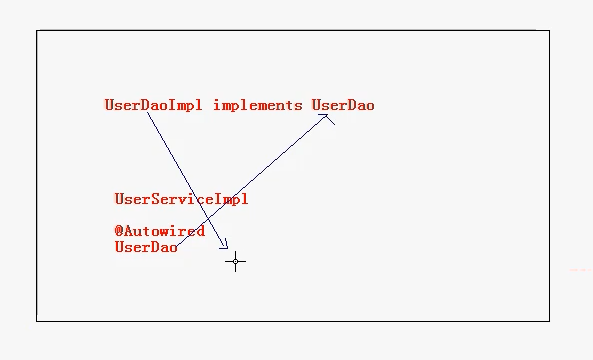
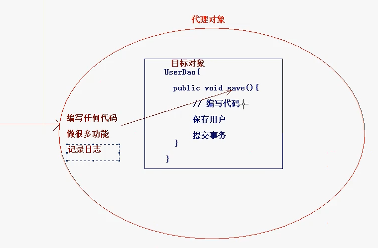
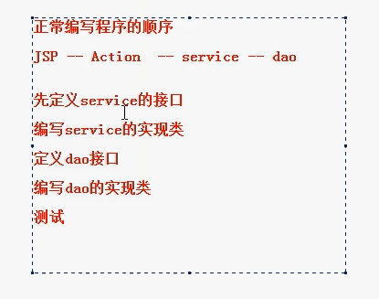
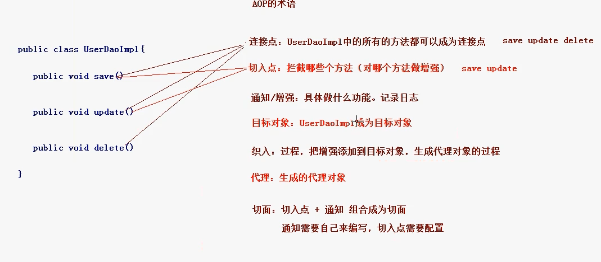

# Spring框架第二天 #

----------

## **课程回顾：Spring框架第一天**

	1. 概述
		* IOC和AOP
	2. 框架的IOC的入门
		* 创建applicationContext.xml，引入约束，<bean/>	
		* 配置文件<bean id="" class="" name="" scope=""/>	
	3. 依赖注入
		* DI：依赖注入
	4. 整合WEB
		* Spring框架提供解决方案，先导入Spring-web.jar包，提供类

----------

## **今天内容介绍**

	1. Spring框架的IOC基于注解的方式
	2. Spring框架整合JUnit单元测试
	3. AOP的概述
	4. AOP的底层实现原理（了解）
	5. AOP功能基于AspectJ的配置文件方式

----------

## 技术分析之Spring框架的IOC功能之注解的方式 ##

----------

### **Spring框架的IOC之注解方式的快速入门**

	1. 步骤一：导入注解开发所有需要的jar包
			* 引入IOC容器必须的6个jar包
			* 多引入一个：Spring框架的AOP的jar包，spring-aop的jar包
	
	2. 步骤二：创建对应的包结构，编写Java的类
		* UserService			-- 接口
		* UserServiceImpl		-- 具体的实现类
	
	3. 步骤三：在src的目录下，创建applicationContext.xml的配置文件，然后引入约束。注意：因为现在想使用注解的方式，那么引入的约束发生了变化
		* 需要引入context的约束，具体的约束如下
			<beans xmlns="http://www.springframework.org/schema/beans"
			    xmlns:xsi="http://www.w3.org/2001/XMLSchema-instance"
	  xmlns:context="http://www.springframework.org/schema/context" xsi:schemaLocation="
			        http://www.springframework.org/schema/beans http://www.springframework.org/schema/beans/spring-beans.xsd
			        http://www.springframework.org/schema/context http://www.springframework.org/schema/context/spring-context.xsd"> <!-- bean definitions here -->			
			</beans>
	
	4. 步骤四：在applicationContext.xml配置文件中开启组件扫描
		* Spring的注解开发:组件扫描
			<context:component-scan base-package="com.itheima.demo1"/>
			
		* 注意：可以采用如下配置
			<context:component-scan base-package="com.itheima"/> 这样是扫描com.itheima包下所有的内容
	
	5. 步骤五：在UserServiceImpl的实现类上添加注解
		* @Component(value="userService")	-- 相当于在XML的配置方式中 <bean id="userService" class="..."> 。这里的value就相当于当时的<bean id>
	
	6. 步骤六：编写测试代码
		public class SpringDemo1 {
			@Test
			public void run1(){
				ApplicationContext ac = new ClassPathXmlApplicationContext("applicationContext.xml");
				UserService us = (UserService) ac.getBean("userService");
				us.save();
			}
		}

----------

### **Spring框架中Bean管理的常用注解**

	1. @Component:组件.(作用在类上),可以用在web,业务，持久层
	2. Spring中提供@Component的三个衍生注解:(功能目前来讲是一致的)
		* @Controller		-- 作用在WEB层
		* @Service			-- 作用在业务层
		* @Repository		-- 作用在持久层
		
		* 说明：这三个注解是为了让标注类本身的用途清晰，Spring在后续版本会对其增强
	
	3. 属性注入的注解(说明：使用注解注入的方式,可以不用提供set方法)
		* 如果是注入的普通类型，可以使用value注解
			* @Value			-- 用于注入普通类型
		// 给name属性注入美美的字符串，setName方法还可以省略不写
		@Value(value="美美")
		private String name;
		/*public void setName(String name) {
			this.name = name;
		}*/
		
		* 如果注入的是对象类型，使用如下注解
			* @Autowired		-- 默认按类型进行自动装配
				@Autowired 按类型自动装配。UserDao是接口类型，UserDaoImpl implements UserDao表示UserDaoImpl实现了UserDao。所以UserDaoImpl也是一个接口类型。现在在UserDaoImpl里面有一个成员变量userDao,就会根据userDao的类型去找他的实现类就是UserDaoImpl。但这样不好，因为可能会实现多个接口
				* 如果想按名称注入。这两个必须一起用
				*  @Autowired
				   @Qualifier	-- 强制使用名称注入。这两个注解都是spring框架提供的
		
		* @Resource				-- 相当于@Autowired和@Qualifier一起使用
			* 强调：Java提供的注解
			* 属性使用name属性

- @Autowired



----------

### **Bean的作用范围和生命周期的注解**

	1. Bean的作用范围注解
			* 注解为@Scope(value="prototype")，作用在类上。值如下：
				* singleton		-- 单例，默认值
				* prototype		-- 多例
	
	2. Bean的生命周期的配置（了解）
		* 注解如下：
			* @PostConstruct	-- 相当于init-method
			* @PreDestroy		-- 相当于destroy-method
			
			在service类内部，写如下这样的初始化函数
			@PostConstruct
			public void init(){
			}

----------

**Spring框架整合JUnit单元测试**	
	1. 为了简化了JUnit的测试，使用Spring框架也可以整合测试
	2. 具体步骤
		* 要求：必须先有JUnit的环境（即已经导入了JUnit4的开发环境）！！
	
		* 步骤一：在程序中引入:spring-test.jar
		* 步骤二：在具体的测试类上添加注解
			@RunWith(SpringJUnit4ClassRunner.class)
			@ContextConfiguration("classpath:applicationContext.xml")
			public class SpringDemo1 {
				
				@Resource(name="userService")
				private UserService userService;
				
				@Test
				public void demo2(){
					userService.save();
				}
			}

----------

## 案例一：使用AOP技术对DAO层操作进行增强功能 ##

----------

**需求分析**
	1. 使用AOP技术对DAO层操作进行增强功能

----------

### 技术分析之Spring框架的核心功能之AOP技术 ###

----------

**AOP的概述**
	1. 什么是AOP的技术？
		* 在软件业，AOP为Aspect Oriented Programming的缩写，意为：面向切面编程
		* AOP是一种编程范式，隶属于软工范畴，指导开发者如何组织程序结构
		* AOP最早由AOP联盟的组织提出的,制定了一套规范.Spring将AOP思想引入到框架中,必须遵守AOP联盟的规范
		* 通过预编译方式和运行期动态代理实现程序功能的统一维护的一种技术
		* AOP是OOP的延续，是软件开发中的一个热点，也是Spring框架中的一个重要内容，是函数式编程的一种衍生范型
		* 利用AOP可以对业务逻辑的各个部分进行隔离，从而使得业务逻辑各部分之间的耦合度降低，提高程序的可重用性，同时提高了开发的效率
	2. AOP:面向切面编程.(思想.---解决OOP遇到一些问题)
	3. AOP采取横向抽取机制，取代了传统纵向继承体系重复性代码（性能监视、事务管理、安全检查、缓存）

​	4. 为什么要学习AOP

​		可以在不修改源代码的前提下，对程序进行增强！！	

----------

**Spring框架的AOP的底层实现**
	1. Srping框架的AOP技术底层也是采用的代理技术，代理的方式提供了两种
			1. 基于JDK的动态代理
				* 必须是面向接口的，只有实现了具体接口的类才能生成代理对象
			2. 基于CGLIB动态代理
				* 对于没有实现了接口的类，也可以产生代理，产生这个类的子类的方式
	2. Spring的传统AOP中根据类是否实现接口，来采用不同的代理方式
		1. 如果实现类接口，使用JDK动态代理完成AOP
		2. 如果没有实现接口，采用CGLIB动态代理完成AOP

### 代理的思想：

在如下，没有改变目标对象的代码，但却实现了很多功能。



JDK动态代理：原来的类有接口--运行期间帮你生成。因为参数要传入接口。某一个类若实现了接口，传入这个类也可以

cglib：生成类的子类--预编译的方式or类加载的时候

----------

**JDK的动态代理（代码了解，理解原理）**

	1. 使用Proxy类来生成代理对象的一些代码如下：

- UserDao.java

  ```java
  package com.itheima.demo1;
  
  public interface UserDao {
      public void save();
      public void update();
  }
  ```

- UserDaoImpl.java

  ```java
  package com.itheima.demo1;
  
  public class UserDaoImpl implements UserDao {
      public void save() {
          System.out.println("保存用户...");
      }
  
      public void update() {
          System.out.println("修改用户...");
      }
  }
  ```

- Demo1.java：直接调用目标对象的方法。 给目标对象生成代理，访问代理对象，让代理决定目标对象的执行。

  ```java
  package com.itheima.demo1;
  
  import org.junit.Test;
  
  public class Demo1 {
  	
  	@Test
  	public void run1(){
  		// 目标对象
  		UserDao dao = new UserDaoImpl();
  		dao.save();
  		dao.update();
  		
  		System.out.println("=============================");
  		
          // 使用工具类，获取到代理对象！！
  		UserDao proxy = MyProxyUtils.getProxy(dao);
  		// 调用代理对象的方法
  		proxy.save();
  		proxy.update();
  	}
  }
  ```

- MyProxyUtils.java 代理对象 

```java
/**
* 使用JDK的方式生成代理对象
* @author Administrator
*/
		public class MyProxyUtils {
			public static UserDao getProxy(final UserDao dao) {
				// 使用Proxy类生成代理对象,返回的是object，强转即可
				UserDao proxy = (UserDao) Proxy.newProxyInstance(dao.getClass().getClassLoader(),
						dao.getClass().getInterfaces(), new InvocationHandler() {

						// 代理对象方法一执行，invoke方法就会执行一次。所以判断控制一下
						public Object invoke(Object proxy, Method method, Object[] args) throws Throwable {
                            // 在这里面进行增强
							if("save".equals(method.getName())){
								System.out.println("记录日志...");
								// 开启事务
							}
							// 提交事务
							// 让dao类的save或者update方法正常的执行下去
							return method.invoke(dao, args);
						}
					});
			// 返回代理对象
			return proxy;
		}
	}
```

----------

**CGLIB的代理技术（代码了解）**
```java
1. 引入CBLIB的开发包
	* 如果想使用CGLIB的技术来生成代理对象，那么需要引入CGLIB的开发的jar包，在Spring框架核心包中已经引入了CGLIB的开发包了。所以直接引入Spring核心开发包即可！
```

- 代理对象：MyCglibUtils.java

- ```java
  public static OrderDaoImpl getProxy(){
  		// 创建CGLIB核心的类
  		Enhancer enhancer = new Enhancer();
  		// 设置enhancer的父类
  		enhancer.setSuperclass(OrderDaoImpl.class);
  		// 设置回调函数，代理对象执行的时候该函数要执行
  		enhancer.setCallback(new MethodInterceptor() {
  			@Override
  			public Object intercept(Object obj, Method method, Object[] args,
  					MethodProxy methodProxy) throws Throwable {
  				if("save".equals(method.getName())){
  					// 记录日志
  					System.out.println("记录日志了...");
  				}
  				return methodProxy.invokeSuper(obj, args);
  			}
  		});
  		// 生成代理对象
  		OrderDaoImpl proxy = (OrderDaoImpl) enhancer.create();
  		return proxy;
  	}
  ```

  被代理的对象是个类文件：OrderDaoImpl.java

  ```java
  public class BookDaoImpl {
  	public void save(){
  		System.out.println("保存图书...");
  	}
  	
  	public void update(){
  		System.out.println("修改图书...");
  	}
  }
  ```

- 测试代码

  ```java
  public class Demo2 {
  	@Test
  	public void run1(){
  		// 目标对象
  		BookDaoImpl dao = new BookDaoImpl();
  		dao.save();
  		dao.update();
  		
  		System.out.println("============================");
  		
  		// 使用CGLIB方式生成代理对象
  		BookDaoImpl proxy = MyCglibUtils.getProxy();
  		proxy.save();
  		proxy.update();
  	}
  }
  ```

- 一般都是用有接口的。

  service业务接口

  

----------

### Spring基于AspectJ的AOP的开发 ###

----------

**技术分析之AOP的相关术语**
	1. Joinpoint(连接点)	-- 所谓连接点是指那些被拦截到的点。在spring中,这些点指的是方法,因为spring只支持方法类型的连接点
	2. Pointcut(切入点)		-- 所谓切入点是指我们要对哪些Joinpoint进行拦截的定义
	3. Advice(通知/增强)	-- 所谓通知是指拦截到Joinpoint之后所要做的事情就是通知.通知分为前置通知,后置通知,异常通知,最终通知,环绕通知(切面要完成的功能)
	4. Introduction(引介)	-- 引介是一种特殊的通知在不修改类代码的前提下, Introduction可以在运行期为类动态地添加一些方法或Field
	5. Target(目标对象)		-- 代理的目标对象
	6. Weaving(织入)		-- 是指把增强应用到目标对象来创建新的代理对象的过程
	7. Proxy（代理）		-- 一个类被AOP织入增强后，就产生一个结果代理类
	8. Aspect(切面)			-- 是切入点和通知的结合，以后咱们自己来编写和配置的



----------

**技术分析之AspectJ的XML方式完成AOP的开发**
	1. 步骤一：创建JavaWEB项目，引入具体的开发的jar包
			* 先引入Spring框架开发的基本开发包
			* 再引入Spring框架的AOP的开发包
				* spring的传统AOP的开发的包
					* spring-aop-4.2.4.RELEASE.jar
					* com.springsource.org.aopalliance-1.0.0.jar
				* aspectJ的开发包
				* com.springsource.org.aspectj.weaver-1.6.8.RELEASE.jar
				* spring-aspects-4.2.4.RELEASE.jar
	
	2. 步骤二：创建Spring的配置文件，引入具体的AOP的schema约束
		<beans xmlns="http://www.springframework.org/schema/beans"
		       xmlns:xsi="http://www.w3.org/2001/XMLSchema-instance"
		       xmlns:aop="http://www.springframework.org/schema/aop"
		       xsi:schemaLocation="
				http://www.springframework.org/schema/beans http://www.springframework.org/schema/beans/spring-beans.xsd
				http://www.springframework.org/schema/aop http://www.springframework.org/schema/aop/spring-aop.xsd">
	
	3. 步骤三：创建包结构，编写具体的接口和实现类
		* com.itheima.demo2
			* CustomerDao			-- 接口
			* CustomerDaoImpl		-- 实现类
	
	4. 步骤四：将目标类配置到Spring中
		<bean id="customerDao" class="com.itheima.demo3.CustomerDaoImpl"/>
	
	5. 步骤五：定义切面类
		public class MyAspectXml {
			// 定义通知
			public void log(){
				System.out.println("记录日志...");
			}
		}
	
	6. 步骤六：在配置文件中定义切面类
		<bean id="myAspectXml" class="com.itheima.demo3.MyAspectXml"/>
	
	7. 步骤七：在配置文件中完成aop的配置
		<aop:config>
			<!-- 引入切面类 -->
			<aop:aspect ref="myAspectXml">
				<!-- 定义通知类型：切面类的方法和切入点的表达式 -->
				<aop:before method="log" pointcut="execution(public * com.itheima.demo3.CustomerDaoImpl.save(..))"/>
			</aop:aspect>
		</aop:config>
	
	8. 完成测试
		@RunWith(SpringJUnit4ClassRunner.class)
		@ContextConfiguration("classpath:applicationContext.xml")
		public class Demo3 {
			@Resource(name="customerDao")
			private CustomerDao customerDao;
			@Test
			public void run1(){
				customerDao.save();
				customerDao.update();
				customerDao.delete();
			}
		}

----------

**切入点的表达式**
	1. 再配置切入点的时候，需要定义表达式，重点的格式如下：execution(public * *(..))，具体展开如下：
		* 切入点表达式的格式如下：
			* execution([修饰符] 返回值类型 包名.类名.方法名(参数))
		
		* 修饰符可以省略不写，不是必须要出现的。
		* 返回值类型是不能省略不写的，根据你的方法来编写返回值。可以使用 * 代替。
		* 包名例如：com.itheima.demo3.BookDaoImpl
			* 首先com是不能省略不写的，但是可以使用 * 代替
			* 中间的包名可以使用 * 号代替
			* 如果想省略中间的包名可以使用 .. 
		
		* 类名也可以使用 * 号代替，也有类似的写法：*DaoImpl
		* 方法也可以使用 * 号代替
		* 参数如果是一个参数可以使用 * 号代替，如果想代表任意参数使用 ..

```java
<aop:aspect ref="myAspectXml">
		<!-- 切入点的表达式 
			1. execution()	固定的，不能不写
			2. public 可以省略不写
			3. void，返回值可以出现 * 表示任意的返回值，返回值类型不能不写
			4. 可以使用 * 代替一层，不能不编写的，想要省略前面所有层，采用简写方式："*..*"
			5. *DaoImpl 表示一共以DaoImpl结尾的类名
			6. 方法 save* 方法以save开头的
			7. 方法的参数：..表示任意参数，*表示一个参数
		-->
			<!-- <aop:before method="log" pointcut="execution(public void com.itheima.demo3.CustomerDaoImpl.save())"/> -->
			<!-- public 可以省略不写 -->
			<!-- <aop:before method="log" pointcut="execution(void com.itheima.demo3.CustomerDaoImpl.save())"/> -->
			
			<!-- void，返回值可以出现 * 表示任意的返回值，返回值类型不能不写 -->
			<!-- <aop:before method="log" pointcut="execution(* com.itheima.demo3.CustomerDaoImpl.save())"/> -->
			
			<!-- 包名可以使用 * 代替，不能不写 -->
			<!-- <aop:before method="log" pointcut="execution(* com.itheima.*.CustomerDaoImpl.save())"/> -->
			
			<!-- 包的简写的方式，任意的包的结构 -->
			<!-- <aop:before method="log" pointcut="execution(* *..*.CustomerDaoImpl.save())"/> -->
			
			<!-- 编写类的写法 -->
			<!-- <aop:before method="log" pointcut="execution(* *..*.*DaoImpl.save())"/> -->
			
			<!-- 方法编写 -->
			<!-- <aop:before method="log" pointcut="execution(* *..*.*DaoImpl.save*())"/> -->
			
			<!-- 参数列表：出现一个*，表示一个参数，任意参数使用 .. -->
			<aop:before method="log" pointcut="execution(* *..*.*DaoImpl.save*(..))"/>
		</aop:aspect>
```

----------

**AOP的通知类型**	
	1. 前置通知
			* 在目标类的方法执行之前执行。
			* 配置文件信息：<aop:after method="before" pointcut-ref="myPointcut3"/>
			* 应用：可以对方法的参数来做校验
	
	2. 最终通知
		* 在目标类的方法执行之后执行，如果程序出现了异常，最终通知也会执行。
		* 在配置文件中编写具体的配置：<aop:after method="after" pointcut-ref="myPointcut3"/>
		* 应用：例如像释放资源
	
	3. 后置通知
		* 方法正常执行后的通知。		
		* 在配置文件中编写具体的配置：<aop:after-returning method="afterReturning" pointcut-ref="myPointcut2"/>
		* 应用：可以修改方法的返回值
	
	4. 异常抛出通知
		* 在抛出异常后通知
		* 在配置文件中编写具体的配置：<aop:after-throwing method="afterThorwing" pointcut-ref="myPointcut3"/>	
		* 应用：包装异常的信息
	
	5. 环绕通知
		* 方法的执行前后执行。
		* 在配置文件中编写具体的配置：<aop:around method="around" pointcut-ref="myPointcut2"/>
		* 要注意：目标的方法默认不执行，需要使用ProceedingJoinPoint对来让目标对象的方法执行。
		* 应用：事物的管理
		
		代码示例：
		/**
		 * 环绕通知：方法执行之前和方法执行之后进行通知，默认的情况下，目标对象的方法不能执行的。需要手动让目标对象的方法执行
		 */
		public void around(ProceedingJoinPoint joinPoint){
			System.out.println("环绕通知1...");
			try {
				// 手动让目标对象的方法去执行
				joinPoint.proceed();
			} catch (Throwable e) {
				e.printStackTrace();
			}
			System.out.println("环绕通知2...");
		}


​	
