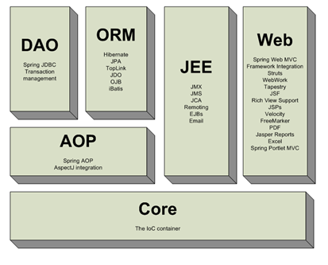
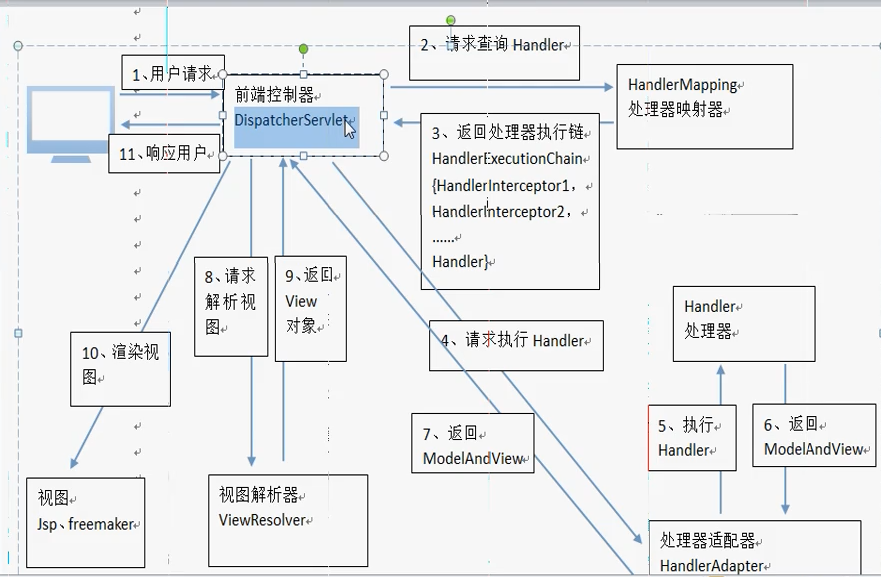
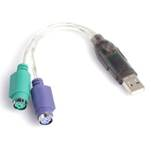
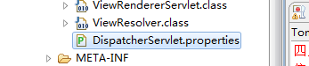

# springMVC第一天

# 1、Springmvc介绍

springMvc:是一个表现层框架



- 作用

1. 从请求中接收传入的参数,
2. 将处理后的结果数据返回给页面展示

# 2、入门程序

- 需求

使用springmvc实现商品列表的展示。

- 需求分析

  请求的url：/itemList.action

  参数：无

  数据：静态数据

- 步骤

  1. 创建itemList.jsp 
  2. ItemsController.java

  ItemController是一个普通的java类，不需要实现任何接口，只需要在类上添加@Controller注解即可。@RequestMapping注解指定请求的url，其中“.action”可以加也可以不加。在ModelAndView对象中，将视图设置为“/WEB-INF/jsp/itemList.jsp” 

```java
@Controller
public class ItemsController {

	//指定url到请求方法的映射
	//url中输入一个地址,找到这个方法.例如:localhost:8081/springmvc0523/list.action
	@RequestMapping("/list")
	public ModelAndView  itemsList() throws Exception{
		List<Items> itemList = new ArrayList<>();
		
		//商品列表
		Items items_1 = new Items();
		items_1.setName("联想笔记本_3");
		items_1.setPrice(6000f);
		items_1.setDetail("ThinkPad T430 联想笔记本电脑！");
		
		Items items_2 = new Items();
		items_2.setName("苹果手机");
		items_2.setPrice(5000f);
		items_2.setDetail("iphone6苹果手机！");
		
		itemList.add(items_1);
		itemList.add(items_2);
		
		//模型和视图
		//model模型: 模型对象中存放了返回给页面的数据
		//view视图: 视图对象中指定了返回的页面的位置
		ModelAndView modelAndView = new ModelAndView();
		
		//将返回给页面的数据放入模型和视图对象中
		modelAndView.addObject("itemList", itemList);
		
		//指定返回的页面位置
		modelAndView.setViewName("itemList");
		
		return modelAndView;
	}
}
```

- 商品数据使用Items类描述，可以使用参考资料中提供的pojo类
- 创建springmvc.xml

```xml
<?xmlversion="1.0"encoding="UTF-8"?>
<beansxmlns="http://www.springframework.org/schema/beans"
	xmlns:xsi="http://www.w3.org/2001/XMLSchema-instance"xmlns:p="http://www.springframework.org/schema/p"
	xmlns:context="http://www.springframework.org/schema/context"
	xmlns:dubbo="http://code.alibabatech.com/schema/dubbo"xmlns:mvc="http://www.springframework.org/schema/mvc"
	xsi:schemaLocation="http://www.springframework.org/schema/beans http://www.springframework.org/schema/beans/spring-beans-4.0.xsd
        http://www.springframework.org/schema/mvc http://www.springframework.org/schema/mvc/spring-mvc-4.0.xsd
        http://code.alibabatech.com/schema/dubbo http://code.alibabatech.com/schema/dubbo/dubbo.xsd
        http://www.springframework.org/schema/context http://www.springframework.org/schema/context/spring-context-4.0.xsd">

	<context:component-scanbase-package="cn.itcast.springmvc.controller"/>
	
</beans>

```

- 配置前端控制器 

在web.xml中添加DispatcherServlet的配置。 

```xml
<!-- 前端控制器 -->
<servlet>
	<servlet-name>springmvc</servlet-name>
	<servlet-class>org.springframework.web.servlet.DispatcherServlet</servlet-class>
	<init-param>
		<param-name>contextConfigLocation</param-name>
		<param-value>classpath:springmvc.xml</param-value>
	</init-param>
</servlet>
<servlet-mapping>
	<servlet-name>springmvc</servlet-name>
	<url-pattern>*.action</url-pattern>
</servlet-mapping>
```

# 3、Springmvc架构讲解

## a)框架结构



1. 用户发送请求至前端控制器DispatcherServlet
2. DispatcherServlet收到请求调用HandlerMapping处理器映射器。
3. 处理器映射器根据请求url找到具体的处理器，生成处理器对象及处理器拦截器(如果有则生成)一并返回给DispatcherServlet。
4. DispatcherServlet通过HandlerAdapter处理器适配器调用处理器
5. 执行处理器(Controller，也叫后端控制器)。
6. Controller执行完成返回ModelAndView
7. HandlerAdapter将controller执行结果ModelAndView返回给DispatcherServlet
8. DispatcherServlet将ModelAndView传给ViewReslover视图解析器
9. ViewReslover解析后返回具体View(什么是视图：freemaker（模板)类似cms）会根据不同的视图进行不同解析。
10. DispatcherServlet对View进行渲染视图（即将模型数据填充至视图中）.DispatcherServlet响应用户

## b)组件说明

以下组件通常使用框架提供实现：

- DispatcherServlet：前端控制器

用户请求到达前端控制器，它就相当于mvc模式中的c，dispatcherServlet是整个流程控制的中心，由它调用其它组件处理用户的请求，dispatcherServlet的存在降低了组件之间的耦合性。

- HandlerMapping：处理器映射器

HandlerMapping负责根据用户请求找到Handler即处理器，springmvc提供了不同的映射器实现不同的映射方式，例如：配置文件方式，实现接口方式，注解方式等。

- Handler：处理器

Handler 是继DispatcherServlet前端控制器的后端控制器，在DispatcherServlet的控制下Handler对具体的用户请求进行处理。

由于Handler涉及到具体的用户业务请求，所以一般情况需要程序员根据业务需求开发Handler。

- HandlAdapter：处理器适配器

通过HandlerAdapter对处理器进行执行，这是适配器模式的应用，通过扩展适配器可以对更多类型的处理器进行执行。（usb转网口，usb转串口，usb转ps2)



 

- View Resolver：视图解析器

View Resolver负责将处理结果生成View视图，View Resolver首先根据逻辑视图名解析成物理视图名即具体的页面地址，再生成View视图对象，最后对View进行渲染将处理结果通过页面展示给用户。 

- View：视图

springmvc框架提供了很多的View视图类型的支持，包括：jstlView、freemarkerView、pdfView等。我们最常用的视图就是jsp。

一般情况下需要通过页面标签或页面模版技术将模型数据通过页面展示给用户，需要由程序员根据业务需求开发具体的页面。

### 框架默认加载组件



### 1,2 注解映射器和适配器

### 1.1  组件扫描器

​	使用组件扫描器省去在spring容器配置每个controller类的繁琐。使用<context:component-scan>自动扫描标记@controller的控制器类，配置如下：

```
<!-- 扫描controller注解,多个包中间使用半角逗号分隔 -->
	<context:component-scanbase-package="cn.itcast.springmvc.controller.first"/>
```

### 1.2  RequestMappingHandlerMapping

​	注解式处理器映射器，对类中标记@ResquestMapping的方法进行映射，根据ResquestMapping定义的url匹配ResquestMapping标记的方法，匹配成功返回HandlerMethod对象给前端控制器，HandlerMethod对象中封装url对应的方法Method。 

​	从spring3.1版本开始，废除了DefaultAnnotationHandlerMapping的使用，推荐使用RequestMappingHandlerMapping完成注解式处理器映射。

配置如下：

```
<!--注解映射器 -->
<beanclass="org.springframework.web.servlet.mvc.method.annotation.RequestMappingHandlerMapping"/>
```

注解描述：

@RequestMapping：定义请求url到处理器功能方法的映射

### 1.3  RequestMappingHandlerAdapter

​	注解式处理器适配器，对标记@ResquestMapping的方法进行适配。

​	从spring3.1版本开始，废除了AnnotationMethodHandlerAdapter的使用，推荐使用RequestMappingHandlerAdapter完成注解式处理器适配。

​	配置如下：

```
<!--注解适配器 -->
<beanclass="org.springframework.web.servlet.mvc.method.annotation.RequestMappingHandlerAdapter"/>
```

### 1.4  \<mvc:annotation-driven>

springmvc使用<mvc:annotation-driven>自动加载RequestMappingHandlerMapping和RequestMappingHandlerAdapter，可用在springmvc.xml配置文件中使用<mvc:annotation-driven>替代注解处理器和适配器的配置。 

### 3.视图解析器

在springmvc.xml文件配置如下： 

```xml
<bean class="org.springframework.web.servlet.view.InternalResourceViewResolver">
		<property name="viewClass"
			value="org.springframework.web.servlet.view.JstlView"/>
		<property name="prefix" value="/WEB-INF/jsp/"/>
		<property name="suffix" value=".jsp"/>
</bean>
```

InternalResourceViewResolver：支持JSP视图解析

viewClass：JstlView表示JSP模板页面需要使用JSTL标签库，所以classpath中必须包含jstl的相关jar 包。此属性可以不设置，默认为JstlView。

prefix 和suffix：查找视图页面的前缀和后缀，最终视图的址为：

前缀+**逻辑视图名**+后缀，逻辑视图名需要在controller中返回ModelAndView指定，比如逻辑视图名为hello，则最终返回的jsp视图地址 “WEB-INF/jsp/hello.jsp”

## 三大组件

说明：在springmvc的各个组件中，处理器映射器(指定url到请求方法的映射，相当于一个hashmap，key是url,value是方法)、处理器适配器（注解形式的处理器适配器，执行完返回modle and view）、视图解析器（根据不同类型的视图去解析，比如jsp视图。返回view对象给前端控制器再去渲染）称为springmvc的三大组件。

需要用户开放的组件有handler、view。

- springmvc.xml

```
<?xml version="1.0" encoding="UTF-8"?>
<beans xmlns="http://www.springframework.org/schema/beans"
	xmlns:xsi="http://www.w3.org/2001/XMLSchema-instance" 
	xmlns:p="http://www.springframework.org/schema/p"
	xmlns:context="http://www.springframework.org/schema/context"
	xmlns:dubbo="http://code.alibabatech.com/schema/dubbo" 
	xmlns:mvc="http://www.springframework.org/schema/mvc"
	xsi:schemaLocation="http://www.springframework.org/schema/beans 
		http://www.springframework.org/schema/beans/spring-beans-4.0.xsd
        http://www.springframework.org/schema/mvc 
        http://www.springframework.org/schema/mvc/spring-mvc-4.0.xsd
        http://code.alibabatech.com/schema/dubbo 
        http://code.alibabatech.com/schema/dubbo/dubbo.xsd
        http://www.springframework.org/schema/context 
        http://www.springframework.org/schema/context/spring-context-4.0.xsd">
        
        <!-- 配置@Controller注解扫描 -->
        <context:component-scan base-package="cn.itheima.controller"></context:component-scan>
        
        <!-- 如果没有显示的配置处理器映射器和处理器适配那么springMvc会去默认的dispatcherServlet.properties中查找,
        对应的处理器映射器和处理器适配器去使用,这样每个请求都要扫描一次他的默认配置文件,效率非常低,会降低访问速度,所以要显示的配置处理器映射器和
        处理器适配器 -->
        
        <!-- 注解形式的处理器映射器 -->
<!--         <bean class="org.springframework.web.servlet.mvc.annotation.DefaultAnnotationHandlerMapping"></bean> -->
        <!-- 注解形式的处理器适配器 -->
<!--         <bean class="org.springframework.web.servlet.mvc.annotation.AnnotationMethodHandlerAdapter"></bean> -->
        
        <!-- 配置最新版的注解的处理器映射器 -->
<!--         <bean class="org.springframework.web.servlet.mvc.method.annotation.RequestMappingHandlerMapping"></bean> -->
        <!-- 配置最新版的注解的处理器适配器 -->
<!--         <bean class="org.springframework.web.servlet.mvc.method.annotation.RequestMappingHandlerAdapter"></bean> -->

	// 不用上面那个
	<!-- 注解驱动:
		作用:替我们自动配置最新版的注解的处理器映射器和处理器适配器
	 -->
	<mvc:annotation-driven></mvc:annotation-driven>
	
	
	<!-- 配置视图解析器 
	作用:在controller中指定页面路径的时候就不用写页面的完整路径名称了,可以直接写页面去掉扩展名的名称
	-->
	<bean class="org.springframework.web.servlet.view.InternalResourceViewResolver">
		<!-- 真正的页面路径 =  前缀 + 去掉后缀名的页面名称 + 后缀 -->
		<!-- 前缀 -->
		<property name="prefix" value="/WEB-INF/jsp/"></property>
		<!-- 后缀 -->
		<property name="suffix" value=".jsp"></property>
	</bean>
	
</beans>
```

主要配置以下三项:

注解扫描:扫描@Controller注解
注解驱动:替我们显示的配置了最新版的处理器映射器和处理器适配器
视图解析器:显示的配置是为了在controller中不用每个方法都写页面的全路径

# 4、Springmvc整合mybatis（ssm整合）

## 思路：

1)Dao层
	pojo和映射文件以及接口使用逆向工程生成
	SqlMapConfig.xml   mybatis核心配置文件
	ApplicationContext-dao.xml 整合后spring在dao层的配置
		数据源
		会话工厂
		扫描Mapper
2)service层
	事务			ApplicationContext-trans.xml
	@Service注解扫描	ApplicationContext-service.xml
3)controller层
	SpringMvc.xml 
		注解扫描:扫描@Controller注解
		注解驱动:替我们显示的配置了最新版的处理器映射器和处理器适配器
		视图解析器:显示的配置是为了在controller中不用每个方法都写页面的全路径
4)web.xml
	springMvc前端控制器配置
	spring监听

## 需求：

实现商品查询列表，从mysql数据库查询商品信息。

## jar包

包括：spring（包括springmvc）、mybatis、mybatis-spring整合包、数据库驱动、第三方连接池。

参考：“mybatis与springmvc整合全部jar包”目录 

## 1   工程搭建

### 1.1  整合思路

Dao层：

1、SqlMapConfig.xml，空文件即可。需要文件头。

2、applicationContext-dao.xml。

a)         数据库连接池

b)        SqlSessionFactory对象，需要spring和mybatis整合包下的。

c)         配置mapper文件扫描器。

Service层：

1、applicationContext-service.xml包扫描器，扫描@service注解的类。

2、applicationContext-trans.xml配置事务。

表现层：

Springmvc.xml

1、包扫描器，扫描@Controller注解的类。

2、配置注解驱动。

3、视图解析器

Web.xml

配置前端控制器。

### 1.2 相关文件，具体参考（word）

sqlMapConfig.xml

applicationContext-dao.xml

applicationContext-service.xml

applicationContext-transaction.xml

springmvc.xml

web.xml

# 5、参数绑定★★（从请求中接收参数，接收什么类型的参数。有不同的方式接收不同类型的参数） 

## 0)简单参数绑定

### 1.1.1  需求

打开商品编辑页面，展示商品信息。

### 1.1.2  需求分析

编辑商品信息，需要根据商品id查询商品信息，然后展示到页面。

请求的url：/itemEdit.action

参数：id（商品id）

响应结果：商品编辑页面，展示商品详细信息。

### 1.1.1  Service

```java
@Override
	public Items getItemById(intid) {
		Items items = itemMapper.getItemById(id);
		returnitems;
	}
```

### 1.1.1  Controller参数绑定

要根据id查询商品数据，需要从请求的参数中把请求的id取出来。Id应该包含在Request对象中。可以从Request对象中取id。 有两种方式可以返回

- 第一种方式：返回modelAndView

```java
@Controller
public class ItemsController {
	@Autowired
	private ItemsService itmesService;
	
	@RequestMapping("/list")
	public ModelAndView itemsList() throws Exception{
		List<Items> list = itmesService.list();
		
		ModelAndView modelAndView = new ModelAndView();
		
		modelAndView.addObject("itemList", list);
		modelAndView.setViewName("itemList");
		
		return modelAndView;
	}
```

- 返回字符串

```java
/**
	 * springMvc中默认支持的参数类型:也就是说在controller方法中可以加入这些也可以不加,  加不加看自己需不需要,都行.
	 *HttpServletRequest
	 *HttpServletResponse
	 *HttpSession
	 *Model
	 */
	@RequestMapping("/itemEdit")
	public String itemEdit(HttpServletRequest reuqest, 
			 Model model) throws Exception{
		
		String idStr = reuqest.getParameter("id");
		Items items = itmesService.findItemsById(Integer.parseInt(idStr));
		
		//Model模型:模型中放入了返回给页面的数据
		//model底层其实就是用的request域来传递数据,但是对request域进行了扩展.
		model.addAttribute("item", items);
		
		//如果springMvc方法返回一个简单的string字符串,那么springMvc就会认为这个字符串就是页面的名称
		return "editItem";
	}
```

如果想获得Request对象只需要在Controller方法的形参中添加一个参数即可。Springmvc框架会自动把Request对象传递给方法。 

- 接收简单类型（基本数据类型）的参数

  ```
  //springMvc可以直接接收基本数据类型,包括string.spirngMvc可以帮你自动进行类型转换.
  //controller方法接收的参数的变量名称必须要等于页面上input框的name属性值
  	
  @RequestMapping("/updateitem")
  public String update(Integer id, String name, Float price, String detail) throws Exception{
  		Items items = new Items();
  		items.setId(id);
  		items.setName(name);
  		items.setPrice(price);
  		items.setDetail(detail);
  		items.setCreatetime(new Date());
  		itmesService.updateItems(items);	
  		return "success";
  	}
  ```

## a)Springmvc默认支持的类型

```java
/** springMvc中默认支持的参数类型:也就是说在controller方法中可以加入这些也可以不加,  加不加看自己需不需要,都行.
	 *HttpServletRequest
	 *HttpServletResponse
	 *HttpSession
	 *Model
	 */
	@RequestMapping("/itemEdit")
	public String itemEdit(HttpServletRequest reuqest, 
			 Model model) throws Exception{
		
		String idStr = reuqest.getParameter("id");
		Items items = itmesService.findItemsById(Integer.parseInt(idStr));
		
		//Model模型:模型中放入了返回给页面的数据
		//model底层其实就是用的request域来传递数据,但是对request域进行了扩展.
		model.addAttribute("item", items);
		
		//如果springMvc方法返回一个简单的string字符串,那么springMvc就会认为这个字符串就是页面的名称
		return "editItem";
	}
```

ModelMap是Model接口的实现类，如果使用Model则可以不使用ModelAndView对象，Model对象可以向页面传递数据，View对象则可以使用String返回值替代。不管是Model还是ModelAndView，其本质都是使用Request对象向jsp传递数据。 

## b)简单数据类型

参数类型推荐使用包装数据类型，因为基础数据类型不可以为null

整形：Integer、int

字符串：String

单精度：Float、float

双精度：Double、double

布尔型：Boolean、boolean

说明：对于布尔类型的参数，请求的参数值为true或false。

处理器方法：

public String editItem(Model model,Integer id,Boolean status) throws Exception

请求url：

http://localhost:8080/xxx.action?id=2&status=false


controller方法接收的参数的变量名称必须要等于页面上input框的name属性值

```java
//springMvc可以直接接收基本数据类型,包括string.spirngMvc可以帮你自动进行类型转换.
//controller方法接收的参数的变量名称必须要等于页面上input框的name属性值
@RequestMapping("/updateitem")
public String update(Integer id, String name, Float price, String detail) throws Exception{
		Items items = new Items();
		items.setId(id);
		items.setName(name);
		items.setPrice(price);
		items.setDetail(detail);
		items.setCreatetime(new Date());
    
		itmesService.updateItems(items);	
		return "success";
	}
```

#### 1.1.1.1 @RequestParam 

使用@RequestParam常用于处理简单类型的绑定。

value：参数名字，即入参的请求参数名字，如value=“item_id”表示请求的参数区中的名字为item_id的参数的值将传入；

required：是否必须，默认是true，表示请求中一定要有相应的参数，否则将报；

TTP Status 400 - Required Integer parameter 'XXXX' is not present

defaultValue：默认值，表示如果请求中没有同名参数时的默认值

```
定义如下：

public String editItem(@RequestParam(value="item_id",required=true) String id) {         
}

形参名称为id，但是这里使用value="item_id"限定请求的参数名为item_id，所以页面传递参数的名必须为item_id。
注意：如果请求参数中没有item_id将跑出异常：
HTTP Status 500 - Required Integer parameter 'item_id' is not present
```


这里通过required=true限定item_id参数为必需传递，如果不传递则报400错误，可以使用defaultvalue设置默认值，即使required=true也可以不传item_id参数值

## c)Pojo类型

页面上input框的name属性名称必须等于pojo的属性名称.

```java
//spirngMvc可以直接接收pojo类型:要求页面上input框的name属性名称必须等于pojo的属性名称
	@RequestMapping("/updateitem")
	public String update(Items items) throws Exception{
        items.setCreatetime(new Date());
		itmesService.updateItems(items);
		
		return "success";
	}
```

## d)Pojo包装类型,比如vo

- controller.java

```java
//如果Controller中接收的是Vo,那么页面上input框的name属性值要等于vo的属性.属性.属性.....
	@RequestMapping("/search")
	public String search(QueryVo vo) throws Exception{
		System.out.println(vo);
		return "";
	}
```

- QueryVo.java

```java
import cn.itheima.pojo.Items;

public class QueryVo {
	//商品对象
	private Items items;
	//订单对象...
	//用户对象....

	public Items getItems() {
		return items;
	}

	public void setItems(Items items) {
		this.items = items;
	}	
}
```

- items.jsp.上面vo类的内部对象items

```jsp
<tr>
<!-- 如果Controller中接收的是Vo,那么页面上input框的name属性值要等于vo的属性.属性.属性..... -->
<td>商品名称:<input type="text" name="items.name"/></td>
<td>商品价格:<input type="text" name="items.price"/></td>
<td><input type="submit" value="查询"/></td>
</tr>
```

## e)自定义参数绑定

注意：提交的表单中不要有日期类型的数据，否则会报400错误。如果想提交日期类型的数据需要用到后面的自定义参数绑定的内容。  因为提交的都是string类型，是系统帮你转换的，但是日期类型转换不了。因为有很多种日期格式。所以要自己手动转换.

- converter.java

```java
/**
 * S - source:源
 * T - target:目标
 * @author zj
 */
public class CustomGlobalStrToDateConverter implements Converter<String, Date> {

    @Override
    public Date convert(String source) {
        try {
            Date date = new SimpleDateFormat("yyyy-MM-dd hh:mm:ss").parse(source);
            return date;
        } catch (ParseException e) {
            // TODO Auto-generated catch block
            e.printStackTrace();
        }
        return null;
    }
}
```

- springMvc.xml

```xml
<!-- 配置自定义转换器 
	注意: 一定要将自定义的转换器配置到注解驱动上
	-->
	<bean id="conversionService"
		class="org.springframework.format.support.FormattingConversionServiceFactoryBean">
		<property name="converters">
			<set>
				<!-- 指定自定义转换器的全路径名称 -->
				<bean class="cn.itheima.controller.converter.CustomGlobalStrToDateConverter"/>
			</set>
		</property>
	</bean>
```

```xml
<!-- 注解驱动:
    		替我们显示的配置了最新版的注解的处理器映射器和处理器适配器 -->
    <mvc:annotation-driven conversion-service="conversionService"></mvc:annotation-driven>
```

# 6、Springmvc和struts2的区别

1、  springmvc的入口是一个servlet即前端控制器，而struts2入口是一个filter过虑器。

**2、**  **springmvc**是基于方法开发(**一个url对应一个方法)**，请求参数传递到方法的形参，可以设计为单例或多例(**建议单例)**，struts2**是基于类开发，传递参数是通过类的属性，只能设计为多例。**

3、  Struts采用值栈存储请求和响应的数据，通过OGNL存取数据， springmvc通过参数解析器是将request请求内容解析，并给方法形参赋值，将数据和视图封装成ModelAndView对象，最后又将ModelAndView中的模型数据通过reques域传输到页面。Jsp视图解析器默认使用jstl。