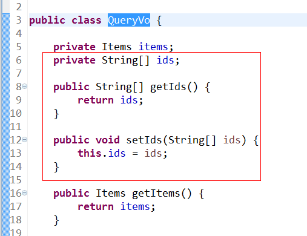
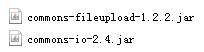
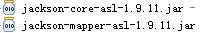

# springMVC第二天

# 1、高级参数绑定★★

## a)         数组类型的参数绑定

### 1.1.1  需求

在商品列表页面选中多个商品，然后删除。

### 1.1.2  需求分析

此功能要求商品列表页面中的每个商品前有一个checkbook，选中多个商品后点击删除按钮把商品id传递给Controller，根据商品id删除商品信息。 

### 1.1.3  代码

- controller.java

  ```java
  @RequestMapping("/delAll")
  	public String delAll(QueryVo vo) throws Exception{
  		//如果批量删除,一堆input复选框,那么可以提交数组.(只有input复选框被选中的时候才能提交)
  		System.out.println(vo);
  		return "";
  	}
  ```

- vo.java

  

- jsp 

  ```jsp
  <c:forEach items="${itemList }" var="item" >
  <tr>
  	<!-- name属性名称要等于vo中的接收的属性名 -->
  	<!-- 如果批量删除,可以用List<pojo>来接收,页面上input框的name属性值= vo中接收的集合属性名称+[list的下标]+.+list泛型的属性名称 -->
      <td><input type="checkbox" name="ids" value="${item.id }"/></td>
      <td>${item.name }</td>
      <td>${item.price }</td>
      <td>${item.detail }</td>
  <tr>
  ```

## b)        List类型的绑定

### 1.2.1  需求

批量修改

### 1.2.2  需求分析

要想实现商品数据的批量修改，需要在商品列表中可以对商品信息进行修改，并且可以批量提交修改后的商品数据。


- jsp.  name的写法根据vo类的属性itemsList[元素下标].id/name.

  varStatus="status"中有一个index属性，是从0开始。

  如果批量删除,可以用List<pojo>来接收,页面上input框的name属性值= vo中接收的集合属性名称+[list的下标]+.+list泛型的属性名称 

  ```jsp
  <c:forEach items="${itemList }" var="item" varStatus="status">
      <tr>
          <!-- name属性名称要等于vo中的接收的属性名 -->
          <!-- 如果批量删除,可以用List<pojo>来接收,页面上input框的name属性值= vo中接收的集合属性名称+[list的下标]+.+list泛型的属性名称 -->
          <td>
              <input type="checkbox" name="ids" value="${item.id }"/>
              <input type="hidden" name="itemsList[${status.index }].id" value="${item.id }"/>
          </td>
          <td><input type="text" name="itemsList[${status.index }].name" value="${item.name }"/></td>
          <td><input type="text" name="itemsList[${status.index }].price" value="${item.price }"/></td>
          <td><input type="text" name="itemsList[${status.index }].createtime" 
                     value="<fmt:formatDate value="${item.createtime}" pattern="yyyy-MM-dd HH:mm:ss"/>"/></td>
          <td><input type="text" name="itemsList[${status.index }].detail" value="${item.detail }"/></td>
  
          <td><a href="${pageContext.request.contextPath }/items/itemEdit/${item.id}">修改</a></td>
      </tr>
  </c:forEach>
  ```

# 2、@RequestMapping注解的使用

通过RequestMapping注解可以定义不同的处理器映射规则。

## 1.1   URL路径映射

@RequestMapping(value="/item")或@RequestMapping("/item）

value的值是数组，可以将多个url映射到同一个方法

 url到请求方法的映射

## 1.2   窄化请求映射

在class上添加@RequestMapping(url)指定通用请求前缀， 限制此类下的所有方法请求url必须以请求前缀开头，通过此方法对url进行分类管理。

如下：

```java
@RequestMapping放在类名上边，设置请求前缀 
@Controller
@RequestMapping("/item")


方法名上边设置请求映射url：
@RequestMapping放在方法名上边，如下：
@RequestMapping("/queryItem ")

访问地址为：/item/queryItem
```

 例如：下面类里面有个函数交list。

```java
@Controller
//窄化请求映射:为防止你和你的队友在conroller方法起名的时候重名,所以相当于在url中多加了一层目录,防止重名
//例如:当前list的访问路径   localhost:8081/ssm0523-1/items/list.action
@RequestMapping("/items")
public class ItemsController {
    @RequestMapping("/list")
	public ModelAndView itemsList() throws Exception{
    }
}
```

## 1.3   请求方法限定 

- 限定GET方法

@RequestMapping(method = RequestMethod.*GET*)

 如果通过Post访问则报错：

HTTP Status 405 - Request method 'POST' not supported 

例如：

```java
@RequestMapping(value="/list", method=RequestMethod.GET)
public ModelAndView itemsList() throws Exception{
}
```

- 限定POST方法

@RequestMapping(method = RequestMethod.*POST*)

如果通过Post访问则报错：

HTTP Status 405 - Request method 'GET' not supported

- GET和POST都可以

@RequestMapping(method={RequestMethod.GET,RequestMethod.POST})

# 3、Controller方法返回值★★

## 1)ModelAndView 

​	modelAndView.addObject("itemList", list); 指定返回页面的数据
	modelAndView.setViewName("itemList");	  指定返回的页面

## 2)String(推荐使用)

​	返回普通字符串,就是页面去掉扩展名的名称, 返回给页面数据通过Model来完成
	返回的字符串以forward:开头为请求转发
	返回的字符串以redirect:开头为重定向

### 1.1.1  逻辑视图名

controller方法返回字符串可以指定逻辑视图名，通过视图解析器解析为物理视图地址。

//指定逻辑视图名，经过视图解析器解析为jsp物理路径：/WEB-INF/jsp/item/editItem.jsp

**return** "item/editItem";

### 1.1.2  Redirect重定向

Contrller方法返回结果重定向到一个url地址，如下商品修改提交后重定向到商品查询方法，参数无法带到商品查询方法中。

//重定向到queryItem.action地址,request无法带过去

**return** "redirect:queryItem.action";

redirect方式相当于“response.sendRedirect()”，转发后浏览器的地址栏变为转发后的地址，因为转发即执行了一个新的request和response。

由于新发起一个request原来的参数在转发时就不能传递到下一个url，如果要传参数可以/item/queryItem.action后边加参数，如下：

/item/queryItem?...&….. 

```java
@RequestMapping("/updateitem")
public String update(Integer id, String name, Float price, String detail) throws Exception{
	//重定向:浏览器中url发生改变,request域中的数据不可以带到重定向后的方法中
	model.addAttribute("id", items.getId());
	//在springMvc中凡是以redirect:字符串开头的都为重定向
	return "redirect:itemEdit/"+items.getId();
}
```

### 1.1.3  forward转发

controller方法执行后继续执行另一个controller方法，如下商品修改提交后转向到商品修改页面，修改商品的id参数可以带到商品修改方法中。

//结果转发到editItem.action，request可以带过去

**return** "forward:editItem.action";

 (相对路径)

forward方式相当于“request.getRequestDispatcher().forward(request,response)”，转发后浏览器地址栏还是原来的地址。转发并没有执行新的request和response，而是和转发前的请求共用一个request和response。所以转发前请求的参数在转发后仍然可以读取到。 

```java
@RequestMapping("/updateitem")
	public String update(Integer id, String name, Float price, String detail) throws Exception{
	//请求转发:浏览器中url不发生改变,request域中的数据可以带到转发后的方法中
	model.addAttribute("id", items.getId());
	//spirngMvc中请求转发:返回的字符串以forward:开头的都是请求转发, 
	//后面forward:itemEdit.action表示相对路径,相对路径就是相对于当前目录,当前为类上面指定的items目录.在当前目录下可以使用相对路径随意跳转到某个方法中
	//后面forward:/itemEdit.action路径中以斜杠开头的为绝对路径,绝对路径从项目名后面开始算,项目名后面是items
	return "forward:/items/itemEdit.action";
}
```

## 3)返回void(使用它破坏了springMvc的结构,所以不建议使用)

​	可以使用request.setAttribut 来给页面返回数据
	可以使用request.getRquestDispatcher().forward()来指定返回的页面
	如果controller返回值为void则不走springMvc的组件,所以要写页面的完整路径名称

- 相对，绝对路径区别：

相对路径:相对于当前目录,也就是在当前类的目录下,这时候可以使用相对路径跳转
绝对路径:从项目名后开始.
	在springMvc中不管是forward还是redirect后面凡是以/开头的为绝对路径,不以/开头的为相对路径
	例如:forward:/items/itemEdit.action 为绝对路径
		forward:itemEdit.action为相对路径

```java
@RequestMapping("/updateitem")
public String update(Integer id, String name, Float price, String detail) throws Exception{
    //返回数据
    request.setAttribute("", arg1);
    //指定返回的页面(如果controller方法返回值为void,则不走springMvc组件,所以要写页面的完整路径名称)
    request.getRequestDispatcher("/WEB-INF/jsp/success.jsp").forward(request, response);
}
```


```java

```


# 4、Springmvc中异常处理（具体参照word）

springmvc在处理请求过程中出现异常信息交由异常处理器进行处理，自定义异常处理器可以实现一个系统的异常处理逻辑。 

系统中异常包括两类：预期异常和运行时异常RuntimeException，前者通过捕获异常从而获取异常信息，后者主要通过规范代码开发、测试通过手段减少运行时异常的发生。

系统的dao、service、controller出现都通过throws Exception向上抛出，最后由springmvc前端控制器交由异常处理器进行异常处理。

# 5、图片上传处理

## 1.1   jar包

*CommonsMultipartResolver*解析器依赖commons-fileupload（服务器接收到图片后解析用）和commons-io，加入如下jar包：



## 1.1   配置解析器

springmvc提供了一个multipart组件用于解析图片，所以配置上传组件如下

```xml
<!-- 文件上传 -->
<bean id="multipartResolver"
      class="org.springframework.web.multipart.commons.CommonsMultipartResolver">
    <!-- 设置上传文件的最大尺寸为5MB -->
    <property name="maxUploadSize">
        <value>5242880</value>
    </property>
</bean>
```

- controller.java

因为mysql操作数据库慢，不能频繁读写。所以要先保存在硬盘

```java
//spirngMvc可以直接接收pojo类型:要求页面上input框的name属性名称必须等于pojo的属性名称
	@RequestMapping("/updateitem")
	public String update(MultipartFile pictureFile,Items items, Model model, HttpServletRequest request) throws Exception{
		//1. 获取图片完整名称
		String fileStr = pictureFile.getOriginalFilename();
		//2. 使用随机生成的字符串+源图片扩展名组成新的图片名称,防止图片重名
		String newfileName = UUID.randomUUID().toString() + fileStr.substring(fileStr.lastIndexOf("."));
		//3. 将图片保存到硬盘
		pictureFile.transferTo(new File("E:\\image\\" + newfileName));
		//4.将图片名称保存到数据库
		items.setPic(newfileName);
		itmesService.updateItems(items);
	}
```

- jsp

file的name与controller形参一致：

```
<tr>
    <td>商品图片</td>
    <td><c:if test=*"*${item.pic !=null}*"*>
           
           <br />
       </c:if> <input type=*"file"* name=*"pictureFile"* /></td>
</tr>
```

# 6、Json数据交互

压缩数据的一种形式。发送的时候将对象中的数据拼接为json格式，接收的数据自动解析为json。

Springmvc默认用MappingJacksonHttpMessageConverter对json数据进行转换，需要加入jackson的包，如下：



js,css,html静态的东西较安全所以可以放在WebContent下，能直接访问。

一些jsp就放在WEB-INF目录下，得跳转才能访问。保护了安全性。


## 1.1   @RequestBody

- 作用：

@RequestBody注解用于读取http请求的内容(字符串)，通过springmvc提供的HttpMessageConverter接口将读到的内容转换为json、xml等格式的数据并绑定到controller方法的参数上。

List.action?id=1&name=zhangsan&age=12

- 本例子应用：

@RequestBody注解实现接收http请求的json数据，将json数据转换为java对象

## 1.2   @ResponseBody

- 作用：

该注解用于将Controller的方法返回的对象，通过HttpMessageConverter接口转换为指定格式的数据如：json,xml等，通过Response响应给客户端

- 本例子应用：

@ResponseBody注解实现将controller方法返回对象转换为json响应给客户端

```java
//导入jackson的jar包在 controller的方法中可以使用@RequestBody,让spirngMvc将json格式字符串自动转换成java中的pojo
//页面json的key要等于java中pojo的属性名称

@RequestMapping("/sendJson")
//controller方法返回pojo类型的对象并且用@ResponseBody注解,springMvc会自动将pojo对象转换成json格式字符串
@ResponseBody
public Items json(@RequestBody Items items) throws Exception{
    System.out.println(items);
    return items;
}
```

# 7、Springmvc实现Restful

## 1.1   什么是restful？

Restful就是一个资源定位及资源操作的风格。不是标准也不是协议，只是一种风格，是对http协议的诠释。

**资源定位：**互联网所有的事物都是资源，要求url中没有动词，只有名词。没有参数

## 1.1   什么是restful？

Restful就是一个资源定位及资源操作的风格。不是标准也不是协议，只是一种风格，是对http协议的诠释。

资源定位：互联网所有的事物都是资源，要求url中没有动词，只有名词。没有参数

Url格式：<http://blog.csdn.net/beat_the_world/article/details/45621673>

Url格式：<http://blog.csdn.net/beat_the_world/article/details/id?=45621673> 这样的就不行

资源操作：使用put、delete、**post****、get**，使用不同方法对资源进行操作。分别对应添加、删除、修改、查询。一般使用时还是post和get。Put和Delete几乎不使用。

## 1.2   需求

RESTful方式实现商品信息查询，返回json数据

**资源操作：**使用put、delete、**post**、**get**，使用不同方法对资源进行操作。分别对应添加、删除、修改、查询。一般使用时还是post和get。Put和Delete几乎不使用。

## 1.2   需求

RESTful方式实现商品信息查询，返回json数据

## 1.3   实现

- 在web.xml中添加DispatcherServlet的rest配置

```xml
 <!-- springmvc前端控制器 -->
  <servlet>
  	<servlet-name>springMvc</servlet-name>
  	<servlet-class>org.springframework.web.servlet.DispatcherServlet</servlet-class>
  	<init-param>
  		<param-name>contextConfigLocation</param-name>
  		<param-value>classpath:SpringMvc.xml</param-value>
  	</init-param>
  	<!-- 在tomcat启动的时候就加载这个servlet -->
  	<load-on-startup>1</load-on-startup>
  </servlet>
  <servlet-mapping>
  	<servlet-name>springMvc</servlet-name>
  	<!-- 
  	*.action    代表拦截后缀名为.action结尾的（原来是是这样的，就不符合restful标准）
  	/ 			拦截所有但是不包括.jsp
  	/* 			拦截所有包括.jsp
  	 -->
  	<url-pattern>/</url-pattern>
  </servlet-mapping>
```

- URL 模板模式映射

@RequestMapping(value="/ viewItems/{id}")：{×××}占位符，请求的URL可以是“/viewItems/1”或“/viewItems/2”，通过在方法中使用@PathVariable获取{×××}中的×××变量。

@PathVariable用于将请求URL中的模板变量映射到功能处理方法的参数上。

```java
*通过@PathVariable可以接收url中传入的参数
*@RequestMapping("/itemEdit/{id}")中接收参数使用大括号中加上变量名称, @PathVariable中的变量名称要和RequestMapping
*中的变量名称相同
	@RequestMapping("/itemEdit/{id}")
    public String itemEdit(@PathVariable("id") Integer id, HttpServletRequest reuqest, Model model) throws Exception{
    //String idStr = reuqest.getParameter("id");
    Items items = itmesService.findItemsById(id);

    //Model模型:模型中放入了返回给页面的数据
    //model底层其实就是用的request域来传递数据,但是对request域进行了扩展.
    model.addAttribute("item", items);

    //如果springMvc方法返回一个简单的string字符串,那么springMvc就会认为这个字符串就是页面的名称
    return "editItem";
}
```

- 重定向问题

```java
@RequestMapping("/updateitem")
//public String update(Integer id, String name, Float price, String detail) throws Exception{
public String update(MultipartFile pictureFile,Items items, Model model, HttpServletRequest request) throws Exception{
    //重定向:浏览器中url发生改变,request域中的数据不可以带到重定向后的方法中.这样子是使用model还是会加id?=,所以会报错
    //model.addAttribute("id", items.getId());
    //在springMvc中凡是以redirect:字符串开头的都为重定向
    return "redirect:itemEdit/"+items.getId();
}
```

# 8、拦截器

## 1.1   定义

​       Spring Web MVC 的处理器拦截器类似于Servlet 开发中的过滤器Filter，用于对处理器进行预处理和后处理。

## 1.2   拦截器定义

实现HandlerInterceptor接口，如下：

```java
public class Interceptor1 implements HandlerInterceptor {
    //执行时机:controller已经执行,modelAndview已经返回
    //使用场景: 记录操作日志,记录登录用户的ip,时间等.
    @Override
    public void afterCompletion(HttpServletRequest arg0, HttpServletResponse arg1, Object arg2, Exception arg3)
        throws Exception { System.out.println("======Interceptor1=======afterCompletion========");
    }

    //执行时机:Controller方法已经执行,ModelAndView没有返回
    //使用场景: 可以在此方法中设置全局的数据处理业务，比如左上角加一个天气信息
    @Override
    public void postHandle(HttpServletRequest arg0, HttpServletResponse arg1, Object arg2, ModelAndView arg3)
        throws Exception {
      System.out.println("======Interceptor1=======postHandle========");
    }

    //返回布尔值:如果返回true放行,返回false则被拦截住
    //执行时机:controller方法没有被执行,ModelAndView没有被返回
    //使用场景: 权限验证
    @Override
    public boolean preHandle(HttpServletRequest arg0, HttpServletResponse arg1, Object arg2) throws Exception {
      System.out.println("======Interceptor1=======preHandle========");
        return true;
    }
}
```

## 1.3拦截器配置

### 1.1.1  针对所有mapping配置全局拦截器

多个拦截器的执行顺序等于springMvc.xml中的配置顺序，先去执行Intercept，再去执行intercept2.

```xml
<!-- 配置拦截器 -->
	<mvc:interceptors>
		<!-- 多个拦截器的执行顺序等于springMvc.xml中的配置顺序 -->
		<mvc:interceptor>
			<!-- 拦截请求的路径    要拦截所有必需配置成/** -->
			<mvc:mapping path="/**"/>
			<!-- 指定拦截器的位置 -->
			<bean class="cn.itheima.interceptor.Interceptor1"></bean>
		</mvc:interceptor> 
        
        <mvc:interceptor>
			<mvc:mapping path="/**"/>
			<bean class="cn.itheima.interceptor.Interceptor2"></bean>
		</mvc:interceptor>
	<mvc:interceptors>
```

### 1.1.2  针对某种mapping配置拦截器

```xml
<bean class="org.springframework.web.servlet.handler.BeanNameUrlHandlerMapping">
    <property name="interceptors">
        <list>
            <ref bean="handlerInterceptor1"/>
            <ref bean="handlerInterceptor2"/>
        </list>
    </property>
</bean>
<bean id="handlerInterceptor1" class="springmvc.intercapter.HandlerInterceptor1"/>
<bean id="handlerInterceptor2" class="springmvc.intercapter.HandlerInterceptor2"/>
```

## 1.4   中断流程测试

### 1.1.1  代码：

定义两个拦截器分别为：HandlerInterceptor1和HandlerInteptor2。

### 1.1.2  运行流程

HandlerInterceptor1的preHandler方法返回false，HandlerInterceptor2返回true，运行流程如下：

`HandlerInterceptor1..preHandle..`

从日志看出第一个拦截器的preHandler方法返回false后第一个拦截器只执行了preHandler方法，其它两个方法没有执行，第二个拦截器的所有方法不执行，且controller也不执行了。

HandlerInterceptor1的preHandler方法返回true，HandlerInterceptor2返回false，运行流程如下：

```
HandlerInterceptor1..preHandle..
HandlerInterceptor2..preHandle..
HandlerInterceptor1..afterCompletion.. 
```

从日志看出第二个拦截器的preHandler方法返回false后第一个拦截器的postHandler没有执行，第二个拦截器的postHandler和afterCompletion没有执行，且controller也不执行了。 

- 总结：

```
preHandle按拦截器定义顺序调用
postHandler按拦截器定义逆序调用
afterCompletion按拦截器定义逆序调用
postHandler在拦截器链内所有拦截器返成功调用
afterCompletion只有preHandle返回true**才调用**
```

## 1.5   拦截器应用


### 1.1.1  处理流程

1、有一个登录页面，需要写一个controller访问页面

2、登录页面有一提交表单的动作。需要在controller中处理。

a)         判断用户名密码是否正确

b)        如果正确 想session中写入用户信息

c)         返回登录成功，或者跳转到商品列表

3、拦截器。

a)         拦截用户请求，判断用户是否登录

b)        如果用户已经登录。放行

c)         如果用户未登录，跳转到登录页面。

### 1.1.2  登录权限验证

1)编写登录的controller, 编写跳转到登录页面的方法,  编写登录验证方法
2)编写登录页面
3)编写拦截器

- 运行过程:

1)访问随意一个页面,拦截器会拦截请求,会验证session中是否有登录信息
	如果已登录,放行
	如果未登录,跳转到登录页面
2)在登录页面中输入用户名,密码,点击登录按钮,拦截器会拦截请求,如果是登录路径放行
	在controller方法中判断用户名密码是否正确,如果正确则将登录信息放入session

- LoginController.java

```java
@Controller
@RequestMapping("/login")
public class LoginController {

	//跳转到登录页面
	@RequestMapping("/login")
	public String login() throws Exception{
		return "login";
	}
	
	@RequestMapping("/submit")
	public String submit(String username, String pwd ,HttpServletRequest request) throws Exception{
		
		HttpSession session = request.getSession();
		//判断用户名密码的正确性,如果正确则将登录信息放入session中
		//这里简写,真正项目中需要去数据库中校验用户名和密码
		if(username != null){
			session.setAttribute("username", username);
		}
		
		//跳转到列表页,绝对路径。
		return "redirect:/items/list";
	}
}
```

- LoginInterceptor.java

  有三次拦截，一开始随便打开到了拦截器；然后跳到Login页面之前还要去拦截器；再从login页面到itemlist，这之前还要去拦截器。

  ```java
  public class LoginInterceptor implements HandlerInterceptor {
  	@Override
  	public void afterCompletion(HttpServletRequest arg0, HttpServletResponse arg1, Object arg2, Exception arg3)
  			throws Exception {
  		// TODO Auto-generated method stub
  	}
  
  	@Override
  	public void postHandle(HttpServletRequest arg0, HttpServletResponse arg1, Object arg2, ModelAndView arg3)
  			throws Exception {
  		// TODO Auto-generated method stub
  	}
  
  	@Override
  	public boolean preHandle(HttpServletRequest request, HttpServletResponse response, Object arg2) throws Exception {
  		//判断当前访问路径是否为登录的路径,如果是则放行
  		if(request.getRequestURI().indexOf("/login") > 0){
  			return true;
  		}
  		
  		//判断session中是否有登录信息,如果没有则跳转到登录页面,如果有则放行
  		HttpSession session = request.getSession();
  		if(session.getAttribute("username") != null){
  			return true;
  		}
  		
  		request.getRequestDispatcher("/WEB-INF/jsp/login.jsp").forward(request, response);
  		return false;
  	}
  }
  ```

  