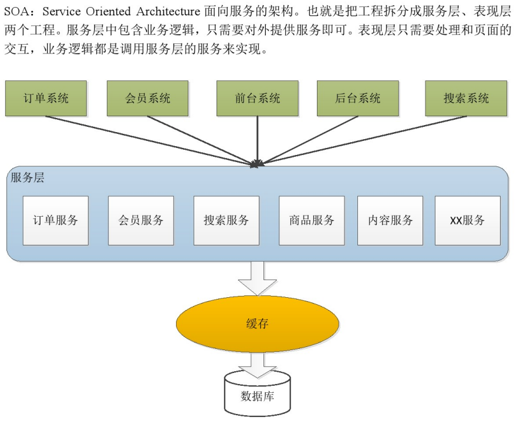

# 第一天

# 1、电商行业的背景。

B2B:商家到商家。阿里巴巴,慧聪网、铭万网。

B2C:商家到用户。京东。

C2C;用户到用户。淘宝。

B2B2C:商家到商家到用户。天猫。

020:线上到线下。百度外卖、美团、饿了么。

# 2、淘淘商城的系统架构

## a)功能介绍

后台管理系统： 管理商品、 订单、 类目、 商品规格屈性、 用户管理以及内容发布等功能。

前台系统： 用户可以在前台系统中进行注册、 登录、 浏览商品、 首页、 下单等操作。
会员系统： 用户可以在该系统中查询已下的订单、 收藏的商品、 我的优惠券、 团购等信息。 

订单系统： 提供下单、 查询订单、 修改订单状态、 定时处理订单。
搜索系统： 提供商品的搜索功能。
单点登录系统： 为多个系统之间提供用户登录凭证以及查询登录用户的信息。

## b)架构讲解

- 传统架构：功能模块集中在一个工程里，部署在服务器或者集群上，集群的每台服务器包含相同的代码。

    

- 问题： 
  1. 模块之间耦合度太高，其中一个升级其他都得升级。
  2. 开发困难，各个团队开发最后都要整合一起。
  3. 系统的扩展性差。
  4. 不能针对每个模块的需要，灵活的进行分布式部署。
- 1000并发

tomcat大概能支持400并发，所以可以用两台服务器。但是有服务器之间session信息同步的问题，所以要配置。

需要20台服务器做tomcat栠群。 当tomcat栠群中节点数雇增加， 服务能力先增加后下降。所以栠群中节点数最不能太多， 一般也就5个左右。

- 10000并发

- 基于soa的架构

- 淘淘商城系统架构

## 技术选型

- Spring、SpringMVC、Mybatis
- JSP、JSTL、jQuery、jQuery plugin、EasyUI、KindEditor（富文本编辑器）、CSS+DIV
- Redis（缓存服务器）
- Solr（搜索）
- httpclient（调用系统服务）
- Mysql

## 工程总览

- 使用了**面向服务的架构**（Service-Oriented Architecture， SOA）

  

## 数据库

mysql作为关系型数据库，提供数据的持久化。
redis作为内存数据库，提供高性能的缓存。

## 服务层

taotao-rest提供商品信息，内容服务。
taotao-sso提供单点登录服务。
taotao-order提供订单服务。
taotao-search提供商品搜索服务，基于solr索引库。

## 交互

taotao-portal作为网站的门户，与用户交互。

微信商城之类的app也可以调用服务层的服务，完成门户的功能。

taotao-manager作为后台管理，供管理员完成对网站商品和内容的增删改查。

# 3、工程搭建后台工程

## 工程结构

 

- taotao-parent是一个pom工程，是所有工程的父工程。定义依赖的jar包的版本信息、Maven插件的版本信息。
- taotao-common定义公用的内容。
- taotao-manager为后台管理系统的模块，是一个多模块组成的项目。 
  - taotao-manager-pojo：实体类。
  - taotao-manager-mapper：数据库访问接口。
  - taotao-manager-service ：主体的业务逻辑。
  - taotao-manager-controller：控制器，对外的访问接口。

## a) 使用maven搭建工程

### 空工程

- 创建空工程。因为idea中一个工程一个窗口，多个工程放置在一起需要将他们作为**模块**放置在一个空的工程中。

 

- 修改pom文件。 
  - 手动添加packaging，定义工程类型为pom。
  - properties中定义全局变量。
  - dependencyManagement中定义依赖的版本，并不实际引入依赖。
  - 注意：依赖的id需要能在maven库中找到，因为不同maven库的GroupId可能不一样。
  - build中定义插件，tomcat7-maven-plugin可以免去在ide中配置tomcat，使用maven命令直接启动tomcat。
  - modules中手动添加子模块，因为idea中新建指定parent的子模块时，不会在parent的pom中自动添加。

### parent模块

创建taotao-parent模块。

填写GroupId和ArtifactId。

修改pom文件。 
手动添加packaging，定义工程类型为pom。
properties中定义全局变量。
dependencyManagement中定义依赖的版本，并不实际引入依赖。
注意：依赖的id需要能在maven库中找到，因为不同maven库的GroupId可能不一样。
build中定义插件，tomcat7-maven-plugin可以免去在ide中配置tomcat，使用maven命令直接启动tomcat。

modules中手动添加子模块，因为idea中新建指定parent的子模块时，不会在parent的pom中自动添加。