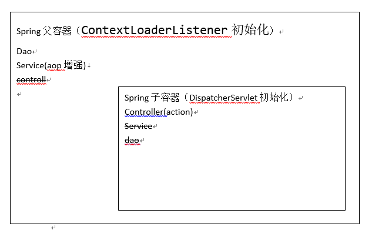

# 第二天

## spring,springmvc父子容器

- web.xml配置文件

```xml
  <!-- 加载spring容器 -->
  <context-param>
    <param-name>contextConfigLocation</param-name>
    <param-value>classpath:spring/spring-*.xml</param-value>
  </context-param>
  <listener>
    <listener-class>org.springframework.web.context.ContextLoaderListener</listener-class>
  </listener>

  <!-- springmvc的前端控制器 -->
  <servlet>
    <servlet-name>taotao-manager</servlet-name>
    <servlet-class>org.springframework.web.servlet.DispatcherServlet</servlet-class>
    <!-- contextConfigLocation不是必须的， 如果不配置contextConfigLocation， springmvc的配置文件默认在：WEB-INF/servlet的name+"-servlet.xml" -->
    <init-param>
      <param-name>contextConfigLocation</param-name>
      <param-value>classpath:springmvc/springmvc-config.xml</param-value>
    </init-param>
    <load-on-startup>1</load-on-startup>
  </servlet>
  <servlet-mapping>
    <servlet-name>taotao-manager</servlet-name>
    <url-pattern>/</url-pattern>
  </servlet-mapping>
```



配置完前端控制器后，又有一个子容器

- 子容器可以访问父容器的对象，父容器不可以访问子容器的对象。 
- 在子容器中可以注入父容器中的bean,但是父容器不能注入子容器的bean

如上配置所示：ContextLoaderListener监听器是装载Spring框架本身的bean上下文（如Service和DAO层等），DispatcherServlet是装载SpringMVC的上下文。

ContextLoaderListener自动扫描配置（applicationContext.xml）

    <!-- 扫描包 -->
    <context:component-scan base-package="com.taotao" />
上述的配置指定了ContextLoaderListener所创建的Spring容器将扫描com.taotao包下所有的注解。

DispatcherServlet配置（dispatcher-servlet.xml）

    <!-- 扫描Controller -->
    <context:component-scan base-package="com.taotao.manager.controller" />
上面配置是指定了DispatcherServlet所创建的springMVC容器只扫描controller控制层的beans，当然在dispatcher-servlet.xml中还可以指定视图解析、JSON转换、上传下载等配置信息。

在上面的配置中，Spring容器（上下文）创建完成之后，当初始化springMVC容器的时候，就会将之前初始化的Spring容器设置为它的父容器。如果项目中没有初始化Spring父容器，springMVC也会初始化一个默认的父容器。

Spring容器  --  父容器
SpringMVC容器  -- 子容器

父子容器的关系：
1、子容器能够访问父容器的资源（bean）
a)示例：Controller可以注入Service
2、父容器不能访问子容器的资源（bean）


注意：上面的配置中springMVC子容器所扫描的包只能限定在controller包，如果将Spring容器和springMVC容器所扫描的包都配置成全部的，就会造成在子容器和父容器都有全部的自定义beans。当子类容器中装载了Service和DAO，控制层就会使用子类容器所装载的bean去执行。但是这里面的service是没有事务等功能的（没有Spring框架的配置），只是普通的bean，因此使用起来会有不可预知的问题。

