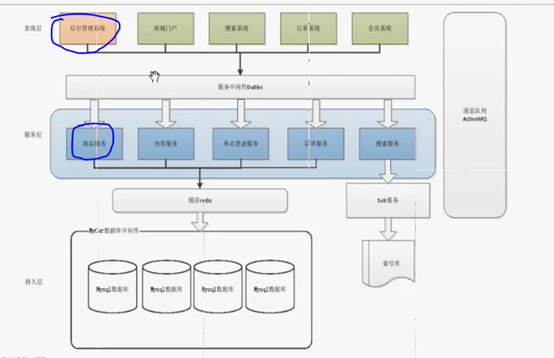

# 第四天：

目前仅实现了以下两个部分，现在实现商城门户。

门户有可能调用商品服务、内容服务。

设计模式：单一职能原则。本系统（类，方法）只做一件事。内容服务只管理内容。所以把内容服务独立出来，搭建内容系统和商城门户。manager就是商品服务。

# 搭建商城门户

- 表现层，创建taotao-portal-web，一个war项目。参照manager-web。新的工程也要在tomcat上启动，所以修改端口。
- SEO（搜索引擎优化）：搜索排名。静态网页的权重高一点，所以把网页的后缀改成html就是伪静态化。
- 静态资源放在webapp目录下即可，不用放在WEB-INF目录下，因为不拦截了。

# 首页展示

跳到controller,通过controller跳转到index.jsp。后台是通过 “/” 拦截，前台不是。访问的默认地址是index.html，前台拦截*.html，所以拦截器可以写（index），通过拦截器跳转到index.jsp。

# 首页内容管理-数据库分析

首页需要有：链接--跳转链接；公告--显示内容；图片--跳转链接。

分类表--内容表。两个表，分类作为外键。

图片有两种，分别支持宽屏和窄屏。

# 内容服务工程

负责维护数据。

taotao-manager：商品服务。

taotao-content：内容服务，可以复用Manager的common, pojo, mapper。pom文件中要修改tomcat端口

发布服务不需要Tomcat,有他能将多个jar包打成war包，部署方便。

