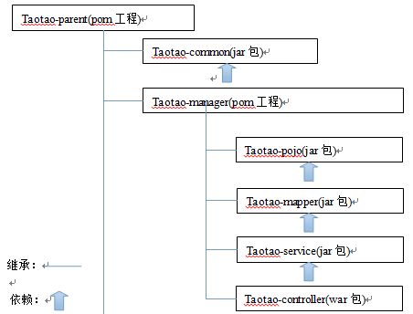

# 配置文件解析

# 工程总览

使用了面向服务的架构（Service-Oriented Architecture， SOA）

## 数据库

- mysql作为关系型数据库，提供数据的持久化。
- redis作为内存数据库，提供高性能的缓存。

## 服务层

- taotao-rest提供商品信息，内容服务。
- taotao-sso提供单点登录服务。
- taotao-order提供订单服务。
- taotao-search提供商品搜索服务，基于solr索引库。

## 交互

- taotao-portal作为网站的门户，与用户交互。
- 微信商城之类的app也可以调用服务层的服务，完成门户的功能。
- taotao-manager作为后台管理，供管理员完成对网站商品和内容的增删改查

# 工程搭建

 

- taotao-parent是一个pom工程，是所有工程的父工程。定义依赖的jar包的版本信息、Maven插件的版本信息。
- taotao-common定义公用的内容。
- taotao-manager为后台管理系统的模块，是一个多模块组成的项目。 
  - taotao-manager-pojo：实体类。
  - taotao-manager-mapper：数据库访问接口。
  - taotao-manager-service ：主体的业务逻辑。
  - taotao-manager-controller：控制器，对外的访问接口。

## taotao-parent

- 修改pom文件。 
  - 手动添加packaging，定义工程类型为pom。
  - properties中定义全局变量。
  - dependencyManagement中定义依赖的版本，并不实际引入依赖。
  - 注意：依赖的id需要能在maven库中找到，因为不同maven库的GroupId可能不一样。
  - build中定义插件，tomcat7-maven-plugin可以免去在ide中配置tomcat，使用maven命令直接启动tomcat。
  - modules中手动添加子模块，因为idea中新建指定parent的子模块时，不会在parent的pom中自动添加。

## taotao-common模块

创建taotao-common模块，类似taotao-parent模块，但是需要设置parent为taotao-parent

修改pom文件。 

- 工程类型为jar。
- 添加依赖。
  - 时间操作组件
  - Apache工具组件 
  - Jackson Json处理工具包 
  - httpclient 
  - 单元测试 
  - 日志处理 

## taotao-manager模块

## 

 修改pom文件。 

- 工程类型为pom。
- 添加taotao-common依赖。
- build中配置tomcat-maven的端口号和路径。
- modules中添加4个子模块。(pojo, mapper, service, web)

### taotao-manager的子模块taotao-manager-pojo 

- 修改pom文件，工程类型jar。

### taotao-manager的子模块taotao-manager-mapper

修改pom文件。 

- 工程类型jar。
- 依赖taotao-manager-pojo模块、mybatis模块、mysql模块、连接池模块（阿里druid）
- 需要在build里面扫描mapper的配置文件，否则他们将会被遗漏。

### taotao-manager的子模块taotao-manager-service

修改pom文件。 

- 工程类型jar。
- 依赖taotao-manager-mapper。
- 添加对spring的各种依赖（spring-context, spring-beans, spring-webmvc, spring-jdbc, spring-aspects, spring-test）

### taotao-manager的子模块taotao-manager-web

修改pom文件。 

- 工程类型war。
- 依赖taotao-manager-service。
- 添加对JSP的依赖，和文件上传组件的依赖

## taotao-manager-web 

- ssm的核心配置文件需要放在taotao-manager-web下，因为该项目打包为war，其他为jar。

- 项目的配置文件如下： 

   

# 整合

## [数据库](https://blog.csdn.net/qq_40369829/article/details/79515268#%E6%95%B0%E6%8D%AE%E5%BA%93)

## [Dao层](https://blog.csdn.net/qq_40369829/article/details/79515268#dao%E5%B1%82)

1. 使用mybatis逆向工程 generatorSqlmapCustom：

- 生成数据库对应的pojo类，放在taotao-manager-pojo模块的 com.taotao.pojo 包下。
- 生成对应的mapper接口和配置文件，放在taotao-manager-mapper模块的 com.taotao.mapper 包下。

2. 创建db.properties，存放数据库连接信息。  
3. 创建mybatis-config.xml，存放mybatis的基本配置，暂时为空。
4. 创建spring-dao.xml，引入： 
   - 数据库参数。（加载配置文件location= "classpath:resource/db.properties" ）
   - druid数据库连接池。
   - sqlSessionFactory对象。
   - mapper代理对象，即数据库访问接口。配置扫描包，加载mapper代理对象到spring容器 

## [Service层](https://blog.csdn.net/qq_40369829/article/details/79515268#service%E5%B1%82)

1. 创建spring-service.xml，在com.taotao.service包下扫描加载service类。
2. 创建spring-transaction.xml，配置： 

- 事务管理器。
- service类中方法的事务传播行为，可参考：http://blog.csdn.net/qq_40369829/article/details/79361851 
  - 增删改为REQUIRED级别，当前事务存在则在当前事务中执行，否则创建事务。
  - 查询为SUPPORTS级别，当前事务存在则在当前事务中执行，否则以非事务方式运行。

## [Controller层](https://blog.csdn.net/qq_40369829/article/details/79515268#controller%E5%B1%82)

1. 创建springmvc-config.xml。 

- 自动扫描controller。
- 开启注解。
- 配置视图解析器。

2. 在web.xml中添加如下内容。 

- 在spring容器中加载dao和service层涉及的bean。

- 使用过滤器解决乱码问题。
- 配置前端控制器，前端控制器中加载controller到springmvc容器。

## [静态资源](https://blog.csdn.net/qq_40369829/article/details/79515268#%E9%9D%99%E6%80%81%E8%B5%84%E6%BA%90)

- WEB-INF下放置静态资源，使用现成的前端页面和部分逻辑。
- 前端框架为easy-ui，并使用富文本编辑器kindeditor。

- 由于静态资源放在WEB-INF下，**不能直接访问**。前端控制器中 `/` 会拦截所有请求，需要在springmvc-config.xml中配置**静态资源映射**。